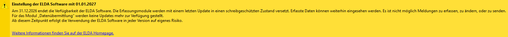

# Kurzinfo

## Jahreslohnzettel (L16) 2026

Das PDF-Formular für den Jahreslohnzettel (L16) **2026** wird voraussichtlich mit der Version **2.26.2.0** bereitgestellt. Die Veröffentlichung ist für Mitte Februar 2026 geplant.

## Ausstehender Beschluss Überstundenzuschläge § 68 (2) und Feiertagsarbeitsentgelt

Entwurf Antrag Einkommenssteuer [Link](https://www.parlament.gv.at/gegenstand/XXVIII/A/666)

### Überstunden § 68 (2) EStG

Im Entwurf des Antrags ist vorgesehen, dass im Zeitraum von 01.01.2026 bis 31.12.2026 die ersten **15 Überstunden** pro Monat bis zu einem Höchstbetrag von **EUR 170,00** steuerfrei abgerechnet werden können.

Bis zum endgültigen Beschluss des Antrags sind jedoch weiterhin die derzeit geltenden Regelungen gemäß § 124b Z 440 EStG anzuwenden. Demnach werden 10 Überstunden pro Monat bis zu einem maximalen Betrag von EUR 120,00 im Lohnverrechnungsprogramm berücksichtigt. Nach Inkrafttreten der neuen Regelung ist eine Aufrollung erforderlich.

### Feiertragsarbeitsentgelt

Der Entwurf des Antrags sieht weiters vor, dass Feiertagsarbeitsentgelte ab 01.01.2026 in den Anwendungsbereich des § 68 Abs. 1 EStG aufgenommen werden.

!!! warning "Hinweis"
    Der Beschluss des Antrags steht derzeit noch aus.

## WF (Wohnbauförderungsbeitrag) Wien

Ab 01.01.2026 kommt es bei Beschäftigten im Bundesland **Wien** zu einer Anhebung des Wohnbauförderungsbeitrages (WF) auf **1,50 %**.

Für die Abrechnung des erhöhten WF wird im Tarifsystem der ELDA ein Zuschlag sowie ein Abschlag geschaffen:

- Z14 Zuschlag zum WF in Wien
- A24 WF-Entfall NeuFög Ergänzung Wien
  
Bis ELDA die Schnittstelle angepasst hat, ist leider eine Abrechnung des erhöhten WFs noch nicht möglich.

## ELDA Software: Wartung endet mit Ende 2026

Beim Öffnen der ELDA Software erscheint ein Hinweis, dass die Wartung der ELDA Software mit Ende 2026 endet.

Bei RZL wird bereits an der Umsetzung des neuen **ELDA Transfer Webservice** gearbeitet. Im Laufe des Jahres erfolgt die Umstellung auf diesen Webservice. Sie werden rechtzeitig über die verfügbaren Umstiegsmöglichkeiten informiert.

Aus Kundensicht sind derzeit keine Maßnahmen erforderlich.
