# Lohnformelzuordnungen

Um die angelegten Lohnformeln automatisiert in bestimmten Monaten innerhalb der Abrechnung verwenden zu können, müssen die Lohnformeln einer (oder auch mehrerer) Tabelle(n) zugeordnet werden. In dieser Tabelle werden die Lohnformeln den Lohnarten (Fixe Lohnarten, Freie Lohnarten) zugeordnet. Die Zuordnung erfolgt im Programmteil *Stamm / Lohn-Formelzuordnungen*. Erfolgt keine Zuordnung der angelegten Lohnformeln, kann auf diese dennoch innerhalb der Lohnarten durch Anwahl der *F2-Taste* zugegriffen werden.

{width="500"}

Zunächst ist im Feld *Tabelle* eine Nummer und im Feld *Bezeichnung* ein Name für die Tabelle zu vergeben.

Im Feld *Lohnart* können zunächst mit der *F2-Taste* die Lohnarten aufgerufen werden.

{width="400"}

Hier wird festgelegt, mit welcher Lohnart (fixe oder freie) der automatisch aufgrund der Lohnformel errechnete Betrag abgerechnet werden soll (hier Fixe Lohnart: Sonderzahlungen). Nach Anwahl der Schaltfläche *Übernehmen* wird die Nummer der Lohnart in die Lohnformel-Zuordnungstabelle eingetragen.

{width="500"}

Der nächste Schritt ist die Eintragung (oder Aufruf mit der *F2-Taste*) der Lohnformel (hier Schnitt_3MO_Krank_Urlaub_Feiertag).

{width="500"}

Im unteren Bereich wird festgelegt, wann die Lohnformel (hier Schnitt_3MO_Krank_Urlaub_Feiertag) bei der ausgewählten Lohnart (hier Urlaubsschnitt) automatisch verwendet werden soll. Nach Anwahl der Schaltfläche *Speichern* wird die Zuordnung abgespeichert und in der Liste angezeigt. 

{width="500"}

## Duplizieren

Sie haben die Möglichkeit, einer Lohnart mehrere Formeln zuzuordnen, jedoch muss sich das Anwendungsmonat der einzelnen Formeln unterscheiden.

Wählen Sie die gewünschte Lohnart aus und klicken Sie auf der rechten Seite auf *Duplizieren*.

{width="500"}

Geben Sie nun die gewünschte Lohnformel ein.

{width="500"}

Wählen Sie die anzuwendenden Monate aus. Es dürfen keine gleichen Monate verwendet werden.

{width="500"}

Es wird somit in unserem Beispiel in der Lohnart *Sonderzahlung* im Monat Juni und November die Lohnformel 1 und im Monat Dezember bei der gleichen Lohnart die Lohnformel 10 angewandt.

## Duplizieren einer Lohnformelzuordnungstabelle

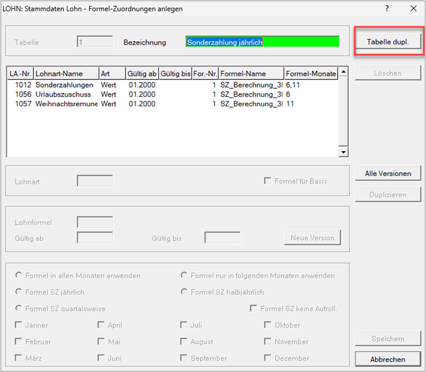{width="500"}

Mit dem Button *Tabelle duplizieren* haben Sie die Möglichkeit, eine bereits bestehende Lohnformelzuordnungstabelle zu duplizieren.

## Änderung bestehender Lohnformelzuordnungen

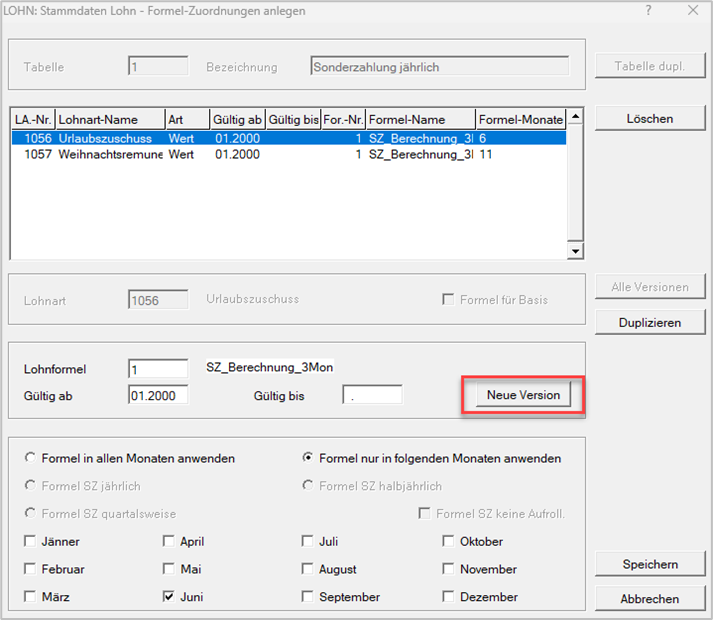{width="500"}

Möchten Sie eine Änderung einer Lohnformelzuordnung vornehmen, klicken Sie auf den Button *Neue Version* an.

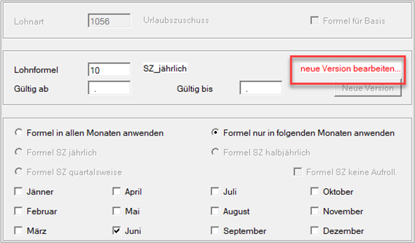{width="400"}

Sie erhalten nun den Hinweis, dass Sie eine *neue Version bearbeiten*. Sie werden direkt in das Feld *Gültig ab* weitergeleitet. Geben Sie dort das **Monat und Jahr** ein, ab welchem Sie die Änderung vornehmen möchten. Danach nehmen Sie im unteren Teil des Bildschirms die entsprechenden Änderungen vor. Sie haben auch die Möglichkeit, die *Lohnformel* zu ändern.

!!! warning "Hinweis"
    Bereits bestehende Lohnformelzuordnungen werden mit dem Gültigkeitsdatum ab 01.2000 dargestellt.

**Alle Versionen**

Durch Anwahl *Alle Versionen* werden auch die alten Lohnformelzuordnungen angeführt.

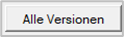{width="100"}

Wie Sie hier sehen, wurde vom Lohnprogramm automatisch ein *Gültig-bis-Datum* befüllt.

{width="500"}

## Sonderzahlungslohnformelzuordnung

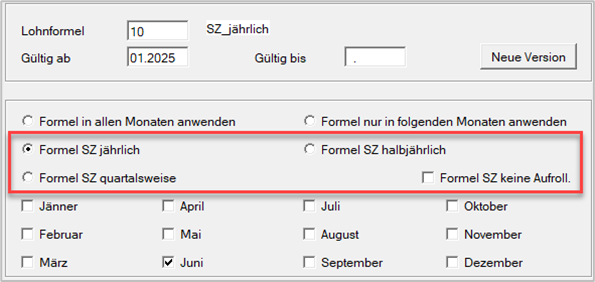{width="400"}

**Formel SZ jährlich**

Durch Anwahl *Formel SZ jährlich* haben Sie die Möglichkeit, die Lohnformelzuordnung darauf hinzuweisen, dass es sich hierbei um eine Sonderzahlung handelt. Bei jährlicher Anwendung kann nur ein Sonderzahlungsmonat angewählt werden. (Beispiel: Lohnformelzuordnung auf die Lohnart 1056 Urlaubszuschuss)

**Formel SZ halbjährlich**

Durch Anwahl *Formel SZ halbjährlich* haben Sie die Möglichkeit, die Lohnformelzuordnung darauf hinzuweisen, dass es sich hierbei um eine Sonderzahlung handelt. Bei halbjährlicher Anwendung müssen zwei Sonderzahlungsmonate angewählt werden.

**Formel SZ quartalsweise**

Durch Anwahl *Formel SZ quartalsweise* haben Sie die Möglichkeit, die Lohnformelzuordnung darauf hinzuweisen, dass es sich hierbei um eine Sonderzahlung handelt. Bei quartalsweiser Anwendung müssen vier Sonderzahlungsmonate angewählt werden. (Beispiel: Lohnformelzuordnung auf die Lohnart 1012 Sonderzahlung)

**Formel SZ keine Aufrollung**

Durch die Kennzeichnung, dass es sich hierbei eine Sonderzahlungslohnformelzuordnung handelt, führt das Lohnprogramm bei Austritten eine automatische Aufrollung der Sonderzahlungen durch. Wenn **keine** automatische Aufrollung der Sonderzahlungen erfolgen soll, aktivieren Sie das Häkchen *Formel SZ keine Aufrollung*.

!!! warning "Hinweis"
    Wenn Sie die neuen Felder bei einer bestehenden Lohnformelzuordnung anwenden möchten, dann müssen Sie eine neue Version anlegen. Ansonsten sind die neuen Felder ausgegraut.

!!! warning "Hinweis"
    Die Systematik der Sonderzahlungslohnformeln kann bei fallweisen Beschäftigten nicht angewendet werden.

### Automatische Aufrollung bei Austritt

Wenn Sie bereits eine Sonderzahlung mittels Lohnformel abgerechnet haben und einen Austritt erfassen, erscheint in der Abrechnung der Hinweis, dass die Sonderzahlungslohnart aufgerollt wird.

{width="350"}

Sie haben nun die Wahl, ob Sie die Sonderzahlungsaufrollung durchführen oder nicht. Wenn Sie auf *Ja* geklickt haben, gelangen Sie automatisch in die Aufrollmaske des aufzurollenden Monats.

!!! warning "Hinweis"
    Es wird immer nur das aktuelle Dienstverhältnis aufgerollt.

Fehlt noch ein Sonderzahlungsteil, dann erscheint der Hinweis, dass die Sonderzahlungslohnformel aufgrund des Austritts ausgelöst wird.

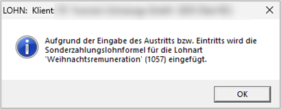{width="350"}

Bei den folgenden Austrittsgründen wird keine Sonderzahlung eingefügt oder eine Aufrollung vorgeschlagen:

- 11 Unbezahlter Urlaub
- 20 Truppenübung
- 34 SV-Ende, Beschäftigung aufrecht

**Präsenz- bzw. Zivildienst**

Bei Eingabe des Austritts für Präsenz- bzw. Zivildienst werden die Sonderzahlungen eingefügt und gegebenenfalls eine Aufrollung vorgeschlagen.

Während der Monate, wo Sie nur die BV-Bemessung abführen, wird in den regulären Sonderzahlungsmonaten keine Sonderzahlungslohnformel ausgelöst.

**Wochengeld und Karenzurlaub**

Beim Austrittsgrund *Wochengeld* werden die Sonderzahlungen eingefügt und gegebenenfalls eine Aufrollung vorgeschlagen.

Während der Monate, wo Sie nur die BV-Bemessung abführen, wird in den regulären Sonderzahlungsmonaten keine Sonderzahlungslohnformel ausgelöst.

Kommt es anschließend zum Austritt *Karenzurlaub*, wird keine Sonderzahlungslohnformel mehr ausgelöst, da die zu-stehende Sonderzahlung bereits bei Beginn Mutterschutz gezahlt wurde.

In jenen Fällen, wo es kein Wochengeld gibt, zum Beispiel bei geringfügigen Dienstnehmern oder Väterkarenzen, erfolgt das Einfügen und gegebenenfalls Aufrollen der Sonderzahlung wie bei allen anderen Austritten.

### Dienstnehmer tritt nach dem Sonderzahlungsmonat ein

Wird grundsätzlich im Juni die Sonderzahlung ausgezahlt und der Dienstnehmer tritt zum Beispiel erst im August ein, dann erfolgt die automatische Berechnung dieser noch nicht ausgezahlten Sonderzahlung im **Dezember**. Sie erhalten folgenden Hinweis:

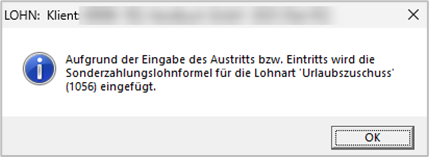{width="350"}

Wurde bereits im November die noch fehlende Sonderzahlung ausgezahlt, muss manuell im Dezember die Lohn-formel deaktiviert werden. Die Lohnformel kann über einen rechten Mausklick *Formel deaktivieren* deaktiviert werden. Vergessen Sie nicht den Betrag auf null zu setzen.

### Änderung des Austrittsdatums

Wird das Austrittsdatum geändert oder entfernt, erscheint folgender Hinweis:

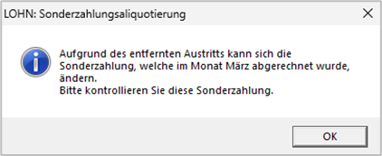{width="350"}

Falls nötig führen Sie eine manuelle Anpassung durch.

## Beispiele für die Abrechnung von Sonderzahlungen

### Auszahlung Urlaubszuschuss und Weihnachtsremuneration

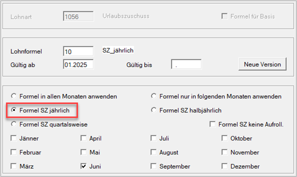{width="400"}

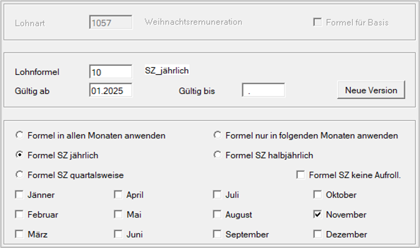{width="400"}

!!! warning "Hinweis"
    Es werden für die normale Abrechnung der Sonderzahlung **immer zwei Lohnarten** benötigt. Nur so kann die Aufrollung der Sonderzahlung korrekt erfolgen.

### Auszahlung des Urlaubszuschusses und der Weihnachtsremuneration über eine gemeinsame Lohnart

Nur ohne Sonderzahlungsaufrollautomatik möglich. Hierfür wird bei *Formel SZ jährlich, Formel SZ halbjährlich* oder *Formel SZ quartalsweise* **keines** dieser Felder aktiviert.

### Auszahlung einer halbjährlichen Sonderzahlung

Soll eine Sonderzahlung für das erste oder zweite Halbjahr ausgezahlt werden, wählen Sie *Formel SZ halbjährlich* aus.

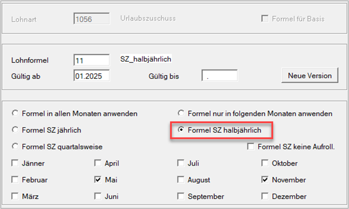{width="400"}

Ebenso müssen Sie für die korrekte Berechnung der halbjährlichen Sonderzahlung, den entsprechenden **Lohnformelprovider** anwenden.

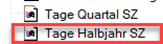{width="100"}

Lohnart(2002).Wert(0)/ZR().TageKalenderjahr***ZR().TageHalbjahrSZ**

Diese Lohnformelzuordnung ist nur anzuwenden, wenn Sie die Sonderzahlung von Jänner bis Juni auszahlen möchten. Bei der automatischen Sonderzahlungsaufrollung wird immer nur das **aktuelle Halbjahr** betrachtet. Wenn Sie zum Beispiel im Mai die Sonderzahlung halbjährlich auszahlen und es erfolgt ein Austritt im Oktober, dann wird die Sonderzahlung vom Mai **nicht** aufgerollt. Es kommt hier nur zu einer Auszahlung der Sonderzahlung vom zweiten Halbjahr. Das erste Halbjahr bleibt vollkommen unberührt.

!!! warning "Hinweis"
    Deshalb ist diese Lohnformelzuordnung für die jährliche Auszahlung der Sonderzahlungen **nicht** geeignet.

**Beispiel halbjährliche Sonderzahlung**

*Lohnformel:*

Lohnart(2002).Wert(0)/ZR().TageKalenderjahr***ZR().TageHalbjahrSZ**

*Lohnformelzuordnung:*

{width="400"}

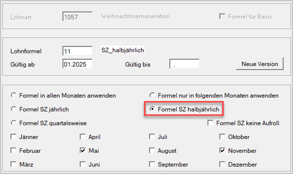{width="400"}

Im Mai kommt es zur automatischen Auslösung der Sonderzahlungslohnformel für **exakt** ein halbes Jahr (= 181 Tage):

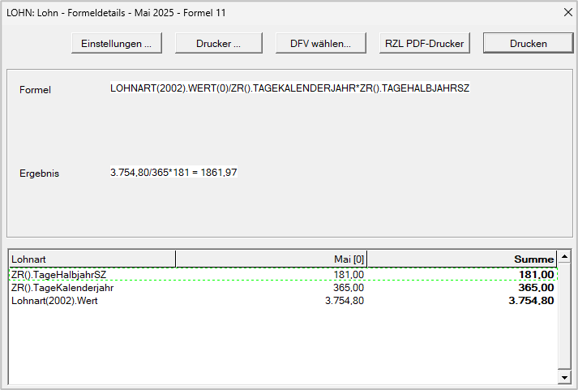{width="500"}

Kommt es nun mit 31.10.2025 zu einem Austritt, erfolgt nur noch die Verrechnung der Sonderzahlungen von 01.07.-31.10.2025. Die Monate Jänner bis Juni werden **nicht** aufgerollt. Betrachtungszeitraum im Oktober ist Juli bis Dezember.

Bei Eingabe des Austritts erfolgen folgende Hinweise:

{width="350"}

{width="350"}

Für die Berechnung der Sonderzahlung werden nur jene Kalendertage von 01.07. bis 31.10.2025 verwendet (= 123 Kalendertage).

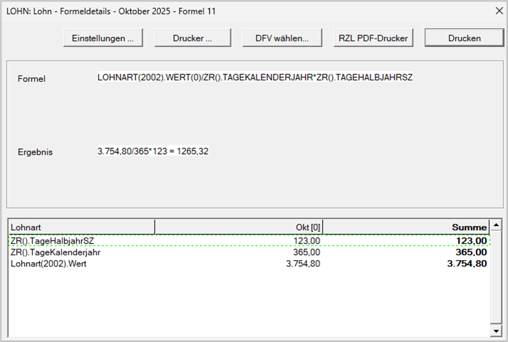{width="500"}

### Auszahlung einer quartalsweisen Sonderzahlung

Pro Quartal (1. Quartal Jänner bis März, 2. Quartal April bis Juni, 3. Quartal Juli bis September, 4. Quartal Oktober bis Dezember) soll eine Sonderzahlung ausgezahlt werden, wählen Sie *Formel SZ quartalsweise* aus.

{width="400"}

Ebenso müssen Sie für die korrekte Berechnung der quartalsweisen Sonderzahlung, den entsprechenden **Lohnformelprovider** anwenden.

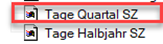{width="100"}

Lohnart(2001).Wert(0)/ZR().TageKalenderjahr*Z**R().TageQuartalSZ**

Diese Lohnformelzuordnung ist nur anzuwenden, wenn Sie die Sonderzahlung **quartalsweise** auszahlen möchten. Bei der automatischen Sonderzahlungsaufrollung wird immer nur das **aktuelle Quartal** betrachtet. Wenn Sie zum Beispiel im März und Juni die Sonderzahlung quartalsweise auszahlen und es erfolgt ein Austritt im August. Dann wird die Sonderzahlung vom März und Juni **nicht** aufgerollt. Es kommt hier nur zu einer Auszahlung der Sonderzahlung vom 3. Quartal. Das 1. und 2. Quartal bleiben unberührt.

**Beispiel quartalsweise Sonderzahlung**

*Lohnformel:*

Lohnart(2002).Wert(0)/ZR().TageKalenderjahr***ZR().TageQuartalSZ**

*Lohnformelzuordnung:*

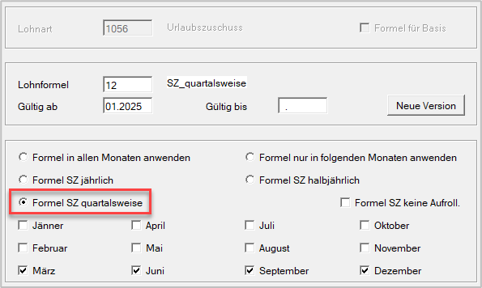{width="400"}

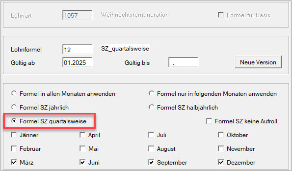{width="400"}

Im März und Juni kommt es zur automatischen Auslösung der Sonderzahlungslohnformel für **exakt** jeweils ein Quartal (= 90 bzw. 91 Kalendertage):

{width="500"}

Kommt es nun mit 31.08.2025 zu einem Austritt, erfolgt nur noch die Verrechnung der Sonderzahlungen von 01.07.-31.08.2025. Die Monate Jänner bis Juni werden **nicht** aufgerollt.

Bei Eingabe des Austritts erfolgen folgende Hinweise:

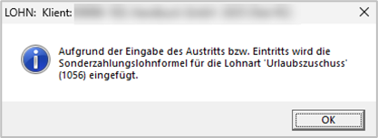{width="350"}

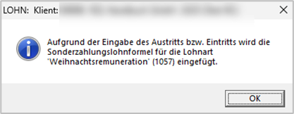{width="350"}

Für die Berechnung der Sonderzahlung werden nur jene Kalendertage von 01.07. bis 31.08.2025 verwendet (= 62 Kalendertage).

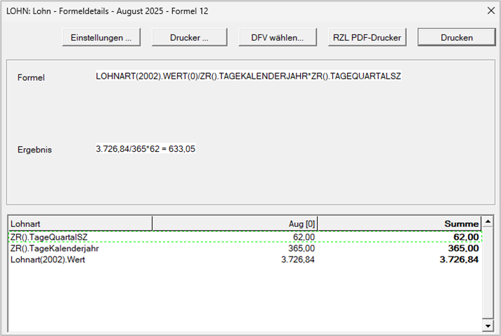{width="500"}