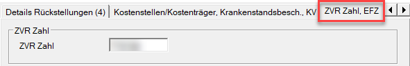
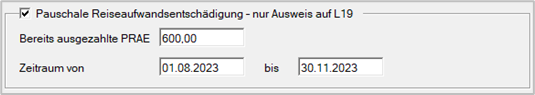
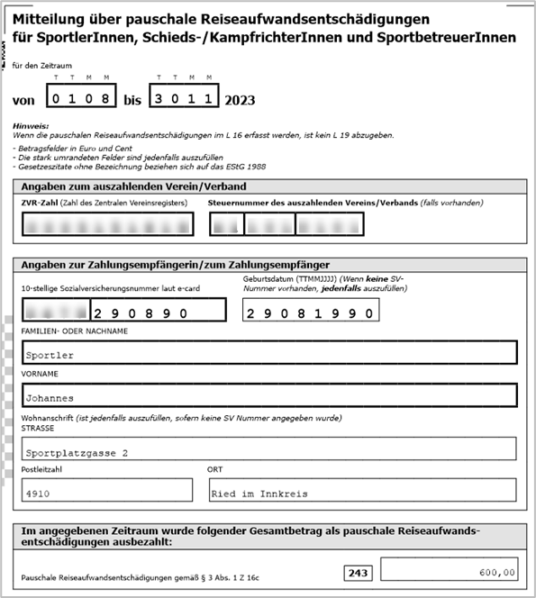
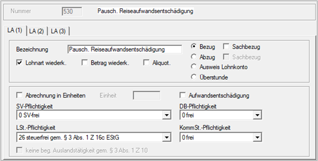
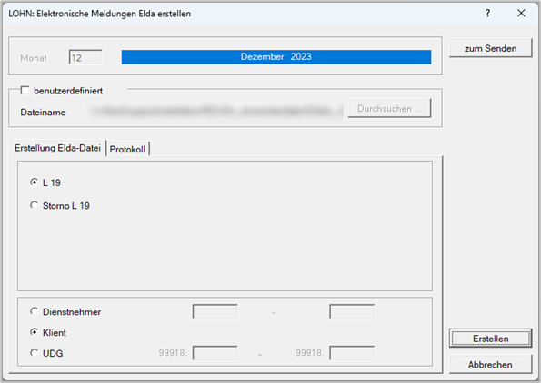
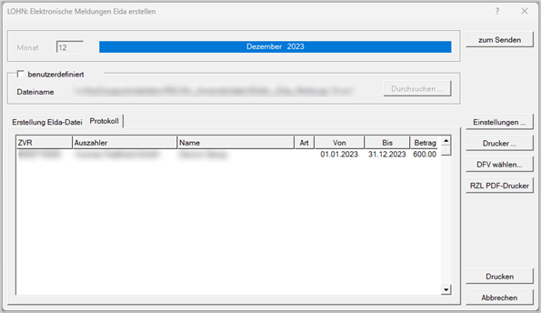
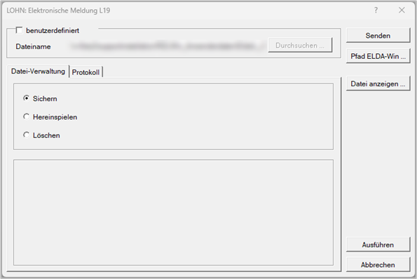

# Pauschale Reiseaufwandsentschädigung L19

## Grundsätzliches

Gemeinnützige Sportvereine können an Sportlerinnen und Sportler, Schiedsrichterinnen und Schiedsrichter sowie Sportbetreuerinnen und Sportbetreuer pauschale Reiseaufwandsentschädigungen steuer- und sozialversicherungsfrei ausbezahlen.

Pauschale Reiseaufwandsentschädigungen sind **ab 1. Jänner 2023**

- bis zu 120 Euro pro Einsatztag
- und maximal 720 Euro pro Monat

steuer- und sozialversicherungsfrei.

### Lohnkonto und Lohnzettel (L19, L16)

Für jede Sportlerin bzw. jeden Sportler, die oder der im Rahmen eines Dienstverhältnisses eine pauschale Reiseaufwandsentschädigung erhält, hat der Verein grundsätzlich ein Lohnkonto bzw. Lohnaufzeichnungen zu führen. Außerdem ist dem Finanzamt bis spätestens 28. Februar des Folgejahres die kumulierte Jahreshöhe der pauschalen Reiseaufwandsentschädigung mittels Formular L19 zu übermitteln.

Ist die Sportlerin bzw. der Sportler gleichzeitig beim Verein beschäftigt, zum Beispiel in einer administrativen Funktion, ist die pauschale Reiseaufwandsentschädigung im Formular L16 (Lohnzettel) zu erfassen.

### Keine Lohnnebenkosten

Für diese Entschädigungen fallen weder der Dienstgeberbeitrag zum Familienlastenausgleichsfonds noch Kommunalsteuer an.

## ZVR-Zahl (Zahl des Zentralen Vereinsregisters)

Die *ZVR-Zahl* ist im Formular L19 ein Pflichtfeld. Sie können die *ZVR-Zahl* im RZL-Lohnprogramm unter *Stamm / Klient im Registerblatt [ZVR-Zahl, EFZ](../LOHN/Klientenstammdaten/Stammdaten_Klient/ZVR_Zahl.md)* hinterlegen.

## Nacherfassung bereits ausgezahlter pauschaler Reiseaufwandsentschädigungen

Sie haben die Möglichkeit, bereits ausbezahlte pauschale Reiseaufwandsentschädigungen ausschließlich für das L19-Formular nachzuerfassen.

Legen Sie dazu unter *Abrechnungen / [Neuanlage Dienstnehmer](../LOHN/Abrechnungen/Neuanlage_Dienstnehmer.md)* die betroffene Person als Dienstnehmer an.

Erfassen Sie im Abrechnungsbildschirm [*Stammdaten Dienstnehmer*](../LOHN/Abrechnungsbildschirme/Stammdaten_Dienstnehmer.md) folgende Pflichtfelder:

- Name
- Vorname
- Straße
- PLZ / Ort

Am unteren Ende dieses Abrechnungsbildschirms finden Sie eine neue Eingabebox für das L19-Formular.

Aktivieren Sie das Kontrollkästchen *Pauschale Reiseaufwandsentschädigung – nur Ausweis auf L19*. Tragen Sie unter *Bereits ausgezahlte PRAE* den Gesamtbetrag der im Kalenderjahr ausbezahlten pauschalen Reiseaufwandsentschädigung ein. Im Feld *Zeitraum von bis* erfassen Sie den Zeitraum, in dem der Dienstnehmer die PRAE erhalten hat.

Sie müssen daher nicht sämtliche Auszahlungen einzeln nacherfassen.

!!! warning "Hinweis"
    Bei dieser reinen Stammdatenerfassung ist nur der Bildschirm [*Stammdaten Dienstnehmer*](../LOHN/Abrechnungsbildschirme/Stammdaten_Dienstnehmer.md) zu befüllen. Alle übrigen Bildschirme können unbeachtet bleiben. Diese Eingabe dient ausschließlich der Erstellung und Übermittlung des L19-Formulars. Es erfolgt **keine** Auszahlung der pauschalen Reiseaufwandsentschädigung.

## Auszahlung der pauschalen Reiseaufwandsentschädigung über die RZL-Lohnverrechnung

Wenn Sie die pauschale Reiseaufwandsentschädigung über die RZL-Lohnverrechnung ausbezahlen möchten, müssen Sie eine freie Lohnart anlegen.

!!! warning "Hinweis"
    Dabei handelt es sich um einen Vorschlag. Für die Anlage freier Lohnarten ist der Anwender selbst verantwortlich. Die RZL Software GmbH übernimmt hierfür keine Haftung.

!!! warning "Hinweis"
    Auch wenn mehrere unterbrochene Zeiträume für die Auszahlung der pauschalen Reiseaufwandsentschädigung vorliegen, wird dennoch nur ein L19 erstellt.

## Auszahlung eines Gehalts bzw. Lohns und einer pauschalen Reiseaufwandsentschädigung

Die pauschale Reiseaufwandsentschädigung wird wie im vorherigen Punkt als freie Lohnart angelegt.

In diesem Fall wird **kein** L19 erstellt. Die pauschale Reiseaufwandsentschädigung wird im **L16** ausgewiesen.

## Ausdruck des L19-Formulars

Unter *Ausdruck / Lohnzettel* steht eine neue Ausgabemöglichkeit *Reiseaufwandsentsch. Sportler (L19)* zur Verfügung.

## Elektronische Übermittlung des L19

Die elektronische Übermittlung des L19 können Sie über den Menüpunkt *Bearbeiten / Elektronische Übermittlung / Elektronische Meldung Reiseaufwandsentsch. Sportler (L19)* durchführen.

Nach der Erstellung des L19 können Sie in das Registerblatt *Protokoll* wechseln. Dort haben Sie die Möglichkeit, die erstellten Daten zu überprüfen.

Über den Button *zum Senden* gelangen Sie in den Senden-Dialog.

In diesem Dialog können Sie sich über den Menüpunkt *Datei anzeigen* die zu versendende Datei im XML-Format anzeigen lassen. Über den Button *Senden* wird das L19 an die ÖGK übermittelt.

!!! warning "Hinweis"
    Derzeit erhalten Sie für jedes übermittelte L19 ein eigenes Übermittlungsprotokoll. Die ÖGK arbeitet daran, künftig ein gesamtes Protokoll bereitzustellen.