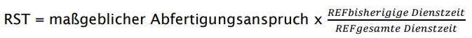
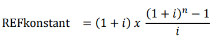
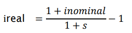
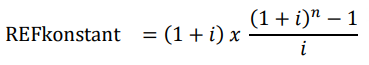

# Exkurs Brutto- oder Nettomethode für die Berechnung von Personalrückstellungen

UGB § 211 Abs. 1 idF RÄG 2014 bzw. AFRAC Stellungnahme 27 sehen die **Nominalmethode** (Bruttomethode) vor. Abfertigungen und Jubiläumsgelder sind mit dem Erfüllungsbetrag anzusetzen. Dieser **Erfüllungsbetrag** ist mit einem **Nominalzinssatz** über die Dienstzeit zu verteilen. Dagegen wird im aktuellen Fachgutachten KFS/RL 2 die Anwendung der **Realwertmethode** (Nettomethode) gefordert. Dabei wird der **aktuelle Bezug,** also ohne zukünftige Gehaltssteigerungen, mit einem **Realzinssatz** verzinst.

Schon bisher war es möglich, in den Stammdaten des Klienten diese Gehaltssteigerungen zu berücksichtigen und damit den erwarteten Erfüllungsbetrag in der Berechnung zu berücksichtigen. Für die Nettomethode musste bislang der Nominalzinssatz manuell auf einen Realzinssatz umgerechnet werden.

**Vorgehensweise in den RZL-Programmen zur Ermittlung der Abfertigungs-Rückstellung**

Die Rückstellung wird auf Basis der Bruttomethode mit **konstanten Rentenendwertfaktoren** mithilfe der Formel

{width="500"}

gebildet. Der maßgebliche Abfertigungsanspruch ergibt sich hierbei aus dem laufenden Bezug, der mit einem Gehaltssteigerungsprozentsatz erhöht wird.

Die Rentenendwertfaktoren wurden dabei bisher mithilfe der Formel für eine **vorschüssige, konstante Rente ermittelt.**

{width="300"}

**Option zur Umstellung auf progressive Bruttomethode oder Nettomethode**

Um die geforderten konsistenten Ergebnisse zu erhalten, besteht die Möglichkeit, in den Klientenstammdaten (*Stamm / Klient / Details Rückstellungen (1)*) entweder auf die progressive *Bruttomethode* oder auf die *Nettomethode* umzustellen.

{width="500"}

**A) Progressive Bruttomethode**

Wie bisher wird der lfd. Bezug hier zunächst mit Hilfe des Gehaltssteigerungsprozentsatzes auf einen maßgeblichen Abfertigungsanspruch hochgerechnet (Erfüllungsbetrag). Im Unterschied zur bisherigen Berechnung kommen nun aber die Rentenendwertfaktoren für eine progressive, vorschüssige Rente zum Einsatz.

{width="350"}

D. h. im Vergleich zur bisherigen Berechnungsvariante verändern sich hier die REF für die bisherige Dienstzeit und für die gesamte Dienstzeit.

**B) Nettomethode**

Als Alternative dazu kann in den Stammdaten auch die *Nettomethode* angewählt werden. Auf Basis des eingegebenen Nominalzinssatzes und des Prozentsatzes für die Gehaltssteigerungen, wird über die Formel

{width="200"}

ein **Realzinssatz** ermittelt, der auch sofort angezeigt wird. Im Gegensatz zu den beiden Bruttovarianten wird in der Nettomethode der maßgebliche Abfertigungsanspruch **nur aus den laufenden Bezügen** gebildet (also ohne Gehaltssteigerungen). Nachdem die Gehaltssteigerungen hier bereits über den Realzinssatz (ireal) Berücksichtigung finden, kommt hier wieder

{width="300"}

d. h., die Formel für die konstanten Rentenendwertfaktoren zum Einsatz, allerdings natürlich mit einem veränderten Zinssatz im Vergleich zur bisherigen Berechnung.

Speziell bei der **Rückstellung für Abfertigungen** werden die beiden Berechnungsvarianten zu einer sehr exakten Übereinstimmung der Rückstellungswerte führen. Welche der beiden Varianten eingesetzt wird, ist daher eigentlich nicht entscheidend. Der Vorteil der Nettomethode liegt aus unserer Sicht in der etwas leichteren Nachvollziehbarkeit der Werte.

Bei den **Jubiläumsgeldrückstellungen** können sich vor allem bei sehr hohen Rückstellungsbeträgen **Unterschiede** zwischen der progressiven Bruttomethode und der Nettomethode ergeben. Diese ergeben sich aus der seit 2016 bestehenden SV-Pflicht bei den Jubiläumsgeldern und den damit verbundenen Nebenkosten bis zur Sonderzahlungshöchstbemessungsgrundlage. Über ein eigenes Eingabefeld *Valorisierung HBGL* kann daher ein Steigerungsfaktor für die HBGL-SZ definiert werden, der wiederum die Ergebnisse aus Brutto- und Nettomethode auch bei sehr hohen Jubiläumsgeldern annähert.