# Sachbezug anlegen und abrechnen

In dieser Anleitung erfahren Sie, wie Sie einen Sachbezug anlegen und beim Dienstnehmer abrechnen.

> **Kurzüberblick**
>
> **KFZ-Sachbezug:**  
> Firmenfahrzeug anlegen → Sachbezugslohnart anlegen → Lohnart beim Dienstnehmer abrechnen → KFZ-Nummer zuordnen
>
> **Andere Sachbezüge:**  
> Sachbezugslohnart anlegen → Lohnart beim Dienstnehmer abrechnen

---

## 1. Sachbezugsart bestimmen

Welche Schritte erforderlich sind, hängt von der Art des Sachbezugs ab.

| Sachbezugsart           | Vorgehensweise                                                       |
| ----------------------- | -------------------------------------------------------------------- |
| **KFZ-Sachbezug**       | Zuerst [Firmenfahrzeug anlegen](#2-firmenfahrzeug-anlegen)           |
| **Sachbezug Wohnraum**  | Weiter mit [Sachbezugslohnart anlegen](#3-sachbezugslohnart-anlegen) |
| **Sonstiger Sachbezug** | Weiter mit [Sachbezugslohnart anlegen](#3-sachbezugslohnart-anlegen) |

Liegt zusätzlich ein Sonderfall vor?

| Sonderfall                          | Vorgehensweise                                                                     |
| ----------------------------------- | ---------------------------------------------------------------------------------- |
| **Sachbezug 0 %**                   | Zusätzlich [Sonderfall: Sachbezug 0 %](#sonderfall-sachbezug-0) beachten           |
| **Sachbezug bei Auslandstätigkeit** | Zusätzlich [Sonderfall: Auslandstätigkeit](#sonderfall-auslandstatigkeit) beachten |

## 2. Firmenfahrzeug anlegen

> Dieser Schritt ist nur bei einem **KFZ-Sachbezug** erforderlich.

Öffnen Sie *Stamm / Erfassung Firmenfahrzeuge* und legen Sie das Firmenfahrzeug an.

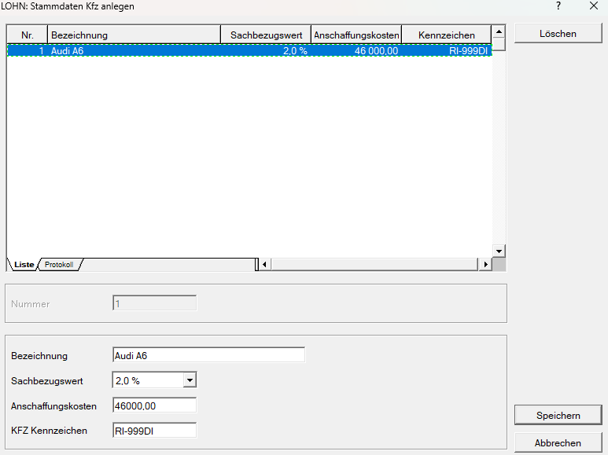{width="600"}

Vergeben Sie zunächst eine frei wählbare Fahrzeugnummer. Erfassen Sie anschließend:

- *Bezeichnung* des Fahrzeugs
- *Sachbezugswert* (0 %, 1,5 %, 2,0 % oder Durchschnittswert)
- *Anschaffungskosten*
- *KFZ-Kennzeichen*

!!! info "Tipp"
    Der *Durchschnittswert* wird ausschließlich für Poolfahrzeuge verwendet.

!!! warning "Hinweis"
    Die Felder *Sachbezugswert* und *Anschaffungskosten* sind verpflichtend auszufüllen.

### Halber Sachbezug

Auch bei einem halben Sachbezug ist beim Firmenfahrzeug der *volle Sachbezugsprozentsatz* auszuwählen.

Zur Verfügung stehen:

- 0 %
- 1,5 %
- 2,0 %
- Durchschnittswert

Die Halbierung erfolgt somit nicht über den Sachbezugsprozentsatz im Firmenfahrzeug, sondern über den tatsächlich abgerechneten Sachbezugsbetrag in der Abrechnung.

**Beispiel:**

Der CO₂-Emissionswert des Fahrzeugs beträgt **130 g/km**. Daraus ergibt sich ein Sachbezugsprozentsatz von **2,0 %**.

Auch wenn das Fahrzeug nur mit halbem Sachbezug berücksichtigt wird, wählen Sie in den KFZ-Stammdaten im Feld *Sachbezugswert* **2,0 %** aus.

## 3. Sachbezugslohnart anlegen

Für die Abrechnung eines Sachbezugs benötigen Sie eine entsprechende freie Lohnart.

Je nach gewünschter Verbuchung stehen drei Varianten zur Verfügung:

| Variante                                    | Geeignet, wenn ...                                                                           |
| ------------------------------------------- | -------------------------------------------------------------------------------------------- |
| **1. Eine Lohnart für Bezug und Abzug**     | für Bezug und Abzug dieselbe FIBU-Kontonummer verwendet werden kann                          |
| **2. Eigene Lohnarten für Bezug und Abzug** | unterschiedliche FIBU-Kontonummern benötigt werden                                           |
| **3. Abzug direkt beim Dienstnehmer**       | der Bezug über eine freie Lohnart und der Abzug direkt in der Abrechnung erfasst werden soll |

### Variante 1 – Eine Lohnart für Bezug und Abzug

Legen Sie eine freie Lohnart mit der Art *Bezug* an und aktivieren Sie das Feld *Sachbezug*. Dadurch wird in der Abrechnung automatisch ein Abzug in gleicher Höhe erzeugt.

**Vorteil:**

Es wird nur eine einzige Lohnart benötigt. Eine separate Abzugslohnart ist nicht notwendig.

**Zu beachten:**

Für Bezug und Abzug kann nur eine gemeinsame FIBU-Kontonummer hinterlegt werden.

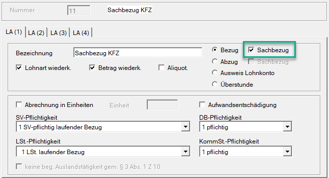{width="500"}

Wählen Sie anschließend im Register **LA (4)** die passende *Art des Sachbezugs* aus:

- Sachbezug KFZ
- Sachbezug Wohnraum
- sonstige Sachbezüge

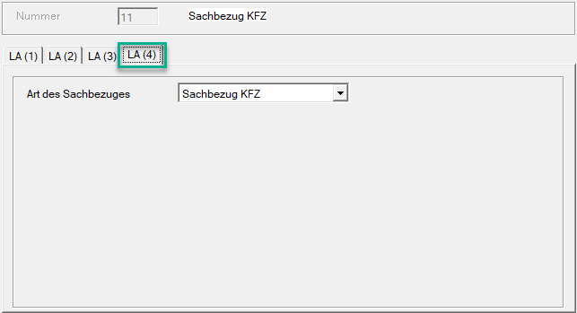{width="500"}

Die korrekte *Sachbezugsart* ist erforderlich, damit die Zuordnung auf dem **Jahreslohnzettel L16** richtig erfolgt.

Bei der Sachbezugsart *Sachbezug KFZ* wird bei der Abrechnung automatisch im Bereich [*Lohnsteuer*](../LOHN/Abrechnungsbildschirme/Lohnsteuer.md/#pendlerpauschale) bei *Firmenfahrzeug* die Checkbox aktiviert. Dadurch werden am Jahreslohnzettel die betroffenen Monate bei „Überlassung eines arbeitgebereigenen KFZ für Fahrten Wohnung–Arbeitsstätte, Anzahl Kalendermonate (§ 16 Abs. 1 Z 6 lit. b)“ berücksichtigt.

### Variante 2 – Eigene Lohnart für Bezug und Abzug

Verwenden Sie diese Variante, wenn für Bezug und Abzug **unterschiedliche FIBU-Kontonummern** benötigt werden.

Legen Sie dazu zwei freie Lohnarten an:

**Bezugslohnart**

Legen Sie eine freie Lohnart mit der Art *Bezug* an. Das Feld *Sachbezug* bleibt **deaktiviert**.

{width="500"}

**Abzugslohnart**

Legen Sie eine freie Lohnart mit der Art *Abzug* an und **aktivieren** Sie das Feld *Sachbezug*.

{width="500"}

Wählen Sie anschließend im Register **LA (4)** die entsprechende *Art des Sachbezugs* aus.

!!! warning "Hinweis"
    Bei dieser Variante darf das Feld *Sachbezug* **nur** bei der *Abzugslohnart* aktiviert sein. Wird es bereits bei der *Bezugslohnart* aktiviert, erzeugt das Programm automatisch einen Abzug. Zusammen mit der eigenen Abzugslohnart würde der Sachbezug dadurch doppelt abgezogen.

### Variante 3 – Abzug direkt beim Dienstnehmer

Legen Sie eine freie Lohnart mit der Art *Bezug* an. Das Feld *Sachbezug* bleibt **deaktiviert**.

{width="500"}

Den *Abzug* erfassen Sie anschließend direkt beim Dienstnehmer über das Feld ***Sachbezug*** im Bereich [Abzüge](../LOHN/Abrechnungsbildschirme/Abzuege.md/#sachbezug).

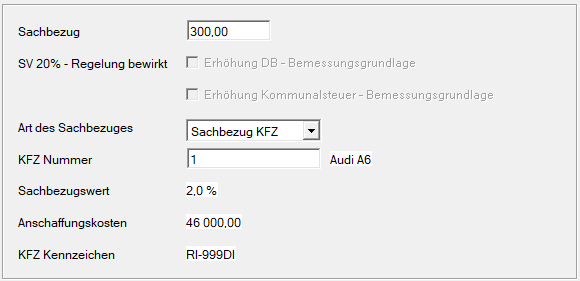{width="400"}

Auch für den verwendeten Abzug muss die passende *Art des Sachbezugs* hinterlegt sein.

!!! info "Tipp"
    Durch einen Rechtsklick in das Feld *Sachbezug* kann der Wert *Explizit 0* ausgewählt werden. Dadurch wird der Sachbezug mit 0,00 auf der Abrechnung ausgewiesen – auch wenn kein Betrag verrechnet wird. Bei einem *Sachbezug KFZ* bewirkt diese Einstellung zusätzlich, dass die relevanten Felder für *Sachbezugsprozentsatz* und *Anschaffungskosten* sowohl auf dem Jahreslohnzettel (L16) als auch auf dem Jahreslohnkonto korrekt befüllt werden.

!!! warning "Hinweis"
    Bei dieser Variante darf das Feld *Sachbezug* **nur** bei der *Abzugslohnart* aktiviert sein. Wird es bereits bei der *Bezugslohnart* aktiviert, erzeugt das Programm automatisch einen Abzug. Zusammen mit der eigenen Abzugslohnart würde der Sachbezug dadurch doppelt abgezogen.

## 4. Sachbezug beim Dienstnehmer abrechnen

Erfassen Sie den Sachbezug beim Dienstnehmer entsprechend der zuvor gewählten Variante. Je nach gewählter Variante erfassen Sie nur die Bezugslohnart, die Bezugs- und Abzugslohnart oder den Abzug direkt im Bereich [*Abzüge*](../LOHN/Abrechnungsbildschirme/Abzuege.md/#sachbezug).

### Zusätzlich bei einem KFZ-Sachbezug

Bei einem KFZ-Sachbezug muss zusätzlich die **KFZ-Nummer** hinterlegt werden.

Dies erfolgt entweder:

- bei der entsprechenden freien Lohnart oder
- im Abrechnungsbildschirm [*Abzüge*](../LOHN/Abrechnungsbildschirme/Abzuege.md/#sachbezug).

Über die *KFZ-Nummer* wird das zuvor unter [Firmenfahrzeug anlegen](#2-firmenfahrzeug-anlegen) erfasste Fahrzeug übernommen.

**Freie Lohnart**

{width="500"}

**Abzüge**

{width="500"}

## Sonderfälle

### Sonderfall: Sachbezug 0 %

Auch ein Sachbezug mit **0 %** muss entsprechend berücksichtigt werden.

Gehen Sie dazu wie folgt vor:

1. Hinterlegen Sie die entsprechende Lohnart beim Dienstnehmer.
2. Klicken Sie mit der rechten Maustaste in das Betragsfeld.
3. Wählen Sie ***Explizit 0***.

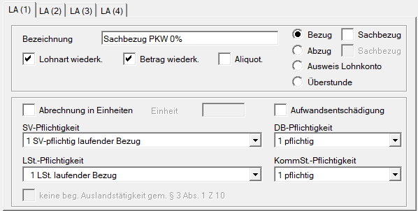{width="500"}

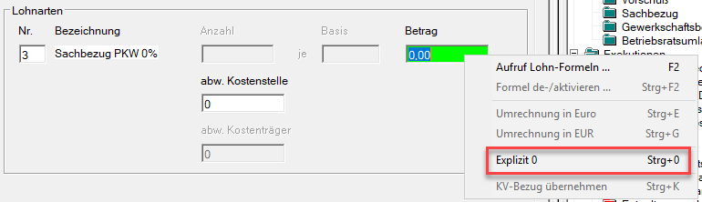

Dadurch wird der Betrag mit **0,00** ausgewiesen und beim Betragsfeld erscheint ein `!`.

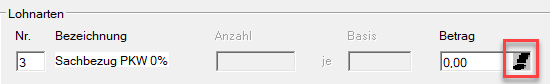

!!! info "KFZ-Sachbezug"
    Bei einem KFZ-Sachbezug sorgt *Explizit 0* zusätzlich dafür, dass die relevanten Angaben zum Sachbezugsprozentsatz und zu den Anschaffungskosten am Jahreslohnzettel (L16) sowie am Jahreslohnkonto berücksichtigt werden.

!!! info "Tipp"
    Wenn Sie unter *Abzüge* den Sachbezugsabzug erfassen, können Sie auch dort *Explizit 0* auswählen.

### Sonderfall: Auslandstätigkeit

Ist ein Dienstnehmer im Ausland tätig, sind beim Sachbezug zusätzliche Einstellungen erforderlich.

#### Bezugslohnart

Legen Sie die Bezugslohnart für den Sachbezug wie gewohnt an.

Bei der *Lohnsteuerpflichtigkeit* wählen Sie **Nr. 4 LSt. Auslandsbezug**.

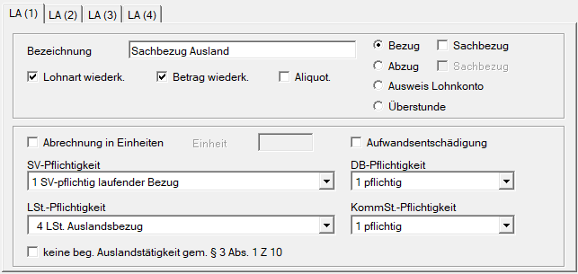{width="500"}

Bei einer **nicht begünstigten Auslandstätigkeit** aktivieren Sie unter **LA (1)** die Option *keine beg. Auslandstätigkeit gem. § 3 Abs. 1 Z 10*.

#### Abzugslohnart

Aktivieren Sie bei der Abzugslohnart:

- **Abzug**
- **Sachbezug**

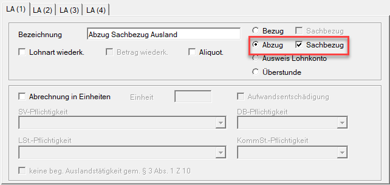{width="500"}

Wählen Sie anschließend im Register **LA (4)** die passende *Art des Sachbezugs*.

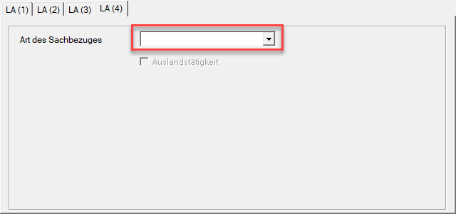{width="500"}

Bei einer **begünstigten Auslandstätigkeit** – zum Beispiel einer Montagetätigkeit – aktivieren Sie zusätzlich **Auslandstätigkeit**.

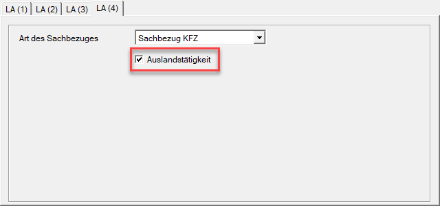{width="500"}

Bei einer **nicht begünstigten Auslandstätigkeit** aktivieren Sie unter **LA (1)** die Option *keine beg. Auslandstätigkeit gem. § 3 Abs. 1 Z 10*.

#### Abrechnung

Legen Sie in der Abrechnung sowohl bei der Bezugs- als auch bei der Abzugslohnart fest:

- für welches **Land** die Abrechnung erfolgt, und
- ob die **Befreiungsmethode** oder die **Anrechnungsmethode** angewendet wird.

!!! info "Tipp"
    Bei einem KFZ-Sachbezug muss bei der Abzugslohnart zusätzlich die **KFZ-Nummer** des Fahrzeugs hinterlegt werden. Fehlt diese, erhalten Sie einen entsprechenden Hinweis.

### Besonderheiten beim KFZ-Sachbezug am Jahresende

Wird das Fahrzeug im Dezember gewechselt, dürfen am Jahreslohnzettel nur die Anschaffungskosten des am 31. Dezember aktuellen Fahrzeugs ausgewiesen werden.

Damit der Fahrzeugwechsel auf dem Jahreslohnzettel korrekt dargestellt wird, deaktivieren Sie beim bisherigen Sachbezug unter **Freie Lohnarten** oder **Abzüge** die Option *Anschaffungskosten per 31.12. am L16 ausweisen (nur Dezember)*.

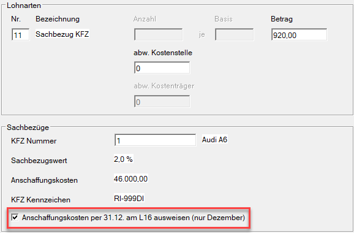

Für den Jahreslohnzettel sind die Anschaffungskosten jener Fahrzeuge zu berücksichtigen, die am 31. Dezember tatsächlich verwendet werden.

Wird im Dezember ein Fahrzeug gewechselt und das bisherige Fahrzeug am 31. Dezember nicht mehr verwendet, deaktivieren Sie bei diesem Sachbezug unter *Freie Lohnarten* bzw. *Abzüge* die Option *Anschaffungskosten per 31.12. am L16 ausweisen (nur Dezember)*.

Werden hingegen am 31. Dezember mehrere Fahrzeuge verwendet, bleibt die Option bei allen betreffenden Sachbezügen aktiviert. Die Anschaffungskosten dieser Fahrzeuge werden am Jahreslohnzettel entsprechend in Summe berücksichtigt.

!!! warning "Hinweis"
    Die Option wirkt sich ausschließlich auf die **Anschaffungskosten** aus. Die Sachbezugsprozentsätze sind unabhängig davon am Jahreslohnzettel (L16) auszuweisen.

!!! info "Tipp"
    Von Jänner bis November ist die Option *Anschaffungskosten per 31.12. am L16 ausweisen (nur Dezember)* deaktiviert und ausgegraut.

