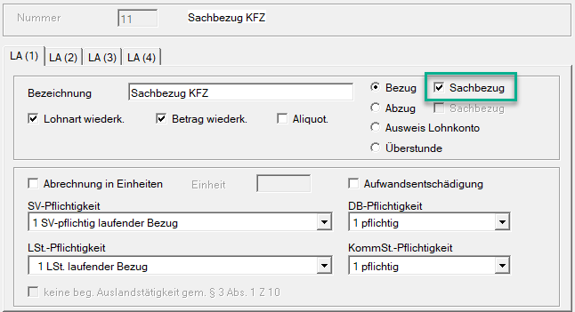
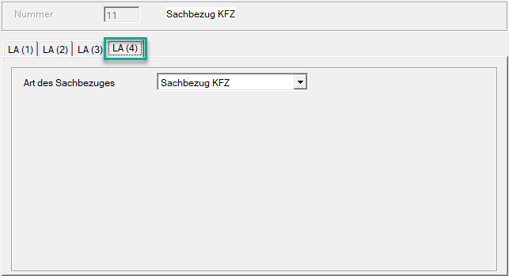
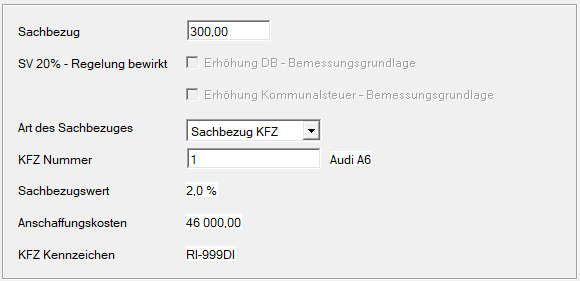

# Anlage Sachbezug – drei Möglichkeiten

## Möglichkeit 1

Legen Sie eine freie Lohnart mit der Art *Bezug* an und aktivieren Sie das Feld *Sachbezug*. Dadurch wird in der Abrechnung automatisch ein Abzug in gleicher Höhe erzeugt.

**Vorteil:**

Es wird nur eine einzige Lohnart benötigt; eine separate Abzugslohnart ist nicht notwendig.

**Nachteil:**

Für Bezug und Abzug kann nur eine FIBU-Kontonummer hinterlegt werden.

{width="500"}

Im Register **LA(4)** wählen Sie die passende Sachbezugsart aus:

- Sachbezug KFZ
- Sachbezug Wohnraum
- sonstige Sachbezüge

{width="500"}

Nur durch diese Auswahl ist eine korrekte Zuordnung für den Jahreslohnzettel (L16) gewährleistet.

## Möglichkeit 2

Bei dieser Variante können zwei unterschiedliche FIBU-Kontonummern hinterlegt werden. Dafür müssen jedoch zwei freie Lohnarten angelegt werden – eine für den Bezug und eine für den Abzug.

{width="500"}

{width="500"}

Auch hier ist bei der Abzugslohnart im Register LA(4) die entsprechende Art des Sachbezugs auszuwählen.

## Möglichkeit 3

Bei der dritten Möglichkeit wird nur eine freie Lohnart für den Bezug angelegt. Der Abzug erfolgt direkt in der Abrechnung über das Feld Sachbezug im Bereich der [Abzüge](../Abrechnungsbildschirme/Abzuege.md).

{width="500"}

{width="400"}

Auch in diesem Fall muss für die verwendete Abzugslohnart die Art des Sachbezugs hinterlegt werden.