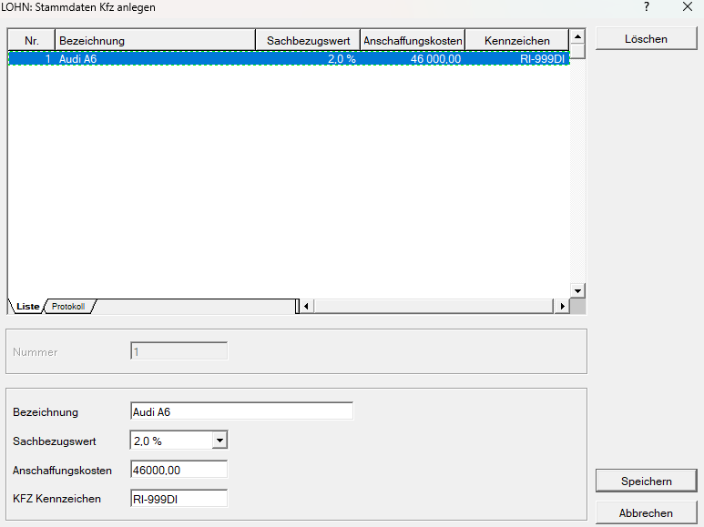

# Erfassung von Firmenfahrzeugen

Über den Menüpunkt *Stamm / Erfassung Firmenfahrzeuge* können Sie alle Firmenfahrzeuge anlegen.

Legen Sie zunächst eine frei wählbare Fahrzeugnummer fest. Anschließend können Sie folgende Angaben erfassen:

- *Bezeichnung* des Fahrzeugs,
- *Sachbezugswert* (0 %, 1,5 %, 2,0 % oder Durchschnittswert),
- *Anschaffungskosten*
- *KFZ-Kennzeichen*

!!! info "Tipp"
    Der *Durchschnittswert* wird ausschließlich für Poolfahrzeugen verwendet.

!!! warning "Hinweis"
    Die Felder *Sachbezugswert* und *Anschaffungskosten* sind verpflichtend auszufüllen.

## Halber Sachbezug

Auch bei einem halben Sachbezug muss am Jahreslohnzettel (L16) der volle Sachbezugsprozentsatz angegeben werden.

Es stehen dabei ausschließlich folgende Werte zur Auswahl:

- 0 %
- 1,5 %
- 2,0 %
- Durchschnittswert

**Beispiel:**

Der CO₂-Emissionswert des Fahrzeugs beträgt **130 g/km**.

Daraus ergibt sich ein Sachbezugsprozentsatz von **2,0 %**.

Auch wenn das Fahrzeug nur mit halbem Sachbezug berücksichtigt wird, muss in den KFZ-Stammdaten beim Feld *Sachbezugswert* der Wert *2,0 %* ausgewählt werden.
