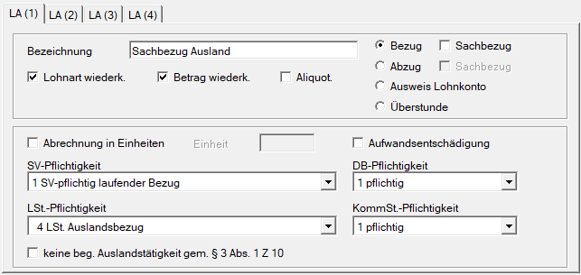
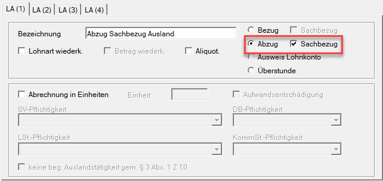
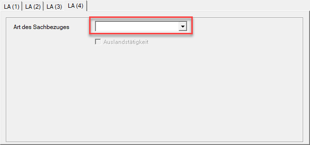
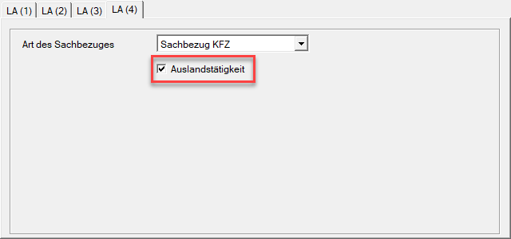

# Sachbezug bei Auslandstätigkeit anlegen

Ist ein Dienstnehmer im Ausland tätig, muss dies auch beim Sachbezug entsprechend berücksichtigt werden. Dieser Beitrag beschreibt, wie Sie die Bezugslohnart und die Abzugslohnart für den Sachbezug korrekt anlegen, wenn ein Auslandsabzug vorliegt, und worauf Sie bei der Abrechnung achten müssen.

## Anlage der Bezugslohnart

Legen Sie zunächst die Bezugslohnart für den Sachbezug wie gewohnt an.

!!! warning "Hinweis"
    Bei der Lohnsteuerpflichtigkeit muss die Einstellung **Nr. 4 LSt. Auslandsbezug** ausgewählt werden.

Je nachdem, ob es sich um eine begünstigte oder nicht begünstigte Auslandstätigkeit handelt, muss das Häkchen bei *keine beg. Auslandstätigkeit gem. § 3 Abs. 1 Z 10* gesetzt werden.

## Anlage der Abzugslohnart

Bei der Abzugslohnart aktivieren Sie **Abzug** und **Sachbezug**.

Wählen Sie anschließend unter **LA (4)** zusätzlich die passende **Sachbezugsart** aus.

Setzen Sie das Häkchen bei **Auslandstätigkeit**, wenn eine **begünstigte Auslandstätigkeit** vorliegt (zum Beispiel eine Montagetätigkeit). 

Liegt eine **nicht begünstigte** Auslandstätigkeit vor, aktivieren Sie – wie auch bei normalen Bezugslohnarten für das Ausland – unter **LA (1)** das Häkchen bei *keine beg. Auslandstätigkeit gem. § 3 Abs. 1 Z 10*.

## Abrechnung

In der Abrechnung legen Sie sowohl bei der Bezugslohnart als auch bei der Abzugslohnart fest:

- für welches **Land** die Abrechnung erfolgt, und
- ob die **Befreiungsmethode** oder die **Anrechnungsmethode** zur Anwendung kommt.

!!! info "Tipp"
    Wenn es sich um einen KFZ Sachbezug handelt, vergessen Sie nicht, bei der Abzugslohnart die **KFZ-Nummer** des Fahrzeugs zu hinterlegen. Wird diese nicht erfasst, erhalten Sie einen entsprechenden Hinweis.
