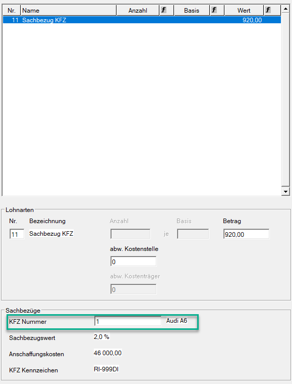
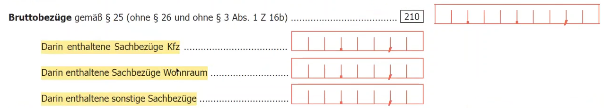

# Anwendung des KFZ Sachbezugs in der Abrechnung

Damit ein KFZ-Sachbezug korrekt in der Abrechnung berücksichtigt wird, muss bei der entsprechenden Lohnart bzw. im Abrechnungsbildschirm [*Abzüge*](../Abrechnungsbildschirme/Abzuege.md) die *KFZ-Nummer* hinterlegt werden. Dadurch wird das zuvor unter [*Erfassung Firmenfahrzeuge*](../Sachbezüge/Erfassung_Firmenfahrzeuge.md) angelegte Fahrzeug automatisch übernommen.

**Freie Lohnart**

{width="500"}

**Abzüge**

{width="500"}

## Ausweis KFZ Sachbezug auf Jahreslohnzettel (L16)

Ein Ausdruck bzw. die elektronische Übermittlung des Jahreslohnzettels 2026 ist derzeit noch nicht verfügbar. Das entsprechende Formular wird in einem der nächsten Updates bereitgestellt.

**Ausschnitte aus dem PDF-Formular**

!!! warning "Hinweis"
    Bei einem Wechsel des KFZ und somit des Sachbezugswerts (0 %, 1,5 %, 2 % oder Durchschnittswert) müssen alle Sachbezugswerte aktiviert werden, die im Laufe des Jahres zur Anwendung kamen.
    
    Die *Anschaffungskosten Kfz zum 31.12.* sind nur dann anzugeben, wenn zum 31.12. tatsächlich ein KFZ-Sachbezug vorliegt.

