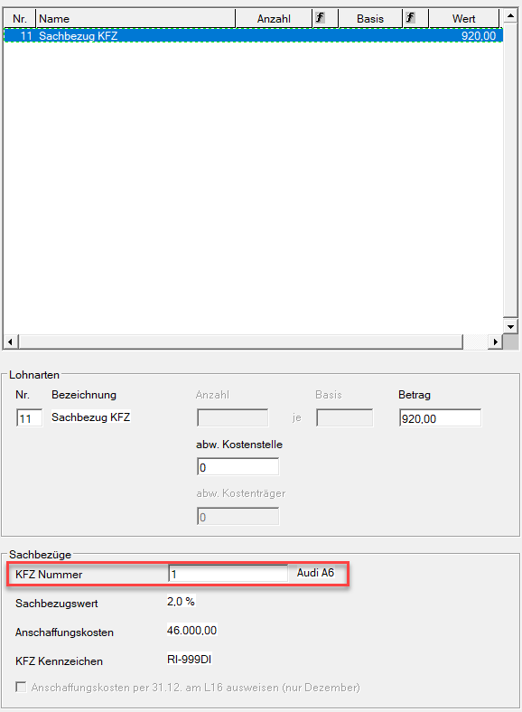
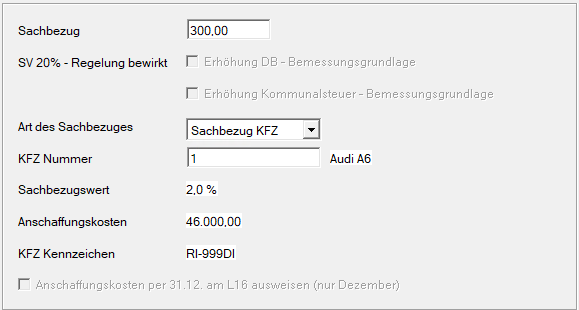
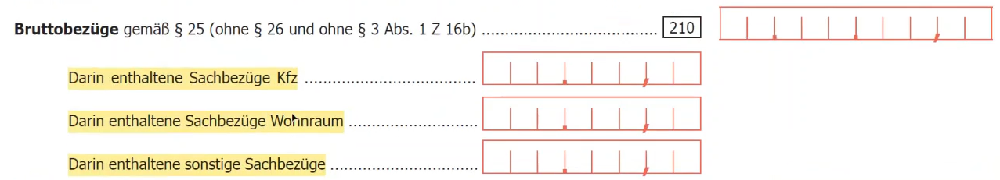
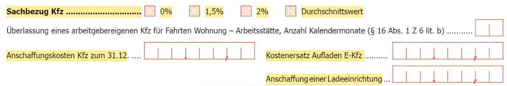

# Anwendung des KFZ Sachbezugs in der Abrechnung

Damit ein KFZ-Sachbezug korrekt in der Abrechnung berücksichtigt wird, muss bei der entsprechenden Lohnart bzw. im Abrechnungsbildschirm [*Abzüge*](../Abrechnungsbildschirme/Abzuege.md) die *KFZ-Nummer* hinterlegt werden. Dadurch wird das zuvor unter [*Erfassung Firmenfahrzeuge*](../Sachbezüge/Erfassung_Firmenfahrzeuge.md) angelegte Fahrzeug automatisch übernommen.

**Freie Lohnart**

{width="500"}

**Abzüge**

{width="500"}

## Ausweis KFZ Sachbezug auf Jahreslohnzettel (L16)

Ein Ausdruck bzw. die elektronische Übermittlung des Jahreslohnzettels 2026 ist derzeit noch nicht verfügbar. Das entsprechende Formular wird in einem der nächsten Updates bereitgestellt.

**Ausschnitte aus dem PDF-Formular**

!!! warning "Hinweis"
    Bei einem Wechsel des KFZ und somit des Sachbezugswerts (0 %, 1,5 %, 2 % oder Durchschnittswert) müssen alle Sachbezugswerte aktiviert werden, die im Laufe des Jahres zur Anwendung kamen.
    
    Die *Anschaffungskosten Kfz zum 31.12.* sind nur dann anzugeben, wenn zum 31.12. tatsächlich ein KFZ-Sachbezug vorliegt.

## Wechsel des KFZ-Sachbezugs im Dezember

Wird das Fahrzeug im Dezember gewechselt, sind ausschließlich die Anschaffungskosten des am 31. Dezember aktuellen KFZ-Sachbezugs auszuweisen.

Damit der Fahrzeugwechsel auf dem Jahreslohnzettel korrekt dargestellt wird, deaktivieren Sie beim bisherigen Sachbezug unter **Freie Lohnarten** oder **Abzüge** die Option *Anschaffungskosten per 31.12. am L16 ausweisen (nur Dezember)*.

Dadurch werden die Anschaffungskosten dieses Fahrzeugs für Dezember nicht berücksichtigt. Auf dem Jahreslohnzettel (L16) werden nur die Anschaffungskosten des zum 31. Dezember aktiven Fahrzeugs ausgewiesen.

!!! warning "Hinweis"
    Die Option *Anschaffungskosten per 31.12. am L16 ausweisen (nur Dezember)* wirkt sich ausschließlich auf die Anschaffungskosten aus. Die Prozentsätze sind unabhängig davon, ob der Sachbezug am 31. Dezember aktiv ist, auf dem Jahreslohnzettel (L16) auszuweisen.

!!! info "Tipp"
    In den Monaten Jänner bis November ist die Option *Anschaffungskosten per 31.12. am L16 ausweisen (nur Dezember)* deaktiviert und ausgegraut.