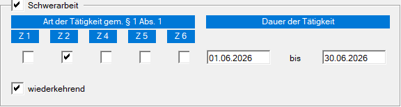
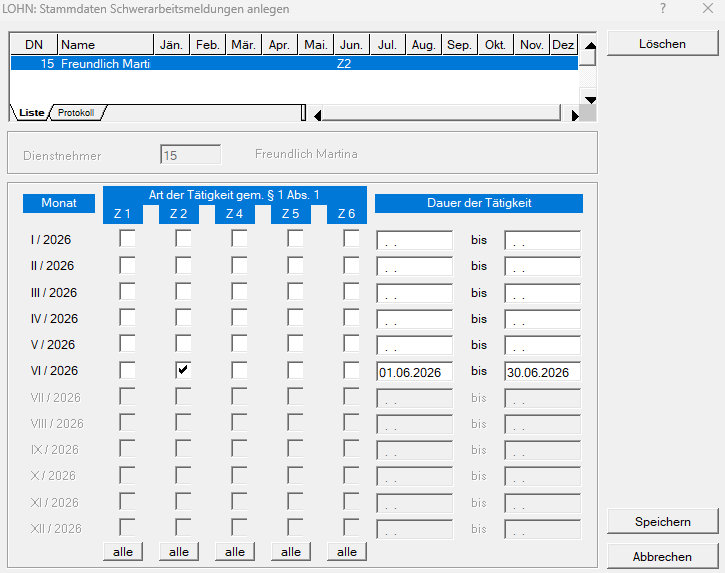

# Schwerarbeitsmeldung

**Warum ist eine Schwerarbeitsmeldung erforderlich?**

Arbeitgeber sind verpflichtet, bestimmte Tätigkeiten, die als **Schwerarbeit im Sinne der Schwerarbeitsverordnung** gelten können, an den zuständigen Krankenversicherungsträger zu melden.

Die Meldung dient dazu, die geleisteten Schwerarbeitszeiten einer versicherten Person zu dokumentieren. Diese Zeiten können später für die Prüfung eines möglichen Anspruchs auf eine **Schwerarbeitspension** von Bedeutung sein.

Die Schwerarbeitsmeldung bedeutet dabei noch nicht automatisch, dass tatsächlich ein Anspruch auf eine Schwerarbeitspension besteht. Die endgültige Beurteilung, ob die gesetzlichen Voraussetzungen für Schwerarbeit bzw. für eine entsprechende Pension erfüllt sind, erfolgt durch den zuständigen Pensionsversicherungsträger.

**Für welche Mitarbeiter ist eine Meldung zu machen?**

Eine Schwerarbeitsmeldung ist grundsätzlich für Arbeitnehmer erforderlich, die Tätigkeiten ausüben, die unter die Schwerarbeitsverordnung fallen, und die folgende Altersgrenzen erreicht haben:

- männliche Versicherte: ab Vollendung des 40. Lebensjahres
- weibliche Versicherte: ab Vollendung des 35. Lebensjahres

Zu melden sind insbesondere die betreffende Schwerarbeitstätigkeit, die betroffene Person einschließlich Versicherungsnummer sowie die Dauer der Tätigkeit.

Ob eine Tätigkeit tatsächlich als Schwerarbeit einzustufen ist, richtet sich nach den Kriterien der Schwerarbeitsverordnung. Dazu können beispielsweise bestimmte Formen von Nacht- bzw. Schichtarbeit oder besonders schwere körperliche Arbeit zählen.

**Wann ist die Meldung durchzuführen?**

Die Schwerarbeitsmeldung ist **jährlich bis spätestens Ende Februar des Folgejahres** zu übermitteln.

Beispiel: Schwerarbeitszeiten aus dem Jahr 2026 sind bis spätestens Ende Februar 2027 zu melden.

**Für wen ist keine Schwerarbeitsmeldung erforderlich?**

Keine Schwerarbeitsmeldung ist insbesondere für **geringfügig Beschäftigte** zu erstatten, da für diese Zeiten grundsätzlich keine Pflichtversicherung in der Pensionsversicherung besteht.

Für bestimmte Tätigkeiten im Bereich der BUAK erfolgt die Meldung außerdem durch die **Bauarbeiter-Urlaubs- und Abfertigungskasse (BUAK)** und nicht durch den Arbeitgeber.

## Abrechnung in der RZL Lohnverrechnung

In der RZL Lohnverrechnung stehen zwei Möglichkeiten zur Verfügung, um Schwerarbeitszeiträume zu erfassen:

- direkt in der Abrechnung des Dienstnehmers im Bereich [*Sozialversicherung*](../LOHN/Abrechnungsbildschirme/Sozialversicherung.md/#schwerarbeit)
- unter *Stamm / Schwerarbeitsmeldungen*

### Erfassung in der Abrechnung des Dienstnehmers

Im Bereich *Sozialversicherung* kann der Schwerarbeitszeitraum für jeden Monat erfasst werden.

Wird die Option *wiederkehrend* aktiviert, wird der Schwerarbeitszeitraum im Folgemonat automatisch für den gesamten Monat übernommen.

Für die Erfassung stehen folgende Tätigkeitsarten zur Auswahl:

| Tätigkeitsart | Beschreibung                                 |
| :------------ | :------------------------------------------- |
| Z1            | Schicht- oder Wechseldienst                  |
| Z2            | Regelmäßige Arbeit bei Hitze oder Kälte      |
| Z4            | Schwere körperliche Arbeit                   |
| Z5            | Berufsbedingte Pflege                        |
| Z6            | Anspruch auf Pflegegeld (mindestens Stufe 3) |

### Erfassung unter Stamm / Schwerarbeitsmeldungen

Unter *Stamm / Schwerarbeitsmeldungen* kann die Schwerarbeit für einen Dienstnehmer gesammelt für das gesamte Jahr erfasst werden. Dadurch ist es nicht erforderlich, die einzelnen Monatsabrechnungen aufzurufen.

Bei der Auswahl des Dienstnehmers werden jene Personen in schwarzer Schrift angezeigt, die das für die Schwerarbeitsmeldung relevante Alter erreicht haben. Die unterschiedlichen Altersgrenzen für männliche und weibliche Dienstnehmer werden dabei automatisch berücksichtigt.

Anschließend ist für jeden betroffenen Monat die entsprechende *Tätigkeitsart* auszuwählen und die jeweilige *Dauer der Schwerarbeit* einzutragen.

