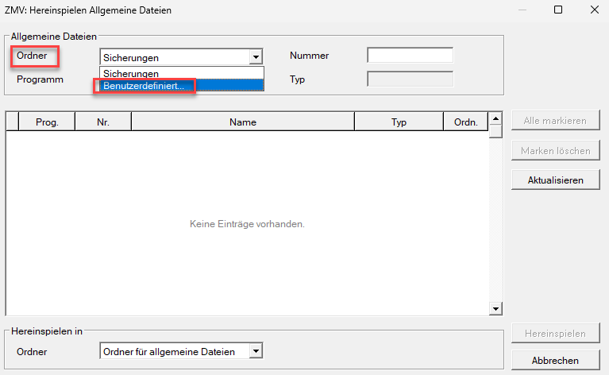
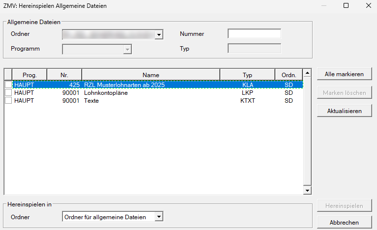

# Verwaltung

## Das Mengengerüst

Das *Mengengerüst* sollte immer den tatsächlichen Anforderungen des jeweiligen Klienten entsprechen, damit nicht unnötig Speicherplatz auf der Festplatte belegt wird. Änderungen am Mengengerüst während der Arbeit in der Lohnverrechnung werden über den Menüpunkt *Klient / Vergrößern/Verkleinern* vorgenommen.

{width="500"}

## Klient komprimieren/dekomprimieren

Durch das Komprimieren benötigt der Klient nur noch etwa 20 – 30 % des ursprünglichen Speicherplatzes.

Nach Anwahl des Menüpunktes *Klient / Verwaltung / Komprimieren* kann zwischen *Komprimieren* und *Dekomprimieren* gewählt werden. Nach Eingabe der Klientennummer wird der gewünschte Klient entsprechend verarbeitet.

Über die Schaltfläche *Erweitert* werden alle Lohn-Klienten aufgelistet. Die gewünschten Klienten können mit dem *Cursor* ausgewählt und mit der *Leertaste* oder per Mausklick aktiviert werden. Mit *Komprimieren* oder *Dekomprimieren* werden alle ausgewählten Klienten in einem Schritt bearbeitet.

!!! warning "Hinweis"
    Komprimierte Klienten werden beim Öffnen automatisch dekomprimiert. Es wird empfohlen, die Daten des zweitvergangenen Jahres auf der Festplatte zu komprimieren.

## Klienten sichern

Durch Anwahl des Menüpunktes *Klient* / *Verwaltung* / *Sichern* kann ein Klient gesichert werden. Über die Schaltfläche *Erweitert* besteht die Möglichkeit, mehrere Klienten gleichzeitig zu sichern.

Die Einstellung, auf welchen Datenordner (Festplatte, u. Ä.) gesichert werden soll, wird im Menüpunkt *Hilfsmittel / Einstellungen / Datenordner* festgelegt. Dieser kann selbst hinterlegt oder manuell ausgewählt werden.

## Klient hereinspielen

Der Menüpunkt *Klient / Verwaltung / Hereinspielen* ermöglicht das Einspielen von Lohn-Klienten auf den Rechner. Befinden sich auf dem Speichermedium mehrere Klienten, so werden wiederum durch Betätigung der Schaltfläche *Erweitert* alle darauf befindlichen Klienten angezeigt. Durch Aktivierung der gewünschten Klienten mittels *Leertaste* oder *Maus* und Drücken der Schaltfläche *Hereinspielen* werden diese gleichzeitig hereingespielt.

## Klient sperren/freigeben

Sollte ein Klient innerhalb gewisser Zeiträume nicht von anderen Mitarbeitern bearbeitet werden können, besteht die Möglichkeit, den Klienten zu sperren. Durch Eingabe der Klientennummer im Menüpunkt *Klient / Verwaltung / Sperren/Freigeben* können Klienten gesperrt und wieder freigegeben werden.

Klienten können nur mehr dann freigegeben werden, wenn der Benutzer, der den Klienten gesperrt hat, mit seinem Benutzerkennwort einsteigt und den Klienten freigibt.

!!! warning "Hinweis"
    Wird ein gesperrter Klient durch den befugten Benutzer geöffnet, so wird der gesperrte Klient automatisch freigegeben. Die Freigabe erfolgt aber in diesem Fall nur für den befugten Benutzer. Die endgültige Freigabe muss wiederum im Menüpunkt *Klient / Verwaltung / Sperren/Freigeben* erfolgen.

Auch hier besteht die Möglichkeit, durch die Schaltfläche *Erweitert* mehrere Klienten in einem Schritt zu sperren bzw. freizugeben.

## Klient verschieben

In einem Netzwerk besteht durch den Menüpunkt *Klient / Verwaltung / Verschieben* die Möglichkeit, einen Klienten nach Eingabe der jeweiligen Klientennummer und unter Angabe des jeweiligen Ordners auf einen anderen Arbeitsplatz bzw. auf einen Laptop zu verschieben.

Durch Anwahl der Schaltfläche *Erweitert* besteht in diesem Dialog die Möglichkeit, mehrere Klienten gleichzeitig zu verschieben.

## Klient löschen

Um einen Klienten zu löschen, wird der Menüpunkt *Klient / Verwaltung / Löschen* angewählt und die entsprechende Klientennummer eingegeben. Wurde der Klient vorher nicht gesichert, erfolgt ein Warnhinweis durch das Programm.

Auch der Dialog *Klient löschen* beinhaltet durch die Schaltfläche *Erweitert* die Möglichkeit, mehrere Klienten auf einmal zu löschen.

## (Klient) Mit E-Mail senden

Der Programmteil *Klient / Verwaltung / Mit E-Mail versenden* ermöglicht die Versendung eines oder mehrerer Klienten (durch Anwahl der Schaltfläche *Erweitert*) per E-Mail. Die Daten-Dateien der Klienten werden automatisch in das zu versendende E-Mail als Anlagen eingetragen und es müssen nur noch die Empfängeradresse und eventuelle Bemerkungen eingetragen werden.

!!! info "Tipp"
    Bezüglich der Vorgehensweise beim Erhalt von Daten per E-Mail siehe unter *Hilfe / Handbuch / Zentrale Mandantenverwaltung*.

## Erhalt einer Sicherung mit E-Mail

Siehe Handbuch *ZMV* im Programmteil *Hilfe / Handbuch / Zentrale Mandantenverwaltung*.

## Hereinspielen der Kanzleilohnarten, Kanzleitexte und Kanzleilohnkontenpläne

Die Kanzleilohnarten, Kanzleitexte und Kanzleilohnkontenpläne werden über die **ZMV** (Zentrale Mandantenverwaltung) in das System eingespielt.

Öffnen Sie den Menüpunkt *Allg. Dateien / Hereinspielen*. Klicken Sie auf den Button *Erweitert*. Wählen Sie bei Feld *Ordner* anstelle von *Sicherungen* den Eintrag *benutzerdefiniert* aus:

{width="500"}

Es öffnet sich das Windows-Auswahlfenster. Navigieren Sie zu dem Ordner, in dem Sie die bereitgestellten Daten gespeichert haben.

!!! warning "Hinweis"
    Der Ordner wird **leer** angezeigt - das ist korrekt. Klicken Sie auf *Ordner auswählen*.

Im Darstellungsdialog werden nun die verfügbaren Dateien zur Auswahl angezeigt:

{width="500"}

Markieren Sie die gewünschten Dateien und klicken Sie auf *Hereinspielen*.

Nach dem Schließen des Dialogfensters wurde der Import erfolgreich durchgeführt.

!!! warning "Hinweis"
    Bevor Sie die Kanzleilohnarten, Kanzleitexte und Kanzleilohnkontenpläne hereinspielen, prüfen Sie bitte, ob die enthaltenen Dateinummern in Ihrer Kanzlei bereits verwendet werden. Falls bereits Nummern belegt sind, würden bestehende Dateien beim Import überschrieben werden.

    In diesem Fall wenden Sie sich bitte an den **RZL Lohnsupport** und geben Sie **freie Nummern** bekannt. Sie erhalten daraufhin die Dateien mit angepassten, freien Nummern zurück und können diese importieren.

**Übersicht**

| Datei                  | Dateibezeichnung | Beispiel     | Lösung - Nummer             |
| ---------------------- | ---------------- | ------------ | --------------------------- |
| Kanzleilohnarten       | Rnnnnn03.DAT     | R0042503.DAT | Kanzleilohnartentabelle 425 |
| Kanzleilohnkontenpläne | Rnnnnn04.DAT     | R9000104.DAT | Kanzleilohnkontenplan 90001 |
| Kanzleitexte           | Rnnnnn05.DAT     | R0003005.DAT | Kanzleitexte 30             |