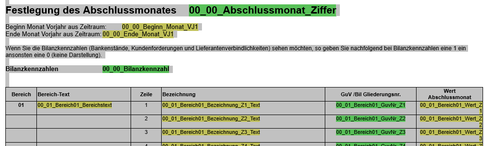

# Ansichten

## Absatzmarke ausblenden / einblenden

Mit diesem Menüpunkt kann die Absatzmarke  ein- bzw. ausgeblendet werden.

## Formeltext einblenden

Mit diesem Menüpunkt kann statt des Ergebnisses der Formel der Formeltext dargestellt werden.

## Verborgenen Text ausblenden / einblenden

Durch Anwahl *Verborgenen Text ausblenden* wird der grau hinterlegte Text nicht mehr dargestellt. Dieser verborgene Text ist gekennzeichnet durch die blaue Linie auf der linken Seite.

## Dokumentgliederung

Umfangreiche Reports mit mehreren Seiten werden schnell unübersichtlich. Zur besseren Überschaubarkeit der Struktur kann die *Dokumentgliederung* im linken Bildschirmbereich eingeblendet werden. Wählen Sie dazu den Menüpunkt *Ansicht / Dokumentgliederung* aus.

Die Ebenen können mittels Klick auf das *Plus- bzw. Minussymbol* ein-/ausgeblendet werden. Mit Anwahl einer Position kann durch *Rechtsklick* und Auswahl der Option *Verbergen* der gesamte markierte Absatz ausgeblendet werden. Soll der verborgene Punkt wieder eingeblendet werden, so ist dieser mit der rechten Maustaste anzuwählen und auf *Einblenden* zu klicken. Mit einem Doppelklick können Sie den gesamten Absatz selektieren um beispielsweise im Formelfenster eine Bedingung für diesen Absatz zu hinterlegen. Wird auf *Alle erweitern* geklickt, so wird die gesamte Untergliederung des Dokumentes in einem Schritt geöffnet. Die Option *Alle reduzieren* bewirkt, dass alle Untergliederungen in einem Schritt geschlossen werden und nur noch die
Hauptüberschriften ersichtlich sind.

## Zweite Dokumentenansicht öffnen

Durch Anwahl dieses Menüpunkts öffnet sich ein neues Report-Fenster. In diesem zweiten Fenster kann nichts verändert werden. Für eine Änderung der Daten gehen Sie ins Hauptdokument. Wenn Sie im Hauptdokument Änderungen vornehmen, werden diese sofort in der Dokumentenansicht dargestellt. Die zweite Dokumentenansicht spiegelt den Hauptreport.