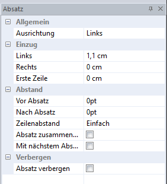
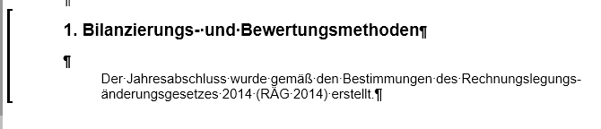
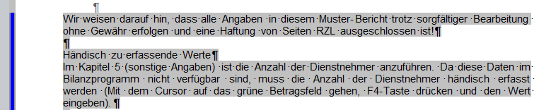

# Absatz

Durch das Markieren eines Textbereichs mittels Doppelklick auf einen Textbereich im linken Seitenbereich öffnet sich im rechten Bildschirmbereich das Eigenschaftsfenster zur Absatzformatierung. Dieses Fenster kann auch mit dem Kontextmenü *Absatzeigenschaften* oder im Menüpunkt *Ansicht Eigenschaftsfenster Absatz* geöffnet werden.

## Allgemein

Hier können Sie die Ausrichtung des Textes einstellen.

## Einzug

Der aktuelle Absatz kann links, rechts oder in der ersten Zeile eingezogen werden.

## Abstand

Hier können Sie den Abstand vor und nach dem Absatz und den Zeilenabstand definieren.

Seitenübergreifende Absätze werden grundsätzlich automatisch getrennt. Um mehrere Absätze bewusst auf einer Seite darzustellen, können Sie diese miteinander verknüpfen. Markieren Sie dazu den gewünschten Absatz und setzen Sie im Absatzeigenschaftsfenster die Option *Mit nächstem Absatz zusammenhalten*.

*Absatz zusammenhalten* bedeutet, dass der markierte Absatz auf einer Seite zusammengehalten wird.

**Beispiel:** Die Überschrift steht am Ende der vorherigen Seite und die Beschreibung dazu auf der nächsten Seite. Damit die Überschrift inklusive Beschreibung auf einer Seite angedruckt wird, kann der Haken bei *Absatz zusammenhalten* gesetzt werden.

Zusammengehaltene Absätze werden im *Report Designer* mit einer Klammer dargestellt.

## Verbergen

Zur Hinterlegung von Kommentaren oder Bearbeitungsanweisungen können Texte oder Absätze eingefügt und anschließend ausgeblendet werden. Somit werden sie beim Druck des Reports nicht angezeigt. Sie werden nur bei der Bearbeitung des Reports im *Report Designer* angezeigt.

Markieren Sie dazu den gewünschten Textbereich. Mit dem Schnellstartsymbol  oder durch Anwahl der Option *Absatz verbergen* in den *Absatzeigenschaften* wird der Bereich grau hinterlegt und somit ausgeblendet. Im linken Seitenbereich wird dieser Absatz mit einem blauen Balken markiert:

!!! info "Tipp"
    Mit dem Menüpunkt *Ansicht / Verborgenen Text ein-/ausblenden* oder dem Schnellstartsymbol  kann der Text im Bearbeitungsmodus ein- bzw. ausgeblendet werden.