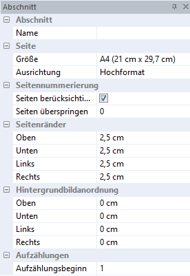

# Abschnitt (Dokument)

Mit Anwahl des Menüpunkts *Ansicht / Eigenschaftsfenster / Abschnitt (Dokument)* wird das Eigenschaftsfenster für die allgemeinen Formatierungen des Dokuments geöffnet:

Durch Anwahl des jeweiligen Auswahlfeldes können Sie die Einstellungen mittels Drop-down-Menü, Pfeiltasten bzw. Eingabe verändern.

## Name

Hier kann für den Abschnitt ein Name vergeben werden (z. B. Titelblatt).

## Größe

Sie haben hier die Möglichkeit, eine Seitengröße zu definieren (A4, A3, A5 oder Präsentation).

## Ausrichtung

Ausrichtung des Dokuments in Hoch- oder Querformat.

## Seitennummerierung

|                             |                                                                                                                   |
| --------------------------- | ----------------------------------------------------------------------------------------------------------------- |
| **Seiten berücksichtigen:** | Hier wird eingestellt, ob die Seite(n) des Abschnittes für die Seitennummerierung berücksichtigt werden soll(en). |
| **Seiten überspringen:**    | Ab welcher Seitennummer das Dokument beginnen soll.                                                               |

**Beispiel:** Das Dokument soll mit der Seitennummer 10 beginnen. Es wird bei Seiten überspringen die Ziffer 9 eingetragen. D.h. die Seitennummerierung beginnt mit der Nummer 10.

## Seitenränder

Anpassung des oberen, unteren, rechten oder linken Seitenrandes.

## Hintergrundbildanordnung

Anpassung des Bereiches (oben, unten, links, rechts) des Hintergrundbildes.

## Aufzählungen

Setzt den Beginn der obersten Aufzählungsebene.

**Beispiel:**

Soll die Nummerierung der Überschrift anstatt mit 1 mit 10 beginnen, ist beim Aufzählungsbeginn 10 einzutragen.

!!! info "Tipp"
    Im unteren Bereich des Eigenschaftsfensters erhalten Sie eine Schnellinformation zum aktuell ausgewählten Feld.