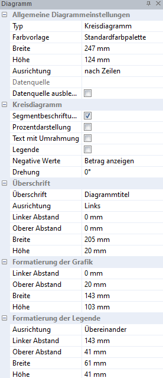

# Diagramm

Zur Formatierung der Diagramme stehen Ihnen die Diagrammeigenschaften zur Verfügung. Markieren Sie dazu im linken Randbereich das komplette Diagramm mit der *linken Maustaste*. Anschließend öffnen sich im Eigenschaftsfenster die *Diagrammeigenschaften*:

## Allgemeine Diagrammeinstellungen

Neben dem Diagrammtyp und der Farbvorlage können Sie hier die Ausrichtung (Datenbezug nach Spalten oder Zeilen) auswählen. Die verwendeten Farben hängen von der gewählten Farbformatvorlage ab. Diese kann unter *Bearbeiten / [Farbformatvorlage](../Report_bearbeiten/Formatvorlagen.md)* neu angelegt bzw. abgeändert werden. Mit dem Häkchen *Datenquelle ausblenden* können Sie die verwendete Tabelle für den Ausdruck ausblenden/einblenden.

## Säulendiagramm/Kreisdiagramm/Liniendiagramm

Je nach Diagrammtyp haben Sie hier noch weitere Optionsmöglichkeiten zur Darstellung zur Verfügung.

## Überschrift

In diesem Bereich können Sie den Diagrammtitel und die Positionierung definieren. Mit Hilfe der Werkzeugleiste kann die Überschrift formatiert werden.

## Formatierung der Grafik/Legende

Die Ausrichtung von Grafik und Legende ist in den jeweiligen Bereichen möglich.

## Schriftart anpassen

Die im Diagramm verwendeten Schriften zur Legende, Achsenbeschriftung und Überschrift können nach jeweiliger Auswahl mit Hilfe der Werkzeugleiste formatiert werden.