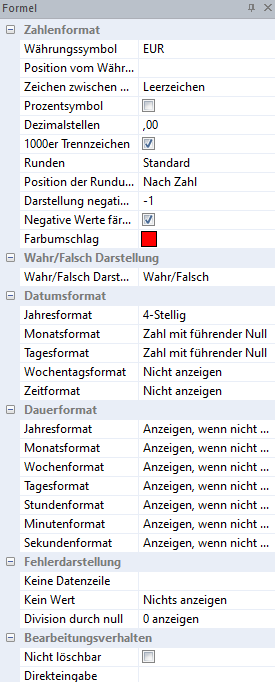
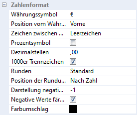
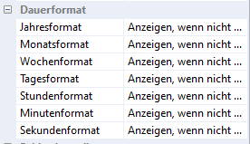
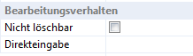

# Formel

In diesem Eigenschaftsfenster können Sie die Formel bearbeiten.

## Zahlenformat

Hier sind detaillierte Einstellungen zur Darstellung von Zahlen möglich.

Neben Einstellungen zur *Währung* *und Position des Währungssymbols* können Sie mittels *Drop-Down Menü* bzw. Optionsanwahl den gewünschten Ausweis einstellen. Im *Farbumschlag* wird die Farbe für einen Negativwert der Formel definiert.

## Datumsformat

Bei Datumsausgaben können Sie die Ausgabe des Datums gestalten.

Neben Einstellungen zur Anzeige von Tag, Monat und Jahr kann zusätzlich der *Wochentag* und die *Zeit* angezeigt werden. Einzelne Parameter können auch ausgeblendet werden. Wählen Sie dazu im jeweiligen Drop-Down Menü *Nicht anzeigen* aus.

## Dauerformat

Wird ein Dauerformat mit *Nicht anzeigen* definiert, wird automatisch die nächsthöhere Ebene des Formats ausgewählt und der Wert laut eingegebener  Dezimalstellen gerundet.

**Beispiel:**

Sie tragen die Formel *Dauer(AktuellesDatum;DN(1).Geburtsdatum)* in den Formeldialog ein um das Alter des Dienstnehmers in eine Liste führen zu können. Nun sehen Sie im rechten Bereich des *Report Designers* ein Formatierungsfenster. In diesem Formatierungsfenster für die Formel können Sie das  Dauerformat* festlegen. In unserem Beispiel soll nur die Jahreszahl angezeigt werden, deswegen wurden alle weiteren Formate (Monatsformat usw.) auf den Status „*Nicht anzeigen*" gesetzt.

## Fehlerdarstellung

Kommt es bei einer Formel zu einer falschen Darstellung aufgrund eines Fehlers, sind folgende Varianten möglich:

| Fehler              | Beschreibung                                                                 |
| ------------------- | ---------------------------------------------------------------------------- |
| Keine Datenzeile    | Es wird beispielsweise auf ein Vorjahr zugegriffen, welches nicht existiert. |
| Kein Wert           | In den eingegebenen Parametern ist kein Wert vorhanden.                      |
| Division durch null | Anzeige, wenn durch null dividiert wird.                                     |

Je nach Option kann hier der Wert null, kein Ausweis oder ein Fehlerausweis ausgegeben werden.

## Zahlenformatvorlagen anlegen oder ändern

Zahlenformatvorlagen erleichtern Ihnen die schnellere Formatierung von Formeln. Durch das einmalige Anlegen einer Formatvorlage kann diese Formatierung mittels Drop-Down Auswahl in der Werkzeugleiste auf einen Formelwert angewendet werden. Markieren Sie die Zahl mit einem Doppelklick und wählen Sie in der Werkzeugleiste das gewünschte Zahlenformat im Drop-down-Menü an.

## Bearbeitungsverhalten

Hier können Sie definieren, dass es sich um keine Formel, sondern um ein Eingabefeld handelt.

*Nicht löschbar* bedeutet, dass diese Formel nicht gelöscht werden kann. Bei *Direkteingabe* wählen Sie aus, um welche Eingabe es sich handelt (Ganze Zahl, Zahl, Text, Datum, Wahr/Falsch, Bereich).