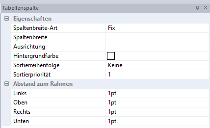

# Tabellenspalte

Mit diesem Eigenschaftsfenster kann jede Spalte einer Tabelle bearbeitet werden.

## Spaltenbreite-Art

Hier kann zwischen *Fix* und *Variabel* unterschieden werden.

## Spaltenbreite

Geben Sie hier die gewünschte *Spaltenbreite* ein.

## Ausrichtung

Stellen Sie hier ein, wo der Text der Spalte dargestellt wird: *Oben*, *Zentriert* oder *Unten*.

## Hintergrundfarbe

Wählen Sie eine Hintergrundfarbe aus.

## Sortierreihenfolge

Hier haben Sie die Möglichkeit, eine Sortierung der Spalte vorzunehmen: *Aufsteigend* oder *Absteigend*.

## Sortierpriorität

Nach der Sortierreihenfolge können Sie hier wählen, welche Spalte, in welcher Sortierreihenfolge Vorrang hat. Wenn die Spalte „Nachname" aufsteigend sein soll und vorrangig zur Spalte „Vorname" sein soll, geben Sie bei „Nachname" die Sortierpriorität 1 ein und bei der Spalte „Vorname" die  Sortierpriorität 2.

## Abstand zum Rahmen

Stellen Sie hier ein, wie sich der Abstand (*Links*, *Oben*, *Rechts* oder *Unten*) zum Rahmen verhalten soll.