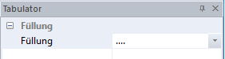
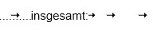

# Tabulator

Soll der Tabulator mit einem Füllzeichen ... ausgefüllt werden, so besteht die Möglichkeit, über den Menüpunkt *Ansicht / Eigenschaftsfenster / Tabulator* das Füllzeichen auszuwählen. Ein praktisches Beispiel hierfür wäre die Erstellung eines Inhaltsverzeichnisses über den Report Designer.

Es öffnet sich nachfolgendes Fenster auf der rechten Seite.

Die Darstellung im Report Designer ist folgendermaßen:

