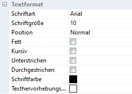
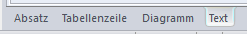

# Text

Formatierungen eines Textes können neben der [Werkzeugleiste](../Report_bearbeiten/Text_und_Absatzbearbeitung.md) auch im Texteigenschaftsfenster durchgeführt werden. Das Fenster kann im Menüpunkt *Ansicht / Eigenschaftsfenster / Text* oder im Kontextmenü *Texteigenschaften* aufgerufen werden:

!!! info "Tipp"
    Sofern Sie bereits mehrere Eigenschaftsfenster geöffnet haben, können Sie im unteren Bereich des Eigenschaftsfensters zwischen den einzelnen Ansichten wechseln:
    
    