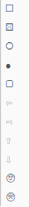

# Einfügen

## Grafik

Zum Einfügen einer Grafik stellen Sie sich mit dem Cursor im Report auf die gewünschte Position und wählen den Menüpunkt *Einfügen / Grafik* aus. Es erscheint ein Auswahldialog indem Sie die gewünschte Datei aus dem Quellordner anwählen können. Mit der Schalfläche *Öffnen* wird die Grafik eingefügt.

Die Größenanpassung der Grafik erfolgt mit gedrückter Maustaste an der unteren rechten Ecke durch Verschieben des Doppelpfeils:

Mit Hilfe der Ausrichtungssymbole in der Schnellstartleiste ist eine Anpassung der Ausrichtung (links-, rechtsbündig oder zentriert) möglich.

Grafiken können in Tabellenzellen eingefügt werden.

## Manueller Seitenumbruch

Mit dem Menüpunkt *Einfügen / Manueller Seitenumbruch* oder der Tastenkombination *Strg+Enter* wird ein manueller Seitenumbruch im aktuell markierten Dokumentenbereich eingefügt.

Seitenübergreifende Absätze werden grundsätzlich automatisch getrennt. Um mehrere Absätze bewusst auf einer Seite darzustellen, können Sie diese miteinander verknüpfen. Markieren Sie dazu den gewünschten Absatz und setzen Sie im *Absatzeigenschaftsfenster* die Option *Mit nächstem Absatz zusammenhalten* (siehe Kapitel 3.6.2 Absatz-Eigenschaftsfenster, Seite [23](#absatz-eigenschaftsfenster))*.*

## Abschnittswechsel

Wird der Menüpunkt *Einfügen / Abschnittswechsel* verwendet, beginnt eine neue Seite und zugleich ein neuer Abschnitt. Dieser Abschnitt kann über *Ansicht / Eigenschaftsfenster / Abschnitt (Dokument)* bearbeitet werden.

## Geschütztes Leerzeichen

Soll ein Text durch Eingabe eines Leerzeichens nicht getrennt werden, dann geben Sie über *Einfügen / Geschütztes Leerzeichen* dieses Leerzeichen hinein. Zum Beispiel bei „EUR 200,00".

## Zeilenumbruch

Über *Einfügen / Zeilenumbruch* können Sie einen Zeilenumbruch einfügen.

## Formel

Über *Einfügen / Formel* öffnet sich das Formel-Fenster und Sie können eine Formel anlegen.

Näheres zur Anlage einer Formel finden Sie im Kapitel 5.1 Einfügen und Bearbeiten von Formeln ab Seite [36](#einfügen-und-bearbeiten-von-formeln).

## Tabelle

Über *Einfügen / Tabelle* können Sie eine Tabelle in den Report einfügen. Es öffnet sich nachstehendes Fenster. In diesem Dialog können Sie einen *Tabellennamen*, die *Spalten- und Zeilenanzahl* vergeben, sowie auswählen, ob eine *Kopfzeile eingefügt* werden soll.

Mehr Details zu den Tabellen finden Sie im Kapitel 6.1 Arbeiten mit Tabellen, Seite [49](#arbeiten-mit-tabellen) und im Kapitel 5.1.8 Arbeiten mit Tabellenformeln, Seite [46](#arbeiten-mit-tabellenformeln).

## Formeltabelle

Über *Einfügen / Formeltabelle* können Sie eine Tabelle mit Formelfunktion in den Report einfügen. Sie werden nach Anwahl des Menüpunkts auf den *Formeldialog* verwiesen. Geben Sie hier die Formel für die Tabelle ein. Nachdem Sie *Tabelle einfügen* angeklickt haben, öffnet sich das Fenster für *Neue Tabelle einfügen*.

Mehr Details zu den Formeltabellen finden Sie im Kapitel 6.1 Arbeiten mit Tabellen, Seite [49](#arbeiten-mit-tabellen) und im Kapitel 5.1.9 Arbeiten mit Formeltabellen, Seite [47](#arbeiten-mit-formeltabellen) 

## Diagramm

Grundvoraussetzung zur Erstellung eines Diagrammes ist eine bestehende Datenquelle in Form einer Tabelle bei der die Werte in Form einer Formel eingegeben wurden. Sollte die Tabelle im ausgedruckten Report anschließend nicht sichtbar sein, kann sie für die Ausgabe ausgeblendet werden. Das Ausblenden von einzelnen Bereichen finden Sie im Kapitel 2.1.2 Texte/Absätze ausblenden, Seite [13](#texteabsätze-ausblenden).

!!! info "Tipp"
    Scheint eine Datenquelle im Report nicht auf, d.h. auch nicht ausgegraut, können Sie diese in den *Diagrammeigenschaften* durch Anwahl der Option *Datenquelle ausblenden* wieder einblenden.

### Neues Diagramm erstellen

Über *Einfügen / Diagramm* können Sie ein neues Diagramm erstellen. Wählen Sie im anschließenden Dialogfenster die *Datenquelle* (= Tabellennamen) und den gewünschten *Diagrammtyp* aus. Mit *OK* wird das Diagramm im aktuellen Bereich eingefügt.

### Diagramme formatieren

Zur Formatierung der Diagramme stehen Ihnen die Diagrammeigenschaften zur Verfügung. Markieren Sie dazu im linken Randbereich das komplette Diagramm mit der linken Maustaste. Anschließend öffnen sich im Eigenschaftsfenster die Diagrammeigenschaften. Eine Erklärung zu den Diagrammeigenschaften finden Sie im Kapitel 3.6.10 Diagramm, Seite [30](#diagramm-eigenschaftsfenster).

## Eledigtsymbol

Das Erledigt-Symbol ist eine Checkbox und dient zur Darstellung des Bearbeitungsstatus in unterschiedlichen Checklisten. Es kann im Menüpunkt *Einfügen / Erledigtsymbol* oder mit der Tastenkombination *Strg + E* eingefügt werden. Durch einen Mausklick auf das Symbol verändert sich der Status wie folgt:

| Status                    | Funktion                       |
| ------------------------- | ------------------------------ |
|  | Offen                          |
|  | Erledigt                       |
|  | Erledigt - nicht von Bedeutung |
|  | In Arbeit                      |
|  | Fehlerhaft                     |

## Symbol

Über *Einfügen / Symbol* können Sie die folgenden Symbole einfügen:

