# Einfügen und Bearbeiten von Formeln

Mit der Verwendung von Formeln können Sie im *Report Designer* nicht nur Berechnungen durchführen oder Bedingungen verwenden, sondern auch direkt und schnell auf klientenbezogene Daten zugreifen sowie Auswertungen erstellen.

## Das Formeldialogfenster

Das Formeldialogfenster dient zur Erstellung und Bearbeitung der Formeln und kann über folgende Funktionen geöffnet werden:

- Über den Menüpunkt *Einfügen / Formel*,
- mit dem *Formel einfügen Symbol* in der Werkzeugleiste,
- mit der Tastenkombination *Strg + I* oder
- bei einer bereits existierenden Formel im Text mittels Kontextmenü und Auswahl der Option *Formel in Formeldialog* bzw. der *F4-Taste*.

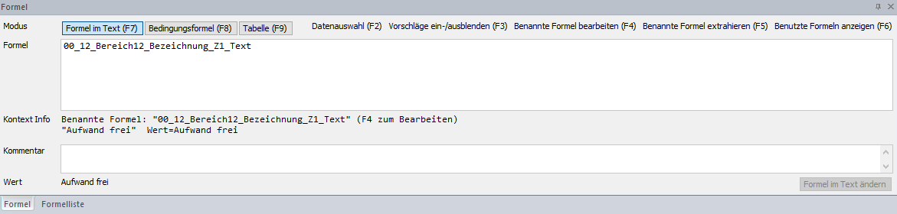

## Modus

Hier können Sie zwischen den einzelnen Anwendungsarten wechseln:

- [*Formel in Text*](../Formeln/Einfuegen_und_Bearbeiten_von_Formeln.md) - F7-Taste
- [*Bedingungsformel*](../Formeln/Einfuegen_und_Bearbeiten_von_Formeln.md) - F8-Taste
- [*Tabelle*](../Formeln/Einfuegen_und_Bearbeiten_von_Formeln.md) - F9-Taste

### Formel im Text

Eingabefeld bzw. Auswahl der gewünschten [Formel](../Formeln/Einfuegen_und_Bearbeiten_von_Formeln.md) solange die eingegebene Formel nicht vollständig bzw. korrekt eingegeben wurde, wird der Rahmen des Dialogfensters rot markiert.

### Kontext Info

Aufbau/Beschreibung einer benannten Formel.

### Kommentar

Hier kann eine Kurzerklärung zur Formel eingegeben werden.

### Wert

Zeigt das Endergebnis bzw. den Fehler bei Falscheingabe der aktuellen Formeleingabe an.

### Bestätigungs-Button für Formeleingabe (Formel in Text einfügen)

Mit der *Enter-Taste* bzw. der Schaltfläche *Formel in Text einfügen* werden die Eingaben übernommen und gespeichert.

### Funktionstasten

F2-Taste: Mit der F2-Taste können die Daten in einer Formel aufgerufen werden.

F3-Taste: Aus-/Einblendung des Formelergänzungsfensters (Formelvorschläge)

F4-Taste: Ansicht zur Bearbeitung der benannten Formel wird geöffnet

F5-Taste: Unbenannte/benannte Formel kann mit anderen Formelnamen angelegt werden

F6-Taste: Anzeige der zuletzt geschriebenen Formeln

## Berechnungen

Berechnungen können Sie im Formeldialogfenster mit Hilfe von Formeln durchführen. Die Bedienung der Formelsyntax ist in Anlehnung an das Tabellenkalkulationsprogramm Excel gestaltet.

### Zahlenformeln

Zur Formelanwendung von Berechnungen können folgende Zahlenformeln verwendet werden:

| Art                 | Operator | Beschreibung        |
| ------------------- | -------- | ------------------- |
| Arithmetisch (Zahl) | \+       | Addition            |
|                     | \-       | Subtraktion         |
|                     | /        | Division            |
|                     | \*       | Multiplikation      |
| Vergleiche          | =        | Gleich              |
|                     | \>       | Größer als          |
|                     | \<       | Kleiner als         |
|                     | \>=      | Größer oder gleich  |
|                     | \<=      | Kleiner oder gleich |
|                     | \<\>     | ungleich            |
 
### Beispiel Aufsummieren von Werten

Sie möchten mehrere Werte in Euro manuell aufsummieren: 135 + 250 + 359 = EUR 744,00.

Auswahl der Formatvorlage *Zahlen-Standard* und Eingabe im Formeldialog:

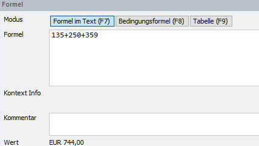

Mit der Enter-Taste bzw. der Schaltfläche *Formel in Text einfügen* wird der Wert übernommen.

!!! info "Tipp"
    Die Formatierung des Ergebnisses ist vom ausgewählten Zahlenformat abhängig. Sie können diese jederzeit durch Markieren des Wertes und Änderung der [Zahlenformatvorlage](../Report_bearbeiten/Formatvorlagen.md) mittels Auswahl in der Werkzeugleiste anpassen.

### Textformeln

| Art          | Operator      | Beschreibung                                                             |
| ------------ | ------------- | ------------------------------------------------------------------------ |
| Arithmetisch | \+            | Texte zusammenfassen                                                     |
| Vergleich    | =             | Gleich                                                                   |
| Vergleich    | \<\>          | Ungleich                                                                 |
| Text         | \"Mustertext" | Texte in einer Formel müssen mit einem Anführungszeichen versehen werden |
 
### Beispiel Andruck eines Textes mit Wenn-Formel

Wenn eine bestimmte Bedingung/ein Prüfwert erfüllt wird, soll das Wort „Herr" eingefügt werden, ansonsten das Wort „Frau":

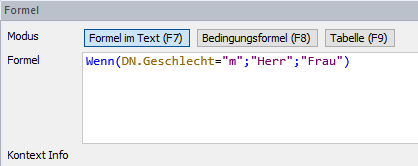

Wählen Sie dazu die Funktion *WENN()* aus. Im Parameter wird zunächst die Bedingung eingetragen und mit einem Strichpunkt getrennt. Anschließend geben Sie den gewünschten Text ein, der bei Erfüllung der Bedingung angedruckt werden soll \"Herr\". Im darauffolgenden Sonst-Wert den gewünschten Text, der bei Nichterfüllung der Bedingung angedruckt werden soll \"Frau\". Achten Sie darauf, dass die Parameter mit einem Strichpunkt getrennt werden und der  gewünschte Text im Anführungszeichen steht.

### Boolsche Formeln / Wahrheitswerte

Eine sogenannte „Boolsche Formel" kann als Ergebnis nur WAHR oder FALSCH ausweisen. Die von Ihnen eingegebenen Parameter treffen entweder zu, oder nicht. Sie werden im Zusammenhang mit [Bedingungsformeln](../Formeln/Einfuegen_und_Bearbeiten_von_Formeln.md)  verwendet.

| **Art**   | **Operator** | **Beschreibung** |
| --------- | ------------ | ---------------- |
| Vergleich | =            | Gleich           |
| Vergleich | \<\>         | Ungleich         |
| Wert      | WAHR         | Wert WAHR        |
| Wert      | FALSCH       | Wert FALSCH      |

### Datum

| **Funktion**                        | **Beschreibung**                                                   |
| ----------------------------------- | ------------------------------------------------------------------ |
| Datum(Tag;Monat;Jahr)               | Darstellung des eingegebenen Datums in der aktuellen Formatvorlage |
| Datum(Tag;Monat;Jahr;Stunde;Minute) | Stunde/Minute können optional ergänzt werden                       |

Mit Hilfe der Datumsformel kann ein Datum in unterschiedlichen Formaten dargestellt werden. Bei der Datumseingabe sind die Werte *Tag, Monat* und *Jahr* verpflichtend zu definieren. *Stunde* und *Minute* können optional ergänzt werden. Nach Eingabe der Werte können Sie die gewünschten Änderungen der Formatierung (z. B. Anzeige eines Wochentages) im [*Formel-Eigenschaftsfenster*](../Eigenschaftsfenster/Formel.md) durchführen.

### Dauer

| **Funktion** | **Beschreibung**  |
| ------------ | ----------------- |
| JAHRE(Wert)  | Anzahl der Jahre  |
| MONATE(Wert) | Anzahl der Monate |
| TAGE(Wert)   | Anzahl der Tage   |

Diese Formel können Sie mit der Datum-Formel für Berechnungen verwenden.

### Beispiel Darstellung der Dauer

Sie möchten gerne vom heutigen Tag sechs Monate hinzurechnen und das Ergebnis im Datumsformat anzeigen.

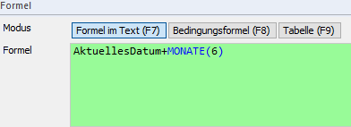

Verwenden Sie dazu die Formel für das heutige Datum *AktuellesDatum* und anschließend das Plus-Symbol + für die Addition. Mit anschließender Eingabe der Formel *MONATE()* können Sie die Zahl der gewünschten Monate definieren. Mit der Schaltfläche *Formel in Text einfügen* oder der *Enter-Taste* wird die Eingabe bestätigt und das errechnete Datum ausgegeben.

### Funktionen

Funktionen sind mit der *F3-Taste* im Formeldialog jederzeit aufrufbar und werden in blauer Schrift dargestellt. Die eingegebenen Parameter werden mit einem Strichpunkt getrennt (vgl. Eingabe im Excel).

| **Funktion**                                                                                                                    | **Beschreibung**                                                                                                                              |
| ------------------------------------------------------------------------------------------------------------------------------- | --------------------------------------------------------------------------------------------------------------------------------------------- |
| Abrunden(Kommazahl;Kommastellen)                                                                                                | Abrunden                                                                                                                                      |
| Abs(Wert)                                                                                                                       | Absoluter Wert                                                                                                                                |
| Anzahl(Datenzeilen)                                                                                                             | Anzahl der Datenzeilen                                                                                                                        |
| Aufrunden(Kommazahl;Kommastellen)                                                                                               | Aufrunden                                                                                                                                     |
| Bereich()                                                                                                                       | Für benannte Formel z. B. Bereich(KER(\*);10;20). Damit mit F2 die Dokumentauswahl geöffnet werden kann.                                      |
| Datum(Tag;Monat;Jahr;\[Minute;Sekunde\]                                                                                         | Darstellung des Datums                                                                                                                        |
| Dauer(Datum1;Datum2)                                                                                                            | Darstellung der Dauer zwischen zwei Zeiträumen                                                                                                |
| Filter(Datenzeilen;Bedingung)                                                                                                   | Herausfiltern gewünschter Werte                                                                                                               |
| Funktion(Parametername1;Parametername2;...;Funktion)                                                                            | Teile einer Formel können als Variable im Formelnamen (xxx) angewendet werden                                                                 |
| IstInBereich(Nummer;Bereich)                                                                                                    | Sind gewisse Werte in einem ausgewählten Bereich vorhanden                                                                                    |
| IstVorhanden(Ausdruck)                                                                                                          | Bei optionalen Werten wird geprüft, ob dieser vorhanden ist.                                                                                  |
|                                                                                                                                 | Wenn der Wert nicht null ist = WAHR, wenn Wert null = FALSCH                                                                                  |
|                                                                                                                                 | zB Geburtsdatum ist optional. Wenn es nicht ausgefüllt wurde, der Wert null (= FALSCH)                                                        |
| Jahr(Datum)                                                                                                                     | Hier kann aus einem Datum das Jahr ausgelesen werden z. B. Jahr(Datum(1;1;2024)) = 2024                                                       |
| Jahre(Anzahl)                                                                                                                   | Hier kann eine Anzahl an Jahre zu einem Datum hinzugerechnet werden z. B. Datum(1;1;2024+Jahre(4) = 01.01.2028                                |
| Max(Wert1;Wert2;...)                                                                                                            | Ausgabe des größten Werts innerhalb der Wertmenge                                                                                             |
| MaximaleKombination()                                                                                                           |                                                                                                                                               |
| Min(Wert1;Wert2;...)                                                                                                            | Ausgabe des kleinsten Werts innerhalb der Wertmenge                                                                                           |
| MitNullFüllen(Zahl;Anzahl der Nullen)                                                                                           | Füllt einen Wert mit der mitgeteilten Anzahl an Nullen auf                                                                                    |
| Monat(Datum)                                                                                                                    | Hier kann aus einem Datum das Monat ausgelesen werden z. B. Monat(Datum(1;8;2024)) = 8                                                        |
| Monate(Anzahl)                                                                                                                  | Hier kann eine Anzahl an Monate zu einem Datum hinzugerechnet werden z. B. Datum(1;1;2024+Monate(4) = 01.05.2024                              |
| MonatsErster(Monat;Jahr)                                                                                                        | Erster Tag im Monat                                                                                                                           |
| MonatsLetzter(Monat;Jahr)                                                                                                       | Letzter Tag im Monat                                                                                                                          |
| NächsterBankTag(Datum)                                                                                                          | Nächstmöglicher Banktag (Werktag)                                                                                                             |
| Nicht()                                                                                                                         | Dreht Funktionen ins Gegenteil                                                                                                                |
| NullWennKeinWert()                                                                                                              | Wenn kein Wert dann Null.                                                                                                                     |
| Oder(Wert1;Wert2;...)                                                                                                           | Wenn mindestens ein Wert WAHR ist, liefert die Formel WAHR. Nur wenn alle Werte FALSCH sind, liefert die Formel FALSCH                        |
| Runden(Wert)                                                                                                                    | Runden des eingegeben Wertes auf die definierte Dezimale                                                                                      |
| Summe()                                                                                                                         | Summe der Werte                                                                                                                               |
| SummeWennÜberwiegend()                                                                                                          |                                                                                                                                               |
| Tag(Datum)                                                                                                                      | Hier kann aus einem Datum der Tag ausgelesen werden z. B. Tag(Datum(28;4;2024)) = 28                                                          |
| Tage(Anzahl)                                                                                                                    | Hier kann eine Anzahl an Tage zu einem Datum hinzugerechnet werden z. B. Datum(16;1;2024+Tage(4) = 20.01.2024                                 |
| Und(Wert1;Wert2;...)                                                                                                            | Nur wenn alle Werte WAHR sind, liefert die Formel WAHR                                                                                        |
| VorherigerBankTag(Datum)                                                                                                        | Vorheriger Banktag (Werktag)                                                                                                                  |
| Wenn(Bedingung;Dann;Sonst)                                                                                                      | Auswertung der eingegebenen Bedingung. Ist die Bedingung WAHR, dann wird der Dann-Wert ausgegeben, bei einer FALSCH-Bedingung der Sonst-Wert. |
| ZeilenZusammenfassen(Datenquelle;Maximale Zeilenanzahl;Bezeichnungsspaltennummer;Zusammenfassungsbezeichnung;Wertspaltennummer) | Maximale Anzahl der Diagrammwerte in einem Diagramm darstellen                                                                                |

### Beispiel Darstellung der Dauer

Ein Dienstnehmer ist von 1. Juni bis 15. November 2019 bei Ihnen angestellt. Sie möchten die Dauer in Tagen ausgeben:

1.  Geben Sie die Formel Dauer(Datum(15;11;2019);DATUM(1;6:2019)) im Formeldialog ein. Achten Sie darauf, dass der höhere Wert immer an erster Stelle steht.

2.  Ändern Sie anschließend im *Formel-Eigenschaftsfenster* das Dauerformat auf Tage um. Das Tagesformat ist mit der Option Immer anzeigen, alle anderen Formate mit der Option Nicht anzeigen zu definieren.

Nun werden nur noch die Tage in der Formel ausgegeben.

### Beispiel Andruck des Maximalwertes durch Eingabe

Sie möchten von mehreren Werten (155,35; 155,84; 155,97) den Maximalwert in zwei Dezimalstellen angedruckt bekommen. Die Werte sind nicht im Report hinterlegt, sondern werden direkt in der Formel erfasst. 

Auswahl der Formatvorlage *Betrag ohne Währung* und Eingabe im Formeldialog:

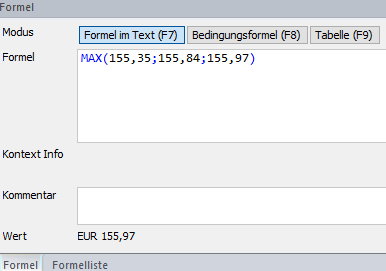

Nach Eingabe der Formel Max() werden die Werte im Parameter mit einem Strichpunkt getrennt eingegeben und mit der *Enter-Taste* oder der Schaltfläche *Formel in Text einfügen* eingesetzt.

## Datenzugriff auf Klientendaten

### Formel auswählen

Die Eingabe einer Formel ist im Formeldialogfenster im Modus *Formel im Text* möglich. Sobald Sie mit der Eingabe der ersten Buchstaben im Formel-Eingabefeld starten, öffnet sich das Suchfenster und Sie erhalten vom Programm einen Formelvorschlag. Die benötigte Formel kann sofort angewählt und mit der *Enter-Taste* übernommen werden.

### Parameter definieren

Abhängig von der Formelauswahl stehen Ihnen nun unterschiedliche Parameter zur Verfügung. Mit der *F2-Taste* können Sie diese aufrufen und auswählen bzw. die benötigten Parameter direkt in der Klammer definieren. Zur Eingabe stehen Ihnen folgende Möglichkeiten zur Verfügung:

| **Eingabe** | **Beschreibung**                                                                   |
| ----------- | ---------------------------------------------------------------------------------- |
| \*          | Alle vorhandenen Werte der Formel werden aufsummiert dargestellt.                  |
| ;           | Zur Eingabe mehrerer Parameter müssen diese mit einem Strichpunkt getrennt werden. |
| :           | Grenzt einen Parameterbereich ein (von / bis)                                      |

Sofern in der verwendeten Formel auch ein Zeitraum (Jahr oder Monat) erfasst wird, ist folgende Definition möglich:

| **Eingabe** | **Beschreibung**                       |
| ----------- | -------------------------------------- |
| Jahr(0)     | Andruck des aktuellen Wirtschaftjahres |
| Monat(0)    | Andruck des aktuellen Monats           |
| Jahr(-1)    | Andruck des Vorjahres                  |
| Monat(-1)   | Andruck des Vormonats                  |
 
### Formel einfügen

Nach Abschluss der korrekten Formeleingabe können Sie diese über *Formel in Text einfügen* oder mit Hilfe der *Enter-Taste* in den Report übernehmen. Die [Formel](../Formeln/Einfuegen_und_Bearbeiten_von_Formeln.md) kann anschließend nach Ihren Wünschen formatiert werden.

### Beispiel Einfügen von KER-Werten

Sie möchten die KER-Gliederungsposition Nr. 10 als Wert einfügen. Geben Sie im Formelfeld die gewünschte Formel *KER().Jahr().Wert* ein und definieren Sie anschließend die benötigten Parameter:

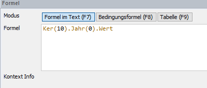

## Datenzugriff auf Reportdaten

Folgende Formeln stehen Ihnen aus dem Reporting zur Verfügung:

| **Formel**     | **Beschreibung**                                                                  |
| -------------- | --------------------------------------------------------------------------------- |
| AktuellesDatum | Zeigt das aktuelle Datum an                                                       |
| AktuelleSeite  | Zeigt die aktuelle Seite an und kann in der Kopf- bzw. Fußzeile eingefügt werden. |
| Seitenanzahl   | Zeigt die Anzahl der Gesamtseiten an                                              |

Sie finden diese Formeln ebenso über nachfolgende Icons.

## Formatieren von Formeln

Bei Eingabe einer Formel wird immer die aktuell angewählte Zahlenformatvorlage (laut Werkzeugleiste) angewendet. Nach der Eingabe können Sie das Formelergebnis schnell und einfach formatieren.

Durch Markierung der Formel öffnen sich im Eigenschaftsfenster die Formeleigenschaften. Hier können Sie je nach Formel unterschiedliche Einstellungen zur Anzeige treffen.

!!! info "Tipp"
    Wenn Sie das von Ihnen gewünschte Anzeigeformat mehrmals im Report verwenden möchten, empfiehlt sich die Anlage einer Zahlenformatvorlage.

### Zahlenformat

Hier sind detaillierte Einstellungen zur Darstellung von Zahlen möglich.

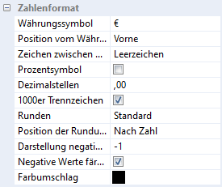

Neben Einstellungen zur Währung und Position des Währungssymbols können Sie mittels *Drop-Down Menü* bzw. Optionsanwahl den gewünschten Ausweis einstellen. Im *Farbumschlag* wird die Farbe für einen Negativwert der Formel definiert.

### Datumsformat

Bei Datumsausgaben können Sie die Ausgabe des Datums gestalten.

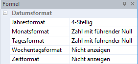

Neben Einstellungen zur Anzeige von Tag, Monat und Jahr kann zusätzlich der Wochentag und die Zeit angezeigt werden. Einzelne Parameter können auch ausgeblendet werden. Wählen Sie dazu im jeweiligen Drop-Down Menü *Nicht anzeigen* aus.

### Dauerformat

Wird ein Dauerformat mit *Nicht anzeigen* definiert, wird automatisch die nächst höhere Ebene des Formates ausgewählt und der Wert laut eingegebenen Dezimalstellen gerundet.

**Beispiel:**

Sie tragen die Formel *Dauer(AktuellesDatum;DN(1).Geburtsdatum)* in den Formeldialog ein um das Alter des Dienstnehmers in eine Liste führen zu können. Nun sehen Sie im rechten Bereich des *Report Designers* ein Formatierungsfenster. In diesem Formatierungsfenster für die Formel können Sie das Dauerformat festlegen. In unserem Beispiel soll nur die Jahreszahl angezeigt werden, deswegen wurden alle weiteren Formate (Monatsformat usw.) auf den Status „*Nicht anzeigen*" gesetzt.

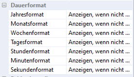

### Fehlerdarstellung

Kommt es bei einer Formel zu einer falschen Darstellung aufgrund eines Fehlers, sind folgende Varianten möglich:

| **Fehler**          | **Beschreibung**                                                             |
| ------------------- | ---------------------------------------------------------------------------- |
| Keine Datenzeile    | Es wird beispielsweise auf ein Vorjahr zugegriffen, welches nicht existiert. |
| Kein Wert           | In den eingegebenen Parametern ist kein Wert vorhanden.                      |
| Division durch null | Anzeige, wenn durch null dividiert wird.                                     |
 
Je nach Option kann hier der Wert null, kein Ausweis oder ein Fehlerausweis ausgegeben werden.

## Benannte Formeln

Wenn Sie bereits erstellte Formeln mehrmals in einem Report verwenden möchten, können Sie diese zur schnelleren Nutzung und Wiedererkennung unter einem eigenen Namen als benannte Formel abspeichern.

Geben Sie zur Neuanlage einer benannten Formel zunächst die gewünschte Formel vollständig im Formelfeld ein. Mit der *F5-Taste* öffnet sich ein Dialogfenster und Sie können einen Namen für die Formel definieren. Mit *Extrahieren* wird die Formel als benannte Formel gespeichert.

Mit Hilfe des Formellistendialoges können Sie alle im geöffneten Report benannten Formeln aufrufen. Wählen Sie dazu

- den Menüpunkt *Formel / Formelliste*,
- das Symbol *Formelliste öffnen* in der Werkzeugleiste oder
- das Registerblatt Formelliste im Formeldialogfenster aus.

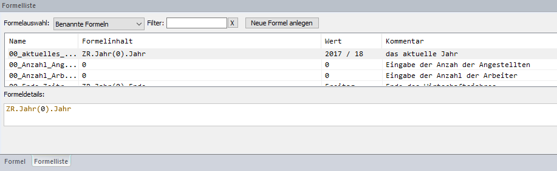

Im Formellistendialog können Sie bestehende benannte Formeln aufrufen, verwalten oder auch neue benannte Formeln anlegen.

## Andruck durch Bedingungen

### Definition

Möchten Sie Teilbereiche eines Reports nur andrucken, wenn bestimmte Werte vorhanden/erfüllt bzw. nicht vorhanden/nicht erfüllt sind, eignet sich die Hinterlegung einer Bedingungsformel in Form einer [boolschen Formel](../Formeln/Einfuegen_und_Bearbeiten_von_Formeln.md).

### Anwendung von Bedingungsformeln

#### Bedingungsformel einfügen

Wechseln Sie im Modus im Formeldialogfenster auf *Bedingungsformel* *(F8)* und markieren Sie anschließend den gewünschten Bereich mit der Maustaste (Tabelle, Tabellenzeilen, Formel, Text, Absatz). Danach können Sie die gewünschte Formel im Formelfeld eingeben. Mit der Schaltfläche *Bedingung zuweisen* oder der *Enter-Taste* wird die Formel übernommen.

### Bedingungsformel ändern

Markieren Sie dazu den betroffenen Bereich und wechseln Sie in den Modus *Bedingungsformel*. Die hinterlegte Formel wird Ihnen im Formelfeld angezeigt und kann geändert werden. Mit der Schaltfläche *Bedingung zuweisen* oder der *Enter-Taste* werden die Änderungen gespeichert. Alternativ dazu können Sie auch das Kontextmenü und der Option *Absatz-/Bedingung hinterlegen* auswählen.

### Bedingungsformel löschen

Zur Löschung einer Bedingungsformel können Sie nach Markierung des betroffenen Bereiches die Bedingungsformel aus dem Formelfeld entfernen oder im Kontextmenü (rechte Maustaste) die Option *Absatz-/Bedingung löschen* anwählen.

### Beispiel: Bedingungsformel

Sie möchten einen Text nur andrucken, wenn das Geschlecht der Dienstnehmer/innen „weiblich" ist.

Markieren Sie dazu den gewünschten Textbereich. Wechseln Sie anschließend in den Modus *Bedingungsformel* und geben Sie den gewünschten Befehl ein:

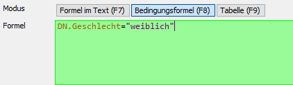

Mit der Schaltfläche *Bedingung zuweisen* oder der *Enter-Taste* wird die Formel übernommen.

### Beispiel: Bedingungsformel auf Wertebasis

Sie möchten den Saldo des Kontos Nr. 440 nur andrucken, wenn dieser einen Wert im aktuellen Wirtschaftsjahr aufweist.

Wechseln Sie in den Bedingungsformelmodus und geben Sie folgende Formel ein:

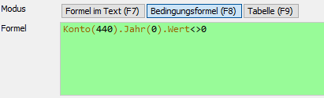

Nach dem Kontobezug *Konto(440)* wird mit *Jahr(0)* ein Bezug auf das aktuelle Wirtschaftsjahr hergestellt. Der *Wert\<\>0* schließt alle Werte außer null mit ein. Die Parameter werden durch einen Punkt getrennt.

### Darstellung von Bedingungsformeln

Aufgrund der farblichen Markierung im linken Seitenbereich des Dokuments sind hinterlegte Bedingungsformeln für Sie sofort ersichtlich:

- **Grün:** Im Absatz ist/sind eine/mehrere Bedingung(en) hinterlegt, die erfüllt ist/sind. Der Absatz wird beim Ausdruck daher angedruckt.

- **Rot:** Im Absatz ist/sind eine/mehrere Bedingung(en) hinterlegt, die nicht erfüllt ist/sind. Der Absatz wird nicht ausgedruckt.

- **Gelb:** Im Absatz sind mehrere Bedingungen hinterlegt und nicht zur Gänze erfüllt. Im Ausdruck werden nur die erfüllten Bedingungen angedruckt.

Bei einem blau markierten Bereich handelt es sich nicht um eine Bedingungsformel. Hier wurde der Text bewusst [ausgeblendet](../Report_bearbeiten/Text_und_Absatzbearbeitung.md).

!!! info "Tipp"
    Bedingungen werden durch ausblenden nicht gelöscht, sondern nur auf „inaktiv" gesetzt.

## Arbeiten mit Tabellenformeln

Mit einer sogenannten Tabellenformel können Sie eine Formel mit einer Referenz auf einen oder mehrere Werte einer Tabelle einfügen. Das Einfügen funktioniert analog zum Zugriff auf [Klientendaten](../Formeln/Einfuegen_und_Bearbeiten_von_Formeln.md). 

Folgende Formeleingabe bietet Ihnen Zugriff auf Tabellenwerte:

*Tabellenname.Zeile().Spalte().Wert*

Geben Sie zunächst den Tabellennamen im Formelfenster mit Modus *Formel im Text* ein. Anschließend wird mit *Zeile().Spalte().Wert* der Bezug zur Tabelle hergestellt. Füllen Sie dazu die benötige Zeilen- bzw. Spaltennummer in den Klammernbereich ein.

### Hilfsmittel automatische Summen einfügen

Zur automatischen Aufsummierung von Zahlen müssen diese als Formelwert eingegeben werden. Mit der rechten Maustaste können Sie mit *Spaltensumme einfügen* die aktuelle Spalte aufsummieren. Mit der Option *Gesamtsummenzeile hinzufügen* wird eine Abschlusszeile mit den Gesamtsummen eingefügt.

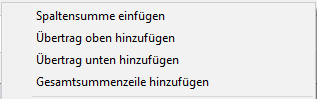

## Arbeiten mit Formeltabellen

Mit Hilfe einer Formeltabelle können Sie Tabellen auf Basis von Formeln automatisch generieren lassen.

Wählen Sie dazu den Menüpunkt *Einfügen / Formeltabelle* oder den Modus *Tabelle* im Formeldialogfenster aus. Geben Sie anschließend im Formelfeld die benötigte Formel für den Zugriff ein. Mit *Tabelle einfügen* wird zunächst eine leere Tabelle erstellt. Definieren Sie einen Tabellennamen und die gewünschte Spaltenanzahl. Die notwendigen Zeilen werden automatisch vom Programm ergänzt. Stellen Sie den Mauscursor danach zur Befüllung in eine beliebige Zeile (Standardzeile) einer Spalte und wechseln Sie anschließend in den *Formel in Text* Modus. Im Formelfeld können Sie anschließend mit der Formel *AktuelleDatenzeile.\[...\]* die gewünschte Formel ergänzen und mit *Formel im Text einfügen* bzw. der *Enter-Taste* einfügen. Die Werte werden somit in der aktiven Spalte automatisch ausgefüllt.

### Beispiel: Einfügen einer Tabelle mit Kontoinformationen

Sie möchten eine Tabelle erstellen, in der alle Konten mit Kontonummer, Kontotext und Gesamtsaldo ausgewiesen werden. 

Geben Sie dazu im Modus *Tabelle* die Formel *Konto(\*)* ein, damit alle Konten ausgewiesen werden:

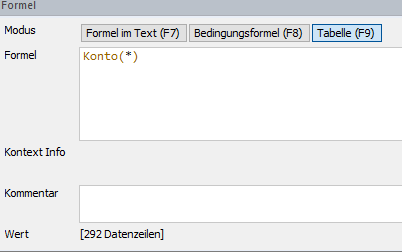

Mit der Schaltfläche *Tabelle übernehmen* wird ein Fenster zur Definition des Namens und der Spalten/Zeilen geöffnet. Die benötigte Liste enthält drei Spalten für *Kontonummer, Text und Saldowerte*. 

Wechseln Sie anschließend in den Modus *Formel im Text.* Klicken Sie zur automatischen Befüllung der Spalten anschließend in eine beliebige Zeile der Spalte zur Befüllung der gewünschten Werte:

| **Spalte**                      | **Beschreibung**                  |
| ------------------------------- | --------------------------------- |
| AktuelleDatenzeile.Nummer       | Zur Anzeige der Kontonummern      |
| AkutelleDatenzeile.Text         | Zur Anzeige des Kontotextes       |
| AktuelleDatenzeile.Jahr(0).Wert | Zur Anzeige des Gesamtkontosaldos |

Nach Eingabe der jeweiligen Formel pro Spalte werden mit der Schaltfläche *Formel im Text einfügen* bzw. der *Enter-Taste* die Werte automatisch in die Tabelle eingepflegt.

