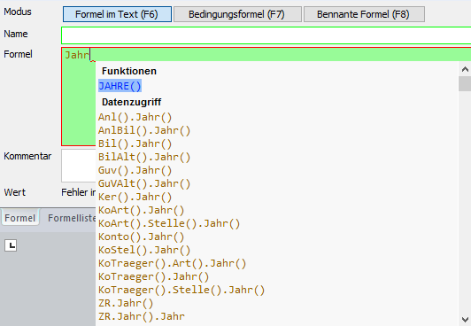

# Formel suchen

## Formelsuche mit Hilfe des Ergänzungsfensters

Zur Eingabe hilft Ihnen im Formeleingabebereich eine automatische Suche und Schnellanzeige. Geben Sie dazu einzelne Wörter der Formel ein. Das Programm schlägt Ihnen sofort die möglichen Formeln mittels dem Ergänzungsfenster vor:

Mit Hilfe der Maus bzw. den Pfeiltasten auf der Tastatur können Sie die gewünschte Formel sofort auswählen.

!!! info "Tipp"
    Das Formelergänzungsfenster kann mit Hilfe der *F3-Taste* ein- bzw. ausgeblendet werden.

**[Formelfarbdarstellung:]{.underline}**

- **Blau**= eingebaute Funktionen

- **Braun** = Formeln aus Klientendaten

- **Schwarz** = benannte Formeln

- **Orange** = Textformeln