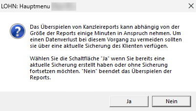
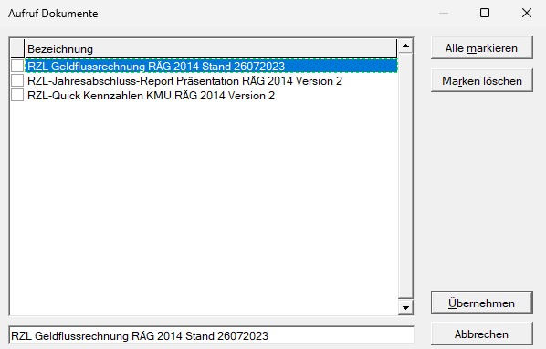

# Kanzleireports

Im Leistungsumfang des RZL Moduls Reporting erhalten Sie eine Vielzahl von vorgefertigten Reports zur Verfügung gestellt. Diese Musterreports dienen Ihnen auch als Basis zur Weiterverarbeitung und klienten- bzw. kanzleispezifischen Individualisierung.

Zur Gestaltung eines klientenspezifischen Reports empfehlen wir Ihnen daher einen passenden RZL-Musterreport auf den gewünschten Klienten zu überspielen und diesen anschließend individuell abzuändern. Diese Reports können danach wiederum als Musterreport gespeichert und auf andere Klienten übertragen werden.

Reports werden direkt beim jeweiligen Klienten hinterlegt. Werden Klientendaten gesichert oder via E-Mail versendet, werden die hinterlegten Reports automatisch mitgespeichert.

## RZL Musterreports installieren

Die Installation der RZL Musterreports wird in der *Zentralen Mandantenverwaltung (ZMV)* durchgeführt. Wählen Sie dazu in der *ZMV* den Menüpunkt *Allg. Dateien / Installieren* aus*.* Im Registerblatt *Reports* können die von Ihnen gewünschten Musterreports angewählt und installiert werden.

!!! info "Tipp"
    Neue RZL Musterreports erhalten Sie im Zuge der laufenden Programmaktualisierungen mitgeliefert. Beachten Sie dazu unsere Hinweise in den RZL-Newslettern. Zur Nutzung im Klienten müssen diese vorab in der *ZMV* installiert werden.

!!! warning "Hinweis"
    Bestehende Reports werden durch ein Programmupdate **nicht** aktualisiert. Neue Musterreports werden immer mit einer neuen Reportnummer ausgeliefert. Aktualisierte Musterreports werden immer mit einem neuen Reportnamen ausgeliefert.

## Reports auf einen Klienten überspielen

Nach der allgemeinen Installation in der *ZMV* kann der Report auf den gewünschten Klienten übertragen werden. Öffnen Sie dazu im jeweiligen Programm den Menüpunkt *Klient / Kanzlei / Reports*. Es öffnet sich nun nachfolgendes Fenster:

{width="500"}

Nach Anwahl des Musterreports wird mit der Option *auf Klient überspielen* die gewünschte Klientennummer und das jeweilige Wirtschaftsjahr eingegeben. Sie können den Klienten im Feld *Klientennummer* mit *der F2-Taste* aufrufen und auswählen. Mit der Schaltfläche *Ausführen* wird der Report auf den eingegebenen Klienten übertragen.

Vor dem Überspielen der gewünschten Reports auf den Klienten erscheint folgende Hinweismeldung:

{width="350"}

Mit Klick auf „*Ja*" kann das Überspielen einige Sekunden in Anspruch nehmen.

!!! warning "Hinweis"
    Wurde die obige Hinweismeldung mit *Ja* bestätigt, darf der Vorgang **keinesfalls** abgebrochen werden. Es könnte ansonsten zu Datenverlusten kommen.

Sind mehrere Dokumente eines Kanzleireports vorhanden, so öffnet sich folgendes Fenster:

{width="400"}

Es besteht nun die Möglichkeit die gewünschten Reports, durch Betätigen der Leertaste, oder durch Anwahl des Rechteckes mit der Maustaste, auf den betreffenden Klienten zu übertragen. Mit Klick auf *Übernehmen* werden die gewünschten Reports auf den Klienten überspielt.

## Report öffnen

Das Öffnen eines Reports ist vom jeweiligen Programm abhängig.

- **RZL Bilanz**: über *Analyse/Bericht /Report* öffnen

- **RZL Finanzbuchhaltung**: über *Reporting / Report öffnen*

- **RZL Lohn**: über *Report / Report* *öffnen*

- **RZL Einnahmen/Ausgaben Abschluss**: über *EA-Analyse/EA-Bericht / Report öffnen*

- **RZL Einnahmen/Ausgabenrechnung**: über *Reporting* / *Report öffnen*

- **RZL Honorarverrechnung:** über *Honorarnoten / Notenvorlage (erweitert) öffnen*

- **RZL Steuererklärungen:** über *Erläuterungen / Report öffnen*

Je nach ausgewähltem Musterreport erscheint ein Zwischendialog zur Auswahl der einzelnen Auswertungen. Nach Anwahl des jeweiligen Reports gelangen Sie über *Öffnen* in den *Report Designer*.