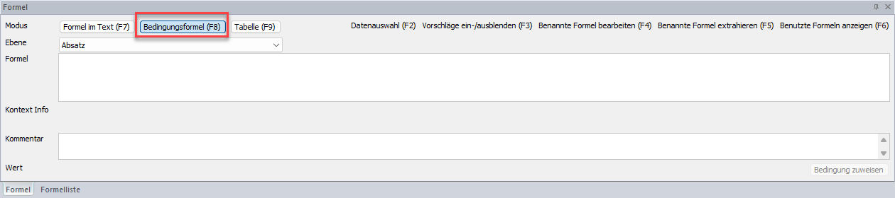

# Kontextmenü

Das Kontextmenü kann mit einem *rechten Mausklick* im Dokument geöffnet werden:

## Absatzbedingungen hinterlegen und ändern

Durch Anwahl des Punktes *Absatzbedingungen hinterlegen/ändern* im *Kontextmenü* öffnet sich das Formeldialog-Fenster im Modus *Bedingungsformel (F8)*. Hier können Sie eine [Bedingungsformel](../Reporting/Formeln/Einfuegen_und_Bearbeiten_von_Formeln.md) hinterlegen.

## Bedingung vom vorherigen Absatz übernehmen

Mit dem Punkt *Bedingung vom vorherigen Absatz übernehmen* können Sie die Bedingung des vorherigen Absatzes ganz einfach auf den neu markierten Absatz übernehmen.

## Bedingung vom nächsten Absatz übernehmen

Mit dem Punkt *Bedingung vom nächsten Absatz übernehmen* können Sie die Bedingung des nächsten Absatzes ganz einfach auf den neu markierten Absatz übernehmen.

## Abschnittshintergrund einfügen

Mit dem Menüpunkt *Abschnittshintergrund einfügen* im *Kontextmenü* können Sie für diesen Abschnitt ein Hintergrundbild einfügen. Sie können alle gängigen Dateitypen für Bilder und auch PDFs hinterlegen.

## Eigenschaften

Im Kontextmenü können über *Eigenschaften* alle [Eigenschaftsfenster](../Reporting/Eigenschaftsfenster/Aufruf_Eigenschaftsfenster.md) geöffnet werden.

## Absatzrahmen

Um einen Rahmen einzufügen, markieren Sie dazu den gewünschten Bereich mit einem Doppelklick. Der gewählte Bereich wird dadurch blau hinterlegt. Mit der rechten Maustaste öffnet sich das Kontextmenü. Mit Anwahl der Option [*Absatzrahmen*](../Reporting/Tabelle.md) können Sie den gewünschten Rahmen auswählen.

