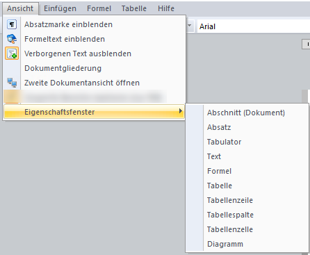
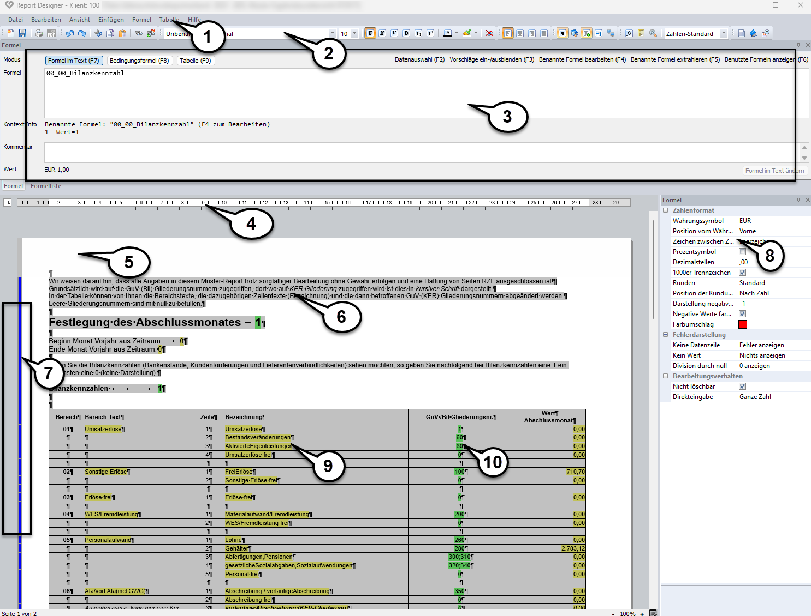

# Erste Schritte/Kurzübersicht

Die Funktionen des *RZL-Report Designer* sind ähnlich einem Textverarbeitungsprogramm aufgebaut. Der große Vorteil hier ist der sofortige Direktzugriff auf klientenbezogene Informationen. Mit der Hilfe von [Formeln](../Formeln/Einfuegen_und_Bearbeiten_von_Formeln.md) können Sie einen direkten Bezug zu den benötigten Daten schnell und einfach herstellen. Interne Bearbeitungsnotizen, Anweisungen oder sonstige Informationen können Sie im Report vermerken und anschließend ausblenden. Diese werden somit nicht angedruckt.

## Die Arbeitsoberfläche im Report Designer

Durch Öffnen eines Reports wird der *RZL Report Designer* in einem separaten Dialogfenster gestartet.

!!! warning "Hinweis"
    Zur besseren Bearbeitung können Sie sich nach dem erstmaligen Start die einzelnen Bearbeitungsfenster (Formelansicht, Eigenschaftsfenster) über den Menüpunkt *Ansicht / Eigenschaftsfenster* einblenden (siehe nachfolgende Abbildung).

Nachfolgend wird die Arbeitsoberfläche im *Report Designer* beschrieben.

1.  Menüleiste

2.  Werkzeugleiste mit Schnellstartsymbolen

3.  [Formelansicht](../Formeln/Einfuegen_und_Bearbeiten_von_Formeln.md)

4.  [Lineal mit Tabulatoreinstellungen](../Report_bearbeiten/Text_und_Absatzbearbeitung.md)

5.  Kopfzeilenbereich: Durch Doppelklick kann eine Kopf-/Fußzeile eingegeben werden.

6.  Ausgegrauter Textbereich: Zur Hinterlegung von Kommentaren und Anweisungen können Textbereiche für den Ausdruck ausgegraut werden.

7.  Farbliche Markierungen im Seitenbereich (betreffend ausgegraute Textbereiche):

    **Blau:** Absatz wird als reiner Informationstext angezeigt und beim Ausdruck komplett ausgeblendet.

    **Grün**: Im Absatz ist/sind eine/mehrere Bedingung(en) hinterlegt, die erfüllt ist/sind. Der Absatz wird beim Ausdruck daher angedruckt.

    **Rot:** Im Absatz ist/sind eine/mehrere Bedingung(en) hinterlegt, die nicht erfüllt ist/sind. Der Absatz wird nicht angedruckt.

    **Gelb:** Im Absatz sind mehrere Bedingungen hinterlegt und nicht zur Gänze erfüllt. Im Ausdruck werden nur die erfüllten Bedingungen angedruckt.

8.  Eigenschaftsfenster: Je nach markiertem Bereich können Einstellungen zur Formatierung getroffen werden.

    !!! info "Tipp"
        Das Eigenschaftsfenster im rechten Bildschirmbereich dient zur Eingabe und Anpassung der Formatierung des selektierten Bereiches. Je nach markiertem Bereich (Tabelle, Text, Spalte, Dokument, Formel, Diagramm) wird es den jeweiligen Funktionen automatisch angepasst.

9.  Gelbe Markierung eines Textes: Anzeige eines Formelergebnisses.

10. Grüne Markierung eines Textes: Anzeige einer Formel mit Direkteingabe. Die gewünschten Daten können hier sofort mittels Doppelklick, oder der *F4-Taste* erfasst werden.

## Nützliche Shortcuts und Symbole

| Symbol               | Tastenkombination             | Funktion                                                 |
| -------------------- | ----------------------------- | -------------------------------------------------------- |
|   | Strg+N                        | Neuen Report öffnen                                      |
|   | Strg+S                        | Report speichern                                         |
|  | Strg+P                        | Report drucken                                           |
|  |                               | Report im RZL PDF-Drucker/RZL PDF-Manager Premium öffnen |
|  | Strg+Z                        | Rückgängig                                               |
|  | Strg+Y                        | Rückgängig gemachte Änderung wiederherstellen            |
|  | Strg+X                        | Textbereich ausschneiden und in Zwischenablage stellen   |
|  | Strg+C                        | Textbereich in die Zwischenablage kopieren               |
|  | Strg+V                        | Textbereich aus Zwischenablage einfügen                  |
|  | Strg+F                        | öffnet Suchen und Ersetzen Dialog                        |
|  | Strg+F                        | öffnet Suchen und Ersetzen Dialog                        |
|                      | Strg+I                        | öffnet Formeldialog zur sofortigen Bearbeitung           |
|                      | Strg+E                        | Einfügen eines Erledigt-Symbols                          |
|                      | Enter am Textblock            | Zeilenumbruch einfügen                                   |
|                      | Enter am Nummernblock         | Tabstopp einfügen                                        |
|                      | Tabulatortaste                | Tabstopp einfügen                                        |
|                      | F4                            | Formeldialog zur Ansicht öffnen                          |
|                      | Strg+Enter                    | manueller Seitenumbruch einfügen                         |
|                      | Doppelklick linker Seitenrand | Markiert den gesamten Absatz bzw. die Tabelle            |
  