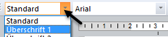
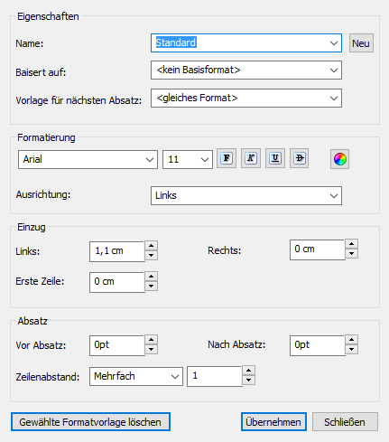

# Formatvorlagen

Um bei einheitlichen oder wiederkehrenden Formatierungen von Texten nicht immer die gleichen Formatierungsbefehle (wie Schriftart, Größe, Nummerierung, Zahlenformat) eingeben zu müssen, eignet sich das Anlegen einer Formatvorlage. So können beispielsweise Überschriften oder Zahlen durch Markierung des Textes und Zuweisung der Formatvorlage sehr schnell einheitlich angepasst werden.

## Textformatvorlagen

### Anwendung

Nach der Auswahl eines Textes kann die gewünschte Formatvorlage über das Drop-down-Menü in der Werkzeugleiste angewählt werden:

Die Formatierungseigenschaften werden sofort auf den markierten Text übertragen.

### Textformatvorlage anlegen oder ändern

Im Menüpunkt *Bearbeiten / Textformatvorlage* können neue Vorlagen angelegt bzw. bestehende verändert werden:

Beim Öffnen des Menüpunkts wird immer die aktuell verwendete Formatvorlage angezeigt. Mit der Schaltfläche *Neu* können Sie eine neue Formatvorlage, basierend auf der derzeit aktiven, erstellen.

**Name**

Vergeben Sie einen selbsterklärenden Namen für die Formatvorlage. Dieser wird im Drop-down-Menü in der Werkzeugleiste angezeigt.

**Basiert auf**

Werden bei der neuen Formatvorlage nur kleine Änderungen an einer bereits bestehenden durchgeführt, kann diese als Basis angewählt und die gewünschten Felder abgeändert werden.

!!! warning "Hinweis"
    Hier kommt es zur hierarchischen Vererbung. Wird in der ursprünglichen Formatvorlage ein gleich definiertes Feld, wie beispielsweise die Schriftart umgestellt, wird diese Änderung auch in die neue Formatvorlage übertragen.

**Vorlage für nächsten Absatz**

Sollte nach Anwendung dieser Formatvorlage eine bestimmte Formatierung für den nächsten Absatz verwendet werden, können Sie diese hier definieren.

## Zahlenformatvorlagen

Um Berechnungen im Report durchführen zu können, müssen Zahlenwerte mit Hilfe von [Formeln](../Formeln/Einfuegen_und_Bearbeiten_von_Formeln.md) eingegeben werden. Einzelne Zahlenwerte wie Datum, Eurobeträge oder Angaben zu einer Dauer können anschließend mit Hilfe der [*Formeleigenschaften*](../Eigenschaftsfenster/Formel.md) individuell gestaltet werden.

Zahlenformatvorlagen erleichtern Ihnen dabei die schnellere Formatierung von Formeln. Durch das einmalige Anlegen einer Formatvorlage kann diese Formatierung sehr schnell mittels Drop-down-Auswahl in der Werkzeugleiste auf einen Formelwert angewendet werden.

Im Menüpunkt *Bearbeiten / Zahlenformatvorlage* können Sie neue Formatvorlagen anlegen bzw. bestehende verändern.

## Farbformatvorlagen

Farbformatvorlagen werden für die Farbgestaltung von Diagrammen verwendet und können unter *Bearbeiten / Farbformatvorlagen* neu angelegt und gespeichert werden. Diese dort eingestellten Farben werden bei der Gestaltung von Diagrammen verwendet.