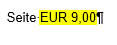
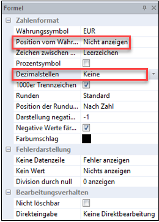

# Kopf- und Fußzeile

Die Bereiche oberhalb und unterhalb des Schriftspiegels können mit Hilfe der Kopf- und Fußzeile gestaltet werden. Hier können Sie Informationen zur Orientierung und Navigation, wie zum Beispiel die Seitenzahl oder das Datum, aufnehmen. Dieser Text wird anschließend auf jeder Seite wiederholt ausgedruckt.

Im Report wird die Kopf-/Fußzeile grundsätzlich ausgegraut (inaktiv) dargestellt. Mit Anwahl des Menüpunktes *Bearbeiten / Kopfzeile/Fußzeile* oder einem Doppelklick in den oberen bzw. unteren Seitenbereich wird die Bearbeitung aktiv und es können Eingaben und Änderungen vorgenommen werden.

!!! warning "Hinweis"   
    Ändern Sie vor dem Einfügen der unten angeführten Formel die Zahlenformatvorlage der Kopf- und Fußzeile noch auf das gewünschte Format, das später angezeigt werden soll. Wählen Sie dazu in der Werkzeugleiste im Drop-Down Menü das gewünschte Format (z.B. ganze Zahlen) aus.

Folgende Formeln können in der Werkzeugleiste ausgewählt und eingefügt werden:

| Symbol                    | Funktion                       |
| ------------------------- | ------------------------------ |
|  | Aktuelle Seitennummer einfügen |
|  | Gesamtseitenanzahl einfügen    |
|  | Aktuelles Datum einfügen       |
  
**Beispiel:**

Sie wollen die Seitenanzahl in ein Dokument einfügen. Schreiben Sie den Text „Seite" in die Kopf- oder Fußzeile und klicken Sie auf das Symbol *aktuelle Seitennummer* einfügen.

Die Darstellung ist nun im Report Designer wie folgt:

Damit die Ziffer richtig ausgewiesen wird, treffen Sie beim Zahlenformat, welches auf der rechten Seite eingeblendet wird, wenn Sie die Ziffer mit der Maustaste doppelt anklicken, folgende Einstellungen:

Ändern Sie die Position des Währungssymbols auf *Nicht anzeigen*. Stellen Sie bei den Dezimalzahlen *Keine* ein. Anschließend wird Ihnen die Seitennummer wie gewünscht formatiert.

!!! info "Tipp"
    Es können auch **Firmenlogos/Grafiken** in der Kopf-/Fußzeile hinterlegt werden. Stellen Sie dazu den Cursor auf den gewünschten Bereich in der Kopf-/Fußzeile und wählen Sie im Menüpunkt *Einfügen / Grafik* die gewünschte [Grafik](../Einfuegen.md) aus.