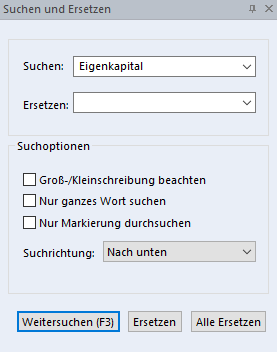

# Suchen und Ersetzen

Wenn Sie in einem umfangreicheren Report nach bestimmten Textstellen suchen, hilft Ihnen die Suchen-/Ersetzen-Funktion. Der gefundene Text kann sofort durch einen anderen Text ersetzt werden.

Zur Einblendung des Suchen-/Ersetzen Dialogfensters stehen Ihnen folgende Möglichkeiten zur Verfügung:

- Über den Menüpunkt *Bearbeiten / Suchen* oder *Suchen und Ersetzen*,

- mit dem Suchen und Ersetzen Symbol oder mit dem Suchen Symbol in der Werkzeugleiste oder

- mit der Tastenkombination *Strg+F*

Es öffnet sich nun nachfolgendes Fenster im rechten Bereich des *Report Designers*.

## Groß-/Kleinschreibung beachten

Groß-/Kleinschreibung wird bei der Suche beachtet.

## Nur ganzes Wort suchen

Mit dieser Option werden nur Wörter gesucht, die eigenständig durch ein Leerzeichen, Satzzeichen oder einen Tabulator getrennt sind.

## Nur Markierung durchsuchen

Der markierte Bereich wird durchsucht.

## Weitersuchen (F3-Taste)

Das erste oder nächste gesuchte Wort wird lt. Suchrichtung aufgerufen.

## Ersetzen

Ersetzt das gefundene und markierte Wort mit dem eingegebenen Wort des Felds *Ersetzen.*

## Alle Ersetzen

Alle im Dokument gefundenen Suchwörter werden auf einmal ersetzt.