# Text- und Absatzbearbeitung

Die Textverarbeitung bietet Ihnen neben standardisierten Gestaltungsmöglichkeiten wie Formatierungen, Tabellen oder Grafiken auch den Zugriff auf unterschiedlichste Programm-Klientendaten in Form von [Formeln](../Formeln/Einfuegen_und_Bearbeiten_von_Formeln.md). Der große Nutzen in der Formelanwendung liegt in der sofortigen Aktualisierung der Daten.

!!! info "Tipp"
    Blenden Sie sich zur Bearbeitung des Reports die Absatzmarken und den verborgenen Text ein, damit erleichtern Sie sich die Bearbeitung und Layoutgestaltung.

Zur Formatierung stehen unterschiedliche Tools zur Verfügung. Neben der Werkzeugleiste können Sie das Eigenschaftsfenster oder das Kontextmenü (Aufruf mit der rechten Maustaste) des jeweils markierten Textbereiches verwenden. Zusätzlich können individuelle Formatvorlagen zur Formatierung gestaltet werden.

## Die Werkzeugleiste für Text-/Absatzformatierungen

In der Werkzeugleiste stehen folgende Möglichkeiten zur Text-/Absatzformatierung zur Verfügung:

| Schaltfläche              | Bedeutung                                              |
| ------------------------- | ------------------------------------------------------ |
| 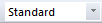 | Auswahl der Textformatvorlage (Standard/Überschriften) |
| 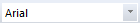 | Auswahl der Schriftart                                 |
| 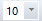 | Schriftgröße einstellen                                |
|  | fett                                                   |
|  | kursiv                                                 |
|  | unterstrichen                                          |
|  | Text wird durchgestrichen                              |
| 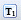 | Text wird tiefgestellt                                 |
|  | Text wird hochgestellt                                 |
|  | Schriftfarbe auswählen                                 |
|  | Textmarkierungsfarbe auswählen                         |
|  | markierten Text verbergen                              |
|  | Absatzausrichtung linksbündig                          |
|  | Absatzausrichtung zentriert                            |
|  | Absatzausrichtung rechtsbündig                         |
|  | Absatzausrichtung Blocksatz                            |
| 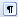 | Absatzmarken und Formatierungssymbole ein-/ausblenden  |
|  | Formeltext ein-/ausblenden                             |
|  | Verborgenen Text ein-/ausblenden                       |
|  | Einzeilige Formeltabellen                              |
| 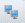 | Zweite Dokumentansicht öffnen                          |
|  | Formel einfügen                                        |
|  | Formelliste öffnen                                     |
| 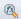 | Formelsuche öffnen                                     |

## Texte/Absätze ausblenden

**Ausblendung mit Bedingungsformel**

Mit Hilfe einer [Bedingungsformel](../Formeln/Einfuegen_und_Bearbeiten_von_Formeln.md) werden Absätze nur gedruckt, wenn die im Absatz integrierte Formel erfüllt wird.

Der betroffene Absatz wird im Bearbeitungsmodus grau dargestellt. Sofern die im Absatz hinterlegte Bedingung erfüllt ist, ist der Text beim Ausdruck sichtbar. Am linken Seitenbereich erscheint zusätzlich ein grüner Balken. Bei Nichterfüllung der Bedingung erscheint der Balken im linken Seitenbereich rot, der Text wird beim Druck somit ausgeblendet.

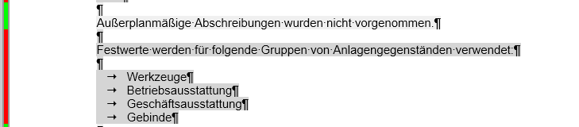

## Eingabefelder/Eingabewerte in Reports

Bestimmte Bereiche in Reports können mit Eingabefeldern ausgestattet sein, um den Report einfach verändern zu können.

**Ein Beispiel** hierfür ist der Unternehmensreport.

Grün markierte Felder können mittels *Doppelklick*, oder *F4-Taste* bearbeitet werden. Wird beispielsweise beim Punkt *Eingabe Monat* 3 eingetragen, wird der Unternehmensreport für März erstellt. Die Kästchen sind Optionen, die entweder dazu- oder weggeschalten werden können. Die Texte der KER-Gliederungen und die KER-Gliederungen selbst, können entweder mittels Formel oder manuell eingetragen werden. Soll die Eingabe beendet werden kann der Eingabedialog mit der *ESC-Taste*, oder der Tastenkombination *Return + Enter-Taste* geschlossen werden.

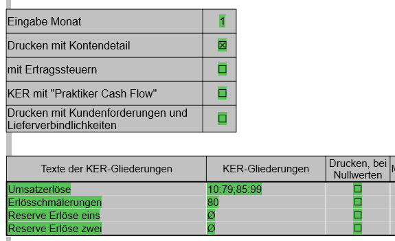{width="400"}

**Beispiel:**

Das **Eingabe Monat** soll mit einem **Eingabefeld selber angelegt werden**.

**Vorgehensweise:**

Zuerst stellen Sie den Cursor an die Stelle, an welcher das Eingabefeld künftig sein soll. Danach klicken Sie auf den Menüpunkt *Formel / Einfügen/Bearbeiten.* Nun tragen Sie im Feld *Formel* für unser Beispiel einen Monat ein, beispielsweise 1. Danach drücken Sie die *F5-Taste* um eine **benannte Formel** anzulegen. Sie gelangen nun zu folgender Ansicht:

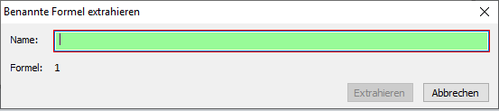{width="400"}

Vergeben Sie nun einen Namen für das Eingabefeld. Wichtig dabei ist, dass keine Leerzeichen erlaubt sind. Wurde ein Name vergeben, ist die Schaltfläche *Extrahieren* aktiv. Klicken Sie zum Abschluss auf *Extrahieren*.

Das Eingabefeld wird nun in gelber Farbe dargestellt. Sie müssen nun noch definieren, dass es sich um keine Formel, sondern um ein Eingabefeld handelt. Dies können Sie über die *Formeleigenschaften* ändern (*Ansicht / Eigenschaftsfenster / Formel*).

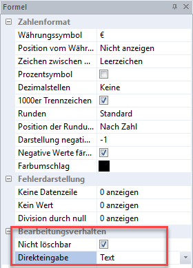

Wir empfehlen das Häkchen bei *Nicht löschbar* zu setzen, damit das Eingabefeld nicht versehentlich gelöscht werden kann. Beim Punkt [*Direkteingabe*](../Eigenschaftsfenster/Formel.md) müssen Sie noch einstellen, um welche Eingabe es sich handelt.

Im Anschluss wird das Eingabefeld grün dargestellt. Sie können nun Ihre Eingaben mit einem *Doppelklick*, oder mit der *F4-Taste* auf das grüne Feld ändern.

## Arbeiten mit Tabulator und Lineal

Tabulatoren regeln die vertikale Ausrichtung eines Fließtextes und können mit Hilfe der Tasten *Tabulator* oder *Enter* am *Nummernblock* eingefügt werden. Der Tabulatortyp kann vor Setzen eines neuen Tabstopps durch Anwahl des Tabulatorsymbols (Links neben dem Lineal) geändert werden. Folgende Möglichkeiten stehen Ihnen zur Verfügung:

| Tabstopp                  | Ausrichtung      |
| ------------------------- | ---------------- |
|  | linksbündig      |
|  | rechtsbündig     |
|  | zentriert        |
|  | Dezimaltabulator |

Die Positionierung der Tabulatoren ist mit Hilfe des Lineals möglich. Klicken Sie in der aktiven Zeile auf den gesetzten Tabstopp und ziehen Sie ihn mit der linken Maustaste auf die gewünschte Position.

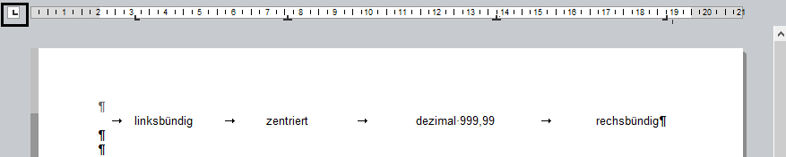

Mit einem Doppelklick auf den Tabstopp im Lineal wird das Eigenschaftsfenster zur Ausrichtung und Positionierung geöffnet und es können Änderungen durchgeführt werden. Ein manuell ausgerichteter Tabstopp kann durch Anklicken und Verschieben außerhalb des Lineals wieder gelöscht werden.

!!! warning "Hinweis"
    Die Ausrichtung von Absätzen bzw. komplexeren Formatierungen innerhalb eines Absatzes können oft in einer [Tabelle](../Tabelle.md) schneller und präziser gelöst werden.

Soll der Tabulator mit einem Füllzeichen .... ausgefüllt werden, so besteht die Möglichkeit über den Menüpunkt *Ansicht / Eigenschaftsfenster / Tabulator* das Füllzeichen auszuwählen. Ein praktisches Beispiel hierfür wäre die Erstellung eines Inhaltsverzeichnisses über den *Report Designer*.

Es öffnet sich nachfolgendes Fenster auf der rechten Seite.

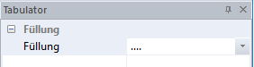

Die Darstellung im Report Designer ist folgendermaßen:

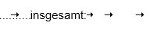