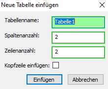

# Tabelle

## Arbeiten mit Tabellen

Das Einfügen von Tabellen funktioniert über die Menüpunkte:

- *Einfügen / Tabelle* oder

- *Tabelle / Einfügen*.

Anschließend öffnet sich ein Dialogfenster zur Eingabe eines
Tabellennamens, der Anzahl der Spalten und Zeilen. Mit der Schaltfläche
*Einfügen* können Sie die Tabelle einfügen und bearbeiten. Durch Setzen
des Häkchens *Kopfzeile einfügen* wird eine Überschriftenzeile (zur
Verwendung bei Formeltabellen) hinzugefügt.

Abb. 6‑1 Tabelle einfügen

{width="1.5278565179352581in"
height="1.2570089676290463in"}

HInweis

Werden Zahlenwerte direkt in die Tabelle eingegeben, sind diese als Text
formatiert (vgl. Eingabe im Word-Dokument). Möchten Sie mit Werten in
einer Tabelle rechnen, ist dazu die Eingabe von Formelwerten notwendig
(vgl. Eingabe in einer Excel-Tabelle). Das Einfügen und Bearbeiten von
Formelwerten wird im Kapitel 5.1 Einfügen und Bearbeiten von Formeln,
Seite [36](#einfügen-und-bearbeiten-von-formeln) im Rahmen der
Formeltabelle erläutert.

### Tabellenbereiche zur Bearbeitung richtig markieren[]{.indexref entry="Tabelle:Markieren"}

Zur Formatierung und Bearbeitung einzelner Tabellenbereiche müssen diese
zunächst ausgewählt werden. Danach können die gewünschten Änderungen mit
Hilfe des Eigenschaftsfensters und Kontextmenüs (rechte Maustaste)
ausgeführt werden:

#### Markieren einer ganzen Tabellenzeile {#markieren-einer-ganzen-tabellenzeile .Überschrift-4---VG}

Klicken Sie einmal mit dem Mauszeiger am linken Seitenrand der
gewünschten Zeile, die markierte Zeile wird blau hinterlegt. Dadurch
wird das Eigenschaftsfenster auf Tabellenzeile angepasst. Sie können nun
die Abstände bzw. Zeilenhöhe, Ausrichtungen, Hintergrundfarben etc.
bearbeiten (siehe Kapitel 3.6.7 Tabellenzeile-Eigenschaftsfenster, Seite
[28](#tabellenzeile-eigenschaftsfenster)).

#### Markieren einer Spalte {#markieren-einer-spalte .Überschrift-4---VG}

Setzen Sie den Mauszeiger an den Spaltenanfang bis er die Form eines
Pfeils nach unten annimmt. Klicken Sie doppelt mit der linken Maustaste.
Es öffnet sich nun das Eigenschaftsfenster für die Tabellenspalte. Sie
können hier den Abstand zum Rahmen und die Tabellenspalteneigenschaften
bearbeiten (siehe Kapitel 3.6.8 Tabellenspalte-Eigenschaftsfenster,
Seite [29](#tabellenspalte-eigenschaftsfenster)).

#### Markieren einer einzelnen Zelle {#markieren-einer-einzelnen-zelle .Überschrift-4---VG}

Ziehen Sie dazu den gedrückten Mauszeiger über das Feld bis die gesamte
Zeile blau markiert ist. Sie können nun die Zelle in den
Tabellenzelleneigenschaften bearbeiten (siehe Kapitel 3.6.9
Tabellenzelle-Eigenschaftsfenster, Seite
[30](#tabellenzelle-eigenschaftsfenster)).

### Zeilen/Spalten hinzufügen oder löschen[]{.indexref entry="Tabelle:Spalten/Zeilen hinzufügen"}

Rufen Sie sich im Tabellenbereich mit der rechten Maustaste das
Kontextmenü auf und wählen Sie die gewünschte Option (*Zeile
oberhalb/unterhalb einfügen* oder *Spalte links/rechts einfügen*) aus.
Möchten Sie zusätzliche Zeilen anstellen, ist dies auch durch Drücken
der Tabulator-Taste möglich.

Ganze Zeilen oder Spalten können nach Anwahl über das Kontextmenü und
*Zeile(n) löschen* bzw. *Spalte(n) löschen* entfernt werden. Mit der
*Entf-Taste* werden lediglich die Inhalte herausgelöscht.

### Zellen verbinden[]{.indexref entry="Tabelle:Zellen verbinden"}

Markieren Sie die gewünschten Zeilen/Spalten und wählen Sie mit der
*rechten Maustaste* den Menüpunkt *Zellen verbinden* an.

### Zellen trennen[]{.indexref entry="Tabelle:Zellen trennen"}

Markieren Sie die gewünschten Zeilen/Spalten und wählen Sie mit der
*rechten Maustaste* den Menüpunkt *Zellenverbindung lösen* an.

### Tabelle formatieren[[]{.indexref entry="Formatierung:Tabelle"}]{.indexref entry="Tabelle:Formatieren"}

Je nach markiertem Feldbereich (ganze Tabelle / Spalten / Zeilen /
Zellen) können Sie anschließend Änderungen in der Darstellung
durchführen. Formatierungen sind zum einen über die
*Tabelleneigenschaften* im rechten Bildschirmbereich, zum anderen über
das *Kontextmenü* über die *rechte Maustaste* möglich.

#### Tabellenrahmen anpassen[]{.indexref entry="Tabelle:Tabellenrahmen"}

Durch Aufruf des Kontextmenüs im Tabellenbereich und der Anwahl des
Punktes *Tabellenrahmen* können Sie die Linienart der Tabelle
einstellen.

Abb. 6‑2 Tabellenrahmen formatieren

{width="3.937007874015748in"
height="2.019983595800525in"}

Mit Anwahl der jeweiligen Schalfläche werden die vorgenommenen
Einstellungen in der Vorschau angezeigt. Diese gelten immer für den
aktuell markierten Bereich. Wenn Sie beispielsweise nur die Rahmenlinien
einer Zeile formatieren möchten, ist diese vor Anwahl des Kontextmenüs
zu markieren.

## Tabellen-Eigenschaften[]{.indexref entry="Eigenschaftsfenster:Tabelle"}

Durch Anwahl des jeweiligen Menüpunkt im Kontextmenü können Sie
gewünschte Formatierungen durchführen:

#### Tabelleneigenschaften {#tabelleneigenschaften .Überschrift-4---VG}

In den Tabelleneigenschaften kann der Tabellenname und Seiteneinzug
geändert werden. Die Anzeige der Datenquelle ist für die Verwendung der
Formeltabelle bedeutend (Kapitel 5.1.9 Arbeiten mit Formeltabellen,
Seite [47](#arbeiten-mit-formeltabellen)).

#### Zeileneigenschaften {#zeileneigenschaften .Überschrift-4---VG}

Markieren Sie zur Anpassung und Ausrichtung die gewünschte Zeile und
rufen Sie sich im Kontextmenü die *Zeileneigenschaften* auf. Im
Zeilentyp können Sie auch eine *Kopf-*/*Fußzeile* definieren. Diese
Zeile wird bei seitenübergreifenden Tabellen auf jeder Seite angedruckt
(siehe Kapitel 3.6.7 Tabellenzeile-Eigenschaftsfenster,
Seite[28](#tabellenzeile-eigenschaftsfenster)).

#### Zelleneigenschaften {#zelleneigenschaften .Überschrift-4---VG}

Durch Markieren einer gesamten Zelle und Aufruf der
*Zelleneigenschaften* können Sie Formatierungen speziell für diese eine
Zelle durchführen. Neben der Ausrichtung können Sie die Hintergrundfarbe
und den Abstand zum Rahmen definieren (siehe Kapitel 3.6.9
Tabellenzelle-Eigenschaftsfenster, Seite
[30](#tabellenzelle-eigenschaftsfenster)).

Tipp

Sollte Ihnen vor der Tabelle eine Leerzeile fehlen, können Sie diese
durch Markieren der gesamten Tabelle und mit der rechten Maustaste
*Leerzeile vor Tabelle einfügen* ergänzen.

#### Tabellenhintergrundbild einfügen[]{.indexref entry="Tabellenhintergrund einfügen"}

Über das Kontextmenü mit der rechten Maustaste kann ein
Tabellenhintergrundbild eingefügt werden.

Abb. 6‑3 Tabellenhintergrundbild einfügen

{width="3.216790244969379in"
height="3.0625in"}

### Automatische Summen einfügen[]{.indexref entry="Tabelle:Summen einfügen"}

Zur automatischen Aufsummierung von Zahlen müssen diese als Formelwert
eingegeben werden. Eine genaue Beschreibung dazu finden Sie im Kapitel
5.1.8 Arbeiten mit Tabellenformeln, Seite
[46](#arbeiten-mit-tabellenformeln).