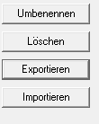
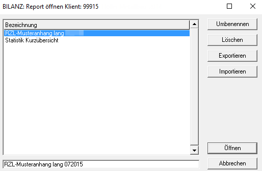
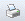

# Verwaltung in den Klassik-Programmen

## Bestehende Reports als Musterreport sichern

Bereits bestehende Reports eines Klienten können gesondert gespeichert und zur Verwendung und individuellen Änderung auf einen anderen Klienten übertragen werden.

Wählen Sie dazu den Menüpunkt *Klient / Kanzlei / Reports* aus. Durch die Eingabe einer neuen, noch nicht belegten Nummer können Sie nach Eingabe eines Textes mit der Option *von Klient übernehmen* im Feld *Klientennummer* die Klientennummer mit dem Wirtschaftsjahr eingeben oder den gewünschten Klienten über den Aufruf mit der *F2-Taste* auswählen.

Mit *Ausführen* werden die einzelnen Reports angezeigt und können durch Setzen von Häkchen individuell angewählt und als Musterreport gesichert werden. Im Anschluss können Sie den Musterreport aus der Liste auswählen und sofort auf einen anderen Klienten überspielen.

!!! info "Tipp"
    Musterreports können über die *Zentrale Mandantenverwaltung (ZMV)* auch via E-Mail versendet werden. Wählen Sie dazu den Menüpunkt *Allg. Dateien / Mit E-Mail senden* und die Schaltfläche *Erweitert* aus. Der gewünschte Report (mit Typ *KREP*) kann dann angewählt und mit *Senden* versendet werden. Beim Empfänger kann der Musterreport anschließend wiederum in der ZMV über *Allg. Dateien / Hereinspielen* hochgeladen und importiert werden.

!!! info "Tipp"
    Eine noch schnellere Variante Musterreports zu versenden bzw. zu exportieren ist über den Menüpunkt [*Report öffnen*](../Reporting/Kanzleireports.md) möglich. Je nach Programm ist der Vormenüpunkt unterschiedlich. Hier kann mittels Klick auf Exportieren der Report als  XML-Datei exportiert werden. Über denselben Menüpunkt kann der Report über die Schaltfläche *Importieren* importiert werden.

    

## Report sichern

Nach der Bearbeitung eines Reports müssen die Änderungen gesichert werden. Zur Speicherung stehen Ihnen folgende Möglichkeiten zur Verfügung:

- über den Menüpunkt *Datei / Speichern,*
- mit dem *Speichern-Symbol* in der Werkzeugleiste  oder
- mit der Tastenkombination *Strg + S*.

Sofern ein neuer Report erstellt wurde, erhalten Sie einen Zwischendialog zur Eingabe eines Reportnamens. Über den Menüpunkt *Datei / Speichern unter* können Sie den geöffneten Report mit einem neuen Namen sichern. Der ursprüngliche Report bleibt mit dem alten Namen somit erhalten.

!!! warning "Hinweis"
    Sobald Sie einen Report auf einen Klienten überspielt haben, wird durch die Sicherung des Klienten der Report mitgesichert. Ein individuelles Speichern ist nur im Zuge der Erstellung bzw. der Bearbeitung notwendig.

## Export und Import eines Reports

Reports eines Klienten können zur Weitergabe auch als XML-Struktur gespeichert werden. Dadurch werden keine klientenspezifischen Daten weitergegeben. Im Report-*Öffnen Dialogfenster* können Sie die Auswertungen exportieren:

Wählen Sie für den Export die Schaltfläche *Exportieren* aus. Sie gelangen in einen *Speichern-unter* Dialog, wo der Speicherort und Dokumentenname definiert werden kann. Der Report wird im Dateityp *RZL-Reports.xml* gesichert und kann nun in jeden beliebigen RZL-Klienten übernommen werden.

Öffnen Sie dazu im gewünschten RZL-Klienten das *Report-Öffnen* Dialogfenster und wählen Sie die Schaltfläche *Importieren* aus. Nach Anwahl des RZL-Reports im XML-Format wird der Report mit *Öffnen* in den Klienten importiert.

## Report löschen

Im *Report-Öffnen* Dialogfenster können Sie mit der Schaltfläche *Löschen* den aktiv angewählten Report des geöffneten Klienten löschen.

## Report umbenennen

Im *Report-Öffnen* Dialogfenster können Sie nach Anwahl des gewünschten Reports im unteren Eingabefeld einen neuen Namen definieren. Mit der Schaltfläche *Umbenennen* wird der bisherige Name überschrieben.

## Drucken von Reports

Für den Ausdruck eines Reports muss dieser zunächst geöffnet werden. Anschließend stehen Ihnen folgende Druckmöglichkeiten zur Verfügung:

### Ausgabe über den RZL PDF-Drucker bzw. RZL PDF-Manager Premium

Zur Vorabansicht bzw. für die Sicherung des Reports als PDF-Dokument empfiehlt sich die Ausgabe im RZL PDF-Drucker bzw. RZL PDF-Manager Premium. Wählen Sie dazu den Menüpunkt *Datei / PDF Drucken* oder das PDF-Druckersymbol in der [Werkzeugleiste](../Reporting/Report_bearbeiten/ErsteSchritte_Kurzuebersicht.md).

Der aktuelle Report wird im RZL PDF-Drucker geöffnet und kann von dort aus direkt gespeichert, gedruckt oder per E-Mail versendet werden.

### Ausdruck beim installierten Drucker

Zur Direktausgabe am installierten Drucker stehen Ihnen folgende Möglichkeiten zur Verfügung:

- über den Menüpunkt *Datei / Drucken*, 
- mit dem Drucker-Symbol in der Werkzeugleiste  oder
- mit der Tastenkombination *STRG + P*.

### Sonderoption: Drucken von dienstnehmer- und dienstgeberbezogenen Daten

Das *RZL Lohnprogramm* bietet Ihnen die Möglichkeit, Reports auf Basis von definierten Dienstgeber- bzw. Dienstnehmerdaten zu drucken.

**Dienstgeberbezogene Reports drucken**

Sofern im Klienten ein Report mit Dienstgeber-Formeln hinterlegt ist, können Sie diesen über den Menüpunkt *Report / DG Report drucken* für den jeweils gewünschten Monat ausgeben.

**Dienstnehmerbezogene Reports drucken**

Auf dienstnehmerbezogene Daten basierende Reports können Sie über den Menüpunkt *Report / DN Report drucken* ausgeben. Nach Eingabe des gewünschten Monats und Dienstnehmers werden die Daten in den ausgewählten Report eingelesen und können anschließend ausgedruckt werden.