# Verwaltung in der FIBU Next

Wenn kein Klient ausgewählt ist, können in der FIBU Next unter dem Menüpunkt *Reports* die allgemeinen Report-Einstellungen vorgenommen werden.

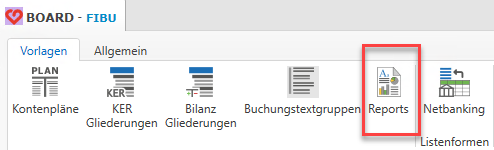

## AAllgemeine Report-Verwaltung

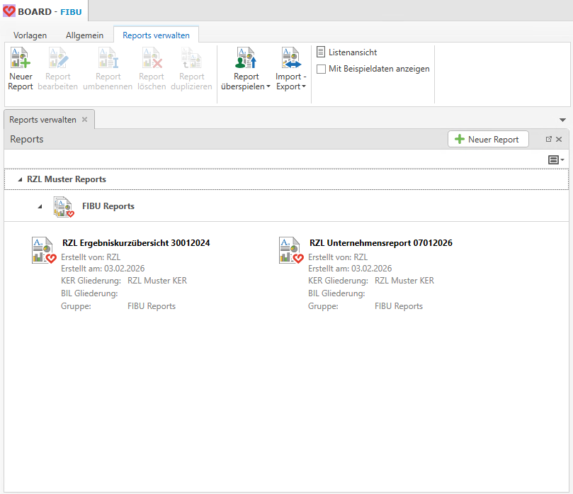

!!! info "Tipp"
    In der Übersicht stehen zwei Musterreports zur Verfügung.

Folgende Funktionen stehen für die Verwaltung der Reports zur Verfügung:

- Neuer Report
- Report bearbeiten
- Report umbenennen
- Report löschen
- Report duplizieren
- Report überspielen
- Import - Export
- mit Beispieldaten anzeigen

Die einzelnen Funktionen werden nachfolgend beschrieben.

### Mit Beispieldaten anzeigen

Wenn die Option *mit Beispieldaten anzeigen* aktiviert ist, kann ein ausgewählter Report über *Report anzeigen* in einer Vorschau mit Beispieldaten geöffnet werden.

Nach dem Klick auf Report anzeigen öffnet sich ein Auswahlfenster für Klient, Wirtschaftsjahr, KER-Gliederung und Bilanz-Gliederung

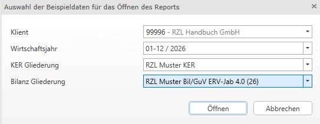

Nach Bestätigung der Auswahl wird der Report mit Beispieldaten in der Vorschau angezeigt.

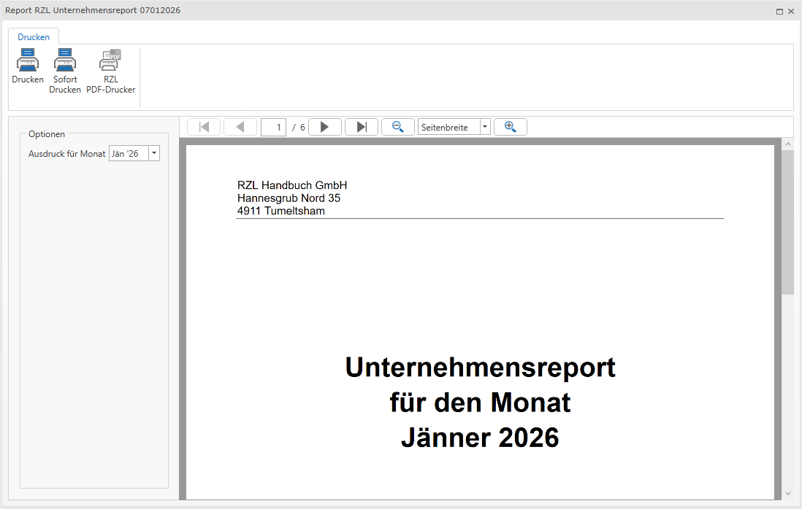

Diese Funktion ermöglicht es, einen Report vorab zu prüfen, bevor er einem Klienten zugewiesen oder auf diesen überspielt wird.

## Report-Verwaltung im Klienten

Innerhalb eines Klienten können Reports über den Reiter *Reporting* verwaltet und bearbeitet werden.

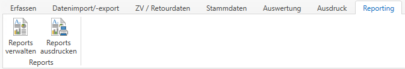

Folgende Funktionen stehen zur Verfügung:

- Neuer Report
- Report bearbeiten
- Report umbenennen
- Report löschen
- Report duplizieren
- Report überspielen
- Import - Export

### Neuen Report erstellen

Über die Schaltfläche *Neuer Report* kann ein neuer Report angelegt werden. Es öffnet sich folgendes Dialogfenster:

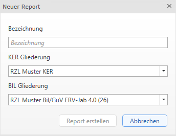

Hier sind folgende Angaben vorzunehmen *Bezeichnung* des Reports, *KER Gliederung* und *BIL Gliederung*.

Mit *Report erstellen* wird der Reporting-Designer geöffnet.

Der neu erstellte Report erscheint anschließend im Bereich *Reports verwalten* mit der vergebenen Bezeichnung.

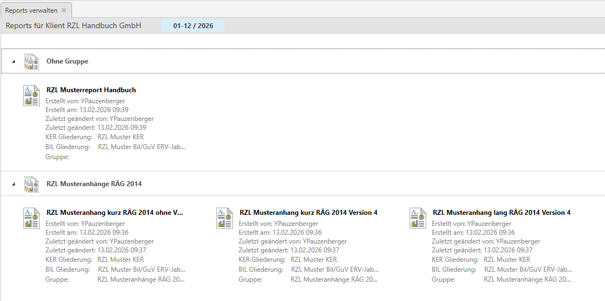

Da der Report zunächst keiner Gruppe zugeordnet ist, wird er unter *Ohne Gruppe* angezeigt.

Um die Gruppe umzubenennen, wählen Sie die Überschrift *Ohne Gruppe* aus und klicken in der Symbolleiste auf *Gruppe umbenennen*. Anschließend kann eine neue Gruppenbezeichnung vergeben werden.

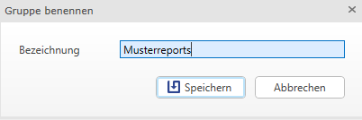

### Report bearbeiten

Über *Report bearbeiten* wird der ausgewählte Report im Reporting-Designer geöffnet und kann dort angepasst werden.

### Report umbenennen

Mit der Funktion *Report umbenennen* kann die Bezeichnung eines bestehenden Reports geändert werden. Nach Auswahl der Funktion wird der Name zur Bearbeitung geöffnet.

### Report löschen

Um einen Report zu entfernen, wählen Sie *Report löschen*. Der Report wird anschließend aus der Liste entfernt.

### Report duplizieren

Mit *Report duplizieren* kann ein bestehender Report kopiert werden. Nach Auswahl der Funktion öffnet sich ein Dialogfenster zur Vergabe einer neuen Bezeichnung. Der duplizierte Report wird anschließend in der Reportliste angezeigt und kann über Report bearbeiten weiter angepasst werden.

### Report überspielen

Für das Überspielen eines Reports stehen zwei Möglichkeiten zur Verfügung:

- Überspielen auf einen oder mehrere Klienten und Wirtschaftsjahre
- Überspielen in die allgemeine Report-Verwaltung

#### Report auf Klient überspielen

Nach Auswahl von *Report auf Klient überspielen* erscheint ein Dialogfenster mit einer Übersicht aller Klienten und Wirtschaftsjahre. Es können ein oder mehrere Klienten ausgewählt werden.

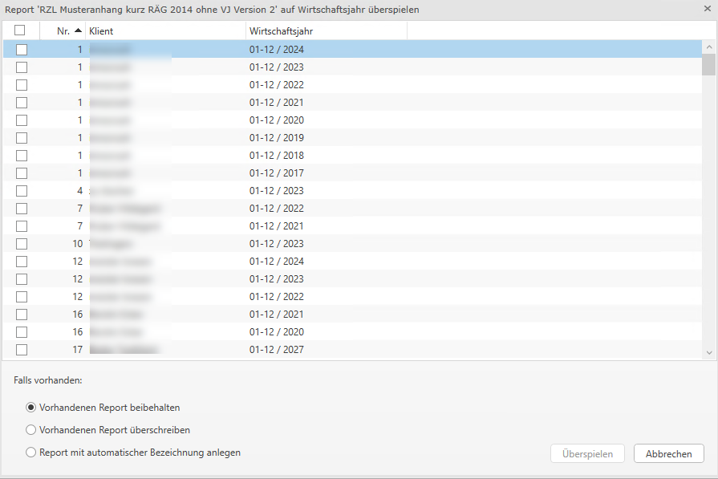

Unter *Falls vorhanden* stehen folgende Optionen zur Verfügung:

- *Vorhandenen Report beibehalten*: Existiert bereits ein Report mit derselben Bezeichnung, wird der neue Report nicht übernommen.
- *Vorhandenen Report überschreiben*: Existiert bereits ein Report mit derselben Bezeichnung, wird dieser durch den neuen Report ersetzt.
- *Report mit automatischer Bezeichnung anlegen*: Existiert bereits ein Report mit derselben Bezeichnung, wird der neue Report mit einer erweiterten Bezeichnung (z. B. „(1)“) angelegt. Ein bestehender Report wird dabei nicht überschrieben.

!!! info "Tipp"
    Reports die nach der Jahresübernahme neu erstellt oder bearbeitet wurden, müssen ebenfalls über diese Funktion in das gewünschte Klientenjahr übernommen werden.

### Import - Export

#### Report importieren

Um einen gespeicherten Report zu importieren, wählen Sie die Funktion *Report importieren* und anschließend den entsprechenden Ordner sowie die gewünschte Datei aus.

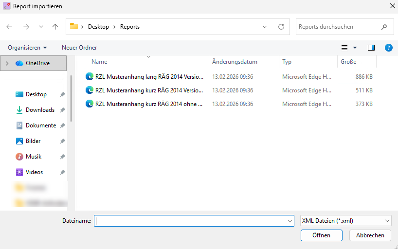

#### Report exportieren

Markieren Sie den zu exportierenden Report und wählen Sie *Report exportieren*. Anschließend öffnet sich ein Speicherdialog, in dem der gewünschte Speicherort ausgewählt werden kann. Der Report wird dort als Datei abgelegt.

## Reports ausdrucken

Über die Funktion *Report ausdrucken* werden alle verfügbaren Reports angezeigt. Wählen Sie den gewünschten Report aus und starten Sie den Ausdruck entweder per Doppelklick oder über die Schaltfläche *Report ausdrucken*.

Anschließend wird die Druckvorschau des Reports geöffnet.

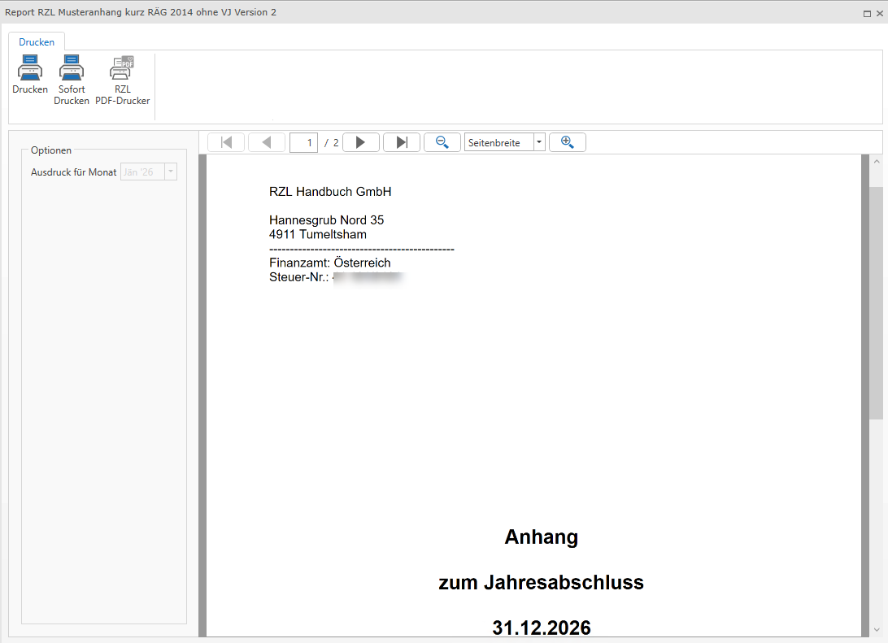

Der Report kann wahlweise über folgende Ausgabemöglichkeiten erstellt werden: Standarddrucker, Sofortdruck oder RZL-PDF-Drucker.

## Übergabe von Reports aus FIBU Klassik in FIBU Next

Wird ein neuer Klient aus der FIBU Klassik in die FIBU Next übergeben (*Klient / Übergabe an FIBU Next / Klienten*), werden die im Klienten gespeicherten Reports automatisch mitübernommen.

Sollen Reports nachträglich aus der FIBU Klassik übernommen werden, erfolgt dies über: *Klient / Übergabe an FIBU Next / Reports*. 

Dabei können alle unter *Klient / Kanzlei / Reports* gespeicherten Reports in die FIBU Next übernommen werden.

!!! warning "Hinweis"
    Wenn speziell für einzelne Klienten erstellte Reports übernommen werden sollen, müssen diese zuerst in Kanzleireports umgewandelt werden. Erst danach können sie über *Klient / Übergabe an FIBU Next / Reports* in die FIBU Next übernommen werden.