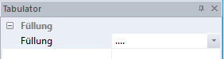
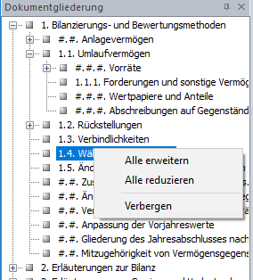
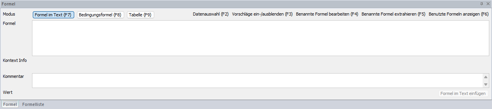
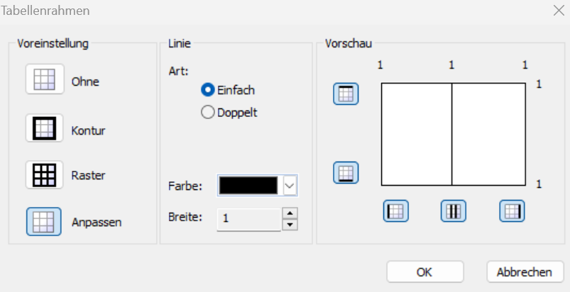
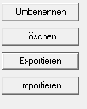

{width="8.257787620297464in"
height="11.677918853893264in"}

Handbuch & Dokumentation zum Modul Reporting

**Impressum**

Herausgeber\
RZL Software GmbH\
Hannesgrub Nord 35, 4911 Tumeltsham

Reporting-Modul in:\
Finanzbuchhaltung/Bilanz, 07752/252-33, <bil@rzl.at>\
Lohnverrechnung, 07752/252-32, <lohn@rzl.at>\
WT-Honorarverrechnung, 07752/252-37, hon@rzl.at

rzlSoftware.at

Handbuch REPORTING

Version A7

Alle Rechte an diesem Handbuch vorbehalten. Jede Verwertung ohne
ausdrückliche schriftliche Zustimmung des Herausgebers ist untersagt.
Vervielfältigungen sind nur im Rahmen der mit uns abgeschlossenen
Lizenz- und Wartungsverträge für den lizenzierten Standort erlaubt.

© RZL-Software, Tumeltsham

# Inhaltsverzeichnis {#inhaltsverzeichnis .TOC-Heading}

[1 Kanzleireports [7](#kanzleireports)](#kanzleireports)

[1.1 RZL Musterreports installieren
[7](#rzl-musterreports-installieren)](#rzl-musterreports-installieren)

[1.2 Reports auf einen Klienten überspielen
[7](#reports-auf-einen-klienten-überspielen)](#reports-auf-einen-klienten-überspielen)

[1.3 Report öffnen [9](#report-öffnen)](#report-öffnen)

[2 Report bearbeiten [10](#report-bearbeiten)](#report-bearbeiten)

[2.1 Erste Schritte/Kurzübersicht
[10](#erste-schrittekurzübersicht)](#erste-schrittekurzübersicht)

[2.1.1 Die Arbeitsoberfläche im Report Designer
[10](#die-arbeitsoberfläche-im-report-designer)](#die-arbeitsoberfläche-im-report-designer)

[2.1.2 Nützliche Shortcuts und Symbole
[12](#nützliche-shortcuts-und-symbole)](#nützliche-shortcuts-und-symbole)

[2.1 Text- und Absatzbearbeitung
[12](#text--und-absatzbearbeitung)](#text--und-absatzbearbeitung)

[2.1.1 Die Werkzeugleiste für Text-/Absatzformatierungen
[13](#die-werkzeugleiste-für-text-absatzformatierungen)](#die-werkzeugleiste-für-text-absatzformatierungen)

[2.1.2 Texte/Absätze ausblenden
[13](#texteabsätze-ausblenden)](#texteabsätze-ausblenden)

[2.1.3 Eingabefelder/Eingabewerte in Reports
[14](#eingabefeldereingabewerte-in-reports)](#eingabefeldereingabewerte-in-reports)

[2.1.4 Arbeiten mit Tabulator und Lineal
[15](#arbeiten-mit-tabulator-und-lineal)](#arbeiten-mit-tabulator-und-lineal)

[2.2 Suchen und Ersetzen
[17](#suchen-und-ersetzen)](#suchen-und-ersetzen)

[2.3 Formatvorlagen [18](#formatvorlagen)](#formatvorlagen)

[2.3.1 Textformatvorlagen
[18](#textformatvorlagen)](#textformatvorlagen)

[2.3.2 Zahlenformatvorlagen
[19](#zahlenformatvorlagen)](#zahlenformatvorlagen)

[2.3.3 Farbformatvorlagen
[19](#farbformatvorlagen)](#farbformatvorlagen)

[2.4 Kopf- und Fußzeile [19](#kopf--und-fußzeile)](#kopf--und-fußzeile)

[3 Ansichten [21](#ansichten)](#ansichten)

[3.1 Absatzmarke ausblenden / einblenden
[21](#absatzmarke-ausblenden-einblenden)](#absatzmarke-ausblenden-einblenden)

[3.2 Formeltext einblenden
[21](#formeltext-einblenden)](#formeltext-einblenden)

[3.3 Verborgenen Text ausblenden / einblenden
[21](#verborgenen-text-ausblenden-einblenden)](#verborgenen-text-ausblenden-einblenden)

[3.4 Dokumentgliederung [21](#dokumentgliederung)](#dokumentgliederung)

[3.5 Zweite Dokumentenansicht öffnen
[22](#zweite-dokumentenansicht-öffnen)](#zweite-dokumentenansicht-öffnen)

[3.6 Eigenschaftsfenster
[22](#eigenschaftsfenster)](#eigenschaftsfenster)

[3.6.1 Abschnitt (Dokument) - Eigenschaftsfenster
[22](#abschnitt-dokument---eigenschaftsfenster)](#abschnitt-dokument---eigenschaftsfenster)

[3.6.2 Absatz-Eigenschaftsfenster
[23](#absatz-eigenschaftsfenster)](#absatz-eigenschaftsfenster)

[3.6.3 Tabulator-Eigenschaftsfenster
[24](#tabulator-eigenschaftsfenster)](#tabulator-eigenschaftsfenster)

[3.6.4 Text-Eigenschaftsfenster
[25](#text-eigenschaftsfenster)](#text-eigenschaftsfenster)

[3.6.5 Formel-Eigenschaftsfenster
[25](#formel-eigenschaftsfenster)](#formel-eigenschaftsfenster)

[3.6.6 Tabelle-Eigenschaftsfenster
[28](#tabelle-eigenschaftsfenster)](#tabelle-eigenschaftsfenster)

[3.6.7 Tabellenzeile-Eigenschaftsfenster
[28](#tabellenzeile-eigenschaftsfenster)](#tabellenzeile-eigenschaftsfenster)

[3.6.8 Tabellenspalte-Eigenschaftsfenster
[29](#tabellenspalte-eigenschaftsfenster)](#tabellenspalte-eigenschaftsfenster)

[3.6.9 Tabellenzelle-Eigenschaftsfenster
[30](#tabellenzelle-eigenschaftsfenster)](#tabellenzelle-eigenschaftsfenster)

[3.6.10 Diagramm-Eigenschaftsfenster
[30](#diagramm-eigenschaftsfenster)](#diagramm-eigenschaftsfenster)

[3.6.11 Aufruf Eigenschaftsfenster
[32](#aufruf-eigenschaftsfenster)](#aufruf-eigenschaftsfenster)

[4 Einfügen [33](#einfügen)](#einfügen)

[4.1 Grafik [33](#grafik)](#grafik)

[4.2 Manueller Seitenumbruch
[33](#manueller-seitenumbruch)](#manueller-seitenumbruch)

[4.3 Abschnittswechsel [33](#abschnittswechsel)](#abschnittswechsel)

[4.4 Geschütztes Leerzeichen
[33](#geschütztes-leerzeichen)](#geschütztes-leerzeichen)

[4.5 Zeilenumbruch [33](#zeilenumbruch)](#zeilenumbruch)

[4.6 Formel [33](#formel)](#formel)

[4.7 Tabelle [34](#tabelle)](#tabelle)

[4.8 Formeltabelle [34](#formeltabelle)](#formeltabelle)

[4.9 Diagramm [34](#diagramm)](#diagramm)

[4.9.1 Neues Diagramm erstellen
[35](#neues-diagramm-erstellen)](#neues-diagramm-erstellen)

[4.9.2 Diagramme formatierenFehler! Textmarke nicht definiert.
[35](#diagramme-formatierenfehler-textmarke-nicht-definiert.)](#diagramme-formatierenfehler-textmarke-nicht-definiert.)

[4.10 Eledigtsymbol [35](#eledigtsymbol)](#eledigtsymbol)

[4.11 Symbol [35](#symbol)](#symbol)

[5 Formeln [36](#formeln)](#formeln)

[5.1 Einfügen und Bearbeiten von Formeln
[36](#einfügen-und-bearbeiten-von-formeln)](#einfügen-und-bearbeiten-von-formeln)

[5.1.1 Das Formeldialogfenster
[36](#das-formeldialogfenster)](#das-formeldialogfenster)

[5.1.2 Berechnungen [37](#berechnungen)](#berechnungen)

[5.1.3 Datenzugriff auf Klientendaten
[42](#datenzugriff-auf-klientendaten)](#datenzugriff-auf-klientendaten)

[5.1.4 Datenzugriff auf Reportdaten
[43](#datenzugriff-auf-reportdaten)](#datenzugriff-auf-reportdaten)

[5.1.5 Formatieren von Formeln
[43](#formatieren-von-formeln)](#formatieren-von-formeln)

[5.1.6 Benannte Formeln [44](#benannte-formeln)](#benannte-formeln)

[5.1.7 Andruck durch Bedingungen
[45](#andruck-durch-bedingungen)](#andruck-durch-bedingungen)

[5.1.8 Arbeiten mit Tabellenformeln
[46](#arbeiten-mit-tabellenformeln)](#arbeiten-mit-tabellenformeln)

[5.1.9 Arbeiten mit Formeltabellen
[47](#arbeiten-mit-formeltabellen)](#arbeiten-mit-formeltabellen)

[5.2 Formelliste [48](#formelliste)](#formelliste)

[5.3 Formel suchen [48](#formel-suchen)](#formel-suchen)

[6 Tabelle [49](#tabelle-1)](#tabelle-1)

[6.1 Arbeiten mit Tabellen
[49](#arbeiten-mit-tabellen)](#arbeiten-mit-tabellen)

[6.1.1 Tabellenbereiche zur Bearbeitung richtig markieren
[49](#tabellenbereiche-zur-bearbeitung-richtig-markieren)](#tabellenbereiche-zur-bearbeitung-richtig-markieren)

[6.1.2 Zeilen/Spalten hinzufügen oder löschen
[50](#zeilenspalten-hinzufügen-oder-löschen)](#zeilenspalten-hinzufügen-oder-löschen)

[6.1.3 Zellen verbinden [50](#zellen-verbinden)](#zellen-verbinden)

[6.1.4 Zellen trennen [50](#zellen-trennen)](#zellen-trennen)

[6.1.5 Tabelle formatieren
[50](#tabelle-formatieren)](#tabelle-formatieren)

[6.2 Tabellen-Eigenschaften
[50](#tabellen-eigenschaften)](#tabellen-eigenschaften)

[6.2.1 Automatische Summen einfügen
[51](#automatische-summen-einfügen)](#automatische-summen-einfügen)

[7 Kontextmenü [52](#kontextmenü)](#kontextmenü)

[7.1 Absatzbedingungen hinterlegen/ändern
[52](#absatzbedingungen-hinterlegenändern)](#absatzbedingungen-hinterlegenändern)

[7.2 Bedingung vom vorherigen Absatz übernehmen
[52](#bedingung-vom-vorherigen-absatz-übernehmen)](#bedingung-vom-vorherigen-absatz-übernehmen)

[7.3 Bedingung vom nächsten Absatz übernehmen
[52](#bedingung-vom-nächsten-absatz-übernehmen)](#bedingung-vom-nächsten-absatz-übernehmen)

[7.4 Abschnittshintergrund einfügen
[52](#abschnittshintergrund-einfügen)](#abschnittshintergrund-einfügen)

[7.5 Eigenschaften [53](#eigenschaften)](#eigenschaften)

[7.6 Absatzrahmen [53](#absatzrahmen)](#absatzrahmen)

[8 Verwaltung [54](#verwaltung)](#verwaltung)

[8.1 Bestehende Reports als Musterreport sichern
[54](#bestehende-reports-als-musterreport-sichern)](#bestehende-reports-als-musterreport-sichern)

[8.2 Report sichern [54](#report-sichern)](#report-sichern)

[8.3 Export/Import eines Reports
[55](#exportimport-eines-reports)](#exportimport-eines-reports)

[8.4 Report löschen [55](#report-löschen)](#report-löschen)

[8.5 Report umbenennen [55](#report-umbenennen)](#report-umbenennen)

[8.6 Drucken von Reports
[55](#drucken-von-reports)](#drucken-von-reports)

[8.6.1 Ausgabe über den RZL PDF-Drucker/RZL PDF-Manager Premium
[55](#ausgabe-über-den-rzl-pdf-druckerrzl-pdf-manager-premium)](#ausgabe-über-den-rzl-pdf-druckerrzl-pdf-manager-premium)

[8.6.2 Ausdruck beim installierten Drucker
[56](#ausdruck-beim-installierten-drucker)](#ausdruck-beim-installierten-drucker)

[8.6.3 Sonderoption: Drucken von dienstnehmer- und dienstgeberbezogenen
Daten
[56](#sonderoption-drucken-von-dienstnehmer--und-dienstgeberbezogenen-daten)](#sonderoption-drucken-von-dienstnehmer--und-dienstgeberbezogenen-daten)

[9 Auflistung Musterreports
[57](#auflistung-musterreports)](#auflistung-musterreports)

[9.1 Bilanz [57](#bilanz)](#bilanz)

[9.2 Finanzbuchhaltung [58](#finanzbuchhaltung)](#finanzbuchhaltung)

[9.3 Lohnverrechnung [59](#lohnverrechnung)](#lohnverrechnung)

[9.4 Honorarverrechnung [59](#honorarverrechnung)](#honorarverrechnung)

[10 Formelsammlung Programmübergreifend
[60](#formelsammlung-programmübergreifend)](#formelsammlung-programmübergreifend)

[10.1 Liste der Formeln [60](#liste-der-formeln)](#liste-der-formeln)

[10.1.1 Lizenz [60](#lizenz)](#lizenz)

[11 Formelsammlung für das Lohn-Reporting
[61](#formelsammlung-für-das-lohn-reporting)](#formelsammlung-für-das-lohn-reporting)

[11.1 RZL Musterreports LV
[61](#rzl-musterreports-lv)](#rzl-musterreports-lv)

[11.2 Liste der Lohnformeln
[61](#liste-der-lohnformeln)](#liste-der-lohnformeln)

[11.2.1 Zeitraum [61](#zeitraum)](#zeitraum)

[11.2.2 Arbeitsstätte [61](#arbeitsstätte)](#arbeitsstätte)

[11.2.3 Dienstgeber - Allgemein
[62](#dienstgeber---allgemein)](#dienstgeber---allgemein)

[11.2.4 Dienstnehmer - Allgemein
[64](#dienstnehmer---allgemein)](#dienstnehmer---allgemein)

[11.2.5 Dienstnehmer -- Stammdaten
[65](#dienstnehmer-stammdaten)](#dienstnehmer-stammdaten)

[11.2.6 Dienstnehmer -- Stammdaten Fristen
[66](#dienstnehmer-stammdaten-fristen)](#dienstnehmer-stammdaten-fristen)

[11.2.7 Dienstnehmer -- Eintritt
[67](#dienstnehmer-eintritt)](#dienstnehmer-eintritt)

[11.2.8 Dienstnehmer -- Kollektivvertrag
[69](#dienstnehmer-kollektivvertrag)](#dienstnehmer-kollektivvertrag)

[11.2.9 Dienstnehmer -- Austritt
[70](#dienstnehmer-austritt)](#dienstnehmer-austritt)

[11.2.10 Dienstnehmer -- Lohnsteuer
[71](#dienstnehmer-lohnsteuer)](#dienstnehmer-lohnsteuer)

[11.2.11 Dienstnehmer -- Sozialversicherung
[72](#dienstnehmer-sozialversicherung)](#dienstnehmer-sozialversicherung)

[11.2.12 Dienstnehmer -- Lohnarten
[75](#dienstnehmer-lohnarten)](#dienstnehmer-lohnarten)

[11.2.13 Dienstnehmer -- Über-/Mehrstunden
[76](#dienstnehmer-über-mehrstunden)](#dienstnehmer-über-mehrstunden)

[11.2.14 Dienstnehmer -- BUAK
[76](#dienstnehmer-buak)](#dienstnehmer-buak)

[11.2.15 Dienstnehmer -- Urlaub
[77](#dienstnehmer-urlaub)](#dienstnehmer-urlaub)

[11.2.16 Dienstnehmer -- Krankenstand
[78](#dienstnehmer-krankenstand)](#dienstnehmer-krankenstand)

[11.2.17 Dienstnehmer -- Dienstzettel
[79](#dienstnehmer-dienstzettel)](#dienstnehmer-dienstzettel)

[11.2.18 Auswahlkriterium [79](#auswahlkriterium)](#auswahlkriterium)

[11.2.19 Zeitausgleich [80](#zeitausgleich)](#zeitausgleich)

[11.2.20 Abzüge [81](#abzüge)](#abzüge)

[11.2.21 Exekutionen [82](#exekutionen)](#exekutionen)

[11.2.22 Kostenstelle [83](#kostenstelle)](#kostenstelle)

[11.2.23 Freie Dienstnehmer
[83](#freie-dienstnehmer)](#freie-dienstnehmer)

[11.2.24 Kurzarbeit [83](#kurzarbeit)](#kurzarbeit)

[12 Formelsammlung für die Bilanz und Finanzbuchhaltung
[86](#formelsammlung-für-die-bilanz-und-finanzbuchhaltung)](#formelsammlung-für-die-bilanz-und-finanzbuchhaltung)

[12.1 RZL Musterreports Finanzbuchhaltung und Bilanz
[86](#rzl-musterreports-finanzbuchhaltung-und-bilanz)](#rzl-musterreports-finanzbuchhaltung-und-bilanz)

[12.2 Liste der Bilanz- und Finanzbuchhaltungsformeln
[86](#liste-der-bilanz--und-finanzbuchhaltungsformeln)](#liste-der-bilanz--und-finanzbuchhaltungsformeln)

[12.2.1 Zeitraum [86](#zeitraum-1)](#zeitraum-1)

[12.2.2 Klientendaten [87](#klientendaten)](#klientendaten)

[12.2.3 Bilanzdaten [88](#bilanzdaten)](#bilanzdaten)

[12.2.4 Gewinn- und Verlustrechnung
[88](#gewinn--und-verlustrechnung)](#gewinn--und-verlustrechnung)

[12.2.5 KER -- Kurzfristige Erfolgsrechnung
[90](#ker-kurzfristige-erfolgsrechnung)](#ker-kurzfristige-erfolgsrechnung)

[12.2.6 Kostenrechnung [90](#kostenrechnung)](#kostenrechnung)

[12.2.7 Konto [93](#konto)](#konto)

[12.2.8 Kammerumlage [94](#kammerumlage)](#kammerumlage)

[12.2.9 Umsatzsteuer [94](#umsatzsteuer)](#umsatzsteuer)

[12.2.10 Personenkonten [94](#personenkonten)](#personenkonten)

[12.2.11 Kontoart [95](#kontoart)](#kontoart)

[12.3 Formelliste für die RZL Bilanz
[96](#formelliste-für-die-rzl-bilanz)](#formelliste-für-die-rzl-bilanz)

[12.3.1 Anlagenwerte auf Kontenbasis
[96](#anlagenwerte-auf-kontenbasis)](#anlagenwerte-auf-kontenbasis)

[12.3.2 Anlagenwerte auf Gliederungsnummer-Basis
[97](#anlagenwerte-auf-gliederungsnummer-basis)](#anlagenwerte-auf-gliederungsnummer-basis)

[12.3.3 Gesellschafter und Geschäftsführer
[97](#gesellschafter-und-geschäftsführer)](#gesellschafter-und-geschäftsführer)

[12.4 Formelliste für das Mahnwesen in der RZL-Finanzbuchhaltung
[98](#formelliste-für-das-mahnwesen-in-der-rzl-finanzbuchhaltung)](#formelliste-für-das-mahnwesen-in-der-rzl-finanzbuchhaltung)

[12.4.1 Allgemein [98](#allgemein-1)](#allgemein-1)

[12.4.2 Klientendaten [98](#klientendaten-1)](#klientendaten-1)

[12.4.3 Bankkonten des Klienten
[98](#bankkonten-des-klienten)](#bankkonten-des-klienten)

[12.4.4 Kontendaten [98](#kontendaten)](#kontendaten)

[12.4.5 Buchungen / Offene Posten
[99](#buchungen-offene-posten)](#buchungen-offene-posten)

[12.4.6 Weitere Mahndaten [99](#weitere-mahndaten)](#weitere-mahndaten)

[13 Formelsammlung für die Honorarverrechnung
[101](#formelsammlung-für-die-honorarverrechnung)](#formelsammlung-für-die-honorarverrechnung)

[13.1 RZL Notenvorlage Erweitert
[101](#rzl-notenvorlage-erweitert)](#rzl-notenvorlage-erweitert)

[13.2 Liste der Honorarverrechnungsformeln
[101](#liste-der-honorarverrechnungsformeln)](#liste-der-honorarverrechnungsformeln)

[13.2.1 Dokument Allgemein
[101](#dokument-allgemein)](#dokument-allgemein)

[13.2.2 Honorarnote Allgemein
[101](#honorarnote-allgemein)](#honorarnote-allgemein)

[13.2.3 Kanzleibereich (Rechnungssteller)
[101](#kanzleibereich-rechnungssteller)](#kanzleibereich-rechnungssteller)

[13.2.4 Klient (Rechnungsempfänger)
[102](#klient-rechnungsempfänger)](#klient-rechnungsempfänger)

[13.2.5 Zustellvertreter [102](#zustellvertreter)](#zustellvertreter)

[13.3 Bereiche [103](#bereiche)](#bereiche)

[13.3.1 Mit Umsatzsteuer [103](#mit-umsatzsteuer)](#mit-umsatzsteuer)

[13.3.2 Ohne Umsatzsteuer [103](#ohne-umsatzsteuer)](#ohne-umsatzsteuer)

[13.3.3 Rabatte [103](#rabatte)](#rabatte)

[13.3.4 Akonto [104](#akonto)](#akonto)

[13.4 Summen [104](#summen)](#summen)

[13.4.1 Nettosumme vor Abzug der Rabatte
[104](#nettosumme-vor-abzug-der-rabatte)](#nettosumme-vor-abzug-der-rabatte)

[13.4.2 Nettosumme vor der Umsatzsteuer
[104](#nettosumme-vor-der-umsatzsteuer)](#nettosumme-vor-der-umsatzsteuer)

[13.4.3 Umsatzsteuer [104](#umsatzsteuer-1)](#umsatzsteuer-1)

[13.4.4 Summe Nach Umsatzsteuer
[105](#summe-nach-umsatzsteuer)](#summe-nach-umsatzsteuer)

[13.4.5 Bruttosumme (Zwischensumme vor Akonto)
[105](#bruttosumme-zwischensumme-vor-akonto)](#bruttosumme-zwischensumme-vor-akonto)

[13.4.6 Akonto Umsatzsteuer
[105](#akonto-umsatzsteuer)](#akonto-umsatzsteuer)

[13.4.7 Gesamtbetrag [105](#gesamtbetrag)](#gesamtbetrag)

[13.4.8 Zahlung [105](#zahlung)](#zahlung)

[13.4.9 Journal [106](#journal)](#journal)

[13.4.10 Verrechnungskreis-Rückblick
[109](#verrechnungskreis-rückblick)](#verrechnungskreis-rückblick)

# Report bearbeiten

Im folgenden Kapitel werden die unterschiedlichen Werkzeuge zur
allgemeinen Bearbeitung von Reports beschrieben. []{.indexref
entry="Report bearbeiten"}Die spezifischen Formelsammlungen zu den
jeweiligen Programmen Lohn, Bilanz/Finanzbuchhaltung und
Honorarverrechnung finden Sie ab Kapitel 10 Formelsammlung
Programmübergreifend, Seite [60](#formelsammlung-programmübergreifend).

## Erste Schritte/Kurzübersicht[[]{.indexref entry="Arbeitsoberfläche"}]{.indexref entry="Kurzübersicht"}

Die Funktionen des *RZL-Report Designer* sind ähnlich einem
Textverarbeitungsprogramm aufgebaut. Der große Vorteil hier ist der
sofortige Direktzugriff auf klientenbezogene Informationen. Mit der
Hilfe von Formeln (Kapitel 5 Formeln, Seite [36](#formeln)) können Sie
einen direkten Bezug zu den benötigten Daten schnell und einfach
herstellen. Interne Bearbeitungsnotizen, Anweisungen oder sonstige
Informationen können Sie im Report vermerken und anschließend
ausblenden. Diese werden somit nicht angedruckt.

### Die Arbeitsoberfläche im Report Designer[]{.indexref entry="Ansichten:Arbeitsoberfläche"}

Durch Öffnen eines Reports wird der *RZL Report Designer* in einem
separaten Dialogfenster gestartet.

HInweis

Zur besseren Bearbeitung können Sie sich nach dem erstmaligen Start die
einzelnen Bearbeitungsfenster (Formelansicht, Eigenschaftsfenster) über
den Menüpunkt *Ansicht / Eigenschaftsfenster*[]{.indexref
entry="Eigenschaftsfenster einblenden"} / *...* einblenden (siehe
nachfolgende Abbildung).

Abb. 2‑1 Eingenschaftsfenster einblenden

{width="3.0973818897637795in"
height="2.5487423447069117in"}

Nachfolgend wird die Arbeitsoberfläche im *Report Designer* beschrieben.

Abb. 2‑2 Die Arbeitsoberfläche

{width="5.905511811023622in"
height="4.493729221347332in"}

**10**

**9**

**7**

**6**

**5**

**4**

**3**

**2**

**1**

**8**

1.  Menüleiste

2.  Werkzeugleiste mit Schnellstartsymbolen (Kapitel 2.1.2 Nützliche
    Shortcuts und Symbole, Seite [12](#nützliche-shortcuts-und-symbole))

3.  Formelansicht (Kapitel 5.1.1 Das Formeldialogfenster, Seite
    [36](#das-formeldialogfenster))

4.  Lineal mit Tabulatoreinstellungen (Kapitel 2.1.4 [[]{.indexref
    entry="Tabulator"}]{.indexref entry="Tabstopps"}Arbeiten mit
    Tabulator und Lineal, Seite
    [15](#arbeiten-mit-tabulator-und-lineal))

5.  Kopfzeilenbereich: Durch Doppelklick kann eine Kopf-/Fußzeile
    eingegeben werden.

6.  Ausgegrauter Textbereich: Zur Hinterlegung von Kommentaren und
    Anweisungen können Textbereiche für den Ausdruck ausgegraut werden
    (Kapitel 2.1.2 Nützliche Shortcuts und Symbole, Seite
    [13](#texteabsätze-ausblenden)).

7.  Farbliche Markierungen im Seitenbereich[]{.indexref
    entry="farbliche Markierungen Seitenbereich"} (betreffend
    ausgegraute Textbereiche):

    *Blau:* Absatz wird als reiner Informationstext angezeigt und beim
    Ausdruck komplett ausgeblendet.

    *Grün:* Im Absatz ist/sind eine/mehrere Bedingung(en) hinterlegt,
    die erfüllt ist/sind. Der Absatz wird beim Ausdruck daher
    angedruckt.

    *Rot:* Im Absatz ist/sind eine/mehrere Bedingung(en) hinterlegt, die
    nicht erfüllt ist/sind. Der Absatz wird nicht angedruckt.

    *Gelb:* Im Absatz sind mehrere Bedingungen hinterlegt und nicht zur
    Gänze erfüllt. Im Ausdruck werden nur die erfüllten Bedingungen
    angedruckt.

8.  Eigenschaftsfenster: Je nach markiertem Bereich können Einstellungen
    zur Formatierung getroffen werden.

TIpp

Das Eigenschaftsfenster[]{.indexref entry="Eigenschaftsfenster"} im
rechten Bildschirmbereich dient zur Eingabe und Anpassung der
Formatierung des selektierten Bereiches. Je nach markiertem Bereich
(Tabelle, Text, Spalte, Dokument, Formel, Diagramm) wird es den
jeweiligen Funktionen automatisch angepasst. []{.indexref
entry="Ansichten:Eigenschaftsfenster"}

9.  Gelbe Markierung eines Textes: Anzeige eines Formelergebnisses.

10. Grüne Markierung eines Textes: Anzeige einer Formel mit
    Direkteingabe. Die gewünschten Daten können hier sofort mittels
    Doppelklick, oder der *F4-Taste* erfasst werden.

### Nützliche Shortcuts und Symbole[[]{.indexref entry="Schnellstartleiste"}]{.indexref entry="Shortcuts"}

  ----------------------------------------------------------------------------------------------------------------------------
  Symbol                                                     Tastenkombination     Funktion
  ---------------------------------------------------------- --------------------- -------------------------------------------
  {width="0.20830708661417321in"    Strg+N                Neuen Report öffnen
  height="0.20830708661417321in"}                                                  

  {width="0.21872265966754156in"    Strg+S                Report speichern
  height="0.1978915135608049in"}                                                   

  {width="0.24996828521434822in"   Strg+P                Report drucken
  height="0.1978915135608049in"}                                                   

  {width="0.21872265966754156in"                         Report im RZL PDF-Drucker/RZL PDF-Manager
  height="0.1978915135608049in"}                                                   Premium öffnen

  {width="0.22913823272090988in"   Strg+Z                Rückgängig
  height="0.20830708661417321in"}                                                  

  {width="0.1978915135608049in"    Strg+Y                Rückgängig gemachte Änderung
  height="0.1978915135608049in"}                                                   wiederherstellen

  {width="0.22913823272090988in"   Strg+X                Textbereich ausschneiden und in
  height="0.1874770341207349in"}                                                   Zwischenablage stellen

  {width="0.21872265966754156in"   Strg+C                Textbereich in die Zwischenablage kopieren
  height="0.1978915135608049in"}                                                   

  {width="0.1978915135608049in"    Strg+V                Textbereich aus Zwischenablage einfügen
  height="0.1874770341207349in"}                                                   

  {width="0.2395538057742782in"    Strg+F                öffnet Suchen und Ersetzen Dialog
  height="0.1978915135608049in"}                                                   

  {width="0.20830708661417321in"   Strg+F                öffnet Suchen und Ersetzen Dialog
  height="0.21872265966754156in"}                                                  

                                                             Strg+I                öffnet Formeldialog zur sofortigen
                                                                                   Bearbeitung

                                                             Strg+E                Einfügen eines Erledigt-Symbols

                                                             Enter am Textblock    Zeilenumbruch einfügen

                                                             Enter am Nummernblock Tabstopp einfügen

                                                             Tabulatortaste        Tabstopp einfügen

                                                             F4                    Formeldialog zur Ansicht öffnen

                                                             Strg+Enter            manueller Seitenumbruch
                                                                                   einfügen[]{.indexref entry="Seitenumbruch"}

                                                             Doppelklick linker    Markiert den gesamten Absatz bzw. die
                                                             Seitenrand            Tabelle
  ----------------------------------------------------------------------------------------------------------------------------

## Text- und Absatzbearbeitung[]{.indexref entry="Textbearbeitung"}

Die Textverarbeitung bietet Ihnen neben standardisierten
Gestaltungsmöglichkeiten wie Formatierungen, Tabellen oder Grafiken auch
den Zugriff auf unterschiedlichste Programm-Klientendaten in Form von
Formeln (Kapitel 5 Formeln, Seite [36](#formeln)). Der große Nutzen in
der Formelanwendung liegt in der sofortigen Aktualisierung der Daten.

Tipp

Blenden Sie sich zur Bearbeitung des Reports die Absatzmarken und den
verborgenen Text ein, damit erleichtern Sie sich die Bearbeitung und
Layoutgestaltung.

Zur Formatierung stehen unterschiedliche Tools zur Verfügung. Neben der
Werkzeugleiste können Sie das Eigenschaftsfenster oder das Kontextmenü
(Aufruf mit der rechten Maustaste) des jeweils markierten Textbereiches
verwenden. Zusätzlich können individuelle Formatvorlagen zur
Formatierung gestaltet werden.

### Die Werkzeugleiste für Text-/Absatzformatierungen[]{.indexref entry="Werkzeuge"}

In der Werkzeugleiste stehen folgende Möglichkeiten zur
Text-/Absatzformatierung zur Verfügung:

  ---------------------------------------------------------------------------------------------------------------
  Schaltfläche                                               Bedeutung
  ---------------------------------------------------------- ----------------------------------------------------
  {width="0.8380686789151356in"    Auswahl der Textformatvorlage
  height="0.1889763779527559in"}                             (Standard/Überschriften)

  {width="1.1493055555555556in"    Auswahl der Schriftart
  height="0.18819444444444444in"}                            

  {width="0.3779527559055118in"    Schriftgröße einstellen
  height="0.1889763779527559in"}                             

  {width="0.1864905949256343in"    fett
  height="0.17716535433070865in"}                            

  {width="0.1978915135608049in"    kursiv
  height="0.1770614610673666in"}                             

  {width="0.1978915135608049in"    unterstrichen
  height="0.1770614610673666in"}                             

  {width="0.1968503937007874in"    Text wird durchgestrichen
  height="0.1874770341207349in"}                             

  {width="0.1968503937007874in"    Text wird tiefgestellt
  height="0.1874770341207349in"}                             

  {width="0.1968503937007874in"    Text wird hochgestellt
  height="0.17810258092738407in"}                            

  {width="0.3444870953630796in"    Schriftfarbe auswählen
  height="0.17716535433070865in"}                            

  {width="0.3170341207349081in"    Textmarkierungsfarbe auswählen
  height="0.17716535433070865in"}                            

  {width="0.19684930008748908in"   markierten Text verbergen
  height="0.17716535433070865in"}                            

  {width="0.1874770341207349in"    Absatzausrichtung linksbündig
  height="0.1770614610673666in"}                             

  {width="0.1870067804024497in"    Absatzausrichtung zentriert
  height="0.17716535433070865in"}                            

  {width="0.16784120734908137in"   Absatzausrichtung rechtsbündig
  height="0.17716535433070865in"}                            

  {width="0.1978915135608049in"    Absatzausrichtung Blocksatz
  height="0.1770614610673666in"}                             

  {width="0.1874770341207349in"    Absatzmarken und Formatierungssymbole
  height="0.1770614610673666in"}                             ein-/ausblenden

  {width="0.20830708661417321in"   Formeltext ein-/ausblenden
  height="0.1978915135608049in"}                             

  {width="0.1978915135608049in"    Verborgenen Text ein-/ausblenden
  height="0.1770614610673666in"}                             

  {width="0.1968503937007874in"    Einzeilige Formeltabellen
  height="0.15748140857392826in"}                            

  {width="0.1968503937007874in"    Zweite Dokumentansicht öffnen
  height="0.18110345581802276in"}                            

  {width="0.1968503937007874in"    Formel einfügen
  height="0.18747594050743657in"}                            

  {width="0.14316382327209098in"   Formelliste öffnen
  height="0.1968503937007874in"}                             

  {width="0.21872265966754156in"   Formelsuche öffnen
  height="0.1978915135608049in"}                             
  ---------------------------------------------------------------------------------------------------------------

### Texte/Absätze ausblenden[[[[[]{.indexref entry="Formatierung:Text/Absatz ausblenden"}]{.indexref entry="Verborgener Text"}]{.indexref entry="Absatz ausblenden"}]{.indexref entry="Text ausblenden"}]{.indexref entry="Kommentare hinzufügen"}

#### Ausblendung mit Bedingungsformel[[]{.indexref entry="Formatierung:Text ausblenden mit Bedingung"}]{.indexref entry="Bedingungsformel"} {#ausblendung-mit-bedingungsformel .Überschrift-4---VG}

Mit Hilfe einer Bedingungsformel werden Absätze nur gedruckt, wenn die
im Absatz integrierte Formel erfüllt wird. Die Einrichtung der
Bedingungsformel ist im Kapitel 5.1.7, Seite
[45](#anwendung-von-bedingungsformeln) beschrieben.

Der betroffene Absatz wird im Bearbeitungsmodus grau dargestellt. Sofern
die im Absatz hinterlegte Bedingung erfüllt ist, ist der Text beim
Ausdruck sichtbar. Am linken Seitenbereich erscheint zusätzlich ein
grüner Balken. Bei Nichterfüllung der Bedingung erscheint der Balken im
linken Seitenbereich rot, der Text wird beim Druck somit ausgeblendet.

Abb. 2‑3 Bedigungsformel

{width="5.905511811023622in"
height="1.2961187664041995in"}

### Eingabefelder/Eingabewerte in Reports[[]{.indexref entry="Eingabefelder"}]{.indexref entry="Eingabewerte"}

Bestimmte Bereiche in Reports können mit Eingabefeldern ausgestattet
sein, um den Report einfach verändern zu können.

**Ein Beispiel** hierfür ist der Unternehmensreport.

Grün markierte Felder können mittels *Doppelklick*, oder *F4-Taste*
bearbeitet werden (siehe Abb. 2-4). Wird beispielsweise beim Punkt
*Eingabe Monat* 3 eingetragen, wird der Unternehmensreport für März
erstellt. Die Kästchen sind Optionen, die entweder dazu oder
weggeschalten werden können. Die Texte der KER-Gliederungen und die
KER-Gliederungen selbst, können entweder mittels Formel oder manuell
eingetragen werden. Soll die Eingabe beendet werden kann der
Eingabedialog mit der *ESC-Taste*, oder der Tastenkombination *Return +
Enter-Taste* geschlossen werden.

Abb. 2‑4 Eingabewerte

{width="4.619654418197725in"
height="2.819997812773403in"}

**Beispiel:**

Das **Eingabe Monat** soll mit einem **Eingabefeld selber angelegt
werden**.

**Vorgehensweise:**

Zuerst stellen Sie sich an die Stelle mit dem Mauscursor an welcher das
Eingabefeld künftig sein soll. Danach klicken Sie auf den Menüpunkt
*Formel / Einfügen/Bearbeiten.* Nun tragen Sie im Feld *Formel* für
unser Beispiel ein Monat ein. Beispielsweise 1. Danach drücken Sie die
*F5-Taste* um eine **benannte Formel** anzulegen. Sie gelangen nun zu
folgender Ansicht:

Abb. 2‑5 benannte Formel anlegen

{width="5.759697069116361in"
height="1.2810903324584426in"}

Vergeben Sie nun einen Namen für das Eingabefeld. Wichtig dabei ist,
dass keine Leerzeichen erlaubt sind. Wurde ein Name vergeben, ist die
Schaltfläche „*Extrahieren*" aktiv. Klicken Sie zum Abschluss auf
*Extrahieren*.

Das Eingabefeld wird nun in gelber Farbe dargestellt. Sie müssen nun
noch definieren, dass es sich um keine Formel, sondern um ein
Eingabefeld handelt. Dies können Sie über die *Formeleigenschaften*
ändern (*Ansicht / Eigenschaftsfenster / Formel*).

Abb. 2‑6 Bearbeitungsverhalten ändern

{width="2.9163024934383204in"
height="4.051576990376203in"}

Wir empfehlen das Häkchen bei *Nicht löschbar* zu setzen, damit das
Eingabefeld nicht versehentlich gelöscht werden kann. Beim Punkt
*Direkteingabe* müssen Sie noch einstellen, um welche Eingabe es sich
handelt (Kapitel 3.6.5 Formel, Seite [25](#formel-eigenschaftsfenster)).

Im Anschluss wird das Eingabefeld grün dargestellt. Sie können nun Ihre
Eingaben mit einem *Doppelklick*, oder mit der *F4-Taste,* auf das grüne
Feld ändern.

### Arbeiten mit Tabulator [[]{.indexref entry="Tabulator"}]{.indexref entry="Tabstopps"}und Lineal[[]{.indexref entry="Formatierung:Ausrichtung"}]{.indexref entry="Lineal"}

Tabulatoren regeln die vertikale Ausrichtung eines Fließtextes und
können mit Hilfe der Tasten *Tabulator* oder *Enter* am *Nummernblock*
eingefügt werden. Der Tabulatortyp kann vor Setzen eines neuen Tabstopps
durch Anwahl des Tabulatorsymbols (Links neben dem Lineal) geändert
werden. Folgende Möglichkeiten stehen Ihnen zur Verfügung:

  -----------------------------------------------------------------------------------------------------
  **Tabstopp**                                              **Ausrichtung**
  --------------------------------------------------------- -------------------------------------------
  {width="0.1770614610673666in"   linksbündig
  height="0.1770614610673666in"}                            

  {width="0.1874770341207349in"   rechtsbündig
  height="0.1874770341207349in"}                            

  {width="0.1874770341207349in"   zentriert
  height="0.1874770341207349in"}                            

  {width="0.1874770341207349in"   Dezimaltabulator
  height="0.1874770341207349in"}                            
  -----------------------------------------------------------------------------------------------------

Die Positionierung der Tabulatoren ist mit Hilfe des Lineals möglich.
Klicken Sie in der aktiven Zeile auf den gesetzten Tabstopp und ziehen
Sie ihn mit der linken Maustaste auf die gewünschte Position.

Abb. 2‑7 Tabulator und Lineal

{width="5.695999562554681in"
height="1.1431036745406824in"}

Mit einem Doppelklick auf den Tabstopp im Lineal wird das
Eigenschaftsfenster zur Ausrichtung und Positionierung geöffnet und es
können Änderungen durchgeführt werden. Ein manuell ausgerichteter
Tabstopp kann durch anklicken und verschieben außerhalb des Lineals
wieder gelöscht werden.

Hinweis

Die Ausrichtung von Absätzen bzw. komplexeren Formatierungen innerhalb
eines Absatzes können oft in einer Tabelle schneller und präziser gelöst
werden (Kapitel 6.1 Arbeiten mit Tabellen, Seite
[49](#arbeiten-mit-tabellen)).

Soll der Tabulator mit einem Füllzeichen[]{.indexref
entry="Tabulator mit Füllzeichen"} .... ausgefüllt werden, so besteht
die Möglichkeit über den Menüpunkt *Ansicht / Eigenschaftsfenster /
Tabulator* das Füllzeichen auszuwählen. Ein praktisches Beispiel hierfür
wäre die Erstellung eines Inhaltsverzeichnisses über den *Report
Designer*.

Es öffnet sich nachfolgendes Fenster auf der rechten Seite.

Abb. 2‑8 Tabulator - Füllung

{width="2.9375in" height="0.78125in"}

Die Darstellung im Report Designer ist folgendermaßen:

Abb. 2‑9 Tabulator -- Füllung -- Darstellung im Report

{width="2.0in" height="0.3958333333333333in"}

## Suchen und Ersetzen[[]{.indexref entry="Ersetzen"}]{.indexref entry="Suchen"}

Wenn Sie in einem umfangreicheren Report nach bestimmten Textstellen
suchen, hilft Ihnen die Suchen-/Ersetzen-Funktion. Der gefundene Text
kann sofort durch einen anderen Text ersetzt werden.

Zur Einblendung des Suchen-/Ersetzen Dialogfensters stehen Ihnen
folgende Möglichkeiten zur Verfügung:

- Über den Menüpunkt *Bearbeiten / Suchen* oder *Suchen und Ersetzen*,

- mit dem Suchen und Ersetzen Symbol oder mit dem Suchen Symbol in der
  Werkzeugleiste oder

- mit der Tastenkombination *Strg+F*

  Es öffnet sich nun nachfolgendes Fenster im rechten Bereich des
  *Report Designers*.

Abb. 2‑10 Suchen und Ersetzen

{width="2.525644138232721in"
height="3.2094827209098864in"}

#### Groß-/Kleinschreibung beachten {#groß-kleinschreibung-beachten .Überschrift-4---VG}

Groß-/Kleinschreibung wird bei der Suche beachtet.

#### Nur ganzes Wort suchen {#nur-ganzes-wort-suchen .Überschrift-4---VG}

Mit der Option werden nur Wörter gesucht, die eigenständig durch ein
Leerzeichen, Satzzeichen oder einen Tabulator getrennt sind.

#### Nur Markierung durchsuchen {#nur-markierung-durchsuchen .Überschrift-4---VG}

Der markierte Bereich wird durchsucht.

#### Weitersuchen (F3-Taste) {#weitersuchen-f3-taste .Überschrift-4---VG}

Das erste oder nächste gesuchte Wort wird lt. Suchrichtung aufgerufen.

#### Ersetzen {#ersetzen .Überschrift-4---VG}

Ersetzt das gefundene und markierte Wort mit dem eingegebenen Wort des
Feldes *Ersetzen.*

#### Alle Ersetzen {#alle-ersetzen .Überschrift-4---VG}

Alle im Dokument gefundenen Suchwörter werden in einem Schritt ersetzt.

## Formatvorlagen[]{.indexref entry="Formatvorlagen"}

Um bei einheitlichen oder wiederkehrenden Formatierungen von Texten
nicht immer die gleichen Formatierungsbefehle (wie Schriftart, Größe,
Nummerierung, Zahlenformat) eingeben zu müssen, eignet sich die Anlage
einer Formatvorlage. So können beispielsweise Überschriften oder Zahlen
durch Markierung des Textes und Zuweisung der Formatvorlage sehr schnell
einheitlich angepasst werden.

### Textformatvorlagen[[]{.indexref entry="Formatierung:Text"}]{.indexref entry="Formatvorlagen:Textformatvorlagen"}

#### Anwendung {#anwendung .Überschrift-4---VG}

Nach der Auswahl eines Textes kann die gewünschte Formatvorlage über das
Drop-Down Menü in der Werkzeugleiste angewählt werden:

Abb. 2‑11 Textformatvorlage auswählen

{width="2.562179571303587in"
height="0.5728455818022747in"}

Die Formatierungseigenschaften werden sofort auf den markierten Text
übertragen.

#### Textformatvorlage anlegen oder ändern {#textformatvorlage-anlegen-oder-ändern .Überschrift-4---VG}

Im Menüpunkt *Bearbeiten / Textformatvorlage* können neue Vorlagen
angelegt bzw. bestehende verändert werden:

Abb. 2‑12 Textformatvorlage anlegen/ändern

{width="2.940298556430446in"
height="3.335977690288714in"}

Beim Öffnen des Menüpunktes wird immer die aktuell verwendete
Formatvorlage angezeigt. Mit der Schaltfläche *Neu* können Sie eine neue
Formatvorlage, basierend auf der derzeit aktiven, anlegen.

#### Name {#name .Überschrift-4---VG}

Vergeben Sie einen selbsterklärenden Namen für die Formatvorlage. Dieser
wird im Drop-Down Menü in der Werkzeugleiste angezeigt.

#### Basiert auf {#basiert-auf .Überschrift-4---VG}

Werden bei der neuen Formatvorlage nur kleine Änderungen zu einer
bereits bestehenden durchgeführt, kann diese als Basis angewählt und die
gewünschten Felder abgeändert werden.

HInweis

Hier kommt es zur hierarchischen Vererbung. Wird in der ursprünglichen
Formatvorlage ein gleich definiertes Feld, wie beispielsweise die
Schriftart umgestellt, wird diese Änderung auch in die neue
Formatvorlage übertragen.

#### Vorlage für nächsten Absatz {#vorlage-für-nächsten-absatz .Überschrift-4---VG}

Sollte nach Anwendung dieser Formatvorlage eine bestimmte Formatierung
im nächsten Absatz verwendet werden, können Sie diese hier definieren.

### Zahlenformatvorlagen[[]{.indexref entry="Formatierung:Zahl"}]{.indexref entry="Formatvorlagen:Zahlenformatvorlagen"}

Um Berechnungen im Report durchführen zu können, müssen Zahlenwerte mit
Hilfe von Formeln eingegeben werden (Kapitel 5 Formeln, Seite
[36](#formeln)). Einzelne Zahlenwerte wie Datum, Eurobeträge oder
Angaben zu einer Dauer können anschließend mit Hilfe der
*Formeleigenschaften* individuell gestaltet werden.

Zahlenformatvorlagen erleichtern Ihnen dabei die schnellere Formatierung
von Formeln. Durch das einmalige Anlegen einer Formatvorlage kann diese
Formatierung sehr schnell mittels Drop-Down Auswahl in der
Werkzeugleiste auf einen Formelwert angewendet werden.

Im Menüpunkt *Bearbeiten / Zahlenformatvorlage* können Sie neue
Formatvorlagen anlegen bzw. bestehende verändern. Eine genaue
Erläuterung der einzelnen Felder finden Sie im Kapitel 5.1.5, Seite
[43](#formatieren-von-formeln).

### Farbformatvorlagen[[]{.indexref entry="Farbformatvorlagen"}]{.indexref entry="Formatvorlagen:Farbformatvorlagen"}

Farbformatvorlagen werden für die Farbgestaltung von Diagrammen
verwendet und können unter *Bearbeiten / Farbformatvorlagen* neu
angelegt und gespeichert werden. Diese dort eingestellten Farben werden
bei der Gestaltung von Diagrammen verwendet (Kapitel 2.3.3
Farbformatvorlagen, Seite [19](#farbformatvorlagen)).

## Kopf- und Fußzeile[[]{.indexref entry="Fußzeile"}]{.indexref entry="Kopfzeile"}

Die Bereiche oberhalb und unterhalb des Schriftspiegels können mit Hilfe
der Kopf- und Fußzeile gestaltet werden. Hier können Sie Informationen
zur Orientierung und Navigation, wie zum Beispiel die Seitenzahl oder
das Datum, aufnehmen. Dieser Text wird anschließend auf jeder Seite
wiederholt angedruckt.

Im Report wird die Kopf-/Fußzeile grundsätzlich ausgegraut (inaktiv)
dargestellt. Mit Anwahl des Menüpunktes *Bearbeiten /
Kopfzeile/Fußzeile* oder einem Doppelklick in den oberen bzw. unteren
Seitenbereich wird die Bearbeitung aktiv und es können Eingaben und
Änderungen vorgenommen werden.

Hinweis

Ändern Sie vor dem Einfügen der unten angeführten Formel die
Zahlenformatvorlage der Kopf- und Fußzeile noch auf das gewünschte
Format, das später angezeigt werden soll. Wählen Sie dazu in der
Werkzeugleiste im Drop-Down Menü das gewünschte Format (z.B. ganze
Zahlen) aus.

Folgende Formeln können in der Werkzeugleiste angewählt und eingefügt
werden:

  ------------------------------------------------------------------------------------------------------------------
  **Symbol**                                                 **Funktion**
  ---------------------------------------------------------- -------------------------------------------------------
  {width="0.1770614610673666in"    Aktuelle Seitennummer einfügen[]{.indexref
  height="0.1978915135608049in"}                             entry="Fußzeile:Aktuelle Seitennummer einfügen"}

  {width="0.16664588801399824in"   Gesamtseitenanzahl einfügen[]{.indexref
  height="0.20830708661417321in"}                            entry="Fußzeile:Gesamtseitenzahl einfügen"}

  {width="0.1874770341207349in"    Aktuelles Datum einfügen
  height="0.22913823272090988in"}                            
  ------------------------------------------------------------------------------------------------------------------

**Beispiel:**

Sie wollen die Seitenanzahl in ein Dokument einfügen. Schreiben Sie den
Text „Seite" in die Kopf- oder Fußzeile und klicken Sie auf das Symbol
*aktuelle Seitennummer* einfügen.

Die Darstellung ist nun im Report Designer wie folgt:

Abb. 2‑13 Seitenzahl einfügen -- ohne Formatierung

{width="1.21875in" height="0.46875in"}

Damit die Ziffer richtig ausgewiesen wird treffen Sie beim Zahlenformat,
welches auf der rechten Seite eingeblendet wird, wenn Sie die Ziffer mit
der Maustaste doppelt anwählen, nachfolgende Einstellungen:

Abb. 2‑14 Seitenzahl einfügen -- Zahlenformat

{width="2.624763779527559in"
height="3.6742902449693786in"}

Ändern Sie die Position vom Währungssymbol auf *Nicht anzeigen*. Stellen
Sie bei den Dezimalzahlen *Keine* ein. Anschließend wird Ihnen die
Seitennummer wie gewünscht formatiert.

Tipp

Es können auch **Firmenlogos/Grafiken** in der Kopf-/Fußzeile hinterlegt
werden. Stellen Sie dazu den Cursor auf den gewünschten Bereich in der
Kopf-/Fußzeile und wählen Sie im Menüpunkt *Einfügen / Grafik* die
gewünschte Grafik aus (Kapitel 4.1 Grafik, Seite [33](#grafik)).

# Ansichten

## Absatzmarke ausblenden / einblenden[]{.indexref entry="Ansichten:Absatzmarke ein-/ausblenden"}

Mit diesem Menüpunkt kann die Absatzmarke
{width="0.1978915135608049in"
height="0.24996828521434822in"} ein- bzw. ausgeblendet werden.

## Formeltext einblenden[]{.indexref entry="Ansichten:Formeltext einblenden"}

Mit diesem Menüpunkt kann statt dem Ergebnis der Formel, der Formeltext
dargestellt werden.

Abb. 3‑1 Report mit Formeltext

{width="6.102362204724409in"
height="1.8442989938757655in"}

## Verborgenen Text ausblenden / einblenden[]{.indexref entry="Ansichten:Verborgenen Text ein-/ausblenden"}

Durch Anwahl *Verborgenen Text ausblenden* wird der grau hinterlegte
Text nicht mehr dargestellt. Dieser verborgene Text ist gekennzeichnet
durch die blaue Linie auf der linken Seite.

## Dokumentgliederung[]{.indexref entry="Ansichten:Dokumentgliederung"}

Umfangreiche Reports mit mehreren Seiten werden schnell unübersichtlich.
Zur besseren Überschaubarkeit der Struktur kann die *Dokumentgliederung*
im linken Bildschirmbereich eingeblendet werden. Wählen Sie dazu den
Menüpunkt *Ansicht / Dokumentgliederung* aus.

Abb. 3‑2 Dokumentgliederung

{width="2.420090769903762in"
height="2.6757349081364827in"}

Die Ebenen können mittels Klick auf das *Plus- bzw. Minussymbol*
ein-/ausgeblendet werden. Mit Anwahl einer Position kann mittels
*rechter Maustaste* und der Option *Verbergen* der gesamte markierte
Absatz ausgeblendet werden. Soll der verborgene Punkt wieder
eingeblendet werden, so ist dieser mit der rechten Maustaste anzuwählen
und auf *Einblenden* zu klicken. Mit einem Doppelklick können Sie den
gesamten Absatz selektieren um beispielsweise im Formelfenster eine
Bedingung für diesen Absatz zu hinterlegen. Wird auf *Alle erweitern*
geklickt, so wird die gesamte Untergliederung des Dokumentes in einem
Schritt geöffnet. Die Option *Alle reduzieren* bewirkt, dass alle
Untergliederungen in einem Schritt geschlossen werden und nur mehr die
Hauptüberschriften ersichtlich sind.

## Zweite Dokumentenansicht öffnen[]{.indexref entry="Ansichten:Zweite Dokumentenansicht"}

Durch Anwahl dieses Menüpunkts öffnet sich ein neues Report-Fenster. In
diesem zweiten Fenster kann nichts verändert werden. Für eine Änderung
der Daten gehen Sie in das Hauptdokument. Wenn Sie im Hauptdokument
Änderungen vornehmen, werden diese sofort in der Dokumentenansicht
dargestellt. Die zweite Dokumentenansicht spiegelt den Hauptreport.

## Eigenschaftsfenster

### Abschnitt (Dokument) - Eigenschaftsfenster[]{.indexref entry="Eigenschaftsfenster:Abschnitt"}

Mit Anwahl des Menüpunktes *Ansicht / Eigenschaftsfenster / Abschnitt
(Dokument*) wird das Eigenschaftsfenster für die allgemeinen
Formatierungen des Dokuments geöffnet:

Abb. 3‑3 Dokumenteneinstellungen

{width="1.916765091863517in"
height="2.7848654855643042in"}

Durch Anwahl des jeweiligen Auswahlfeldes können Sie die Einstellungen
mittels Drop-Down Menü, Pfeiltasten bzw. Eingabe verändern.

#### Name

Hier kann für den Abschnitt ein Name vergeben werden (z.B. Titelblatt).

#### Größe

Sie haben hier die Möglichkeit, eine Seitengröße zu definieren (A4, A3,
A5 oder Präsentation).

#### Ausrichtung {#ausrichtung .Überschrift-4---VG}

Ausrichtung des Dokuments in Hoch- oder Querformat.

#### Seitennummerierung[]{.indexref entry="Seitennummerierung"} {#seitennummerierung .Überschrift-4---VG}

***Seiten berücksichtigen:***[]{.indexref
entry="Seiten berücksichtigen"} Hier wird eingestellt, ob die
Seite/Seiten des Abschnittes für die Seitennummerierung berücksichtigt
werden soll/sollen.

***Seiten überspringen:*** Ab welcher Seitennummer das Dokument beginnen
soll.[]{.indexref entry="Seiten überspringen"}

**Beispiel:** Das Dokument soll mit der Seitennummer 10 beginnen. Es
wird bei Seiten überspringen die Ziffer 9 eingetragen. D.h. die
Seitennummerierung beginnt mit der Nummer 10.

#### Seitenränder {#seitenränder .Überschrift-4---VG}

Anpassung des oberen, unteren, rechten oder linken Seitenrandes.

#### Hintergrundbildanordnung {#hintergrundbildanordnung .Überschrift-4---VG}

Anpassung des Bereiches (oben, unten, links, rechts) des
Hintergrundbildes.

#### Aufzählungen[]{.indexref entry="Aufzählungen"} {#aufzählungen .Überschrift-4---VG}

Setzt den Beginn der obersten Aufzählungsebene.

**Beispiel:**

Soll die Nummerierung der Überschrift anstatt mit 1 mit 10 Beginnen ist
beim Aufzählungsbeginn 10 einzutragen.

Tipp

Im unteren Bereich des Eigenschaftsfensters erhalten Sie eine
Schnellinformation zum aktuell ausgewählten Feld.

### Absatz-Eigenschaftsfenster[]{.indexref entry="Eigenschaftsfenster:Absatz"}

Durch das Markieren eines Textbereiches mittels Doppelklick im linken
Seitenbereich öffnet sich im rechten Bildschirmbereich das
Eigenschaftsfenster zur Absatzformatierung. Dieses Fenster kann auch mit
dem Kontextmenü und *Absatzeigenschaften* oder im Menüpunkt *Ansicht
Eigenschaftsfenster Absatz* geöffnet werden.

Abb. 3‑4 Absatzeigenschaften

{width="2.4524343832020996in"
height="2.6959383202099736in"}

#### Allgemein {#allgemein .Überschrift-4---VG}

Hier können Sie die Ausrichtung des Textes einstellen.

#### Einzug {#einzug .Überschrift-4---VG}

Der aktuelle Absatz kann links, rechts oder in der ersten Zeile
eingezogen werden.

#### Abstand {#abstand .Überschrift-4---VG}

Hier können Sie den Abstand vor und nach dem Absatz und den
Zeilenabstand definieren.

Seitenübergreifende Absätze werden grundsätzlich automatisch getrennt.
Um mehrere Absätze bewusst auf einer Seite darzustellen, können Sie
diese miteinander verknüpfen. Markieren Sie dazu den gewünschten Absatz
und setzen Sie im Absatzeigenschaftsfenster die Option *Mit nächstem
Absatz zusammenhalten.*

*Absatz zusammenhalten* bedeutet, dass der markierte Absatz auf einer
Seite zusammengehalten wird.

**Beispiel:** Die Überschrift steht am Ende der vorherigen Seite und die
Beschreibung dazu auf der nächsten Seite. Damit die Überschrift inkl.
Beschreibung auf einer Seite angedruckt wird, kann der Haken bei *Absatz
zusammenhalten* gesetzt werden.

Zusammengehaltene Absätze werden im *Report Designer* mit einer Klammer
dargestellt.

Abb. 3‑5 Absatz zusammenhalten/Mit nächsten Absatz zusammenhalten --
Darstellung im Report

{width="3.937007874015748in"
height="0.8461986001749782in"}

#### Verbergen[]{.indexref entry="Ansichten:Verborgenen Text ein-/ausblenden"} {#verbergen .Überschrift-4---VG}

Zur Hinterlegung von Kommentaren oder Bearbeitungsanweisungen können
Texte/Absätze eingefügt und anschließend ausgeblendet werden. Somit
werden sie beim Druck des Reports nicht angezeigt. Sie werden nur bei
der Bearbeitung des Reportes im *Report Designer* angezeigt.

Markieren Sie dazu den gewünschten Textbereich. Mit dem
Schnellstartsymbol
{width="0.1749770341207349in"
height="0.15748031496062992in"} oder durch Anwahl der Option *Absatz
verbergen* in den *Absatzeigenschaften* wird der Bereich grau hinterlegt
und somit ausgeblendet. Im linken Seitenbereich wird dieser Absatz mit
einem blauen Balken markiert:

Abb. 3‑6 Texte/Absätze verbergen

{width="5.15200021872266in"
height="1.0547025371828522in"}

TIpp

Mit dem Menüpunkt *Ansicht / Verborgenen Text ein-/ausblenden* oder dem
Schnellstartsymbol
{width="0.17600940507436572in"
height="0.15748031496062992in"} kann der Text im Bearbeitungsmodus ein-
bzw. ausgeblendet werden.

### Tabulator-Eigenschaftsfenster[]{.indexref entry="Eigenschaftsfenster:Tabulator"}

Soll der Tabulator mit einem Füllzeichen[]{.indexref
entry="Tabulator mit Füllzeichen"} .... ausgefüllt werden, so besteht
die Möglichkeit über den Menüpunkt *Ansicht / Eigenschaftsfenster /
Tabulator* das Füllzeichen auszuwählen. Ein praktisches Beispiel hierfür
wäre die Erstellung eines Inhaltsverzeichnisses über den Report
Designer.

Es öffnet sich nachfolgendes Fenster auf der rechten Seite.

Abb. 3‑7 Tabulator - Füllung

{width="2.9375in" height="0.78125in"}

Die Darstellung im Report Designer ist folgendermaßen:

Abb. 3‑8 Tabulator -- Füllung -- Darstellung im Report

{width="2.0in" height="0.3958333333333333in"}

### Text-Eigenschaftsfenster[]{.indexref entry="Eigenschaftsfenster:Text"}

Formatierungen eines Textes können neben der Werkzeugleiste (siehe
Kapitel 2.1.1 Die Werkzeugleiste für Text-/Absatzformatierungen, Seite
[13](#die-werkzeugleiste-für-text-absatzformatierungen)) auch im
Texteigenschaftsfenster durchgeführt werden. Das Fenster kann im
Menüpunkt *Ansicht / Eigenschaftsfenster / Text* oder im Kontextmenü
*Texteigenschaften* aufgerufen werden:

Abb. 3‑9 Texteigenschaften

{width="1.854261811023622in"
height="1.3264566929133859in"}

Tipp

Sofern Sie bereits mehrere Eigenschaftsfenster angewählt haben, können
Sie im unteren Bereich des Eigenschaftsfensters zwischen den einzelnen
Ansichten wechseln:

{width="2.5669291338582676in"
height="0.22440944881889763in"}

### Formel-Eigenschaftsfenster[]{.indexref entry="Eigenschaftsfenster:Formel"}

In diesem Eigenschaftsfenster können Sie die Formel bearbeiten.

Abb. 3‑10 Formeleigenschaften

{width="1.968503937007874in"
height="4.881888670166229in"}

#### Zahlenformat

Hier sind detaillierte Einstellungen zur Darstellung von Zahlen möglich.

Abb. 3‑11 Zahlenformat

{width="1.9098206474190726in"
height="1.604248687664042in"}

Neben Einstellungen zur *Währung* *und Position des Währungssymbols*
können Sie mittels *Drop-Down Menü* bzw. Optionsanwahl den gewünschten
Ausweis einstellen. Im *Farbumschlag* wird die Farbe für einen
Negativwert der Formel definiert.

#### Datumsformat[]{.indexref entry="Datumsformat"}

Bei Datumsausgaben können Sie die Ausgabe des Datums gestalten.

Abb. 3‑12 Datumsformat

{width="1.9133858267716535in"
height="0.8937007874015748in"}

Neben Einstellungen zur Anzeige von Tag, Monat und Jahr kann zusätzlich
der *Wochentag* und die *Zeit* angezeigt werden. Einzelne Parameter
können auch ausgeblendet werden. Wählen Sie dazu im jeweiligen Drop-Down
Menü *Nicht anzeigen* aus.

#### Dauerformat[]{.indexref entry="Dauerformat"}

Wird ein Dauerformat mit *Nicht anzeigen* definiert, wird automatisch
die nächst höhere Ebene des Formates ausgewählt und der Wert laut
eingegebenen Dezimalstellen gerundet.

**Beispiel:**

Sie tragen die Formel *Dauer(AktuellesDatum;DN(1).Geburtsdatum)* in den
Formeldialog ein um das Alter des Dienstnehmers in eine Liste führen zu
können. Nun sehen Sie im rechten Bereich des *Report Designers* ein
Formatierungsfenster. In diesem Formatierungsfenster für die Formel
können Sie das *Dauerformat* festlegen. In unserem Beispiel soll nur die
Jahreszahl angezeigt werden, deswegen wurden alle weiteren Formate
(Monatsformat usw.) auf den Stauts „*Nicht anzeigen*" gesetzt.

Abb. 3‑13 Dauerformat

{width="1.916765091863517in"
height="1.1042235345581801in"}

#### Fehlerdarstellung[]{.indexref entry="Fehlerdarstellung"}

Kommt es bei einer Formel zu einer falschen Darstellung aufgrund eines
Fehlers, sind folgende Varianten möglich:

  -----------------------------------------------------------------------
  **Fehler**      **Beschreibung**
  --------------- -------------------------------------------------------
  Keine           Es wird beispielsweise auf ein Vorjahr zugegriffen,
  Datenzeile      welches nicht existiert.

  Kein Wert       In den eingegebenen Parametern ist kein Wert vorhanden.

  Division durch  Anzeige, wenn durch null dividiert wird.
  null            
  -----------------------------------------------------------------------

Je nach Option kann hier der Wert null, kein Ausweis oder ein
Fehlerausweis ausgegeben werden.

#### Zahlenformatvorlagen anlegen oder ändern[]{.indexref entry="Formatvorlagen:Zahlenformatvorlagen"}

Zahlenformatvorlagen erleichtern Ihnen die schnellere Formatierung von
Formeln. Durch das einmalige Anlegen einer Formatvorlage kann diese
Formatierung mittels Drop-Down Auswahl in der Werkzeugleiste auf einen
Formelwert angewendet werden. Markieren Sie die Zahl mit einem
Doppelklick und wählen Sie in der Werkzeugleiste das gewünschte
Zahlenformat im Drop-Down Menü an.

#### Bearbeitungsverhalten[]{.indexref entry="Bearbeitungsverhalten"}

Hier können Sie definieren, dass es sich um keine Formel, sondern um ein
Eingabefeld handelt.

Abb. 3‑14 Bearbeitungsverhalten

{width="2.2705489938757655in"
height="0.6561679790026247in"}

*Nicht löschbar* bedeutet, dass diese Formel nicht gelöscht werden kann.
Bei *Direkteingabe* wählen Sie aus, um welche Eingabe es sich handelt
(Ganze Zahl, Zahl, Text, Datum, Wahr/Falsch, Bereich).

### Tabelle-Eigenschaftsfenster[]{.indexref entry="Eigenschaftsfenster:Tabellen"}

Hier haben Sie die Möglichkeit, die Tabelle selbst zu bearbeiten.

Abb. 3‑15 Tabelleneigenschaft

{width="3.937007874015748in"
height="1.8624726596675416in"}

#### Name

Hier können Sie den Tabellennamen ändern.

#### Datenquelle

Hier können Sie als Datenquelle eine andere Tabelle im Report abrufen.
Dies benötigen Sie, wenn Sie für eine Formeltabelle, Werte aus einer
anderen Tabelle übernehmen wollen.

#### Kommentar

Hier können Sie einen Kommentar zur Tabelle hinterlegen.

#### Spaltengröße übernehmen von

Über das Drop Down Menü kann eine andere Tabelle ausgewählt werden. Von
dieser Tabelle wird die Spaltengröße auf diese Tabelle übernommen.

#### Mit nächster Zeile zusammenhalten

Mit dieser Funktion werden die Zeilen dieser Tabelle zusammengehalten
und nicht getrennt.

#### Einzug 

Sie können einen Einzug für *Links* und *Rechts* hinterlegen.

### Tabellenzeile-Eigenschaftsfenster[]{.indexref entry="Eigenschaftsfenster:Tabellenzeile"}

Mit diesem Menüpunkt kann jede Zeile einer Tabelle bearbeitet werden.

Abb. 3‑16 Tabellenzeile

{width="3.937007874015748in"
height="2.1557633420822397in"}

#### Zeilentyp

Wählen Sie hier den Zeilentyp aus: *Standardzeile*, *Kopfzeile* oder
*Fußzeile*.

#### Zeilenhöhe

Definieren Sie hier die Zeilenhöhe.

#### Ausrichtung

Stellen Sie hier ein, wo der Text der Zeile dargestellt wird: *Oben*,
*Zentriert* oder *Unten*.

#### Hintergrundfarbe

Wählen Sie eine Hintergrundfarbe aus.

#### Nächste Zeile

Hier können Sie auswählen, ob das *Standard*verhalten einer
Tabellenzeile angewendet, die *Zeile zusammengehalten* oder auf einer
*neuen Seite* dargestellt werden soll.

#### Abstand zum Rahmen

Stellen Sie hier ein, wie sich der Abstand (*Links*, *Oben*, *Rechts*
oder *Unten*) zum Rahmen verhalten soll.

### Tabellenspalte-Eigenschaftsfenster[]{.indexref entry="Eigenschaftsfenster:Tabellenspalten"}

Mit diesem Eigenschaftsfenster kann jede Spalte einer Tabelle bearbeitet
werden.

Abb. 3‑17 Tabellenspalte

{width="3.937007874015748in"
height="2.400838801399825in"}

#### Spaltenbreite-Art

Hier kann zwischen *Fix* und *Variabel* unterschieden werden.

#### Spaltenbreite

Geben Sie hier die gewünschte *Spaltenbreite* ein.

#### Ausrichtung

Stellen Sie hier ein, wo der Text der Spalte dargestellt wird: *Oben*,
*Zentriert* oder *Unten*.

#### Hintergrundfarbe

Wählen Sie eine Hintergrundfarbe aus.

#### Sortierreihenfolge[]{.indexref entry="Tabellenspalte:Sortierreihenfolge"}

Hier haben Sie die Möglichkeit, eine Sortierung der Spalte vorzunehmen.
*Aufsteigend* und *Absteigend*.

#### Sortierpriorität

Nach der Sortierreihenfolge können Sie hier wählen, welche Spalte, in
welcher Sortierreihenfolge Vorrang hat. Wenn die Spalte „Nachname"
aufsteigend sein soll und vorrangig zur Spalte „Vorname" sein soll,
geben Sie bei „Nachname" die Sortierpriorität 1 hinein und bei der
Spalte „Vorname" die Sortierpriorität 2.

#### Abstand zum Rahmen

Stellen Sie hier ein, wie sich der Abstand (*Links*, *Oben*, *Rechts*
oder *Unten*) zum Rahmen verhalten soll.

### Tabellenzelle-Eigenschaftsfenster[]{.indexref entry="Eigenschaftsfenster:Tabellenzelle"}

Mit diesem Eigenschaftsfenster kann jede Zelle einer Tabelle bearbeitet
werden.

Abb. 3‑18 Tabellenzelle

{width="3.937007874015748in"
height="1.6281550743657043in"}

#### Ausrichtung

Stellen Sie hier ein, wo der Text der Zelle dargestellt wird: *Oben*,
*Zentriert* oder *Unten*.

#### Hintergrundfarbe

Wählen Sie eine Hintergrundfarbe aus.

#### Abstand zum Rahmen

Stellen Sie hier ein, wie sich der Abstand (*Links*, *Oben*, *Rechts*
oder *Unten*) zum Rahmen verhalten soll.

### Diagramm-Eigenschaftsfenster[[]{.indexref entry="Diagramm"}]{.indexref entry="Eigenschaftsfenster:Diagramm"}

Zur Formatierung der Diagramme stehen Ihnen die Diagrammeigenschaften
zur Verfügung. Markieren Sie dazu im linken Randbereich das komplette
Diagramm mit der *linken Maustaste*. Anschließend öffnen sich im
Eigenschaftsfenster die *Diagrammeigenschaften*:

Abb. 3‑19 Diagrammeigenschaften

{width="1.968503937007874in"
height="4.557515310586177in"}

#### Allgemeine Diagrammeinstellungen {#allgemeine-diagrammeinstellungen .Überschrift-4---VG}

Neben dem Diagrammtyp und der Farbvorlage können Sie hier die
Ausrichtung (Datenbezug nach Spalten oder Zeilen) auswählen. Die
verwendeten Farben hängen von der gewählten Farbformatvorlage ab. Diese
kann unter *Bearbeiten / Farbformatvorlage* neu angelegt bzw. abgeändert
werden (Kapitel Farbformatvorlagen, Seite [19](#farbformatvorlagen)).
Mit dem Häkchen *Datenquelle ausblenden* können Sie die verwendete
Tabelle für den Ausdruck ausblenden/einblenden.

#### Säulendiagramm/Kreisdiagramm/Liniendiagramm {#säulendiagrammkreisdiagrammliniendiagramm .Überschrift-4---VG}

Je nach Diagrammtyp haben Sie hier noch weitere Optionsmöglichkeiten zur
Darstellung zur Verfügung.

#### Überschrift {#überschrift .Überschrift-4---VG}

In diesem Bereich können Sie den Diagrammtitel und die Positionierung
definieren. Mit Hilfe der Werkzeugleiste kann die Überschrift formatiert
werden.

#### Formatierung der Grafik/Legende {#formatierung-der-grafiklegende .Überschrift-4---VG}

Die Ausrichtung von Grafik und Legende ist in den jeweiligen Bereichen
möglich.

#### Schriftart anpassen {#schriftart-anpassen .Überschrift-4---VG}

Die im Diagramm verwendeten Schriften zur Legende, Achsenbeschriftung
und Überschrift können nach jeweiliger Auswahl mit Hilfe der
Werkzeugleiste formatiert werden.

### Aufruf Eigenschaftsfenster

Sie haben auch die Möglichkeit, die Eigenschaftsfenster mit diesem
Symbol {width="0.1874770341207349in"
height="0.1874770341207349in"} zu öffnen:

Abb. 3‑20 Aufruf Eigenschaftsfenster

{width="6.102362204724409in"
height="4.343453630796151in"}

### 

# Einfügen

## Grafik[[]{.indexref entry="Grafik"}]{.indexref entry="Einfügen:Grafik"}

Zum Einfügen einer Grafik stellen Sie sich mit dem Cursor im Report auf
die gewünschte Position und wählen den Menüpunkt *Einfügen / Grafik*
aus. Es erscheint ein Auswahldialog indem Sie die gewünschte Datei aus
dem Quellordner anwählen können. Mit der Schalfläche *Öffnen* wird die
Grafik eingefügt.

Die Größenanpassung der Grafik erfolgt mit gedrückter Maustaste an der
unteren rechten Ecke durch Verschieben des Doppelpfeils:

Abb. 4‑1 Grafik formatieren

{width="2.3622047244094486in"
height="1.5258562992125984in"}

Mit Hilfe der Ausrichtungssymbole in der Schnellstartleiste ist eine
Anpassung der Ausrichtung (links-, rechtsbündig oder zentriert) möglich.

Grafiken können in Tabellenzellen eingefügt werden.

## Manueller Seitenumbruch[[]{.indexref entry="Manueller Seitenumbruch"}]{.indexref entry="Einfügen:Manueller Seitenumbruch"}

Mit dem Menüpunkt *Einfügen / Manueller Seitenumbruch* oder der
Tastenkombination *Strg+Enter* wird ein manueller Seitenumbruch im
aktuell markierten Dokumentenbereich eingefügt.

Seitenübergreifende Absätze werden grundsätzlich automatisch getrennt.
Um mehrere Absätze bewusst auf einer Seite darzustellen, können Sie
diese miteinander verknüpfen. Markieren Sie dazu den gewünschten Absatz
und setzen Sie im *Absatzeigenschaftsfenster* die Option *Mit nächstem
Absatz zusammenhalten* (siehe Kapitel 3.6.2 Absatz-Eigenschaftsfenster,
Seite [23](#absatz-eigenschaftsfenster))*.*

## Abschnittswechsel[[]{.indexref entry="Abschnittswechsel"}]{.indexref entry="Einfügen:Abschnittswechsel"}

Wird der Menüpunkt *Einfügen / Abschnittswechsel* verwendet, beginnt
eine neue Seite und zugleich ein neuer Abschnitt. Dieser Abschnitt kann
über *Ansicht / Eigenschaftsfenster / Abschnitt (Dokument)* bearbeitet
werden.

## Geschütztes Leerzeichen[[]{.indexref entry="Geschütztes Leerzeichen"}]{.indexref entry="Einfügen:Geschütztes Leerzeichen"}

Soll ein Text durch Eingabe eines Leerzeichens nicht getrennt werden,
dann geben Sie über *Einfügen / Geschütztes Leerzeichen* dieses
Leerzeichen hinein. Zum Beispiel bei „EUR 200,00".

## Zeilenumbruch[[]{.indexref entry="Zeilenumbruch"}]{.indexref entry="Einfügen:Zeilenumbruch"}

Über *Einfügen / Zeilenumbruch* können Sie einen Zeilenumbruch einfügen.

## Formel[]{.indexref entry="Formel"}

Über *Einfügen / Formel* öffnet sich das Formel-Fenster und Sie können
eine Formel anlegen.

Abb. 4‑2 Formeldialog

{width="6.102362204724409in"
height="1.356013779527559in"}

Näheres zur Anlage einer Formel finden Sie im Kapitel 5.1 Einfügen und
Bearbeiten von Formeln ab Seite
[36](#einfügen-und-bearbeiten-von-formeln).

## Tabelle[]{.indexref entry="Tabelle"}

Über *Einfügen / Tabelle* können Sie eine Tabelle in den Report
einfügen. Es öffnet sich nachstehendes Fenster. In diesem Dialog können
Sie einen *Tabellennamen*, die *Spalten- und Zeilenanzahl* vergeben,
sowie auswählen, ob eine *Kopfzeile eingefügt* werden soll.

Abb. 4‑3 Neue Tabelle einfügen

{width="1.3779527559055118in"
height="1.0959525371828522in"}

Mehr Details zu den Tabellen finden Sie im Kapitel 6.1 Arbeiten mit
Tabellen, Seite [49](#arbeiten-mit-tabellen) und im Kapitel 5.1.8
Arbeiten mit Tabellenformeln, Seite [46](#arbeiten-mit-tabellenformeln).

## Formeltabelle[]{.indexref entry="Formeltabelle"}

Über *Einfügen / Formeltabelle* können Sie eine Tabelle mit
Formelfunktion in den Report einfügen. Sie werden nach Anwahl des
Menüpunkts auf den *Formeldialog* verwiesen. Geben Sie hier die Formel
für die Tabelle ein. Nachdem Sie *Tabelle einfügen* angeklickt haben,
öffnet sich das Fenster für *Neue Tabelle einfügen*.

Abb. 4‑4 Neue Tabelle einfügen

{width="1.3779527559055118in"
height="1.0959525371828522in"}

Mehr Details zu den Formeltabellen finden Sie im Kapitel 6.1 Arbeiten
mit Tabellen, Seite [49](#arbeiten-mit-tabellen) und im Kapitel 5.1.9
Arbeiten mit Formeltabellen, Seite [47](#arbeiten-mit-formeltabellen)

## Diagramm[]{.indexref entry="Diagramm"}

Grundvoraussetzung zur Erstellung eines Diagrammes ist eine bestehende
Datenquelle in Form einer Tabelle bei der die Werte in Form einer Formel
eingegeben wurden. Sollte die Tabelle im ausgedruckten Report
anschließend nicht sichtbar sein, kann sie für die Ausgabe ausgeblendet
werden. Das Ausblenden von einzelnen Bereichen finden Sie im Kapitel
2.1.2 Texte/Absätze ausblenden, Seite [13](#texteabsätze-ausblenden).

Tipp

Scheint eine Datenquelle im Report nicht auf, d.h. auch nicht
ausgegraut, können Sie diese in den *Diagrammeigenschaften* durch Anwahl
der Option *Datenquelle ausblenden* wieder einblenden.

### Neues Diagramm erstellen

Über *Einfügen / Diagramm* können Sie ein neues Diagramm erstellen.
Wählen Sie im anschließenden Dialogfenster die *Datenquelle* (=
Tabellennamen) und den gewünschten *Diagrammtyp* aus. Mit *OK* wird das
Diagramm im aktuellen Bereich eingefügt.

### Diagramme formatieren[]{.indexref entry="Diagramm:Diagramm formatieren"}Fehler! Textmarke nicht definiert.[]{.indexref entry="Eigenschaftsfenster:Diagramm"}

Zur Formatierung der Diagramme stehen Ihnen die Diagrammeigenschaften
zur Verfügung. Markieren Sie dazu im linken Randbereich das komplette
Diagramm mit der linken Maustaste. Anschließend öffnen sich im
Eigenschaftsfenster die Diagrammeigenschaften. Eine Erklärung zu den
Diagrammeigenschaften finden Sie im Kapitel 3.6.10 Diagramm, Seite
[30](#diagramm-eigenschaftsfenster).

## Eledigtsymbol[[]{.indexref entry="Einfügen:Erledigtsymbol"}]{.indexref entry="Erledigtsymbol"}

Das Erledigt-Symbol ist eine Checkbox und dient zur Darstellung des
Bearbeitungsstatus in unterschiedlichen Checklisten. Es kann im
Menüpunkt *Einfügen / Erledigtsymbol* oder mit der Tastenkombination
*Strg + E* eingefügt werden. Durch einen Mausklick auf das Symbol
verändert sich der Status wie folgt:

  ------------------------------------------------------------------------------------------------------------------
  **Status**                                                 **Funktion**
  ---------------------------------------------------------- -------------------------------------------------------
  {width="0.1975984251968504in"    Offen
  height="0.1975984251968504in"}                             

  {width="0.18386811023622046in"   Erledigt
  height="0.18386811023622046in"}                            

  {width="0.1476881014873141in"    Erledigt -- nicht von Bedeutung
  height="0.16782589676290463in"}                            

  {width="0.17534558180227472in"   In Arbeit
  height="0.1836942257217848in"}                             

  {width="0.18520778652668415in"   Fehlerhaft
  height="0.18520778652668415in"}                            
  ------------------------------------------------------------------------------------------------------------------

## Symbol[[]{.indexref entry="Symbol"}]{.indexref entry="Einfügen:Symbol"}

Über *Einfügen / Symbol* können Sie die folgenden Symbole einfügen:

Abb. 4‑5 Symbole

{width="0.34370734908136485in"
height="2.395533683289589in"}

# Formeln

## Einfügen und Bearbeiten von Formeln[]{.indexref entry="Formeln"}

Mit der Verwendung von Formeln können Sie im *Report Designer* nicht nur
Berechnungen durchführen oder Bedingungen verwenden, sondern auch direkt
und schnell auf klientenbezogene Daten zugreifen und Auswertungen
erstellen.

### Das Formeldialogfenster[]{.indexref entry="Formeldialogfenster"}

Das Formeldialogfenster dient zur Erstellung und Bearbeitung der Formeln
und kann über folgende Funktionen geöffnet werden:

- Über den Menüpunkt *Einfügen / Formel*,

- mit dem *Formel einfügen Symbol* in der Werkzeugleiste,

- mit der Tastenkombination *Strg + I* oder

- bei einer bereits existierenden Formel im Text mittels Kontextmenü und
  Auswahl der Option *Formel in Formeldialog* bzw. der *F4-Taste*.

Abb. 5‑1 Formeldialogfenster

{width="6.447468285214348in"
height="1.5416666666666667in"}

#### Modus[]{.indexref entry="Formeln:Modus"} {#modus .Überschrift-4---VG}

Hier können Sie zwischen den einzelnen Anwendungsarten wechseln:

- *Formel in Text* -- F7-Taste (Kapitel 5.1.2 Berechnungen, Seite
  [37](#berechnungen))

- *Bedingungsformel* -- F8-Taste (Kapitel Anwendung von
  Bedingungsformeln, Seite [45](#anwendung-von-bedingungsformeln))

- *Tabelle* -- F9-Taste (Kapitel 5.1.9 Arbeiten mit Formeltabellen,
  Seite [47](#arbeiten-mit-formeltabellen))

#### Formel im Text[]{.indexref entry="Formeln:Formel im Text"} {#formel-im-text .Überschrift-4---VG}

Eingabefeld bzw. Auswahl der gewünschten Formel. Solange die eingegebene
Formel nicht vollständig bzw. korrekt eingegeben wurde, wird der Rahmen
des Dialogfensters rot markiert. Eine genauere Erläuterung zur richtigen
Formeleingabe finden Sie im nächsten Kapitel 5.1.2 Berechnungen, Seite
[37](#berechnungen).

#### Kontext Info[]{.indexref entry="Formeln:Kontext Info"} {#kontext-info .Überschrift-4---VG}

Aufbau/Beschreibung einer benannten Formel.

#### Kommentar[]{.indexref entry="Formeln:Kommentar"} {#kommentar-1 .Überschrift-4---VG}

Hier kann eine Kurzerklärung zur Formel eingegeben werden.

#### Wert[]{.indexref entry="Formeln:Wert"} {#wert .Überschrift-4---VG}

Zeigt das Endergebnis bzw. den Fehler bei Falscheingabe der aktuellen
Formeleingabe an.

#### Bestätigungs-Button für Formeleingabe (Formel in Text einfügen) {#bestätigungs-button-für-formeleingabe-formel-in-text-einfügen .Überschrift-4---VG}

Mit der *Enter-Taste* bzw. der Schaltfläche *Formel in Text einfügen*
werden die Eingaben übernommen und gespeichert.

#### Funktionstasten[]{.indexref entry="Formeln:Funktionstasten"} {#funktionstasten .Überschrift-4---VG}

F2-Taste: Mit der F2-Taste können die Daten in einer Formel aufgerufen
werden.

F3-Taste: Aus-/Einblendung des Formelergänzungsfensters
(Formelvorschläge)

F4-Taste: Ansicht zur Bearbeitung der benannten Formel wird geöffnet

> F5-Taste: Unbenannte/benannte Formel kann mit anderen Formelnamen
> angelegt werden

F6-Taste: Anzeige der zuletzt geschriebenen Formeln

### Berechnungen

Berechnungen können Sie im Formeldialogfenster mit Hilfe von Formeln
durchführen. Die Bedienung der Formelsyntax ist in Anlehnung an das
Tabellenkalkulationsprogramm Excel gestaltet.

#### Zahlenformeln[]{.indexref entry="Formeln:Zahlenformeln"}

Zur Formelanwendung von Berechnungen können folgende Zahlenformeln
verwendet werden:

  -----------------------------------------------------------------------
  **Art**                     **Operator**    **Beschreibung**
  --------------------------- --------------- ---------------------------
  Arithmetisch (Zahl)         \+              Addition

                              \-              Subtraktion

                              /               Division

                              \*              Multiplikation

  Vergleiche                  =               Gleich

                              \>              Größer als

                              \<              Kleiner als

                              \>=             Größer oder gleich

                              \<=             Kleiner oder gleich

                              \<\>            ungleich
  -----------------------------------------------------------------------

#### Beispiel Aufsummieren von Werten[]{.indexref entry="Formeln:Aufsummierung von Werten"} {#beispiel-aufsummieren-von-werten .Überschrift-4---VG}

Sie möchten mehrere Werte in Euro manuell aufsummieren: 135 + 250 + 359
= EUR 744,00.

Auswahl der Formatvorlage *Zahlen-Standard* und Eingabe im Formeldialog:

Abb. 5‑2 Beispiel Summe

{width="3.937007874015748in"
height="2.2880063429571305in"}

Mit der Enter-Taste bzw. der Schaltfläche *Formel in Text einfügen* wird
der Wert übernommen.

Tipp

Die Formatierung des Ergebnisses ist vom ausgewählten Zahlenformat
abhängig. Sie können diese jederzeit durch Markieren des Wertes und
Änderung der Zahlenformatvorlage mittels Auswahl in der Werkzeugleiste
anpassen (Kapitel 2.3.2 Zahlenformatvorlagen, Seite
[19](#zahlenformatvorlagen)).

#### Textformeln[]{.indexref entry="Formeln:Textformeln"}

  --------------------------------------------------------------------------------
  **Art**        **Operator**    **Beschreibung**
  -------------- --------------- -------------------------------------------------
  Arithmetisch   \+              Texte zusammenfassen

  Vergleich      =               Gleich

  Vergleich      \<\>            Ungleich

  Text           \"Mustertext"   Texte in einer Formel müssen mit einem
                                 Anführungszeichen versehen werden
  --------------------------------------------------------------------------------

#### Beispiel Andruck eines Textes mit Wenn-Formel[]{.indexref entry="Formeln:Wenn-Formel"} {#beispiel-andruck-eines-textes-mit-wenn-formel .Überschrift-4---VG}

Wenn eine bestimmte Bedingung/ein Prüfwert erfüllt wird, soll das Wort
„Herr" eingefügt werden, ansonsten das Wort „Frau":

Abb. 5‑3 Beispiel Textformel mit Wenn

{width="2.9029265091863516in"
height="1.152836832895888in"}

Wählen Sie dazu die Funktion *WENN()* aus. Im Parameter wird zunächst
die Bedingung eingetragen und mit einem Strichpunkt getrennt.
Anschließend geben Sie den gewünschten Text ein, der bei Erfüllung der
Bedingung angedruckt werden soll \"Herr\". Im darauffolgenden Sonst-Wert
den gewünschten Text, der bei Nichterfüllung der Bedingung angedruckt
werden soll \"Frau\". Achten Sie darauf, dass die Parameter mit einem
Strichpunkt getrennt werden und der gewünschte Text im Anführungszeichen
steht.

#### Boolsche Formeln / Wahrheitswerte[[[]{.indexref entry="Formeln:Boolsche Formeln"}]{.indexref entry="Formeln:Wahr/Falsch Formel"}]{.indexref entry="Wahrheitswerte"}

Eine sogenannte „Boolsche Formel" kann als Ergebnis nur WAHR oder FALSCH
ausweisen. Die von Ihnen eingegebenen Parameter treffen entweder zu,
oder nicht. Sie werden im Zusammenhang mit Bedingungsformeln (Kapitel
5.1.7 Andruck durch Bedingungen, Seite [45](#andruck-durch-bedingungen))
verwendet.

  -----------------------------------------------------------------------
  **Art**              **Operator**         **Beschreibung**
  -------------------- -------------------- -----------------------------
  Vergleich            =                    Gleich

  Vergleich            \<\>                 Ungleich

  Wert                 WAHR                 Wert WAHR

  Wert                 FALSCH               Wert FALSCH
  -----------------------------------------------------------------------

#### Datum[]{.indexref entry="Formeln:Datumsformeln"}

  -----------------------------------------------------------------------------------
  **Funktion**                          **Beschreibung**
  ------------------------------------- ---------------------------------------------
  Datum(Tag;Monat;Jahr)                 Darstellung des eingegebenen Datums in der
                                        aktuellen Formatvorlage

  Datum(Tag;Monat;Jahr;Stunde;Minute)   Stunde/Minute können optional ergänzt werden
  -----------------------------------------------------------------------------------

Mit Hilfe der Datumsformel kann ein Datum in unterschiedlichen Formaten
dargestellt werden. Bei der Datumseingabe sind die Werte *Tag, Monat*
und *Jahr* verpflichtend zu definieren. *Stunde* und *Minute* können
optional ergänzt werden. Nach Eingabe der Werte können Sie die
gewünschten Änderungen der Formatierung (z.B. Anzeige eines Wochentages)
im *Formel-Eigenschaftsfenster* durchführen (Kapitel 5.1.5 Formatieren
von Formeln, Seite [43](#formatieren-von-formeln)).

#### Dauer

  -----------------------------------------------------------------------
  **Funktion**                    **Beschreibung**
  ------------------------------- ---------------------------------------
  JAHRE(Wert)                     Anzahl der Jahre

  MONATE(Wert)                    Anzahl der Monate

  TAGE(Wert)                      Anzahl der Tage
  -----------------------------------------------------------------------

Diese Formel können Sie mit der Datum-Formel für Berechnungen verwenden.

#### Beispiel Darstellung der Dauer[]{.indexref entry="Lohnformeln:Dauer"} {#beispiel-darstellung-der-dauer .Überschrift-4---VG}

Sie möchten gerne vom heutigen Tag sechs Monate hinzurechnen und das
Ergebnis im Datumsformat anzeigen.

Abb. 5‑4 Beispiel Dauer mit Datum

{width="3.161461067366579in"
height="1.145223097112861in"}

Verwenden Sie dazu die Formel für das heutige Datum *AktuellesDatum* und
anschließend das Plus-Symbol + für die Addition. Mit anschließender
Eingabe der Formel *MONATE()* können Sie die Zahl der gewünschten Monate
definieren. Mit der Schaltfläche *Formel in Text einfügen* oder der
*Enter-Taste* wird die Eingabe bestätigt und das errechnete Datum
ausgegeben.

#### Funktionen []{.indexref entry="Lohnformeln:Funktionen"}

Funktionen sind mit der *F3-Taste* im Formeldialog jederzeit aufrufbar
und werden in blauer Schrift dargestellt. Die eingegebenen Parameter
werden mit einem Strichpunkt getrennt (vgl. Eingabe im Excel).

+---------------------------------+------------------------------------+
| **Funktion**                    | **Beschreibung**                   |
+=================================+====================================+
| A                               | Abrunden                           |
| brunden(Kommazahl;Kommastellen) |                                    |
+---------------------------------+------------------------------------+
| Abs(Wert)                       | Absoluter Wert                     |
+---------------------------------+------------------------------------+
| Anzahl(Datenzeilen)             | Anzahl der Datenzeilen             |
+---------------------------------+------------------------------------+
| Au                              | Aufrunden                          |
| frunden(Kommazahl;Kommastellen) |                                    |
+---------------------------------+------------------------------------+
| Bereich()                       | Für benannte Formel z.B.           |
|                                 | Bereich(KER(\*);10;20). Damit mit  |
|                                 | F2 die Dokumentauswahl geöffnet    |
|                                 | werden kann.                       |
+---------------------------------+------------------------------------+
| Datum(Ta                        | Darstellung des Datums             |
| g;Monat;Jahr;\[Minute;Sekunde\] |                                    |
+---------------------------------+------------------------------------+
| Dauer(Datum1;Datum2)            | Darstellung der Dauer zwischen     |
|                                 | zwei Zeiträumen                    |
+---------------------------------+------------------------------------+
| Filter(Datenzeilen;Bedingung)   | Herausfiltern gewünschter Werte    |
+---------------------------------+------------------------------------+
| Funktion(Parameternam           | Teile einer Formel können als      |
| e1;Parametername2;...;Funktion) | Variable im Formelnamen (xxx)      |
|                                 | angewendet werden                  |
+---------------------------------+------------------------------------+
| IstInBereich(Nummer;Bereich)    | Sind gewisse Werte in einem        |
|                                 | ausgewählten Bereich vorhanden     |
+---------------------------------+------------------------------------+
| IstVorhanden(Ausdruck)          | Bei optionalen Werten wird         |
|                                 | geprüft, ob dieser vorhanden ist.  |
|                                 |                                    |
|                                 | Wenn der Wert nicht null ist =     |
|                                 | WAHR, wenn Wert null = FALSCH      |
|                                 |                                    |
|                                 | zB Geburtsdatum ist optional. Wenn |
|                                 | es nicht ausgefüllt wurde, der     |
|                                 | Wert null (= FALSCH)               |
+---------------------------------+------------------------------------+
| Jahr(Datum)                     | Hier kann aus einem Datum das Jahr |
|                                 | ausgelesen werden z.B.             |
|                                 | Jahr(Datum(1;1;2024)) = 2024       |
+---------------------------------+------------------------------------+
| Jahre(Anzahl)                   | Hier kann eine Anzahl an Jahre zu  |
|                                 | einem Datum hinzugerechnet werden  |
|                                 | z.B. Datum(1;1;2024+Jahre(4) =     |
|                                 | 01.01.2028                         |
+---------------------------------+------------------------------------+
| Max(Wert1;Wert2;...)            | Ausgabe des größten Werts          |
|                                 | innerhalb der Wertmenge            |
+---------------------------------+------------------------------------+
| MaximaleKombination()           |                                    |
+---------------------------------+------------------------------------+
| Min(Wert1;Wert2;...)            | Ausgabe des kleinsten Werts        |
|                                 | innerhalb der Wertmenge            |
+---------------------------------+------------------------------------+
| MitNullFüllen(Zahl;Anzahl der   | Füllt einen Wert mit der           |
| Nullen)                         | mitgeteilten Anzahl an Nullen auf  |
+---------------------------------+------------------------------------+
| Monat(Datum)                    | Hier kann aus einem Datum das      |
|                                 | Monat ausgelesen werden z.B.       |
|                                 | Monat(Datum(1;8;2024)) = 8         |
+---------------------------------+------------------------------------+
| Monate(Anzahl)                  | Hier kann eine Anzahl an Monate zu |
|                                 | einem Datum hinzugerechnet werden  |
|                                 | z.B. Datum(1;1;2024+Monate(4) =    |
|                                 | 01.05.2024                         |
+---------------------------------+------------------------------------+
| MonatsErster(Monat;Jahr)        | Erster Tag im Monat                |
+---------------------------------+------------------------------------+
| MonatsLetzer(Monat;Jahr)        | Letzer Tag im Monat                |
+---------------------------------+------------------------------------+
| NächsterBankTag(Datum)          | Nächstmöglicher Banktag (Werktag)  |
+---------------------------------+------------------------------------+
| Nicht()                         | Dreht Funktionen ins Gegenteil     |
+---------------------------------+------------------------------------+
| NullWennKeinWert()              | Wenn kein Wert dann Null.          |
+---------------------------------+------------------------------------+
| Oder(Wert1;Wert2;...)           | Wenn mindestens ein Wert WAHR ist, |
|                                 | liefert die Formel WAHR. Nur wenn  |
|                                 | alle Werte FALSCH sind, liefert    |
|                                 | die Formel FALSCH                  |
+---------------------------------+------------------------------------+
| Runden(Wert)                    | Runden des eingegeben Wertes auf   |
|                                 | die definierte Dezimale            |
+---------------------------------+------------------------------------+
| Summe()                         | Summe der Werte                    |
+---------------------------------+------------------------------------+
| SummeWennÜbewiegend()           |                                    |
+---------------------------------+------------------------------------+
| Tag(Datum)                      | Hier kann aus einem Datum der Tag  |
|                                 | ausgelesen werden z.B.             |
|                                 | Tag(Datum(28;4;2024)) = 28         |
+---------------------------------+------------------------------------+
| Tage(Anzahl)                    | Hier kann eine Anzahl an Tage zu   |
|                                 | einem Datum hinzugerechnet werden  |
|                                 | z.B. Datum(16;1;2024+Tage(4) =     |
|                                 | 20.01.2024                         |
+---------------------------------+------------------------------------+
| Und(Wert1;Wert2;...)            | Nur wenn alle Werte WAHR sind,     |
|                                 | liefert die Formel WAHR            |
+---------------------------------+------------------------------------+
| VorherigerBankTag(Datum)        | Vorheriger Banktag (Werktag)       |
+---------------------------------+------------------------------------+
| Wenn(Bedingung;Dann;Sonst)      | Auswertung der eingegebenen        |
|                                 | Bedingung. Ist die Bedingung WAHR, |
|                                 | dann wird der Dann-Wert            |
|                                 | ausgegeben, bei einer              |
|                                 | FALSCH-Bedingung der Sonst-Wert.   |
+---------------------------------+------------------------------------+
| ZeilenZusa                      | Maximale Anzahl der Diagrammwert   |
| mmenfassen(Datenquelle;Maximale | in einem Diagramm darstellen       |
| Zeilenanzahl;Bezeichnun         |                                    |
| gsspaltennummer;Zusammenfassung |                                    |
| sbezeichnung;Wertspaltennummer) |                                    |
+---------------------------------+------------------------------------+

#### Beispiel Darstellung der Dauer[]{.indexref entry="Lohnformeln:Dauer"} {#beispiel-darstellung-der-dauer-1 .Überschrift-4---VG}

Ein Dienstnehmer ist von 1. Juni bis 15. November 2019 bei Ihnen
angestellt. Sie möchten die Dauer in Tagen ausgeben:

1.  Geben Sie die Formel Dauer(Datum(15;11;2019);DATUM(1;6:2019)) im
    Formeldialog ein. Achten Sie darauf, dass der höhere Wert immer an
    erster Stelle steht.

<!-- -->

11. Ändern Sie anschließend im *Formel-Eigenschaftsfenster* das
    Dauerformat auf Tage um. Das Tagesformat ist mit der Option Immer
    anzeigen, alle anderen Formate mit der Option Nicht anzeigen zu
    definieren.

Nun werden nur noch die Tage in der Formel ausgegeben.

#### Beispiel Andruck des Maximalwertes durch Eingabe[]{.indexref entry="Lohnformeln:Maximalwert"} {#beispiel-andruck-des-maximalwertes-durch-eingabe .Überschrift-4---VG}

Sie möchten von mehreren Werten (155,35; 155,84; 155,97) den Maximalwert
in zwei Dezimalstellen angedruckt bekommen. Die Werte sind nicht im
Report hinterlegt, sondern werden direkt in der Formel erfasst.

Auswahl der Formatvorlage *Betrag ohne Währung* und Eingabe im
Formeldialog:

Abb. 5‑5 Beispiel Summe

{width="2.5074562554680666in"
height="1.7604166666666667in"}

Nach Eingabe der Formel Max() werden die Werte im Parameter mit einem
Strichpunkt getrennt eingegeben und mit der *Enter-Taste* oder der
Schaltfläche *Formel in Text einfügen* eingesetzt.

### Datenzugriff auf Klientendaten

#### Formel auswählen[]{.indexref entry="Formel auswählen"} {#formel-auswählen .Überschrift-4---VG}

Die Eingabe einer Formel ist im Formeldialogfenster im Modus *Formel im
Text* möglich. Sobald Sie mit der Eingabe der ersten Buchstaben im
Formel-Eingabefeld starten, öffnet sich das Suchfenster und Sie erhalten
vom Programm einen Formelvorschlag. Die benötigte Formel kann sofort
angewählt und mit der *Enter-Taste* übernommen werden.

#### Parameter definieren[]{.indexref entry="Parameter definieren"} {#parameter-definieren .Überschrift-4---VG}

Abhängig von der Formelauswahl stehen Ihnen nun unterschiedliche
Parameter zur Verfügung. Mit der *F2-Taste* können Sie diese aufrufen
und auswählen bzw. die benötigten Parameter direkt in der Klammer
definieren. Zur Eingabe stehen Ihnen folgende Möglichkeiten zur
Verfügung:

  -----------------------------------------------------------------------------
  **Eingabe**   **Beschreibung**
  ------------- ---------------------------------------------------------------
  \*            Alle vorhandenen Werte der Formel werden aufsummiert
                dargestellt.

  ;             Zur Eingabe mehrerer Parameter müssen diese mit einem
                Strichpunkt getrennt werden.

  :             Grenzt einen Parameterbereich ein (von / bis)
  -----------------------------------------------------------------------------

Sofern in der verwendeten Formel auch ein Zeitraum (Jahr oder Monat)
erfasst wird, ist folgende Definition möglich:

  -----------------------------------------------------------------------
  **Eingabe**     **Beschreibung**
  --------------- -------------------------------------------------------
  Jahr(0)         Andruck des aktuellen Wirtschaftjahres

  Monat(0)        Andruck des aktuellen Monats

  Jahr(-1)        Andruck des Vorjahres

  Monat(-1)       Andruck des Vormonats
  -----------------------------------------------------------------------

#### Formel einfügen[]{.indexref entry="Formel einfügen"} {#formel-einfügen .Überschrift-4---VG}

Nach Abschluss der korrekten Formeleingabe können Sie diese über *Formel
in Text einfügen* oder mit Hilfe der *Enter-Taste* in den Report
übernehmen. Die Formel kann anschließend nach Ihren Wünschen formatiert
werden (Kapitel 5.1.5 Formatieren von Formeln , Seite
[43](#formatieren-von-formeln)).

#### Beispiel Einfügen von KER-Werten[]{.indexref entry="Lohnformeln:KER Werte einfügen"} {#beispiel-einfügen-von-ker-werten .Überschrift-4---VG}

Sie möchten die KER-Gliederungsposition Nr. 10 als Wert einfügen. Geben
Sie im Formelfeld die gewünschte Formel *KER().Jahr().Wert* ein und
definieren Sie anschließend die benötigten Parameter:

Abb. 5‑6 Formeleingabe Klientendaten KER-Werte

{width="3.161461067366579in"
height="1.3440015310586177in"}

### Datenzugriff auf Reportdaten

Folgende Formeln stehen Ihnen aus dem Reporting zur Verfügung:

  ---------------------------------------------------------------------------
  **Formel**       **Beschreibung**
  ---------------- ----------------------------------------------------------
  AktuellesDatum   Zeigt das aktuelle Datum an

  AktuelleSeite    Zeigt die aktuelle Seite an und kann in der Kopf- bzw.
                   Fußzeile eingefügt werden.

  Seitenanzahl     Zeigt die Anzahl der Gesamtseiten an
  ---------------------------------------------------------------------------

Sie finden diese Formeln ebenso über nachfolgende Icons.

Abb. 5‑7 Icons - Datenzugriff auf Reportdaten

{width="1.0856889763779527in"
height="0.6079866579177603in"}

### Formatieren von Formeln[[[]{.indexref entry="Formeln:Formatieren"}]{.indexref entry="Eigenschaftsfenster:Formel"}]{.indexref entry="Formatierung:Zahl"}

Bei Eingabe einer Formel wird immer die aktuell angewählte
Zahlenformatvorlage (laut Werkzeugleiste) angewendet. Nach der Eingabe
können Sie das Formelergebnis schnell und einfach formatieren.

Durch Markierung der Formel öffnen sich im Eigenschaftsfenster die
Formeleigenschaften. Hier können Sie je nach Formel unterschiedliche
Einstellungen zur Anzeige treffen.

Tipp

Wenn Sie das von Ihnen gewünschte Anzeigeformat mehrmals im Report
verwenden möchten, empfiehlt sich die Anlage einer Zahlenformatvorlage.

#### Zahlenformat[]{.indexref entry="Zahlenformat"}

Hier sind detaillierte Einstellungen zur Darstellung von Zahlen möglich.

Abb. 5‑8 Zahlenformat

{width="1.9098206474190726in"
height="1.604248687664042in"}

Neben Einstellungen zur Währung und Position des Währungssymbols können
Sie mittels *Drop-Down Menü* bzw. Optionsanwahl den gewünschten Ausweis
einstellen. Im *Farbumschlag* wird die Farbe für einen Negativwert der
Formel definiert.

#### Datumsformat[]{.indexref entry="Datumsformat"}

Bei Datumsausgaben können Sie die Ausgabe des Datums gestalten.

Abb. 5‑9 Datumsformat

{width="1.9133858267716535in"
height="0.8937007874015748in"}

Neben Einstellungen zur Anzeige von Tag, Monat und Jahr kann zusätzlich
der Wochentag und die Zeit angezeigt werden. Einzelne Parameter können
auch ausgeblendet werden. Wählen Sie dazu im jeweiligen Drop-Down Menü
*Nicht anzeigen* aus.

#### Dauerformat

Wird ein Dauerformat mit *Nicht anzeigen* definiert, wird automatisch
die nächst höhere Ebene des Formates ausgewählt und der Wert laut
eingegebenen Dezimalstellen gerundet.

**Beispiel:**

Sie tragen die Formel *Dauer(AktuellesDatum;DN(1).Geburtsdatum)* in den
Formeldialog ein um das Alter des Dienstnehmers in eine Liste führen zu
können. Nun sehen Sie im rechten Bereich des *Report Designers* ein
Formatierungsfenster. In diesem Formatierungsfenster für die Formel
können Sie das Dauerformat festlegen. In unserem Beispiel soll nur die
Jahreszahl angezeigt werden, deswegen wurden alle weiteren Formate
(Monatsformat usw.) auf den Stauts „*Nicht anzeigen*" gesetzt.

Abb. 5‑10 Dauerformat

{width="1.916765091863517in"
height="1.1042235345581801in"}

#### Fehlerdarstellung[]{.indexref entry="Fehlerdarstellung"}

Kommt es bei einer Formel zu einer falschen Darstellung aufgrund eines
Fehlers, sind folgende Varianten möglich:

  -----------------------------------------------------------------------
  **Fehler**      **Beschreibung**
  --------------- -------------------------------------------------------
  Keine           Es wird beispielsweise auf ein Vorjahr zugegriffen,
  Datenzeile      welches nicht existiert.

  Kein Wert       In den eingegebenen Parametern ist kein Wert vorhanden.

  Division durch  Anzeige, wenn durch null dividiert wird.
  null            
  -----------------------------------------------------------------------

Je nach Option kann hier der Wert null, kein Ausweis oder ein
Fehlerausweis ausgegeben werden.

### Benannte Formeln[[[]{.indexref entry="Formeln mehrmals verwenden"}]{.indexref entry="Benannte Formeln"}]{.indexref entry="Formelaufruf"}

Wenn Sie bereits erstellte Formeln mehrmals in einem Report verwenden
möchten, können Sie diese zur schnelleren Nutzung und Wiedererkennung
unter einem eigenen Namen als benannte Formel abspeichern.

Geben Sie zur Neuanlage einer benannten Formel zunächst die gewünschte
Formel vollständig im Formelfeld ein. Mit der *F5-Taste* öffnet sich ein
Dialogfenster und Sie können einen Namen für die Formel definieren. Mit
*Extrahieren* wird die Formel als benannte Formel gespeichert.

Mit Hilfe des Formellistendialoges können Sie alle im geöffneten Report
benannten Formeln aufrufen. Wählen Sie dazu

- den Menüpunkt *Formel / Formelliste*,

- das Symbol *Formelliste öffnen* in der Werkzeugleiste oder

- das Registerblatt Formelliste im Formeldialogfenster aus.

Abb. 5‑11 Formellistendialog

{width="6.186300306211724in"
height="1.9092071303587053in"}

Im Formellistendialog können Sie bestehende benannte Formeln aufrufen,
verwalten oder auch neue benannte Formeln anlegen.

### Andruck durch Bedingungen[]{.indexref entry="Bedingungsformel"}

#### Definition

Möchten Sie Teilbereiche eines Reports nur andrucken, wenn bestimmte
Werte vorhanden/erfüllt bzw. nicht vorhanden/nicht erfüllt sind, eignet
sich die Hinterlegung einer Bedingungsformel in Form einer boolschen
Formel (Kapitel 5.1.2 Berechnungen, Seite [37](#berechnungen)).

#### Anwendung von Bedingungsformeln

#### Bedingungsformel einfügen {#bedingungsformel-einfügen .Überschrift-4---VG}

Wechseln Sie im Modus im Formeldialogfenster auf *Bedingungsformel*
*(F8)* und markieren Sie anschließend den gewünschten Bereich mit der
Maustaste (Tabelle, Tabellenzeilen, Formel, Text, Absatz). Danach können
Sie die gewünschte Formel im Formelfeld eingeben. Mit der Schaltfläche
*Bedingung zuweisen* oder der *Enter-Taste* wird die Formel übernommen.

#### Bedingungsformel ändern {#bedingungsformel-ändern .Überschrift-4---VG}

Markieren Sie dazu den betroffenen Bereich und wechseln Sie in den Modus
*Bedingungsformel*. Die hinterlegte Formel wird Ihnen im Formelfeld
angezeigt und kann geändert werden. Mit der Schaltfläche *Bedingung
zuweisen* oder der *Enter-Taste* werden die Änderungen gespeichert.
Alternativ dazu können Sie auch das Kontextmenü und der Option
*Absatz-/Bedingung hinterlegen* auswählen.

#### Bedingungsformel löschen {#bedingungsformel-löschen .Überschrift-4---VG}

Zur Löschung einer Bedingungsformel können Sie nach Markierung des
betroffenen Bereiches die Bedingungsformel aus dem Formelfeld entfernen
oder im Kontextmenü (rechte Maustaste) die Option *Absatz-/Bedingung
löschen* anwählen.

#### Beispiel: Bedingungsformel {#beispiel-bedingungsformel .Überschrift-4---VG}

Sie möchten einen Text nur andrucken, wenn das Geschlecht der
Dienstnehmer/innen „weiblich" ist.

Markieren Sie dazu den gewünschten Textbereich. Wechseln Sie
anschließend in den Modus *Bedingungsformel* und geben Sie den
gewünschten Befehl ein:

Abb. 5‑12 Beispiel Bedingungsformel

{width="2.9756911636045493in"
height="0.8673217410323709in"}

Mit der Schaltfläche *Bedingung zuweisen* oder der *Enter-Taste* wird
die Formel übernommen.

#### Beispiel: Bedingungsformel auf Wertebasis {#beispiel-bedingungsformel-auf-wertebasis .Überschrift-4---VG}

Sie möchten den Saldo des Kontos Nr. 440 nur andrucken, wenn dieser
einen Wert im aktuellen Wirtschaftsjahr aufweist.

Wechseln Sie in den Bedingungsformelmodus und geben Sie folgende Formel
ein:

Abb. 5‑13 Beispiel: Bedingungsformel auf Wertebasis

{width="2.9444838145231844in"
height="0.8955227471566054in"}

Nach dem Kontobezug *Konto(440)* wird mit *Jahr(0)* ein Bezug auf das
aktuelle Wirtschaftsjahr hergestellt. Der *Wert\<\>0* schließt alle
Werte außer null mit ein. Die Parameter werden durch einen Punkt
getrennt.

#### Darstellung von Bedingungsformeln[]{.indexref entry="Formatierung:Text ausblenden mit Bedingung"}

Aufgrund der farblichen Markierung im linken Seitenbereich des Dokuments
sind hinterlegte Bedingungsformeln für Sie sofort ersichtlich:

- **Grün:** Im Absatz ist/sind eine/mehrere Bedingung(en) hinterlegt,
  die erfüllt ist/sind. Der Absatz wird beim Ausdruck daher angedruckt.

- **Rot:** Im Absatz ist/sind eine/mehrere Bedingung(en) hinterlegt, die
  nicht erfüllt ist/sind. Der Absatz wird nicht ausgedruckt.

- **Gelb:** Im Absatz sind mehrere Bedingungen hinterlegt und nicht zur
  Gänze erfüllt. Im Ausdruck werden nur die erfüllten Bedingungen
  angedruckt.

Bei einem blau markierten Bereich handelt es sich nicht um eine
Bedingungsformel. Hier wurde der Text bewusst ausgeblendet (Kapitel
2.1.2 Nützliche Shortcuts und Symbole, Seite
[13](#texteabsätze-ausblenden)).

Tipp

Bedingungen werden durch ausblenden nicht gelöscht, sondern nur auf
„inaktiv" gesetzt.

### Arbeiten mit Tabellenformeln[]{.indexref entry="Lohnformeln:Tabellenformeln"}

Mit einer sogenannten Tabellenformel können Sie eine Formel mit einer
Referenz auf einen oder mehrere Werte einer Tabelle einfügen. Das
Einfügen funktioniert analog zum Zugriff auf Klientendaten (Kapitle
5.1.3 Datenzugriff auf Klientendaten, Seite
[42](#datenzugriff-auf-klientendaten)). Folgende Formeleingabe bietet
Ihnen Zugriff auf Tabellenwerte:

*Tabellenname.Zeile().Spalte().Wert*

Geben Sie zunächst den Tabellennamen im Formelfenster mit Modus *Formel
im Text* ein. Anschließend wird mit *Zeile().Spalte().Wert* der Bezug
zur Tabelle hergestellt. Füllen Sie dazu die benötige Zeilen- bzw.
Spaltennummer in den Klammernbereich ein.

#### Hilfsmittel automatische Summen einfügen {#hilfsmittel-automatische-summen-einfügen .Überschrift-4---VG}

Zur automatischen Aufsummierung von Zahlen müssen diese als Formelwert
eingegeben werden. Mit der rechten Maustaste können Sie mit
*Spaltensumme einfügen* die aktuelle Spalte aufsummieren. Mit der Option
*Gesamtsummenzeile hinzufügen* wird eine Abschlusszeile mit den
Gesamtsummen eingefügt. []{.indexref entry="Tabelle:Summen einfügen"}

Abb. 5‑14 Spaltensumme einfügen

{width="3.3020833333333335in"
height="1.03125in"}

### Arbeiten mit Formeltabellen[]{.indexref entry="Formeltabelle"}

Mit Hilfe einer Formeltabelle können Sie Tabellen auf Basis von Formeln
automatisch generieren lassen.

Wählen Sie dazu den Menüpunkt *Einfügen / Formeltabelle* oder den Modus
*Tabelle* im Formeldialogfenster aus. Geben Sie anschließend im
Formelfeld die benötigte Formel für den Zugriff ein. Mit *Tabelle
einfügen* wird zunächst eine leere Tabelle erstellt. Definieren Sie
einen Tabellennamen und die gewünschte Spaltenanzahl. Die notwendigen
Zeilen werden automatisch vom Programm ergänzt. Stellen Sie den
Mauscursor danach zur Befüllung in eine beliebige Zeile (Standardzeile)
einer Spalte und wechseln Sie anschließend in den *Formel in Text*
Modus. Im Formelfeld können Sie anschließend mit der Formel
*AktuelleDatenzeile.\[...\]* die gewünschte Formel ergänzen und mit
*Formel im Text einfügen* bzw. der *Enter-Taste* einfügen. Die Werte
werden somit in der aktiven Spalte automatisch ausgefüllt.

#### Beispiel: Einfügen einer Tabelle mit Kontoinformationen {#beispiel-einfügen-einer-tabelle-mit-kontoinformationen .Überschrift-4---VG}

Sie möchten eine Tabelle erstellen, in der alle Konten mit Kontonummer,
Kontotext und Gesamtsaldo ausgewiesen werden.

Geben Sie dazu im Modus *Tabelle* die Formel *Konto(\*)* ein, damit alle
Konten ausgewiesen werden:

Abb. 5‑15 Formeltabelle

{width="2.560321522309711in"
height="1.604977034120735in"}

Mit der Schaltfläche *Tabelle übernehmen* wird ein Fester zur Definition
des Namens und der Spalten/Zeilen geöffnet. Die benötigte Liste enthält
drei Spalten für *Kontonummer, Text und Saldowerte*.

Wechseln Sie anschließend in den Modus *Formel im Text.* Klicken Sie zur
automatischen Befüllung der Spalten anschließend in eine beliebige Zeile
der Spalte zur Befüllung der gewünschten Werte:

  ------------------------------------------------------------------------
  **Spalte**                        **Beschreibung**
  --------------------------------- --------------------------------------
  AktuelleDatenzeile.Nummer         Zur Anzeige der Kontonummern

  AkutelleDatenzeile.Text           Zur Anzeige des Kontotextes

  AktuelleDatenzeile.Jahr(0).Wert   Zur Anzeige des Gesamtkontosaldos
  ------------------------------------------------------------------------

Nach Eingabe der jeweiligen Formel pro Spalte werden mit der
Schaltfläche *Formel im Text einfügen* bzw. der *Enter-Taste* die Werte
automatisch in die Tabelle eingepflegt.

## Formelliste[]{.indexref entry="Formelliste"}

Über *Formel / Formelliste* kann eine Liste der Formeln dargestellt und
bearbeitet werden.

Abb. 5‑16 Formelliste

{width="6.102362204724409in"
height="1.356013779527559in"}

## Formel suchen[]{.indexref entry="Formel suchen"}

#### Formelsuche mit Hilfe des Ergänzungsfensters[]{.indexref entry="Formelsuche"}

Zur Eingabe hilft Ihnen im Formeleingabebereich eine automatische Suche
und Schnellanzeige. Geben Sie dazu einzelne Wörter der Formel ein. Das
Programm schlägt Ihnen sofort die möglichen Formeln mittels dem
Ergänzungsfenster vor:

Abb. 5‑17 Formelergänzungsfenster

{width="3.1394378827646543in"
height="2.1716415135608047in"}

Mit Hilfe der Maus bzw. den Pfeiltasten auf der Tastatur können Sie die
gewünschte Formel sofort auswählen.

Tipp

Das Formelergänzungsfenster kann mit Hilfe der *F3-Taste* ein- bzw.
ausgeblendet werden.

**[Formelfarbdarstellung:]{.underline}**[]{.indexref
entry="Formelfarbdarstellung"}

- **Blau**= eingebaute Funktionen

- **Braun** = Formeln aus Klientendaten

- **Schwarz** = benannte Formeln

- **Orange** = Textformeln

# Tabelle

## Arbeiten mit Tabellen [[]{.indexref entry="Tabelle:Einfügen"}]{.indexref entry="Tabelle"}

Das Einfügen von Tabellen funktioniert über die Menüpunkte:

- *Einfügen / Tabelle* oder

- *Tabelle / Einfügen*.

Anschließend öffnet sich ein Dialogfenster zur Eingabe eines
Tabellennamens, der Anzahl der Spalten und Zeilen. Mit der Schaltfläche
*Einfügen* können Sie die Tabelle einfügen und bearbeiten. Durch Setzen
des Häkchens *Kopfzeile einfügen* wird eine Überschriftenzeile (zur
Verwendung bei Formeltabellen) hinzugefügt.

Abb. 6‑1 Tabelle einfügen

{width="1.5278565179352581in"
height="1.2570089676290463in"}

HInweis

Werden Zahlenwerte direkt in die Tabelle eingegeben, sind diese als Text
formatiert (vgl. Eingabe im Word-Dokument). Möchten Sie mit Werten in
einer Tabelle rechnen, ist dazu die Eingabe von Formelwerten notwendig
(vgl. Eingabe in einer Excel-Tabelle). Das Einfügen und Bearbeiten von
Formelwerten wird im Kapitel 5.1 Einfügen und Bearbeiten von Formeln,
Seite [36](#einfügen-und-bearbeiten-von-formeln) im Rahmen der
Formeltabelle erläutert.

### Tabellenbereiche zur Bearbeitung richtig markieren[]{.indexref entry="Tabelle:Markieren"}

Zur Formatierung und Bearbeitung einzelner Tabellenbereiche müssen diese
zunächst ausgewählt werden. Danach können die gewünschten Änderungen mit
Hilfe des Eigenschaftsfensters und Kontextmenüs (rechte Maustaste)
ausgeführt werden:

#### Markieren einer ganzen Tabellenzeile {#markieren-einer-ganzen-tabellenzeile .Überschrift-4---VG}

Klicken Sie einmal mit dem Mauszeiger am linken Seitenrand der
gewünschten Zeile, die markierte Zeile wird blau hinterlegt. Dadurch
wird das Eigenschaftsfenster auf Tabellenzeile angepasst. Sie können nun
die Abstände bzw. Zeilenhöhe, Ausrichtungen, Hintergrundfarben etc.
bearbeiten (siehe Kapitel 3.6.7 Tabellenzeile-Eigenschaftsfenster, Seite
[28](#tabellenzeile-eigenschaftsfenster)).

#### Markieren einer Spalte {#markieren-einer-spalte .Überschrift-4---VG}

Setzen Sie den Mauszeiger an den Spaltenanfang bis er die Form eines
Pfeils nach unten annimmt. Klicken Sie doppelt mit der linken Maustaste.
Es öffnet sich nun das Eigenschaftsfenster für die Tabellenspalte. Sie
können hier den Abstand zum Rahmen und die Tabellenspalteneigenschaften
bearbeiten (siehe Kapitel 3.6.8 Tabellenspalte-Eigenschaftsfenster,
Seite [29](#tabellenspalte-eigenschaftsfenster)).

#### Markieren einer einzelnen Zelle {#markieren-einer-einzelnen-zelle .Überschrift-4---VG}

Ziehen Sie dazu den gedrückten Mauszeiger über das Feld bis die gesamte
Zeile blau markiert ist. Sie können nun die Zelle in den
Tabellenzelleneigenschaften bearbeiten (siehe Kapitel 3.6.9
Tabellenzelle-Eigenschaftsfenster, Seite
[30](#tabellenzelle-eigenschaftsfenster)).

### Zeilen/Spalten hinzufügen oder löschen[]{.indexref entry="Tabelle:Spalten/Zeilen hinzufügen"}

Rufen Sie sich im Tabellenbereich mit der rechten Maustaste das
Kontextmenü auf und wählen Sie die gewünschte Option (*Zeile
oberhalb/unterhalb einfügen* oder *Spalte links/rechts einfügen*) aus.
Möchten Sie zusätzliche Zeilen anstellen, ist dies auch durch Drücken
der Tabulator-Taste möglich.

Ganze Zeilen oder Spalten können nach Anwahl über das Kontextmenü und
*Zeile(n) löschen* bzw. *Spalte(n) löschen* entfernt werden. Mit der
*Entf-Taste* werden lediglich die Inhalte herausgelöscht.

### Zellen verbinden[]{.indexref entry="Tabelle:Zellen verbinden"}

Markieren Sie die gewünschten Zeilen/Spalten und wählen Sie mit der
*rechten Maustaste* den Menüpunkt *Zellen verbinden* an.

### Zellen trennen[]{.indexref entry="Tabelle:Zellen trennen"}

Markieren Sie die gewünschten Zeilen/Spalten und wählen Sie mit der
*rechten Maustaste* den Menüpunkt *Zellenverbindung lösen* an.

### Tabelle formatieren[[]{.indexref entry="Formatierung:Tabelle"}]{.indexref entry="Tabelle:Formatieren"}

Je nach markiertem Feldbereich (ganze Tabelle / Spalten / Zeilen /
Zellen) können Sie anschließend Änderungen in der Darstellung
durchführen. Formatierungen sind zum einen über die
*Tabelleneigenschaften* im rechten Bildschirmbereich, zum anderen über
das *Kontextmenü* über die *rechte Maustaste* möglich.

#### Tabellenrahmen anpassen[]{.indexref entry="Tabelle:Tabellenrahmen"}

Durch Aufruf des Kontextmenüs im Tabellenbereich und der Anwahl des
Punktes *Tabellenrahmen* können Sie die Linienart der Tabelle
einstellen.

Abb. 6‑2 Tabellenrahmen formatieren

{width="3.937007874015748in"
height="2.019983595800525in"}

Mit Anwahl der jeweiligen Schalfläche werden die vorgenommenen
Einstellungen in der Vorschau angezeigt. Diese gelten immer für den
aktuell markierten Bereich. Wenn Sie beispielsweise nur die Rahmenlinien
einer Zeile formatieren möchten, ist diese vor Anwahl des Kontextmenüs
zu markieren.

## Tabellen-Eigenschaften[]{.indexref entry="Eigenschaftsfenster:Tabelle"}

Durch Anwahl des jeweiligen Menüpunkt im Kontextmenü können Sie
gewünschte Formatierungen durchführen:

#### Tabelleneigenschaften {#tabelleneigenschaften .Überschrift-4---VG}

In den Tabelleneigenschaften kann der Tabellenname und Seiteneinzug
geändert werden. Die Anzeige der Datenquelle ist für die Verwendung der
Formeltabelle bedeutend (Kapitel 5.1.9 Arbeiten mit Formeltabellen,
Seite [47](#arbeiten-mit-formeltabellen)).

#### Zeileneigenschaften {#zeileneigenschaften .Überschrift-4---VG}

Markieren Sie zur Anpassung und Ausrichtung die gewünschte Zeile und
rufen Sie sich im Kontextmenü die *Zeileneigenschaften* auf. Im
Zeilentyp können Sie auch eine *Kopf-*/*Fußzeile* definieren. Diese
Zeile wird bei seitenübergreifenden Tabellen auf jeder Seite angedruckt
(siehe Kapitel 3.6.7 Tabellenzeile-Eigenschaftsfenster,
Seite[28](#tabellenzeile-eigenschaftsfenster)).

#### Zelleneigenschaften {#zelleneigenschaften .Überschrift-4---VG}

Durch Markieren einer gesamten Zelle und Aufruf der
*Zelleneigenschaften* können Sie Formatierungen speziell für diese eine
Zelle durchführen. Neben der Ausrichtung können Sie die Hintergrundfarbe
und den Abstand zum Rahmen definieren (siehe Kapitel 3.6.9
Tabellenzelle-Eigenschaftsfenster, Seite
[30](#tabellenzelle-eigenschaftsfenster)).

Tipp

Sollte Ihnen vor der Tabelle eine Leerzeile fehlen, können Sie diese
durch Markieren der gesamten Tabelle und mit der rechten Maustaste
*Leerzeile vor Tabelle einfügen* ergänzen.

#### Tabellenhintergrundbild einfügen[]{.indexref entry="Tabellenhintergrund einfügen"}

Über das Kontextmenü mit der rechten Maustaste kann ein
Tabellenhintergrundbild eingefügt werden.

Abb. 6‑3 Tabellenhintergrundbild einfügen

{width="3.216790244969379in"
height="3.0625in"}

### Automatische Summen einfügen[]{.indexref entry="Tabelle:Summen einfügen"}

Zur automatischen Aufsummierung von Zahlen müssen diese als Formelwert
eingegeben werden. Eine genaue Beschreibung dazu finden Sie im Kapitel
5.1.8 Arbeiten mit Tabellenformeln, Seite
[46](#arbeiten-mit-tabellenformeln).

# Kontextmenü[]{.indexref entry="Kontextmenü"}

Das Kontextmenü kann mit einem *rechten Mausklick* in das Dokument
geöffnet werden:

Abb. 7‑1 Kontextmenü

{width="3.6662084426946633in"
height="2.4996872265966754in"}

## Absatzbedingungen hinterlegen/ändern[]{.indexref entry="Kontextmenü:Absatzbedingungen"}

Durch Anwahl des Punktes *Absatzbedingungen hinterlegen/ändern* im
*Kontextmenü* öffnet sich das Formeldialog-Fenster in dem Modus
*Bedingungsformel (F8)*. Hier können Sie eine Bedingungsformel
hinterlegen (Kapitel 5.1.7 Andruck durch Bedingungen, Seite
[45](#andruck-durch-bedingungen)).

Abb. 7‑2 Kontextmenü

{width="6.102362204724409in"
height="1.356013779527559in"}

## Bedingung vom vorherigen Absatz übernehmen

Mit dem Punkt *Bedingung vom vorherigen Absatz übernehmen*, können Sie
die Bedingung des vorherigen Absatzes ganz einfach auf den neu
markierten Absatz übernehmen.

## Bedingung vom nächsten Absatz übernehmen

Mit dem Punkt *Bedingung vom nächsten Absatz übernehmen*, können Sie die
Bedingung des nächsten Absatzes ganz einfach auf den neu markierten
Absatz übernehmen.

## Abschnittshintergrund einfügen[]{.indexref entry="Kontextmenü:Abschnittshintergrund"}

Mit dem Menüpunkt *Abschnittshintergrund einfügen* im *Kontextmenü*
können Sie für diesen Abschnitt ein Hintergrundbild einfügen. Sie können
alle gängigen Dateitypen für Bilder und auch PDFs hinterlegen.

## Eigenschaften

Im Kontextmenü können über Eigenschaften alle Eigenschaftsfenster
geöffnet werden. Siehe Kapitel 3.6 Eigenschaftsfenster, Seite
[22](#eigenschaftsfenster).

## Absatzrahmen[]{.indexref entry="Kontextmenü:Absatzrahmen"}

Um einen Rahmen einzufügen, markieren Sie dazu den gewünschten Bereich
mit einem Doppelklick. Der gewählte Bereich wird dadurch blau
hinterlegt. Mit der rechten Maustaste öffnet sich das Kontextmenü. Mit
Anwahl der Option *Absatzrahmen* können Sie den gewünschten Rahmen
auswählen.

Abb. 7‑3 Absatzrahmen

{width="2.9537773403324583in"
height="2.4314545056867893in"}

Siehe Kapitel 6.1.5 Tabelle formatieren, Seite
[50](#tabelle-formatieren).

# Verwaltung

## Bestehende Reports als Musterreport sichern[]{.indexref entry="Musterreports:sichern"}

Bereits bestehende Reports eines Klienten können gesondert gespeichert
und zur Verwendung und individuellen Abänderung auf einen anderen
Klienten übertragen werden.

Wählen Sie dazu den Menüpunkt *Klient / Kanzlei / Reports* an. Durch die
Eingabe einer neuen, noch nicht belegten Nummer können Sie nach Eingabe
eines Textes mit der Option *von Klient übernehmen* im Feld
*Klientennummer* die Klientennummer mit dem Wirtschaftsjahr eingeben
oder den gewünschten Klienten über den Aufruf mit der *F2-Taste*
auswählen.

Mit *Ausführen* werden die einzelnen Reports angezeigt und können durch
Setzen von Häkchen individuell angewählt und als Musterreport gesichert
werden. Im Anschluss können Sie den Musterreport aus der Liste auswählen
und sofort auf einen anderen Klienten überspielen.

Tipp

Musterreports können über die *Zentrale Mandantenverwaltung (ZMV)* auch
via E-Mail versendet werden. Wählen Sie dazu den Menüpunkt *Allg.
Dateien / Mit E-Mail senden* und die Schaltfläche *Erweitert* aus. Der
gewünschte Report (mit Typ *KREP*) kann dann angewählt und mit *Senden*
versendet werden. Beim Empfänger kann der Musterreport anschließend
wiederum in der ZMV über *Allg. Dateien / Hereinspielen* hochgeladen und
importiert werden.

Tipp

Eine noch schnellere Variante Musterreports zu versenden bzw. zu
exportieren ist über den Menüpunkt *Report öffnen* möglich. Je nach
Programm ist der Vormenüpunkt unterschiedlich (siehe Kapitel 1.3 Report
öffnen, Seite [9](#report-öffnen)). Hier kann mittels Klick auf
Exportieren der Report als XML-Datei exportiert werden. Über denselben
Menüpunkt kann der Report über die Schaltfläche *Importieren* importiert
werden.

{width="0.7874015748031497in"
height="0.9878313648293964in"}

## Report sichern[[]{.indexref entry="Report:sichern"}]{.indexref entry="Sichern"}

Nach der Bearbeitung eines Reports müssen die Änderungen gesichert
werden. Zur Speicherung haben Sie folgende Möglichkeiten:

- über den Menüpunkt *Datei / Speichern,*

- mit dem *Speichern-Symbol* in der Werkzeugleiste
  {width="0.1978915135608049in"
  height="0.1874770341207349in"} oder

- mit der Tastenkombination *Strg + S*.

Sofern ein neuer Report erstellt wurde, erhalten Sie einen
Zwischendialog zur Eingabe eines Report-Namens. Über den Menüpunkt
*Datei / Speichern unter* können Sie den geöffneten Report mit einem
neuen Namen sichern. Der ursprüngliche Report bleibt mit dem alten Namen
somit erhalten.

HInweis

Sobald Sie einen Report auf einen Klienten überspielt haben, wird durch
die Sicherung des Klienten der Report mitgesichert. Ein individuelles
Speichern ist nur im Zuge der Erstellung bzw. Bearbeitung notwendig.

## Export/Import eines Reports[[[[]{.indexref entry="Report:Import"}]{.indexref entry="Import"}]{.indexref entry="Report:Export"}]{.indexref entry="Export"}

Reports eines Klienten können zur Weitergabe auch als XML-Struktur
gespeichert werden. Dadurch werden keine klientenspezifischen Daten
weitergegeben. Im Report-*Öffnen Dialogfenster* können Sie die
Auswertungen exportieren:

[]{#_Ref453858760 .anchor} Abb. 8‑1 Report öffnen

{width="4.142856517935258in"
height="2.7001115485564307in"}

Wählen Sie für den Export die Schaltfläche *Exportieren* aus. Sie
gelangen in einen *Speichern-unter* Dialog, wo der Speicherort und
Dokumentenname definiert werden kann. Der Report wird im Dateityp
*RZL-Reports.xml* gesichert und kann nun in jeden beliebigen
RZL-Klienten übernommen werden.

Öffnen Sie dazu im gewünschten RZL-Klienten das *Report-Öffnen*
Dialogfenster und wählen Sie die Schaltfläche *Importieren* aus. Nach
Anwahl des RZL-Reports im XML-Format wird der Report mit *Öffnen* in den
Klienten importiert.

## Report löschen[[]{.indexref entry="Report:löschen"}]{.indexref entry="Löschen"}

Im *Report-Öffnen* Dialogfenster ( Abb. 8‑1, Seite [55](#_Ref453858760))
können Sie mit der Schaltfläche *Löschen* den aktiv angewählten Report
des geöffneten Klienten löschen.

## Report umbenennen[[]{.indexref entry="Report:umbenennen"}]{.indexref entry="Umbenennen"}

Im *Report-Öffnen* Dialogfenster ( Abb. 8‑1, Seite [55](#_Ref453858760))
können Sie nach Anwahl des gewünschten Reports im unteren Eingabefeld
einen neuen Namen definieren. Mit der Schaltfläche *Umbenennen* wird der
bisherige Name überschrieben.

## Drucken von Reports[[]{.indexref entry="Report:drucken"}]{.indexref entry="Ausdruck"}

Für den Ausdruck eines Reports muss dieser zunächst geöffnet werden
(Kapitel 1.3 Report öffnen, Seite [9](#_Ref452557488)). Anschließend
stehen Ihnen folgende Druckmöglichkeiten zur Verfügung:

### Ausgabe über den RZL PDF-Drucker/RZL PDF-Manager Premium[[[]{.indexref entry="Sichern:PDF"}]{.indexref entry="PDF-Drucker"}]{.indexref entry="Ausdruck: Report als PDF ausgeben"}

Zur Vorabansicht bzw. für die Sicherung des Reports als PDF-Dokument
empfiehlt sich die Ausgabe im RZL PDF-Drucker/RZL PDF-Manager Premium.
Wählen Sie dazu den Menüpunkt *Datei / PDF Drucken* oder das
PDF-Druckersymbol in der Werkzeugleiste (Kapitel 2.1.2 Nützliche
Shortcuts und Symbole, Seite [12](#nützliche-shortcuts-und-symbole)).

Der aktuelle Report wird im RZL PDF-Drucker geöffnet und kann von dort
aus direkt gespeichert, gedruckt oder per E-Mail versendet werden.

### Ausdruck beim installierten Drucker

Zur Direktausgabe am installierten Drucker stehen Ihnen folgende
Möglichkeiten zur Verfügung:

- über den Menüpunkt *Datei / Drucken*,

- mit dem Drucker-Symbol in der Werkzeugleiste
  {width="0.1968503937007874in"
  height="0.16535433070866143in"} oder

- mit der Tastenkombination *STRG + P*.

### Sonderoption: Drucken von dienstnehmer- und dienstgeberbezogenen Daten [[]{.indexref entry="Ausdruck:DG/DN-bezogene Daten"}]{.indexref entry="Ausdruck:Lohn Sonderoption"}

Das RZL-Lohnprogramm bietet Ihnen die Möglichkeit Reports auf Basis von
definierten Dienstgeber- bzw. Dienstnehmerdaten zu drucken.

#### Dienstgeberbezogene Reports drucken {#dienstgeberbezogene-reports-drucken .Überschrift-4---VG}

Sofern im Klienten ein Report mit Dienstgeber-Formeln hinterlegt ist,
können Sie diesen über den Menüpunkt *Report / DG Report drucken* für
den jeweilig gewünschten Monat ausgeben.

#### Dienstnehmerbezogene Reports drucken {#dienstnehmerbezogene-reports-drucken .Überschrift-4---VG}

Auf dienstnehmerbezogene Daten basierende Reports können Sie über den
Menüpunkt *Report / DN Report drucken* ausgeben. Nach Eingabe des
gewünschten Monats und Dienstnehmers werden die Daten in den
ausgewählten Report eingelesen und können anschließend ausgedruckt
werden.

# Auflistung Musterreports[[]{.indexref entry="Musterreports"}]{.indexref entry="Auflistung Musterreports"}

## Bilanz[]{.indexref entry="Musterreports:Bilanz"}

Nachfolgende Musterreports wurden von uns ausgeliefert.

+--------+--------------------------+---------------------------------+
| **Nu   | **Name**                 | **Inhalt**                      |
| mmer** |                          |                                 |
+========+==========================+=================================+
| 1      | RZL-Musterreport         | Formblatt Anhang RÄG 2014       |
|        | Firmenbuch               |                                 |
+--------+--------------------------+---------------------------------+
| 3      | RZL-Musteranhang kurz    | RZL-Musteranhang kurz 112016    |
|        | 2016                     |                                 |
+--------+--------------------------+---------------------------------+
| 4      | RZL-Musteranhang lang    | RZL-Musteranhang lang 112016    |
|        | 2016                     |                                 |
+--------+--------------------------+---------------------------------+
| 6      | RZL-Musteranhang kurz    | RZL-Musteranhang kurz ohne      |
|        | 2016 ohne Vorjahr        | Vorjahr 112016                  |
+--------+--------------------------+---------------------------------+
| 11     | RZL-Quickkennzahlen      | RZL-Quick Kennzahlen KMU 112016 |
+--------+--------------------------+---------------------------------+
| 13     | RZL Muster Checklisten   | - RZL Checkliste                |
|        |                          |   Automatisierung FIBU          |
|        |                          |                                 |
|        |                          | - RZL Checkliste Bilanzierung   |
|        |                          |   kurz                          |
|        |                          |                                 |
|        |                          | - RZL Bilanzierung lang         |
+--------+--------------------------+---------------------------------+
| 16     | RZL-Er                   | - E                             |
|        | trags_Liquiditätsanalyse | rgebnis-/Liquiditätsentwicklung |
|        |                          |   3 Jahresvergleich 112016      |
|        |                          |                                 |
|        |                          | - E                             |
|        |                          | rgebnis-/Liquiditätsentwicklung |
|        |                          |   4 Jahresvergleich 112016      |
|        |                          |                                 |
|        |                          |   *Nicht für abweichendes       |
|        |                          |   Wirtschaftsjahr geeignet*     |
+--------+--------------------------+---------------------------------+
| 18     | RZ                       | RZL-Jahresabschluss-Report      |
|        | L-Jahresabschluss-Report | Präsentation 112016             |
|        | Präsentation             |                                 |
+--------+--------------------------+---------------------------------+
| 21     | RZL-Berichte gem. KFS/RL | - AAB 2018                      |
|        | 26                       |                                 |
|        |                          | - AAB 2018 Englisch             |
|        |                          |                                 |
|        |                          | - Auftragsbestätigung für einen |
|        |                          |   Erstellungsauftrag            |
|        |                          |                                 |
|        |                          | - Erstellungsbericht mit        |
|        |                          |   Mitwirkung an Buchführung     |
|        |                          |                                 |
|        |                          | - Erstellungsauftrag ohne       |
|        |                          |   Mitwirkung an Buchführung     |
|        |                          |                                 |
|        |                          | - Vollständigkeitserklärung     |
+--------+--------------------------+---------------------------------+
| 22     | G                        | Gaststättenpauschalierung neu   |
|        | aststättenpauschalierung | ab 2020 30032023                |
|        | neu                      |                                 |
+--------+--------------------------+---------------------------------+
| 23     | RZL-Muster               | RZL-Muster Umlaufbeschluss      |
|        | Umlaufbeschluss          | 092019                          |
+--------+--------------------------+---------------------------------+
| 25     | RZL Musteranhänge RÄG    | - RZL Musteranhang kurz RÄG     |
|        | 2014                     |   2014 ohne VJ Version 2        |
|        |                          |                                 |
|        |                          | - RZL Musteranhang kurz RÄG     |
|        |                          |   2014 Version 4                |
|        |                          |                                 |
|        |                          | - RZL Musteranhang lang RÄG     |
|        |                          |   2014 Version 4                |
+--------+--------------------------+---------------------------------+
| 26     | RZL Musterreports RÄG    | - RZL Geldflussrechnung RÄG     |
|        | 2014                     |   2014 Stand 26072023           |
|        |                          |                                 |
|        |                          | - RZL-Jahresabschluss-Report    |
|        |                          |   Präsentation RÄG 2014 Version |
|        |                          |   2                             |
|        |                          |                                 |
|        |                          | - -RZL-Quick Kennzahlen KMU RÄG |
|        |                          |   2014 Version 2                |
+--------+--------------------------+---------------------------------+
| 32     | RZL Musterreports        | - RZL Muster BWR-Spiegel        |
|        | Anlagen                  |   Subvention 072019 Bilanzbasis |
|        |                          |                                 |
|        |                          | - RZL Muster BWR-Spiegel        |
|        |                          |   Subvention 072019 Kontenbasis |
+--------+--------------------------+---------------------------------+

## Finanzbuchhaltung[]{.indexref entry="Musterreports:Finanzbuchhaltung"}

Nachfolgende Musterreports wurden von uns ausgeliefert.

+--------+--------------------------+---------------------------------+
| **Nu   | **Name**                 | **Inhalt**                      |
| mmer** |                          |                                 |
+========+==========================+=================================+
| 19     | RZL-Fibu                 | - RZL-Muster                    |
|        | Ergebniskurzübersicht    |   Ergebniskurzübersicht 072017  |
|        |                          |                                 |
|        |                          | - RZL-Muster                    |
|        |                          |   Ergebniskurzübersicht 072017  |
|        |                          |   Differenzspalte               |
|        |                          |                                 |
|        |                          | - RZL-Muster                    |
|        |                          |   Ergebniskurzübersicht Kleine  |
|        |                          |   Schrift                       |
+--------+--------------------------+---------------------------------+
| 30     | RZL Musterreports Fibu   | RZL Unternehmensreport 022019   |
+--------+--------------------------+---------------------------------+
| 31     | RZL Musterreports Fibu   | - Ausfallsbonus III nach EStG   |
|        | Covid 19                 |   Stand 07032022                |
|        |                          |                                 |
|        |                          | - Ausfallsbonus III nach UVA    |
|        |                          |   Kennzahlen 07032022           |
|        |                          |                                 |
|        |                          | - Ausfüllhilfe für              |
|        |                          |   EPG_Berechnungstool Stand     |
|        |                          |   10032022                      |
|        |                          |                                 |
|        |                          | - Fixkostenzuschuss 800.000     |
|        |                          |   Tranche 2 Stand 09032022      |
|        |                          |                                 |
|        |                          | - Härtefallfonds Stand          |
|        |                          |   09.11.2020                    |
|        |                          |                                 |
|        |                          | - Sozialpartnervereinbarung     |
|        |                          |   10.0 - Beilage 1 FIBU         |
|        |                          |   14072021                      |
|        |                          |                                 |
|        |                          | - Verlustersatz II              |
|        |                          |   Endabrechnung Stand 30032022  |
|        |                          |                                 |
|        |                          | - Verlustersatz III             |
|        |                          |   Endabrechnung Stand 25042022  |
|        |                          |                                 |
|        |                          | - Verlustersatz Tranche 2 Stand |
|        |                          |   06102021                      |
+--------+--------------------------+---------------------------------+
| *Nur   | *Mahnwesen Modul*        |                                 |
| mit*   |                          |                                 |
+--------+--------------------------+---------------------------------+
| 91     | RZL Mahnreports          | - 1\. Mahnung                   |
|        |                          |                                 |
|        |                          | <!-- -->                        |
|        |                          |                                 |
|        |                          | - 2\. Mahnung                   |
|        |                          |                                 |
|        |                          | - 3\. Mahnung                   |
|        |                          |                                 |
|        |                          | - Gesamtmahnung                 |
|        |                          |                                 |
|        |                          | - Übergabe Inkasso              |
+--------+--------------------------+---------------------------------+

## Lohnverrechnung[]{.indexref entry="Musterreports:Lohnverrechnung"}

Nachfolgende Musterreports wurden von uns ausgeliefert.

+--------+--------------------------+---------------------------------+
| **Nu   | **Name**                 | **Inhalt**                      |
| mmer** |                          |                                 |
+========+==========================+=================================+
| 201    | RZL Muster               | Arbeits- und                    |
|        | Lohnbestätigung          | Entgeltsbestätigung             |
|        |                          |                                 |
|        |                          | Lohn- und Gehaltsbestätigung    |
+--------+--------------------------+---------------------------------+
| 202    | RZL Muster Dienstzettel  | Muster DZ Angestellte gem.      |
|        |                          | AVRAG                           |
+--------+--------------------------+---------------------------------+
| 203    | RZL Muster Dienstvertrag | Muster DV Gastgewerbe Arbeiter  |
+--------+--------------------------+---------------------------------+
| 205    | RZL Muster Formulare     | - Aktenvermerk DB 2023 und      |
|        | Lohn                     |   2024_28112022                 |
|        |                          |                                 |
|        |                          | - AMS Beschäftigungsmeldung     |
|        |                          |                                 |
|        |                          | - Grenzüberschreitende          |
|        |                          |   Telearbeit Stand 13112023     |
+--------+--------------------------+---------------------------------+
| 206    | RZL Musterreports        | - Kurzarbeits-Dienstzettel ab   |
|        | Kurzarbeit               |   10_2023, Stand: 09112023      |
|        |                          |                                 |
|        |                          | - Sozialpartner EV ab 10_2023,  |
|        |                          |   Stand: 09112023               |
|        |                          |                                 |
|        |                          | - Sozialpartner EV Beilage 1 ab |
|        |                          |   10_2023, Stand: 09112023      |
|        |                          |                                 |
|        |                          | - Sozialpartner EV Beilage 2 ab |
|        |                          |   10_2023, Stand: 09112023      |
+--------+--------------------------+---------------------------------+
| 207    | Umstiegsdienstzettel KV  | - Muster Umstiegsdienstzettel   |
|        | Handel                   |   KV Handel 2022 Stand 13122021 |
|        |                          |                                 |
|        |                          | - Muster Umstiegsdienstzettel   |
|        |                          |   KV Handel Stand 14042021      |
+--------+--------------------------+---------------------------------+
| 250    | RZL Muster Statistik     | - Konjunkturerhebung            |
|        | Lohn                     |   Ausfüllhilfe Stand 21112023   |
|        |                          |                                 |
|        |                          | - Statistik Personal 112016     |
|        |                          |                                 |
|        |                          | - Vollzeiteinheiten 112016      |
|        |                          |                                 |
|        |                          | - VZÄ jährlich auf Stundenbasis |
|        |                          |   Stand 07062023                |
|        |                          |                                 |
|        |                          | - VZÄ monatlich auf             |
|        |                          |   Stundenbasis Stand 07062023   |
|        |                          |                                 |
|        |                          | - Ausfüllhilfe                  |
|        |                          |   Verdienststrukturerhebung     |
|        |                          |   Stand 31072023                |
+--------+--------------------------+---------------------------------+
| 251    | RZL Lohnstatistik LSE    | Ausfüllhilfe LSE Personal Stand |
|        |                          | 08082023                        |
+--------+--------------------------+---------------------------------+

## Honorarverrechnung[]{.indexref entry="Musterreports:Honorarverrechnung"}

Nachfolgende Musterreports wurden von uns ausgeliefert.

+--------+--------------------------+----------------------------------+
| **Nu   | **Name**                 | **Inhalt**                       |
| mmer** |                          |                                  |
+========+==========================+==================================+
| 300    | RZL Muster Notenvorlagen | RZL Muster Notenvorlage          |
|        |                          |                                  |
|        |                          | RZL Muster Notenvorlage mit      |
|        |                          | Vorblatt                         |
|        |                          |                                  |
|        |                          | RZL Muster Notenvorlage mit      |
|        |                          | Vorblatt Journal Rückblick       |
+--------+--------------------------+----------------------------------+

# 

# Formelsammlung Programmübergreifend

Im folgenden Kapitel finden Sie die Auflistung der verfügbaren Formeln
für das Reporting in allen RZL Programmen.

## Liste der Formeln

### Lizenz

  ------------------------------------------------------------------------------
  **Formel**                      **Beschreibung**
  ------------ -------- --------- ----------------------------------------------
  Lizenz.      DSGVO.   Link      Link zur DSGVO aus der ZMV

  Lizenz.      Name               Name des Lizenznehmers

  Lizenz.      Nummer             Nummer des Lizenznehmers
  ------------------------------------------------------------------------------

# Formelsammlung für das Lohn-Reporting

Im folgenden Kapitel finden Sie die Auflistung der verfügbaren Formeln
für das Reporting im RZL Lohnprogramm. Seitens der RZL Software werden
Ihnen mit dem Reporting-Modul auch diverse Musterreports zur Verfügung
gestellt.

## RZL Musterreports LV

Neben Statistikauswertungen können Sie auch Musterschreiben für
Dienstzettel oder Dienstverträge von RZL übernehmen und nach Ihren
individuellen Bedürfnissen einrichten. Eine aktuelle Übersicht zu den
Musterreports finden Sie in der ZMV unter *Allg. Dateien / Installieren*
im Registerblatt *Reports* oder im Kapitel 9 Auflistung Musterreports
Seite [57](#auflistung-musterreports) ff beschrieben.

Tipp

Die RZL-Musterreports werden stetig erweitert. Neuerungen werden auch im
Zuge der Programmaktualisierung in den RZL-Newslettern veröffentlicht.

Diese können nach erfolgreicher Installation in der ZMV auf den
gewünschten Klienten überspielt und anschließend individuell angepasst
und abgeändert werden. Genauere Informationen zur Installation und
Übertragung auf den Klienten finden Sie im Kapitel 1.2 Reports auf einen
Klienten überspielen, Seite
[7](#reports-auf-einen-klienten-überspielen).

## Liste der Lohnformeln[]{.indexref entry="Formelliste:Lohn"}

Für das RZL Lohnprogramm stehen Ihnen im Reporting-Modul die folgenden
Lohnformeln zur Verfügung.

HInweis

Sofern bei einem Dienstnehmer mehrere Abrechnungen vorhanden sind, kann
mit der Formel **Monat_L().** **anstatt Monat().** immer **auf die
letzte Abrechnung** zugegriffen werden.

### Zeitraum

  -----------------------------------------------------------------------------------------
  **Formel**                                  **Beschreibung**
  ------------ ---------- ---------- -------- ---------------------------------------------
  ZR().        AktMonat                       Zeigt das aktuelle Monat an

  ZR().        Jahr().    Jahr                Zeigt das ausgewählte Jahr an

  ZR().        Jahr().    Anfang              Zeigt den Beginn des aktuellen Jahres an

  ZR().        Jahr().    Ende                Zeigt das Ende des aktuellen Jahres an

  ZR().        Jahr().    Monat().   Anfang   Zeigt den ersten Tag des ausgewählten Monats
                                              an

  ZR().        Jahr().    Monat().   Ende     Zeigt den letzten Tag des ausgewählten Monats
                                              an
  -----------------------------------------------------------------------------------------

### Arbeitsstätte

  ----------------------------------------------------------------------------------
  **Formel**                               **Beschreibung**
  ------------------- -------------------- -----------------------------------------
  Arbeitsstaette().   Gemeinde             Gemeinde der Arbeitsstätte

  Arbeitsstaette().   GemeindeKennziffer   Gemeindekennziffer der Arbeitsstätte

  Arbeitsstaette().   GemeindeNr           Nummer der Gemeinde der Arbeitsstätte

  Arbeitsstaette().   HausNrBis            Hausnummer bis der Arbeitsstätte

  Arbeitsstaette().   HausNrVon            Hausnummer von der Arbeitsstätte

  Arbeitsstaette().   Land                 Länderkennzeichen der Arbeitsstätte

  Arbeitsstaette().   Nummer               Nummer der Arbeitsstätte beim jeweiligen
                                           Dienstgebers

  Arbeitsstaette().   Ortschaft            Ort der Arbeitsstätte

  Arbeitsstaette().   Plz                  Postleitzahl der Arbeitsstätte

  Arbeitsstaette().   Staat                Staat -- nur bei ausländischer
                                           Arbeitsstätte

  Arbeitsstaette().   Stiege               Stiegennummer der Arbeitsstätte

  Arbeitsstaette().   Strasse              Straße der Arbeitsstätte

  Arbeitsstaette().   Tuer                 Türnummer der Arbeitsstätte
  ----------------------------------------------------------------------------------

### Dienstgeber - Allgemein

  ---------------------------------------------------------------------------------------------------
  **Formel**                                          **Beschreibung**
  ------------ ------------------------ ------------- -----------------------------------------------
  DG().        Bank().                  BIC           BIC des Dienstgebers der ausgewählten Bank

  DG().        Bank().                  BLZ           Bankleitzahl des Dienstgebers der ausgewählten
                                                      Bank

  DG().        Bank().                  IBAN          IBAN des Dienstgebers der ausgewählten Bank

  DG().        Bank().                  KtoNr         Kontonummer des Dienstgebers der ausgewählten
                                                      Bank

  DG().        Bank().                  Name          Name der Bank des Dienstgebers der ausgewählten
                                                      Bank

  DG().        Bank().                  Nummer        Nummer der Bank des Dienstgebers der
                                                      ausgewählten Bank

  DG().        Beruf                                  Art der Tätigkeit des Dienstgebers

  DG().        DvrNr                                  Datenverarbeitungsregister-Nummer des
                                                      Dienstgebers

  DG().        EMail                                  E-Mail-Adresse des Dienstgeber

  DG().        FbGericht                              Firmenbuchgericht des Dienstgebers

  DG().        FbName                                 Abweichender Firmenbuchname des Dienstgebers

  DG().        FbNummer                               Firmenbuchnummer des Dienstgebers

  DG().        Finanz                                 Finanzamt des Dienstgebers

  DG()         FinanzDienststelle                     Finanzamtdienststelle

  DG().        FinanzNr                               Finanzamtnummer des Dienstgebers

  DG().        FinanzOrt                              Ort des Finanzamtes des Dienstgebers

  DG().        FinanzPlz                              Postleitzahl des Finanzamtes des Dienstgebers

  DG().        FinanzStrasse                          Straße des Finanzamtes des Dienstgebers

  DG()         FinanzZahlungsreferenz                 Zahlungsreferenz Finanzamt

  DG().        GKK().                   BKNr          Beitragskontonummer des DG mit Auswahl des
                                                      Bundeslandes

  DG().        GKK().                   MVKEMail      E-Mail-Adresse der Mitarbeitervorsorgekasse des
                                                      DG

  DG().        GKK().                   MVKLeitzahl   Leitzahl der Mitarbeitervorsorgekasse des DG

  DG().        GKK().                   MVKName       Name der Mitarbeitervorsorgekasse des DG

  DG().        GKK().                   MVKOrt        Ort der Mitarbeitervorsorgekasse des DG

  DG().        GKK().                   MVKPlz        Postleitzahl der Mitarbeitervorsorgekasse des
                                                      DG

  DG().        GKK().                   MVKStrasse    Straße der Mitarbeitervorsorgekasse des DG

  DG().        GKK().                   MVKTelefon    Telefonnummer der Mitarbeitervorsorgekasse des
                                                      DG

  DG().        GKK().                   Name          Name und Bundesland der Krankenkasse

  DG().        GKK().                   Nummer        Nummer der Krankenkasse

  DG().        GKK().                   Ort           Ort der Krankenkasse

  DG().        GKK().                   Plz           PLZ der Krankenkasse

  DG().        GKK().                   Strasse       Straße der Krankenkasse

  DG().        GKK().                   Telefon       Telefonnummer der Krankenkasse

  DG().        Land                                   Länderkennzeichen des Dienstgebers
  ---------------------------------------------------------------------------------------------------

#### Dienstgeber -- Stammdaten

  -----------------------------------------------------------------------------
  Formel                 **Beschreibung**
  -------- ------------- ------------------------------------------------------
  DG().    Name          Name des Dienstgeber

  DG().    Nummer        Klientennummer des Dienstgebers

  DG().    Ort           Ort des Dienstgebers

  DG().    Plz           Postleitzahl des Dienstgebers

  DG().    Rechtsform    Rechtsform des Dienstgebers

  DG().    Steuer        Steuernummer des Dienstgebers

  DG().    Strasse       Straße des Dienstgebers

  DG().    Telefon       Telefonnummer des Dienstgebers

  DG().    Uid           Umsatzsteuer-Identifikationsnummer des DG

  DG().    Unternummer   Nummer des Unterdienstgebers
  -----------------------------------------------------------------------------

#### Dienstgeber -- Lohnarten

  ----------------------------------------------------------------------------------------
  **Formel**                                      **Beschreibung**
  ------------ -------------- ---------- -------- ----------------------------------------
  DG().        Lohnart().     Monat().   Anzahl   Bei Lohnarten nach Einheiten - Summe der
                                                  Einheiten

  DG().        Lohnart().     Monat().   Basis    Basis einer Lohnart

  DG().        Lohnart().     Monat().   Monat    Zeigt den ausgewählten Monat an

  DG().        Lohnart().     Monat().   Wert     Wert der Lohnart

  DG().        Lohnart().     Name       Wert     Name der Lohnart

  DG().        Lohnart().     Nummer     Wert     Interne Nummer der Lohnart

  DG()         LohnartAktDV   Monat()             Zeigt den ausgewählten Monat an (aktives
                                                  Dienstverhältnis)

  DG()         LohnartAktDV   Monat()    Anzahl   Bei Lohnarten nach Einheiten - Summe der
                                                  Einheiten (aktives Dienstverhältnis)

  DG()         LohnartAktDV   Monat()    Basis    Basis einer Lohnart (aktives
                                                  Dienstverhältnis)

  DG()         LohnartAktDV   Monat()    Wert     Wert der Lohnart (aktives
                                                  Dienstverhältnis)
  ----------------------------------------------------------------------------------------

#### Dienstgeber - Monatssummen

  ------------------------------------------------------------------------------------------
  **Formel**                                            **Beschreibung**
  ------------ --------------------- ---------- ------- ------------------------------------
  DG().        Monatssumme().        Monat().   Monat   Zeigt den ausgewählten Monat an

  DG().        Monatssumme().        Monat().   Wert    Wert der ausgewählten Lohnart

  DG().        Monatssumme().        Name               Name der Lohnart

  DG().        Monatssumme().        Nummer             Interne Nummer der Lohnart

  DG().        MonatssummeAktDV().   Monat().           Zeigt den ausgewählten Monat an

  DG().        MonatssummeAktDV().   Monat().   Wert    Wert der ausgewählten Lohnart
  ------------------------------------------------------------------------------------------

#### Dienstgeber -- Zeitraum

  -------------------------------------------------------------------------------------------
  **Formel**                                               **Beschreibung**
  ------------ ------------ ---------- ------------------- ----------------------------------
  DG().        ZR().        Monat().   LStTage             Anzahl der abgerechneten
                                                           Lohnsteuertage

  DG().        ZR().        Monat().   SVTage              Anzahl der abgerechneten SV-Tage

  DG().        ZR().        Monat().   SVTageKuerzungEFZ   Anzahl der abgerechneten Tage
                                                           Kürzung EFZ

  DG().        ZRAktDV().   Monat().   SVTageKuerzungEFZ   Anzahl der abgerechneten Tage
                                                           Kürzung EFZ (aktives
                                                           Dienstverhältnis)

  DG().        ZR().        Monat().   SVTageKÜ            Anzahl abgerechneten SV-Tage der
                                                           Kündigungsentschädigung

  DG().        ZRAktDV().   Monat().   SVTageKÜ            Anzahl abgerechneten SV-Tage der
                                                           Kündigungsentschädigung (aktives
                                                           Dienstverhältnis)

  DG().        ZR().        Monat().   SVTageUE            Anzahl der abgerechneten SV-Tage
                                                           der Urlaubsersatzleistung

  DG().        ZRAktDV().   Monat().   SVTageUE            Anzahl der abgerechneten SV-Tage
                                                           der Urlaubsersatzleistung (aktives
                                                           Dienstverhältnis)

  DG().        ZRAktDV().   Monat().   LStTage             Anzahl der abgerechneten
                                                           Lohnsteuertage

  DG().        ZRAktDV().   Monat().   SVTage              Anzahl der abgerechneten SV-Tage

  DG().        ZRAktDV().   Monat().   SVTageKuerzungEFZ   Anzahl der abgerechneten Tage
                                                           Kürzung EFZ

  DG().        ZRAktDV().   Monat().   SVTageKÜ            Anzahl abgerechneten SV-Tage der
                                                           Kündigungsentschädigung

  DG().        ZRAktDV().   Monat().   SVTageUE            Anzahl der abgerechneten SV-Tage
                                                           der Urlaubsersatzleistung
  -------------------------------------------------------------------------------------------

#### Dienstgeber -- Überstunden

  -------------------------------------------------------------------------------------------
  **Formel**                                         **Beschreibung**
  ------------ ------------------ ---------- ------- ----------------------------------------
  DG().        Üst_Alle().        Monat().   Monat   Zeigt das ausgewählte Monat an

  DG().        Üst_Alle().        Monat().   Wert    Wert der Überstunden

  DG().        Üst_Alle().        Name               Name der ausgewählten Überstundenart

  DG().        Üst_Alle().        Nummer             Nummer der auswählten Überstundenart

  DG().        Üst_AlleAktDV().   Monat().   Monat   Zeigt das ausgewählte Monat an

  DG().        Üst_AlleAktDV().   Monat().   Wert    Wert der Überstunden

  DG().        Üst_AlleAktDV().   Name               Name der ausgewählten Überstundenart

  DG().        Üst_AlleAktDV().   Nummer             Nummer der auswählten Überstundenart

  DG().        Üst_Wk().          Monat().   Monat   Zeigt das ausgewählte Monat an

  DG().        Üst_Wk().          Monat().   Wert    Wert der wiederkehrenden Überstunden

  DG().        Üst_Wk().          Name               Name der wiederkehrenden Überstundenart

  DG().        Üst_Wk().          Nummer             Nummer der wiederkehrenden
                                                     Überstundenart

  DG().        Üst_WkAktDV().     Monat().   Monat   Zeigt das ausgewählte Monat an

  DG().        Üst_WkAktDV().     Monat().   Wert    Wert der wiederkehrenden Überstunden

  DG().        Üst_WkAktDV().     Name               Name der wiederkehrenden Überstundenart

  DG().        Üst_WkAktDV().     Nummer             Nummer der wiederkehrenden
                                                     Überstundenart
  -------------------------------------------------------------------------------------------

### Dienstnehmer - Allgemein

  -------------------------------------------------------------------------------------------------------
  **Formel**                                                              **Beschreibung**
  ------------ ------------ ------------------------ -------------------- -------------------------------
  DN().        Monat().     Abgerechnet                                   Ob das Monat abgerechnet ist --
                                                                          Wahr/Falsch

  DN().        Monat().     Jahr                                          Zeigt das aktuelle Jahr an

  DN().        Monat().     Monat                                         Zeigt das ausgewählte Monat an

  DN().        Monat().     MonatJahr                                     Zeigt das ausgewählte Monat und
                                                                          Jahr an

  DN().        Monat().     MonatKurz                                     Monat in Kurzform -- z.B. Feb

  DN().        Monat().     MonatNr                                       Nummer des Monat -- z.B. 4 für
                                                                          April

  DN().        Monat().     UDG                                           Nummer des Unterdienstgebers
                                                                          des ausgewählten Monats

  DN().        Monat().     NurAufrollung                                 Ob Monat nur aufgerollt wurde
                                                                          -- Wahr/Falsch

  DN().        Monat().     NurMvBemKrankheit                             Nur mit MV-Bemessung Krankheit
                                                                          abgerechnet wurde (Wahr/Falsch)

  DN().        Monat().     NurMvBemMutterschutz                          Nur mit MV-Bemessung
                                                                          Mutterschutz abgerechnet wurde
                                                                          (Wahr/Falsch)

  DN().        Monat().     NurMvBemPraesenzdienst                        Nur mit MV-Bemessung
                                                                          Präsenzdienst abgerechnet wurde
                                                                          (Wahr/Falsch)

  DN().        Monat().     NurSvBemessung                                Nur mit SV-Bemessung
                                                                          abgerechnet wurde (Wahr/Falsch)

  DN().        ZR().        AktuellesMonat                                Zeigt das aktuelle Monat in
                                                                          Zahlen an

  DN().        ZRAktDV().   AktuellesMonat                                Zeigt das aktuelle Monat des
                                                                          aktiven Dienstverhältnisses in
                                                                          Zahlen an

  DN().        ZR().        JahreEintritt                                 Zeigt die Anzahl der Jahr seit
                                                                          dem Eintritt an

  DN().        ZRAktDV().   JahreEintritt                                 Zeigt die Anzahl der Jahr des
                                                                          aktiven Dienstverhältnisses
                                                                          seit dem Eintritt an

  DN().        ZR().        MonateEintritt                                Zeigt die Anzahl der Monate
                                                                          seit dem Eintritt an

  DN().        ZRAktDV().   MonateEintritt                                Zeigt die Anzahl der Monate
                                                                          seit dem Eintritt an (aktives
                                                                          Dienstverhältnis)

  DN().        ZR().        TageEintritt                                  Zeigt die Anzahl der Tage seit
                                                                          dem Eintritt an

  DN().        ZRAktDV().   TageEintritt                                  Zeigt die Anzahl der Tage seit
                                                                          dem Eintritt an (aktives
                                                                          Dienstverhältnis)

  DN().        ZR().        TageKalenderjahr                              Zeigt die Anzahl der
                                                                          Kalendertage des Jahres

  DN().        ZRAktDV().   TageKalenderjahr                              Zeigt die Anzahl der
                                                                          Kalendertage des Jahres
                                                                          (aktives Dienstverhältnis)

  DN().        ZR().        TageSZ                                        Zeigt die Anzahl der
                                                                          Kalendertage des Jahres für die
                                                                          Sonderzahlung an (aktives
                                                                          Dienstverhältnis)

  DN().        ZRAktDV().   TageSZ                                        Zeigt die Anzahl der
                                                                          Kalendertage des Jahres für die
                                                                          Sonderzahlung an

  DN().        ZR().        Monat().                 AnzahlAbrechnungen   AnzahlAbrechnungen

  DN().        ZRAktDV().   Monat().                 AnzahlAbrechnungen   AnzahlAbrechnungen aktives
                                                                          Dienstverhältnis
  -------------------------------------------------------------------------------------------------------

### Dienstnehmer -- Stammdaten

  -----------------------------------------------------------------------------------------------
  **Formel**                                        **Beschreibung**
  ------------ ------------------ ----------------- ---------------------------------------------
  DN().        UDG                                  Nummer des UDG

  DN().        Nummer                               Nummer des Dienstnehmers

  DN().        Nachname                             Nachname des Dienstnehmers

  DN().        Vorname                              Vorname des Dienstnehmers

  DN().        Name                                 Gibt den kompletten Namen mit den Titeln aus

  DN().        NameAlt                              Ist der Frühere Name des Dienstnehmers

  DN().        Titel1                               Titel des Dienstnehmers 🡪 Akademischer Grad

  DN().        Titel2                               Titel des Dienstnehmers 🡪 Akademischer Grad2

  DN().        Strasse                              Straße des Dienstnehmers

  DN().        Land                                 Länderkennzeichen des Dienstnehmers

  DN().        PLZ                                  Postleitzahl des Dienstnehmers

  DN().        Ort                                  Ort des Dienstnehmers

  DN().        Telefon                              Telefonnummer des Dienstnehmers

  DN().        EMail                                E-Mail-Adresse des Dienstnehmers

  DN().        Passwort                             Passwort des Dienstnehmers für PDF's

  DN().        DnKliportal                          Option Dienstnehmer am Klientenportal anlegen
                                                    aktiviert (Wahr/Falsch)

  DN().        SvNummer                             SV-Nummer des Dienstnehmers

  DN().        GebDatum                             Geburtsdatum des Dienstnehmers

  DN().        Geschlecht                           Wert im Feld „Geschlecht"

  DN().        FamStand                             Wert im Feld „Familienstand"

  DN().        Staat                                Staatsangehörigkeit des Dienstnehmers

  DN().        NummerExtern                         Externe DN-Nummer

  DN().        Beruf                                Beruf des Dienstnehmers

  DN().        DienstortLand                        Länderkennzeichen des Dienstortes

  DN().        DienstortPLZ                         Postleitzahl des Dienstortes

  DN().        Dienstort                            Ort des Dienstortes

  DN().        Monat().           ArbeitsstätteNr   Nummer der Arbeitsstätte

  DN().        BankLand                             Länderkennzeichen der Bank des Dienstnehmers

  DN().        Bank                                 Name der Bank des Dienstnehmers

  DN().        BLZ                                  Bankleitzahl des Dienstnehmers

  DN().        KontoNr                              Kontonummer des Dienstnehmers

  DN().        IBAN                                 IBAN des Dienstnehmers

  DN().        BIC                                  BIC des Dienstnehmers

  DN().        DgBank                               Nummer der ausgewählten DG-Bank beim DN

  DN().        Partner                              Name des (Ehe)Partners

  DN().        PartnerSvNr                          Ersten vier Stellen der SV-Nummer des
                                                    (Ehe)Partners

  DN().        PartnerGebDat                        Geburtsdatum des (Ehe)Partners

  DN().        PartnerUnterhalt                     Unterhalt beim Ehepartner aktiviert
                                                    (Wahr/Falsch)

  DN().        Kind().            Name              Name des Kindes

  DN().        Kind().            SvNummer          SV-Nummer des Kindes (ersten vier Stellen)

  DN().        Kind().            GebDatum          Geburtsdatum des Kindes

  DN().        Kind().            Unterhalt         Unterhalt bei Kind aktiviert (Wahr/Falsch)

  DN().        Kind().            Para106           Kind § 106 beim Kind aktiviert (Wahr/Falsch)
  -----------------------------------------------------------------------------------------------

### Dienstnehmer -- Stammdaten Fristen

  -----------------------------------------------------------------------------------------
  **Formel**                                           **Beschreibung**
  ------------ -------------------- ------------------ ------------------------------------
  DN().        Monat().             Aliquotierung      Aliquotierung aktiviert --
                                                       Wahr/Falsch

  DN().        Monat().             BuchungskreisNr    Nummer des Buchungskreises

  DN().        Monat()              Auswahlkriterium   Nummer des Auswahlkriterium

  DN().        Auwahlkriterium                         Nummer des Auswahlkriterium

  DN().        Monat().             KeineAuszahlung    Keine Auszahlung aktiviert --
                                                       Wahr/Falsch

  DN().        Monat().             Zahltag            Datum im Feld „Zahltag Abrechnung"

  DN().        Monat().             LFZTabellenNr      Nummer der zugeordneten
                                                       Lohnformel-Zuordnungstabelle

  DN().        EndeArbBew                              Datum für Ende der
                                                       Arbeitsbewilligung

  DN().        Monat().             Behinderung        Feld begünstigter Behinderter...
                                                       aktiviert (Wahr/Falsch)

  DN().        Anmerkung().         Datum              Stichtag der Anmerkung

  DN().        Anmerkung().         Text               Text der Anmerkung

  DN().        Abrechnungstext().   Von                Von-Datum für Abrechnungs-Texte

  DN().        Abrechnungstext().   Bis                Bis-Datum für Abrechnungs-Texte

  DN().        Abrechnungstext().   Text               Abrechnungs-Text
  -----------------------------------------------------------------------------------------

### Dienstnehmer -- Eintritt

  ------------------------------------------------------------------------------------------------------
  **Formel**                                                      **Beschreibung**
  ------------ ------------------------- ------------------------ --------------------------------------
  DN().        Monat().                  Eintritt                 Eintrittsdatum des Dienstnehmer

  DN().        Ersteintritt                                       Ersteintrittsdatum des Dienstnehmer

  DN().        Monat().                  BeschäftigtInWo          Anzahl Tage Beschäftigt in der Woche

  DN().        Monat().                  Arbeitsstunden           Anzahl der Stunden pro Tag

  DN().        Monat().                  Wochenstunden            Anzahl der Stunden pro Woche

  DN().        Monat().                  ArbeitstagMo             Arbeitstag Montag aktiviert
                                                                  (Wahr/Falsch)

  DN().        Monat().                  ArbeitstagDi             Arbeitstag Dienstag aktiviert
                                                                  (Wahr/Falsch)

  DN().        Monat().                  ArbeitstagMi             Arbeitstag Mittwoch aktiviert
                                                                  (Wahr/Falsch)

  DN().        Monat().                  ArbeitstagDo             Arbeitstag Donnerstag aktiviert
                                                                  (Wahr/Falsch)

  DN().        Monat().                  ArbeitstagFr             Arbeitstag Freitag aktiviert
                                                                  (Wahr/Falsch)

  DN().        Monat().                  ArbeitstagSa             Arbeitstag Samstag aktiviert
                                                                  (Wahr/Falsch)

  DN().        Monat().                  ArbeitstagSo             Arbeitstag Sonntag aktiviert
                                                                  (Wahr/Falsch)

  DN().        Monat().                  ArbeitstageAnz           Anzahl der aktivierten Arbeitstage

  DN().        Monat().                  Teilzeit                 Beschäftigungsverhältnis Teilzeit
                                                                  aktiviert (Wahr/Falsch)

  DN().        Monat().                  Gesetz                   Ausgewähltes Gesetz, welches das
                                                                  Arbeitsverhältnis unterliegt

  DN().        Monat().                  BefristungBis            Datum der Befristung des DV -- wenn
                                                                  vorhanden

  DN().        Monat().                  DvParallel               Paralleles Beschäftigungsverhältnis
                                                                  beim selben Arbeitgeber aktiviert
                                                                  (Wahr/Falsch)

  DN().        Monat().                  MVPflicht                MV-Beitragspflicht aktiviert
                                                                  (Wahr/Falsch)

  DN().        Monat().                  BeginnMv                 Datum des Beginn der MV-Pflicht

  DN().        LehrzeitBeginn                                     Beginn der Lehrzeit

  DN().        LehrzeitEnde                                       Ende der Lehrzeit

  DN().        EndeErstesLj                                       Ende des ersten Lehrjahres

  DN().        Lehrabschlussprüfung                               Datum der Lehrabschlussprüfung

  DN().        Lehrlingsfreibetrag                                Kein Lehrlingsfreibetrag aktiviert
                                                                  (Wahr/Falsch)

  DN().        Monat().                  BetragAnmeldungAbw       Abweichender Betrag für die Anmeldung

  DN().        MitKlientVerwandt                                  DN mit DG verwandt (Wahr/Falsch)

  DN().        Verwandtschaftsgrad                                Art des Verwandtschaftsgrades

  DN().        MitKlientVerheiratet                               DN mit DG verheiratet (Wahr/Falsch)

  DN().        Monat().                  AngNachTabak             Angehöriger nach Tabakmonopolgesetz
                                                                  aktiviert ist (Wahr/Falsch)

  DN().        AnFirmaBeteiligt                                   DN an Firma beteiligt aktiviert ist
                                                                  (Wahr/Falsch)

  DN().        ArtBeteiligung                                     Art der Beteiligung

  DN().        Monat().                  SachBezTageProWoche      Anzahl der Tage für den Sachbezug

  DN().        Monat().                  SachBezFreieStation      Art des Sachbezuges aktiviert
                                                                  (Wahr/Falsch)

  DN().        Monat().                  SachBezVerpflegung       Art des Sachbezuges aktiviert
                                                                  (Wahr/Falsch)

  DN().        Monat().                  SachBezFruehstueck1      Art des Sachbezuges aktiviert
                                                                  (Wahr/Falsch)

  DN().        Monat().                  SachBezFruehstueck2      Art des Sachbezuges aktiviert
                                                                  (Wahr/Falsch)

  DN().        Monat().                  SachBezMittagessen       Art des Sachbezuges aktiviert
                                                                  (Wahr/Falsch)

  DN().        Monat().                  SachBezJause             Art des Sachbezuges aktiviert
                                                                  (Wahr/Falsch)

  DN().        Monat().                  SachBezAbendessen        Art des Sachbezuges aktiviert
                                                                  (Wahr/Falsch)

  DN().        Monat().                  SachBezWohnung           Art des Sachbezuges aktiviert
                                                                  (Wahr/Falsch)

  DN().        Monat().                  VorbezugBemSvSz          Vorbezüge -- Verbrauch
                                                                  Bemessungsgrundlage SV-SZ

  DN().        Monat().                  VorbezugSvKz225          Vorbezüge -- bisherige SV KZ 225

  DN().        Monat().                  VorbezugSz               Vorbezüge -- bisherige Sonderzahlung

  DN().        Monat().                  VorbezugSzOhneFesteLSt   Vorbezüge -- ohne feste Lohnsteuer

  DN().        Monat().                  VorbezugBrutto           Vorbezüge -- bisheriger Brutto-Lohn

  DN().        VorbezugBemLStVj                                   Vorbezüge --
                                                                  Vorjahres-Bemessungsgrundlage

  DN().        Monat().                  KuerzerEinMonat          DV kürzer als ein Monat vereinbart
                                                                  aktiviert (Wahr/Falsch)

  DN().        ArbeitslosGemeldet                                 Beschäftigungsbonus -- Arbeitslos
                                                                  gemeldet aktiviert (Wahr/Falsch)

  DN().        BeschaeftigtAb                                     Beschäftigungsbonus -- Beschäftigt ab

  DN().        BeschaeftigtBis                                    Beschäftigungsbonus -- Beschäftigt bis

  DN().        Bildungsabgaenger                                  Beschäftigungsbonus --
                                                                  Bildungsabgänger aktiviert
                                                                  (Wahr/Falsch)

  DN().        Foerderungen                                       Beschäftigungsbonus -- Förderungen

  DN().        Jobwechsler                                        Beschäftigungsbonus -- Jobwechsler
                                                                  aktiviert (Wahr/Falsch)

  DN().        MonatsentgeltBrutto                                Beschäftigungsbonus -- Monatsentgelt
                                                                  Brutto

  DN().        SaisonaleBeschaeftigung                            Beschäftigungsbonus -- Saisonale
                                                                  Beschäftigung (Wahr/Falsch)

  DN().        mBGMHauptdienstnehmer                              mBGM Hauptdienstnehmer
  ------------------------------------------------------------------------------------------------------

### Dienstnehmer -- Kollektivvertrag

  -------------------------------------------------------------------------------------------------------
  **Formel**                                                             **Beschreibung**
  ------------ ---------- ------------------ --------------------------- --------------------------------
  DN().        Monat().   KV().              Nummer                      Nummer des Kollektivvertrages

  DN().        Monat().   KV().              Name                        Name des Kollektivvertrages

  DN().        Monat().   KV().              EinstufungBeg               Beginn der Einstufung

  DN().        Monat().   KV().              Vordienstzeit               Anzahl der Monate der
                                                                         Vordienstzeiten

  DN().        Monat().   KV().              Taetigkeitsgruppe           Name aktuelle Tätigkeitsgruppe

  DN().        Monat().   KV().              TaetigkeitsgruppeNr         Interne Nummer der aktuellen
                                                                         Tätigkeitsgruppe

  DN().        Monat().   KV().              Gruppenwechsel              Datum des letzten
                                                                         Gruppenwechsels

  DN().        Monat().   KV().              LetzteTaetigkeitsgruppe     Name der letzten
                                                                         Tätigkeitsgruppe

  DN().        Monat().   KV().              LetzteTaetigkeitsgruppeNr   Interne Nummer letzten
                                                                         Tätigkeitsgruppe

  DN().        Monat().   KV().              Stufe                       Zeigt die aktuelle Stufe des KV
                                                                         an

  DN()         Monat()    KV()               Dienstjahre                 Zeigt das aktuelle Dienstjahr

  DN()         Monat()    KV()               StufeKuerzung               Zeit die Monate, um welche die
                                                                         Stufe gekürzt werden soll

  DN().        Monat().   KV().              Vorrueckung                 Zeigt das Datum der nächsten
                                                                         Vorrückung an

  DN().        Monat().   KV().              Stundensatz                 Stundensatz laut
                                                                         Kollektivvertrag

  DN().        Monat().   KV().              Bezug                       Bezug laut Kollektivvertrag

  DN().        Monat().   KV().              HochrechnungsfaktorAbw      Wert des abw.
                                                                         Hochrechnungsfaktors

  DN().        Monat().   KV().              NAZ                         Normalarbeitszeit laut
                                                                         Kollektivvertrag

  DN().        Monat().   KV().              BezugAliquot                Wert aliquoter
                                                                         Kollektivvertrag-Bezug

  DN().        Monat().   KV().              UeberzahlungVm              Wert der Überzahlung im Vormonat

  DN().        Monat().   KV().              UeberzahlungVmPorz          Prozent der Überzahlung im
                                                                         Vormonat

  DN()         Monat()    KV()               Reformbetrag1               Wert des Reformbetrag 1

  DN()         Monat()    KV()               Reformbetrag1Vm             Wert des Reformbetrag 1 im
                                                                         Vormonat

  DN().        Monat().   KV().              TeilerAbw                   Abw. Stundenteiler bei Teilzeit

  DN().        Monat().   KV().              ZuAbschlagBezug             Abweichender Zu-/Abschlag KV
                                                                         Bezug

  DN().        Monat().   KV().              Ueberzahlung                Überzahlung beibehalten
                                                                         aktiviert -- Wahr/Falsch

  DN().        Monat().   KV().              UeberzahlungBiennal         Überzahlung bei Biennalsprung
                                                                         beibehalten aktiviert
                                                                         (Wahr/Falsch)

  DN().        Monat().   KV().              UeberzahlungProz            Prozentuelle Überzahlung
                                                                         beibehalten aktiviert --
                                                                         Wahr/Falsch

  DN().        KVAlt                                                     Name des KV -- wenn HGKV-DB
                                                                         nicht aktiviert

  DN().        Monat()    KVAltStundensatz                               Stundensatz lt. KV -- wenn
                                                                         HGKV-DB nicht aktiviert ist

  DN().        Monat()    KVAltBezug                                     Bezug lt. KV -- wenn HGKV-DB
                                                                         nicht aktiviert ist
  -------------------------------------------------------------------------------------------------------

### Dienstnehmer -- Austritt

  ---------------------------------------------------------------------------------------------------------------------------
  **Formel**                                                                                **Beschreibung**
  ------------ -------------------------------- ----------------------------- ------------- ---------------------------------
  DN().        Monat().                         Austritt                                    Datum des Austrittes

  DN().        Monat().                         Austrittsgrund                              Grund des Austrittes

  DN().        Monat().                         AustrittsgrundBuak                          Grund des Austrittes für die BUAK

  DN().        Monat().                         EndeEntgelt                                 Datum bei Ende des
                                                                                            Entgeltsanspruches

  DN().        Monat().                         BezahltBis                                  Ende Entgeltsanspruch -- Datum
                                                                                            „bezahlt bis"

  DN().        Monat().                         AnspruchSZ                                  Anzahl der Monate für Anspruch
                                                                                            Sonderzahlung

  DN().        Monat().                         Aufloesungsabgabe                           Auflösungsabgabe aktiviert
                                                                                            (Wahr/Falsch)

  DN().        KarenzurlaubVon                                                              Datum des Beginn des
                                                                                            Karenzurlaubes

  DN().        KarenzurlaubBis                                                              Datum des Ende des Karenzurlaubes

  DN().        Monat().                         EndeMv                                      Datum für das Ende der
                                                                                            MV-Beitragspflicht

  DN().        Monat().                         BetragAbmeldungAbw                          Abweichender Betrag für die
                                                                                            Abmeldung

  DN().        Monat().                         KUEVon                                      Datum des Beginnes der
                                                                                            Kündigungsentschädigung

  DN().        Monat().                         KUEBis                                      Datum des Ende der
                                                                                            Kündigungsentschädigung

  DN().        ZR().                            Monat().                      SVTageKÜ      Anzahl der SV-Tage der
                                                                                            Kündigungsentschädigung

  DN().        ZR().                            Monat().                      TageKÜ        Kalendertage der
                                                                                            Kündigungsentschädigung

  DN().        ZRAktDV().                       Monat().                      TageKÜ        Kalendertage der
                                                                                            Kündigungsentschädigung (aktives
                                                                                            Dienstverhältnis)

  DN().        Monat().                         UEVon                                       Datum des Beginnes der
                                                                                            Urlaubsersatzleistung

  DN().        Monat().                         UEBis                                       Datum des Endes der
                                                                                            Urlaubsersatzleistung

  DN().        ZR().                            Monat().                      SVTageUE      Anzahl der SV-Tage der
                                                                                            Urlaubsersatzleistung

  DN().        ZR().                            Monat().                      TageUE        Kalendertage der
                                                                                            Urlaubsersatzleistung

  DN().        ZRAktDV().                       Monat().                      TageUE        Kalendertage der
                                                                                            Urlaubsersatzleistung (aktives
                                                                                            Dienstverhältnis)

  DN().        ZR().                            Monat().                      TageUEExakt   Kalendertage der
                                                                                            Urlaubsersatzleistung exakt

  DN().        ZRAktDV().                       Monat().                      TageUEExakt   Kalendertage der
                                                                                            Urlaubsersatzleistung exakt
                                                                                            (aktives Dienstverhältnis)

  DN().        Monat().                         UnterbrechnungVon                           Beginn der Unterbrechung der
                                                                                            Beschäftigung

  DN().        Monat().                         UnterbrechnungBis                           Ende der Unterbrechung der
                                                                                            Beschäftigung

  DN().        Monat().                         UnterbrechnungGrund                         Grund der Unterbrechung der
                                                                                            Beschäftigung

  DN().        Monat().                         TeilzeitVon                                 Datum des Beginnes der
                                                                                            Teilzeitbeschäftigung

  DN().        Monat().                         TeilzeitBis                                 Datum des Endes der
                                                                                            Teilzeitbeschäftigung

  DN().        Monat().                         HospizkarenzBeginn                          Datum Beginn der Hospizkarenz

  DN().        Monat().                         HospizkarenzEnde                            Datum Ende der Hospizkarenz

  DN().        Monat().                         HospizkarenzArt                             Ausgewählter Eintrag bei Art der
                                                                                            Karenz

  DN().        Monat().                         HospizkarenzEntgeltVor                      Entgelt vor Hospizkarenz

  DN().        Monat().                         HospizkarenzEntgeltWaehrend                 Entgelt während der Hospizkarenz

  DN().        Arbeitsinspektorat                                                           Arbeitsinspektorat

  DN().        ArbeitsplatzTaetigkeit                                                       Mutterschutzmeldung
                                                                                            Arbeitsplatz/Tätigkeit

  DN().        BeginnMutterschutz                                                           Beginn Mutterschutz

  DN().        EndeMutterschutz                                                             Ende Mutterschutz

  DN().        DienstnehmerGehtInKarenz                                                     Dienstnehmer geht in Karenz
                                                                                            aktiviert (Wahr/Falsch)

  DN().        TagDerGeburt                                                                 Tag der Geburt

  DN().        VerlängerterMutterschutz                                                     Verlängerter Mutterschutz
                                                                                            aktiviert (Wahr/Falsch)

  DN().        VoraussichtlicherGeburtstermin                                               Voraussichtlicher Geburtstermin
  ---------------------------------------------------------------------------------------------------------------------------

### Dienstnehmer -- Lohnsteuer

  ----------------------------------------------------------------------------------------------------------------
  **Formel**                                                                    **Beschreibung**
  ------------ ---------- ------------------------------------------ ---------- ----------------------------------
  DN().        Monat().   Alleinverdiener                                       Ob Alleinverdiener aktiviert ist
                                                                                (Wahr/Falsch)

  DN().        Monat().   Alleinerzieher                                        Ob Alleinerzieher aktiviert ist
                                                                                (Wahr/Falsch)

  DN().        Monat().   KinderPar106                                          Anzahl der Kinder gemäß § 106

  DN().        Monat().   PendlerpauschaleNr                                    Nummer der Pendlerpauschale

  DN().        Monat().   PendlerpauschaleText                                  Art der Pendlerpauschale (zB
                                                                                „klein 20 -- 40 km")

  DN().        Monat().   EinfacheFahrtstrecke                                  Anzahl der Kilometer der einfachen
                                                                                Fahrtstrecke

  DN().        Monat().   Werkverkehr                                           Werkverkehr/Jobticket aktiviert
                                                                                (Wahr/Falsch)

  DN().        Monat().   Firmenfahrzeug                                        Firmenfahrzeug aktiviert
                                                                                (Wahr/Falsch)

  DN().        Monat().   FahrtagMo                                             Fahrttage Montag aktiviert
                                                                                (Wahr/Falsch)

  DN().        Monat().   FahrtagDi                                             Fahrttage Dienstag aktiviert
                                                                                (Wahr/Falsch)

  DN().        Monat().   FahrtagMi                                             Fahrttage Mittwoch aktiviert
                                                                                (Wahr/Falsch)

  DN().        Monat().   FahrtagDo                                             Fahrttage Donnerstag aktiviert
                                                                                (Wahr/Falsch)

  DN().        Monat().   FahrtagFr                                             Fahrttage Freitag aktiviert
                                                                                (Wahr/Falsch)

  DN().        Monat().   FahrtagSa                                             Fahrttage Samstag aktiviert
                                                                                (Wahr/Falsch)

  DN().        Monat().   FahrtagSo                                             Fahrttage Sonntag aktiviert
                                                                                (Wahr/Falsch)

  DN().        Monat().   Fahrtage                                              Anzahl der Fahrttage pro Monat

  DN().        Monat().   FahrtageAbw                                           Anzahl der abweichenden Fahrttage

  DN().        Monat().   FahrtabeAbwWiederkend                                 Abw. Fahrttage wiederkehrend
                                                                                aktiviert (Wahr/Falsch)

  DN().        Monat().   Freibetrag                                            Wert des monatlichen Freibetrages

  DN().        Monat().   Werbungskosten                                        Prozentwert der Werbungskosten

  DN().        Monat().   WerbungskostenMax                                     Höchstbetrag der Werbungskosten

  DN().        Monat().   Nachtarbeit                                           Nachtarbeit aktiviert
                                                                                (Wahr/Falsch)

  DN().        Monat().   Pensionist                                            Pensionist aktiviert (Wahr/Falsch)

  DN().        Monat().   PauschaleLSt                                          Pauschale Lohnsteuer aktiviert
                                                                                (Wahr/Falsch)

  DN().        Monat().   PauschaleLStProz                                      Prozentsatz der Pauschalen
                                                                                Lohnsteuer

  DN().        Monat().   Grenzgaenger                                          Grenzgänger aktiviert
                                                                                (Wahr/Falsch)

  DN().        Monat().   BeschraenkteSteuerpflicht                             Beschränkte Steuerpflicht
                                                                                aktiviert (Wahr/Falsch)

  DN().        Monat().   LStGemPara70Z2                                        Lohnsteuer gem. § 70 / 2 Z 2
                                                                                aktiviert (Wahr/Falsch)

  DN().        Monat().   LandarbeiterFreibetrag                                Landarbeiter-Freibetrag aktiviert
                                                                                (Wahr/Falsch)

  DN().        Monat().   Entwicklungshelfer                                    Auslandsbezüge als
                                                                                Entwicklungshelfer Z 11 aktiviert
                                                                                (Wahr/Falsch)

  DN().        Monat().   Gemeinde().                                Nummer     Nummer der gewählten Gemeinde

  DN().        Monat().   Gemeinde().                                Name       Name der gewählten Gemeinde

  DN().        Monat().   Gemeinde().                                Prozent    Prozentzuordnung der gewählten
                                                                                Gemeinde

  DN().        Monat().   BefreiungKommst                                       Befreiung von Kommunalsteuer
                                                                                aktiviert (Wahr/Falsch)

  DN().        Monat().   KuerzungKommSt                                        Kürzung der Bemessungsgrundlage
                                                                                der Kommunalsteuer aktiviert
                                                                                (Wahr/Falsch)

  DN().        Monat().   KuerzungKommstProz                                    Prozentsatz der Kürzung der
                                                                                Kommunalsteuer-Grundlage

  DN().        Monat().   BefreiungDB                                           Befreiung von DB aktiviert
                                                                                (Wahr/Falsch)

  DN().        Monat().   DZBundeslandAbw                                       Abweichendes DZ-Bundesland

  DN().        Monat().   BefreiungDZ                                           Befreiung von DZ aktiviert
                                                                                (Wahr/Falsch)

  DN().        Monat().   KuerzungDZ                                            Befreiung von DZ aktiviert
                                                                                (Wahr/Falsch)

  DN().        Monat().   KuerzungDZProz                                        Kürzung der Bemessungsgrundlage
                                                                                des DZ aktiviert (Wahr/Falsch)

  DN().        Monat().   UBahnAbgabe                                           U-Bahn-Abgabe aktiviert
                                                                                (Wahr/Falsch)

  DN().        Monat().   UBahnWochenAbw                                        Anzahl der U-Bahn-Wochen

  DN().        Monat().   HomeofficePauschale                                   Steuerfreie Pauschale aktiviert
                                                                                (Wahr/Falsch)

  DN().        Monat().   HomeofficePauschaleBetrag                             Betrag der Homeoffice Pauschale

  DN().        Monat().   HomeofficePauschaleSatz                               Satz der Homeoffice Pauschale

  DN().        Monat().   HomeofficePauschaleWiederkehrend                      Homeoffice Pauschale wiederkehrend
                                                                                aktiviert (Wahr/Falsch)

  DN().        Monat().   HomeofficeTage                                        Homeoffice Tage

  DN().        Monat().   KostenuebernahmeOeffiTicket                           Betrag der Kostenübernahme durch
                                                                                DG

  DN().        Monat().   KostenuebernahmeOeffiTicketNurL16                     Nur Ausweis am Lohnkonto u. L16
                                                                                aktiviert (Wahr/Falsch)

  DN().        Monat().   KostenuebernahmeOeffiTicketWiederkehrend              Kostenübernahme durch DG
                                                                                wiederkehrend aktiviert
                                                                                (Wahr/Falsch)
  ----------------------------------------------------------------------------------------------------------------

### Dienstnehmer -- Sozialversicherung

  ---------------------------------------------------------------------------------------------
  **Formel**                                                **Beschreibung**
  ------------ ---------- --------------------------------- -----------------------------------
  DN().        Monat().   BundeslandNr                      Nummer des ÖGK-Bundeslandes

  DN().        Monat().   Bundesland                        ÖGK Bundesland

  DN().        Monat().   BkNr                              ÖGK Beitragsnummer

  DN().        Monat().   SvGruppe                          Ausgewählte SV-Gruppe

  DN().        Monat().   SvGruppeAlv                       SV-Gruppe
                                                            Arbeitslosenversicherungspfl.
                                                            (Wahr/Falsch)

  DN().        Monat().   SvGruppeAngestellter              SV-Gruppe Angestellter
                                                            (Wahr/Falsch)

  DN().        Monat().   SvGruppeArbeiter                  SV-Gruppe Arbeiter (Wahr/Falsch)

  DN().        Monat().   SvGruppeBahn                      SV-Gruppe VA der Eisenbahnen
                                                            (Wahr/Falsch)

  DN().        Monat().   SvGruppeBVA                       SV-Gruppe VA öffentlicher
                                                            Bediensteter (Wahr/Falsch)

  DN().        Monat().   SvGruppeGfg                       SV-Gruppe geringfügig (Wahr/Falsch)

  DN().        Monat().   SvGruppeGfgAng                    SV-Gruppe Angestellter geringfügig
                                                            (Wahr/Falsch)

  DN().        Monat().   SvGruppeGfgArb                    SV-Gruppe Arbeiter geringfügig
                                                            (Wahr/Falsch)

  DN().        Monat().   SvGruppeKv                        SV-Gruppe
                                                            Krankenversicherungspflichtig
                                                            (Wahr/Falsch)

  DN().        Monat().   SvGruppeLehrling                  SV-Gruppe Lehrling (Wahr/Falsch)

  DN().        Monat().   SvGruppeLehrlingAng               SV-Gruppe Angestellten-Lehrling
                                                            (Wahr/Falsch)

  DN().        Monat().   SvGruppeLehrlingArb               SV-Gruppe Arbeiter-Lehrling
                                                            (Wahr/Falsch)

  DN().        Monat().   SvGruppeNotar                     SV-Gruppe VA des Notariats
                                                            (Wahr/Falsch)

  DN().        Monat().   SvGruppePv                        SV-Gruppe
                                                            Pensionsversicherungspflichtig
                                                            (Wahr/Falsch)

  DN().        Monat().   SvGruppeUv                        SV-Gruppe
                                                            Unfallversicherungspflichtig
                                                            (Wahr/Falsch)

  DN().        Monat().   KeineSvGruppe                     Keine SV-Gruppe ausgewählt
                                                            (Wahr/Falsch)

  DN().        Monat().   Arbeiter                          Arbeiter(in) aktiviert
                                                            (Wahr/Falsch)

  DN().        Monat().   KUPflicht                         Kammerumlage aktiviert
                                                            (Wahr/Falsch)

  DN().        Monat().   LKUPflicht                        LKU-Pflicht aktiviert (Wahr/Falsch)

  DN().        Monat().   WFPflicht                         WF-Pflicht aktiviert (Wahr/Falsch)

  DN().        Monat().   IESGPflicht                       IESG-Pflicht aktiviert
                                                            (Wahr/Falsch)

  DN().        Monat().   SWPflicht                         SW-Pflicht aktiviert (Wahr/Falsch)

  DN().        Monat().   NBPflicht                         Nachtschicht-Schwerarbeiter
                                                            aktiviert (Wahr/Falsch)

  DN().        Monat().   Bildungsfonds                     Bildungsfonds aktiviert
                                                            (Wahr/Falsch)

  DN().        Monat().   Geschaeftsfuehrer                 Geschäftsführer aktiviert
                                                            (Wahr/Falsch)

  DN().        Monat().   Zugehoerigkeit                    Ausgewählter Text für Zugehörigkeit
                                                            (Anmeldung)

  DN().        Monat().   FallweiseBeschaeftigt             Fallweise Beschäftig aktiviert
                                                            (Wahr/Falsch)

  DN().        Monat().   TageFallweise                     Markierte Tage bei Fallweise
                                                            Beschäftigt

  DN().        Monat().   L16Monatlich                      L16 monatlich aktiviert
                                                            (Wahr/Falsch)

  DN().        Monat().   SVFreibetrag                      SV-Freibetrag aktiviert
                                                            (Wahr/Falsch)

  DN().        Monat().   SVFreibetragProz                  Prozentsatz des SV-Freibetrages

  DN().        Monat().   SVFreibetragMax                   Höchstbetrag des SV-Freibetrages

  DN().        Monat().   KeineAlVRueckverrechnung          Keine AlV-Rückverrechnung aktiviert
                                                            (Wahr/Falsch)

  DN().        Monat().   AlVRueckverrechnungN25h           N25h AlV-Rückverrechnung aktiviert
                                                            (Wahr/Falsch)

  DN().        Monat().   BonusgruppenNachSept2009          Bonusgruppe nach 1. Sept. 2009
                                                            erlauben aktiviert (Wahr/Falsch)

  DN()         Monat()    BeginnVerrechnung                 Abweichende Eingabe des Tages des
                                                            Beginn der Verrechnung beim mBGM

  DN()         Monat()    Beschaeftigungsbereich            Beschäftigungsbereich der Anmeldung
                                                            (Arbeiter, Angestellter, etc.)

  DN()         Monat()    BonusAltfall                      Bonus Altfall aktiviert
                                                            (Wahr/Falsch)

  DN()         Monat()    EntfallAVLehrlingssonderfall      Entfall AV Lehrlingssonderfall
                                                            aktiviert (Wahr/Falsch)

  DN()         Monat()    EntfallAVLehrlingssonderfallAlt   Entfall AV Lehrlingssonderfall alt
                                                            aktiviert (Wahr/Falsch)

  DN()         Monat()    AVEntfallPensionsanspruch         AV Entfall Pensionsanspruch
                                                            aktiviert (Wahr/Falsch)

  DN()         Monat()    AVIEEntfallPensionsanspruch       AV+IE Entfall Pensionsanspruch
                                                            aktiviert (Wahr/Falsch)

  DN()         Monat()    BefreiungServiceEntgelt           Befreiung Service-Entgelt (e-card)
                                                            aktiviert (Wahr/Falsch)

  DN()         Monat()    mBGMNichtErstellen                mBGM nicht erstellen

  DN()         Monat()    MinderungAlV02Proz                Minderung ALV um 0,20% (Lehrling)
                                                            aktiviert (Wahr/Falsch)

  DN()         Monat()    MinderungAlV12Proz                Minderung ALV um 1,20% (Lehrling)
                                                            aktiviert (Wahr/Falsch)

  DN()         Monat()    MinderungAlV1Proz                 Minderung ALV um 1% aktiviert
                                                            (Wahr/Falsch)

  DN()         Monat()    MinderungAlV2Proz                 Minderung ALV um 2% aktiviert
                                                            (Wahr/Falsch)

  DN()         Monat()    MinderungAlV3Proz                 Minderung ALV um 3% aktiviert
                                                            (Wahr/Falsch)

  DN()         Monat()    MinderungPVum50Proz               Minderung PV um 50% aktiviert
                                                            (Wahr/Falsch)

  DN()         Monat()    SchwerarbeitBis                   Schwerarbeit (Dauer der Tätigkeit)
                                                            bis

  DN()         Monat()    SchwerarbeitVon                   Schwerarbeit (Dauer der Tätigkeit)
                                                            von

  DN()         Monat()    SchwerarbeitWiederkehrend         Schwerarbeit wiederkehrend
                                                            aktiviert (Wahr/Falsch)

  DN()         Monat()    SchwerarbeitZ1                    Schwerarbeit Z1 aktiviert
                                                            (Wahr/Falsch)

  DN()         Monat()    SchwerarbeitZ2                    Schwerarbeit Z2 aktiviert
                                                            (Wahr/Falsch)

  DN()         Monat()    SchwerarbeitZ4                    Schwerarbeit Z4 aktiviert
                                                            (Wahr/Falsch)

  DN()         Monat()    SchwerarbeitZ5                    Schwerarbeit Z5 aktiviert
                                                            (Wahr/Falsch)

  DN()         Monat()    SchwerarbeitZ6                    Schwerarbeit Z6 aktiviert
                                                            (Wahr/Falsch)

  DN()         Monat()    Sozialfonds                       Sozialfonds aktiviert (Wahr/Falsch)

  DN()         Monat()    SZKeineAlVRueckverrechnung        SZ keine AlV-Rückverrechnung
                                                            aktiviert (Wahr/Falsch)

  DN()         Monat()    SZMinderungAlV02Proz              SZ Minderung ALV um 0,2% (Lehrling)
                                                            aktiviert (Wahr/Falsch)

  DN()         Monat()    SZMinderungAlV12Proz              SZ Minderung ALV um 1,2% (Lehrling)
                                                            aktiviert (Wahr/Falsch)

  DN()         Monat()    SZMinderungAlV1Proz               SZ Minderung ALV um 1% aktiviert
                                                            (Wahr/Falsch)

  DN()         Monat()    SZMinderungAlV2Proz               SZ Minderung ALV um 2% aktiviert
                                                            (Wahr/Falsch)

  DN()         Monat()    SZMinderungAlV3Proz               SZ Minderung ALV um 3% aktiviert
                                                            (Wahr/Falsch)

  DN()         Monat()    UStPflicht                        USt-Pflicht aktiviert (Wahr/Falsch)

  DN()         Monat()    UStProzentsatz                    USt-Prozentsatz

  DN()         Monat()    UVEntfall60LJvollendet            UV-Entfall 60. LJ vollendet
                                                            aktiviert (Wahr/Falsch)

  DN()         Monat()    UVEntfallNeufoeg                  UV-Entfall Neufög aktiviert
                                                            (Wahr/Falsch)

  DN()         Monat()    Verrechnungsgrundlage             Abweichende Eingabe der
                                                            Verrechnungsgrundlage

  DN()         Monat()    WeiterbildungsbeitragAUEG         Weiterbildungsbeitrag -- AÜG
                                                            aktiviert (Wahr/Falsch)

  DN()         Monat()    Wiederkehrend                     Abweichende mBGM Einstellungen
                                                            wiederkehrend aktiviert
                                                            (Wahr/Falsch)

  DN()         Monat()    WVEntfallNeufoeg                  WF-Entfall Neufög aktiviert
                                                            (Wahr/Falsch)
  ---------------------------------------------------------------------------------------------

### Dienstnehmer -- Lohnarten

  -------------------------------------------------------------------------------------------------------------
  **Formel**                                                                      **Beschreibung**
  ------------ --------------------- ---------- ------------------------ -------- -----------------------------
  DN().        Lohnart().                       Monat().                 Wert     Betrag der Lohnart

  DN().        Lohnart().                       Monat().                 Anzahl   Anzahl der Basis der Lohnart

  DN().        Lohnart().                       Monat().                 Basis    Basis der Anzahl der Lohnart

  DN().        Lohnart().                       Monat().                 Monat    Zeigt das Monatskürzel und
                                                                                  Jahr der Lohnart an

  DN().        Lohnart().                       Name                              Name der Lohnart

  DN().        Lohnart().                       Nummer                            Nummer der Lohnart

  DN().        LohnartAktDV().                  Monat().                 Wert     Betrag der Lohnart (aktives
                                                                                  Dienstverhältnis)

  DN().        LohnartAktDV ().                 Monat().                 Anzahl   Anzahl der Basis der Lohnart
                                                                                  (aktives Dienstverhältnis)

  DN().        LohnartAktDV ().                 Monat().                 Basis    Basis der Anzahl der Lohnart
                                                                                  (aktives Dienstverhältnis)

  DN().        LohnartAktDV ().                 Monat().                 Monat    Zeigt das Monatskürzel und
                                                                                  Jahr der Lohnart an (aktives
                                                                                  Dienstverhältnis)

  DN().        LohnartAktDV ().                 Name                              Name der Lohnart (aktives
                                                                                  Dienstverhältnis)

  DN().        LohnartAktDV ().                 Nummer                            Nummer der Lohnart (aktives
                                                                                  Dienstverhältnis)

  DN().        Monatssumme().                   Monat().                 Monat    Zeigt Monatskürzel und Jahr
                                                                                  der Monatssumme an

  DN().        Monatssumme().                   Monat()                  Wert     Wert der ausgewählten
                                                                                  Monatssumme

  DN().        Monatssumme().                   Name                              Name der ausgewählten
                                                                                  Monatssumme

  DN().        Monatssumme().                   Nummer                            Nummer der ausgewählten
                                                                                  Monatssumme

  DN().        MonatssummeAktDV().              Monat().                 Monat    Zeigt Monatskürzel und Jahr
                                                                                  der Monatssumme an (aktives
                                                                                  Dienstverhältnis)

  DN().        MonatssummeAktDV ().             Monat()                  Wert     Wert der ausgewählten
                                                                                  Monatssumme (aktives
                                                                                  Dienstverhältnis)

  DN().        MonatssummeAktDV ().             Name                              Name der ausgewählten
                                                                                  Monatssumme (aktives
                                                                                  Dienstverhältnis)

  DN().        MonatssummeAktDV ().             Nummer                            Nummer der ausgewählten
                                                                                  Monatssumme (aktives
                                                                                  Dienstverhältnis)

  DN().        Monat().                         NurAufrollung                     Ob nur die Aufrollung
                                                                                  vorhanden ist (Wahr/Falsch)

  DN().        Monat().                         NurMvBemKrankheit                 Ob nur ein Wert MV-Bemessung
                                                                                  Krankheit abgerechnet wurde
                                                                                  (Wahr/Falsch)

  DN().        Monat().                         NurMvBemMutterschutz              Ob nur ein Wert MV-Bemessung
                                                                                  Mutterschutz abgerechnet
                                                                                  wurde (Wahr/Falsch)

  DN().        Monat().                         NurMvBemPraesenzdienst            Ob nur ein Wert MV-Bemessung
                                                                                  Präsenzdienst abgerechnet
                                                                                  wurde (Wahr/Falsch)

  DN().        Monat().                         NurSvBemessung                    Ob nur ein Wert in
                                                                                  SV-Bemessung abgerechnet
                                                                                  wurde (Wahr/Falsch)

  DN().        ZR().                 Monat().   Arbeitstage                       Anzahl der Arbeitstage

  DN().        ZRAktDV().            Monat().   Arbeitstage                       Anzahl der Arbeitstage
                                                                                  (aktives Dienstverhältnis)

  DN().        ZR().                 Monat().   Feiertage                         Anzahl der Feiertage

  DN().        ZRAktDV().            Monat().   Feiertage                         Anzahl der Feiertage (aktives
                                                                                  Dienstverhältnis)

  DN().        ZR().                 Monat().   LStTage                           Anzahl der Lohnsteuertage

  DN().        ZRAktDV().            Monat().   LStTage                           Anzahl der Lohnsteuertage
                                                                                  (aktives Dienstverhältnis)

  DN().        ZR().                 Monat().   Monat                             Zeigt das Monat und Jahr an

  DN().        ZRAktDV().            Monat().   Monat                             Zeigt das Monat und Jahr an
                                                                                  (aktives Dienstverhältnis)

  DN().        ZR().                 Monat().   SVTage                            Anzahl der SV-Tage

  DN().        ZRAktDV().            Monat().   SVTage                            Anzahl der SV-Tage (aktives
                                                                                  Dienstverhältnis)

  DN().        ZR().                 Monat().   TageProWoche                      Anzahl der abgerechneten Tage

  DN().        ZRAktDV().            Monat().   TageProWoche                      Anzahl der abgerechneten Tage
                                                                                  (aktives Dienstverhältnis)

  DN().        ZR().                 Monat().   WochenStd                         Anzahl der Wochenstunden

  DN().        ZRAktDV().            Monat().   WochenStd                         Anzahl der Wochenstunden
                                                                                  (aktives Dienstverhältnis)
  -------------------------------------------------------------------------------------------------------------

### Dienstnehmer -- Über-/Mehrstunden

  ----------------------------------------------------------------------------------------
  **Formel**                                    **Beschreibung**
  ------------ ------------- ---------- ------- ------------------------------------------
  DN().        Üst_Alle().   Monat().   Monat   Zeigt das Monatskürzel und Jahr an

  DN().        Üst_Alle().   Monat().   Wert    Wert der ausgewählten Über- und/oder
                                                Mehrarbeitsstunden

  DN().        Üst_Alle().   Name               Text der ausgewählten Über- und/oder
                                                Mehrarbeitsstunden

  DN().        Üst_Alle().   Nummer             Nummer der ausgewählten Über- und/oder
                                                Mehrarbeitsstunden

  DN().        Üst_WK().     Monat()    Monat   Zeigt das Monatskürzel und Jahr an

  DN().        Üst_WK().     Monat().   Wert    Wert der ausgewählten und wiederkehrenden
                                                Über- und/oder Mehrarbeitsstunden

  DN().        Üst_WK().     Name               Text der ausgewählten und wiederkehrenden
                                                Über- und/oder Mehrarbeitsstunden

  DN().        Üst_WK().     Nummer             Nummer der ausgewählten und
                                                wiederkehrenden Über- und/oder
                                                Mehrarbeitsstunden
  ----------------------------------------------------------------------------------------

### Dienstnehmer -- BUAK

  -------------------------------------------------------------------------------------
  **Formel**                                    **Beschreibung**
  ------------ ---------- --------------------- ---------------------------------------
  DN().        Monat().   Buak                  BUAK aktiviert -- Wahr/Falsch

  DN().        Monat().   BuakBkz               Betriebskennzeichen bzw. wenn abw.
                                                Betriebskennzeichen eingeben wurde,
                                                dieser Wert

  DN().        BuakAkz                          Arbeitnehmerkennzeichen bei der BUAK

  DN().        Monat().   BuakBeruf             BUAK -- Beruf

  DN().        Monat().   BuakStundensatzKv     BUAK -- Stundensatz lt. KV

  DN().        Monat().   BuakWochenstundenKv   BUAK -- Wochenstunden lt. KV
  -------------------------------------------------------------------------------------

### Dienstnehmer -- Urlaub

  ----------------------------------------------------------------------------------------------------------------
  **Formel**                                                                        **Beschreibung**
  ------------ ------------------------ ----------------- ------------------------- ------------------------------
  DN().        UrlaubsjahrBeginn                                                    Datum im Beginn Urlaubsjahr

  DN().        UrlaubInAT                                                           Ob Urlaub in Arbeitstagen
                                                                                    abgerechnet wird (Wahr/Falsch)

  DN().        UrlaubInStunden                                                      Ob Urlaub in Stunden
                                                                                    abgerechnet wird (Wahr/Falsch)

  DN().        UrlaubAnspruch                                                       Wert im Feld Anspruch

  DN().        UrlaubAnfang                                                         Wert im Feld Anfangsstand

  DN().        MonatsteilerAbw                                                      Eingabe der Tage bei
                                                                                    abweichenden Monatsteiler für
                                                                                    die Urlaubsrückstellung

  DN().        UrlaubAliquot                                                        Anspruchsaliquotierung
                                                                                    aktiviert (Wahr/Falsch)

  DN().        UrlaubAliquotDauerhaft                                               Dauerhafte
                                                                                    Anspruchsaliquotierung
                                                                                    aktiviert (Wahr/Falsch)

  DN().        UrlaubskarteiJaNein                                                  Ob die Urlaubskartei verwendet
                                                                                    wird (Wahr/Falsch)

  DN().        Urlaubskartei().                           Von                       Datum Von bei Eintrag der
                                                                                    Urlaubszeile

  DN().        Urlaubskartei().                           Bis                       Datum Bis bei Eintrag der
                                                                                    Urlaubszeile

  DN().        Urlaubskartei().                           Dauer                     Dauer der ausgewählten
                                                                                    Urlaubszeile

  DN().        Urlaubskartei().                           Sonderurlaub              Ob bei Urlaubseintrag
                                                                                    Sonderurlaub aktiviert ist
                                                                                    (Wahr/Falsch)

  DN().        Urlaubskartei().                           Saldo                     Wert im Feld Saldo des
                                                                                    Urlaubeintrages

  DN().        Urlaubskartei().                           Text                      Text der ausgewählten
                                                                                    Urlaubszeile

  DN().        ZR().                    Monat().          TageUrlaub                Anzahl Kalendertage des
                                                                                    Urlaubs

  DN().        ZRAktDV().               Monat().          TageUrlaub                Anzahl Kalendertage des
                                                                                    Urlaubs (aktives
                                                                                    Dienstverhältnis)

  DN().        ZR().                    Monat().          TageUrlaubOhneFeiertage   Kalendertage des Urlaubs ohne
                                                                                    Feiertage

  DN().        ZRAktDV().               Monat().          TageUrlaubOhneFeiertage   Kalendertage des Urlaubs ohne
                                                                                    Feiertage (aktives
                                                                                    Dienstverhältnis)

  DN().        ZR().                    Monat().          TageUrlaubMonatSaldo      Saldo der Urlaubskartei zu
                                                                                    einem bestimmten Monat

  DN().        ZRAktDV().               Monat().          TageUrlaubMonatSaldo      Saldo der Urlaubskartei zu
                                                                                    einem bestimmten Monat
                                                                                    (aktives Dienstverhältnis)

  DN().        ZR().                    TageUrlaubSaldo                             Saldo der Urlaubskartei

  DN().        ZRAktDV().               TageUrlaubSaldo                             Saldo der Urlaubskartei
                                                                                    (aktives Dienstverhältnis)
  ----------------------------------------------------------------------------------------------------------------

### Dienstnehmer -- Krankenstand

  ------------------------------------------------------------------------------------------------------------------------------
  **Formel**                                                                             **Beschreibung**
  ------------ ------------------------------------- ---------- ------------------------ ---------------------------------------
  DN().        KrankenstandBeginnBeschaeftigung                                          Datum im Feld „Beschäftigt ab"

  DN().        KrankenstandBeginnArbeitsjahr                                             Datum im Feld „Beginn Arbeitsjahr"

  DN().        KrankenstandAnspruchArbeitsjahr                                           Berechnung der Ansprüche nach
                                                                                         Arbeitsjahr (Wahr/Falsch)

  DN().        KrankenstandAnspruchKalenderjahr                                          Berechnung der Ansprüche nach
                                                                                         Kalenderjahr (Wahr/Falsch)

  DN().        KrankenstandAbrechnungArbeitstage                                         Abrechnung in Arbeitstagen
                                                                                         (Wahr/Falsch)

  DN().        KrankenstandAbrechnungKalendertagen                                       Abrechnung in Kalendertagen
                                                                                         (Wahr/Falsch)

  DN().        KrankenstandskarteiJaNein                                                 Krankenstandkartei aktiviert
                                                                                         (Wahr/Falsch)

  DN().        Krankenstandskartei().                           Art                      Krankenstandskartei -- Wert bei Art

  DN().        Krankenstandskartei().                           Von                      Krankenstandskartei -- Datum Von

  DN().        Krankenstandskartei().                           Bis                      Krankenstandskartei -- Datum Bis

  DN().        Krankenstandskartei().                           Dauer                    Krankenstandskartei -- Tage der Dauer

  DN().        Krankenstandskartei().                           Grund                    Krankenstandskartei -- Grund des
                                                                                         Krankenstandes

  DN().        Krankenstandskartei().                           Ersterkrankung           Krankenstandskartei -- Ersterkrankung
                                                                                         (Wahr/Falsch)

  DN().        Krankenstandskartei().                           Text                     Krankenstandskartei -- Eintrag im Feld
                                                                                         Text

  DN().        ZR().                                 Monat().   TageEFZ                  Anzahl der EFZ-Tage des ausgewählten
                                                                                         Zeitraumes

  DN().        ZRAktDV().                            Monat().   TageEFZ                  Anzahl der EFZ-Tage des ausgewählten
                                                                                         Zeitraumes (aktives Dienstverhältnis)

  DN().        ZR().                                 Monat().   TageEFZ0                 Anzahl der EFZ-Tage des ausgewählten
                                                                                         Zeitraumes für die kein Anspruch mehr
                                                                                         besteht

  DN().        ZRAktDV().                            Monat().   TageEFZ0                 Anzahl der EFZ-Tage des ausgewählten
                                                                                         Zeitraumes für die kein Anspruch mehr
                                                                                         besteht (aktives Dienstverhältnis)

  DN().        ZR().                                 Monat().   TageEFZ100               Anzahl der EFZ-Tage des ausgewählten
                                                                                         Zeitraumes für die ein Anspruch zu 100
                                                                                         % besteht

  DN().        ZRAktDV().                            Monat().   TageEFZ100               Anzahl der EFZ-Tage des ausgewählten
                                                                                         Zeitraumes für die ein Anspruch zu 100
                                                                                         % besteht (aktives Dienstverhältnis)

  DN().        ZR().                                 Monat().   TageEFZ25                Anzahl der EFZ-Tage des ausgewählten
                                                                                         Zeitraumes für die ein Anspruch zu 25 %
                                                                                         besteht

  DN().        ZRAktDV().                            Monat().   TageEFZ25                Anzahl der EFZ-Tage des ausgewählten
                                                                                         Zeitraumes für die ein Anspruch zu 25 %
                                                                                         besteht (aktives Dienstverhältnis)

  DN().        ZR().                                 Monat().   TageEFZ50_1              Anzahl der EFZ-Tage des ausgewählten
                                                                                         Zeitraumes für die ein Anspruch zu 50 %
                                                                                         besteht

  DN().        ZRAktDV().                            Monat().   TageEFZ50_1              Anzahl der EFZ-Tage des ausgewählten
                                                                                         Zeitraumes für die ein Anspruch zu 50 %
                                                                                         besteht (aktives Dienstverhältnis)

  DN().        ZR().                                 Monat().   TageEFZ50_2              Anzahl der EFZ-Tage des ausgewählten
                                                                                         Zeitraumes für die ein Anspruch zu 50 %
                                                                                         (§ 8/2 AngG) besteht

  DN().        ZRAktDV().                            Monat().   TageEFZ50_2              Anzahl der EFZ-Tage des ausgewählten
                                                                                         Zeitraumes für die ein Anspruch zu 50 %
                                                                                         (§ 8/2 AngG) besteht (aktives
                                                                                         Dienstverhältnis)

  DN().        ZR().                                 Monat().   TageEFZTE                Anzahl der EFZ-Tage des ausgewählten
                                                                                         Zeitraumes für die ein Teilentgelt
                                                                                         besteht (Lehrling)

  DN().        ZRAktDV().                            Monat().   TageEFZTE                Anzahl der EFZ-Tage des ausgewählten
                                                                                         Zeitraumes für die ein Teilentgelt
                                                                                         besteht (Lehrling) (aktives
                                                                                         Dienstverhältnis)

  DN().        ZR().                                 Monat().   TageKrank                Anzahl der Krankentage

  DN().        ZRAktDV().                            Monat().   TageKrank                Anzahl der Krankentage (aktives
                                                                                         Dienstverhältnis)

  DN().        ZR().                                 Monat().   TageKrankOhneFeiertage   Anzahl der Krankentage ohne Freitage

  DN().        ZRAktDV().                            Monat().   TageKrankOhneFeiertage   Anzahl der Krankentage ohne Freitage
                                                                                         (aktives Dienstverhältnis)
  ------------------------------------------------------------------------------------------------------------------------------

### Dienstnehmer -- Dienstzettel

  ----------------------------------------------------------------------------------------------------------
  **Formel**                                                                     **Beschreibung**
  ------------ ---------------------------------- -------- --------------------- ---------------------------
  DN().        DienstzettelEndeAV                                                Datum im Feld „Ende
                                                                                 Arbeitsverhältnis"

  DN().        DienstzettelEntgeltFaelligAm                                      Text im Feld Entlohnung
                                                                                 „fällig am"

  DN().        DienstzettelSonstigeVereinbarung                                  Text der sonstigen
                                                                                 Vereinbarungen

  DN().        DienstzettelVdzEinstufung                                         Anrechnung Vordienstzeiten
                                                                                 -- Einstufung

  DN().        DienstzettelVdzAbfertigung                                        Anrechnung Vordienstzeiten
                                                                                 -- Abfertigung

  DN().        DienstzettelVdzUrlaub                                             Anrechnung Vordienstzeiten
                                                                                 -- Urlaub

  DN().        DienstzettelEinstufung                                            Einstufung -- Einstufung

  DN().        DienstzettelEinstufungGruppe                                      Einstufung -- Gruppe im

  DN().        DienstzettelEinstufungJahr                                        Einstufung -- Jahr ab

  DN().        DienstzettelVorrueckung                                           Vorrückung -- Vorrückung

  DN().        DienstzettelVorrueckungGruppe                                     Vorrückung -- Gruppe im

  DN().        DienstzettelVorrueckungJahr                                       Vorrückung -- Jahr ab

  DN().        DienstzettelKuendText().                    Nummer                Nummer des Textbausteines
                                                                                 bei Kündigung

  DN().        DienstzettelSonstText().                    Nummer                Nummer des Textbausteines
                                                                                 bei Sonstiges

  DzText().                                       Nummer                         Nummer des
                                                                                 Dienstzetteltextes

  DzText().                                       Text                           Wortlaut des
                                                                                 Dienstzetteltextes
  ----------------------------------------------------------------------------------------------------------

### Auswahlkriterium

  -----------------------------------------------------------------------------
  **Formel**                     **Beschreibung**
  --------------------- -------- ----------------------------------------------
  Auswahlkriterium().   Nummer   Nummer des Auswahlkriteriums

  Auswahlkriterium().   Text     Text des Auswahlkriteriums
  -----------------------------------------------------------------------------

### Zeitausgleich

  ---------------------------------------------------------------------------------------------------------------------------------------------------------------
  **Formel**                                                                                                                         **Beschreibung**
  ------------ ------------------------------- -------------------------------- ----------------------------- ---------------------- ----------------------------
  DN()         ZeitausgleichAnfang                                                                                                   Anfangsbestand des ZA

  DN().        ZeitausgleichInArbeitsstunden                                                                                         ZA in Arbeitsstunden

  DN().        Zeitauslgeichskartei().                                                                        Arbeitsstunden         Arbeitsstunden

  DN().        Zeitauslgeichskartei().                                                                        Datum                  Datum

  DN().        Zeitauslgeichskartei().                                                                        Saldo                  Saldo des ZA

  DN().        Zeitauslgeichskartei().                                                                        StundenRueckstellung   Stundenrückstellung

  DN().        Zeitauslgeichskartei().                                                                        Zuschlag               ZA Zuschlag

  DN().        ZeitausgleichskarteiJaNein                                                                                            Zeitausgleichskartei ist
                                                                                                                                     aktiviert oder nicht

  DN().        ZeitausgleichStundenteiler                                                                                            Stundenteiler

  DN().        ZeitausgleichStundenteilerAbw                                                                                         Abw. Stundenteiler

  DN().        ZR().                           Monat().                         ZA1                                                  ZA 1

  DN().        ZR().                           Monat().                         ZA1                           AnfangsstandBetrag     ZA 1 Anfangsstand Betrag

  DN().        ZR().                           Monat().                         ZA1                           AnfangsstandStunden    ZA 1 Anfangsstand Stunden

  DN().        ZR().                           Monat().                         ZA1                           EndsaldoBetrag         ZA 1 Endsaldo Betrag

  DN().        ZR().                           Monat().                         ZA1                           EndsaldoStunden        ZA 1 Endsaldo Stunden

  DN().        ZR().                           Monat().                         ZA1                           VeraenderungBasis      ZA 1 Veränderung der Basis

  DN().        ZR().                           Monat().                         ZA1                           VeraenderungBetrag     ZA 1 Veränderung des
                                                                                                                                     Betrages

  DN().        ZR().                           Monat().                         ZA1                           VeraenderungStunden    ZA 1 Veränderung der Stunden

  DN().        ZRAktDV().                      Monat().                         ZA1                                                  ZA 1 (aktives
                                                                                                                                     Dienstverhältnis)

  DN().        ZRAktDV().                      Monat().                         ZA1                           AnfangsstandBetrag     ZA 1 Anfangsstand Betrag
                                                                                                                                     (aktives Dienstverhältnis)

  DN().        ZRAktDV().                      Monat().                         ZA1                           AnfangsstandStunden    ZA 1 Anfangsstand Stunden
                                                                                                                                     (aktives Dienstverhältnis)

  DN().        ZRAktDV().                      Monat().                         ZA1                           EndsaldoBetrag         ZA 1 Endsaldo Betrag
                                                                                                                                     (aktives Dienstverhältnis)

  DN().        ZRAktDV().                      Monat().                         ZA1                           EndsaldoStunden        ZA 1 Endsaldo Stunden
                                                                                                                                     (aktives Dienstverhältnis)

  DN().        ZRAktDV().                      Monat().                         ZA1                           VeraenderungBasis      ZA 1 Veränderung der Basis
                                                                                                                                     (aktives Dienstverhältnis)

  DN().        ZRAktDV().                      Monat().                         ZA1                           VeraenderungBetrag     ZA 1 Veränderung des
                                                                                                                                     Betrages (aktives
                                                                                                                                     Dienstverhältnis)

  DN().        ZRAktDV().                      Monat().                         ZA1                           VeraenderungStunden    ZA 1 Veränderung der Stunden
                                                                                                                                     (aktives Dienstverhältnis)

  DN().        ZR().                           Monat().                         ZA2                                                  ZA 2

  DN().        ZR().                           Monat().                         ZA2                           AnfangsstandBetrag     ZA 2 Anfangsstand Betrag

  DN().        ZR().                           Monat().                         ZA2                           AnfangsstandStunden    ZA 2 Anfangsstand Stunden

  DN().        ZR().                           Monat().                         ZA2                           EndsaldoBetrag         ZA 2 Endsaldo Betrag

  DN().        ZR().                           Monat().                         ZA2                           EndsaldoStunden        ZA 2 Endsaldo Stunden

  DN().        ZR().                           Monat().                         ZA2                           VeraenderungBasis      ZA 2 Veränderung der Basis

  DN().        ZR().                           Monat().                         ZA2                           VeraenderungBetrag     ZA 2 Veränderung des
                                                                                                                                     Betrages

  DN().        ZR().                           Monat().                         ZA2                           VeraenderungStunden    ZA 2 Veränderung der Stunden

  DN().        ZRAktDV().                      Monat().                         ZA2                                                  ZA 2 (aktives
                                                                                                                                     Dienstverhältnis)

  DN().        ZRAktDV().                      Monat().                         ZA2                           AnfangsstandBetrag     ZA 2 Anfangsstand Betrag
                                                                                                                                     (aktives Dienstverhältnis)

  DN().        ZRAktDV().                      Monat().                         ZA2                           AnfangsstandStunden    ZA 2 Anfangsstand Stunden
                                                                                                                                     (aktives Dienstverhältnis)

  DN().        ZRAktDV().                      Monat().                         ZA2                           EndsaldoBetrag         ZA 2 Endsaldo Betrag
                                                                                                                                     (aktives Dienstverhältnis)

  DN().        ZRAktDV().                      Monat().                         ZA2                           EndsaldoStunden        ZA 2 Endsaldo Stunden
                                                                                                                                     (aktives Dienstverhältnis)

  DN().        ZRAktDV().                      Monat().                         ZA2                           VeraenderungBasis      ZA 2 Veränderung der Basis
                                                                                                                                     (aktives Dienstverhältnis)

  DN().        ZRAktDV().                      Monat().                         ZA2                           VeraenderungBetrag     ZA 2 Veränderung des
                                                                                                                                     Betrages (aktives
                                                                                                                                     Dienstverhältnis)

  DN().        ZRAktDV().                      Monat().                         ZA2                           VeraenderungStunden    ZA 2 Veränderung der Stunden
                                                                                                                                     (aktives Dienstverhältnis)

  DN().        ZR().                           Monat().                         ZAArbeitsstunden                                     ZA Arbeitstunden

  DN().        ZRAktDV().                      Monat().                         ZAArbeitsstunden                                     ZA Arbeitstunden (aktives
                                                                                                                                     Dienstverhältnis)

  DN().        ZR().                           Monat().                         ZASaldoArbeitsstunden                                ZA Saldo Arbeitsstunden

  DN().        ZRAktDV().                      Monat().                         ZASaldoArbeitsstunden                                ZA Saldo Arbeitsstunden
                                                                                                                                     (aktives Dienstverhältnis)

  DN().        ZR().                           Monat().                         ZASaldoStundenRueckstellung                          Der Saldo der STeunden
                                                                                                                                     Rückstellung für ZA

  DN().        ZRAktDV().                      Monat().                         ZASaldoStundenRueckstellung                          Der Saldo der STeunden
                                                                                                                                     Rückstellung für ZA (aktives
                                                                                                                                     Dienstverhältnis)

  DN().        ZR().                           Monat().                         ZAStundenRueckstellung                               ZA Stunden Rückstellung ist
                                                                                                                                     aktiviert

  DN().        ZRAktDV().                      Monat().                         ZAStundenRueckstellung                               ZA Stunden Rückstellung ist
                                                                                                                                     aktiviert (aktives
                                                                                                                                     Dienstverhältnis)

  DN().        ZR().                           ZAEndsaldoArbeitsstunden                                                              ZA Endsaldo Arbeitsstunden

  DN().        ZRAktDV().                      ZAEndsaldoArbeitsstunden                                                              ZA Endsaldo Arbeitsstunden
                                                                                                                                     (aktives Dienstverhältnis)

  DN().        ZR().                           ZAEndsaldoStundenRueckstellung                                                        ZA Endsaldo Stunden
                                                                                                                                     Rückstellung

  DN().        ZRAktDV().                      ZAEndsaldoStundenRueckstellung                                                        ZA Endsaldo Stunden
                                                                                                                                     Rückstellung(aktives
                                                                                                                                     Dienstverhältnis)
  ---------------------------------------------------------------------------------------------------------------------------------------------------------------

### Abzüge

  -------------------------------------------------------------------------------------------------------
  **Formel**                                                         **Beschreibung**
  ------------ ------------------ ---------------------------------- ------------------------------------
  DN()         Monat()            Betriebsratsumlage                 Betrag Betriebsratsumlage

  DN()         Monat()            BetriebsratsumlageInklSZ           Betriebsratsumlage inkl.
                                                                     Sonderzahlungen (Wahr/Falsch)

  DN()         Monat()            BetriebsratsumlageProzenteingabe   Betriebsratsumlage Prozenteingabe
                                                                     (Wahr/Falsch)

  DN()         Monat()            BetriebsratsumlageProzentsatz      Betriebsratsumlage Prozentsatz

  DN()         Monat()            ErhoehungDB                        20% Regel Sachbezug -- Erhöhung
                                                                     DB-Bemessungsgrundlage aktiviert
                                                                     (Wahr/Falsch)

  DN()         Monat()            ErhoehungKommunalsteuer            20% Regel Sachbezug -- Erhöhung
                                                                     Kommunalsteuer-Bemessungsgrundlage
                                                                     aktiviert (Wahr/Falsch)

  DN()         Monat()            GewerkschaftProzenteingabe         Gewerkschaftsbeitrag Prozenteingabe
                                                                     (Wahr/Falsch)

  DN()         Monat()            GewerkschaftProzentsatz            Gewerkschaftsbeitrag Prozentsatz

  DN()         Monat()            Gewerkschaftsbeitrag               Betrag Gewerkschaftsbeitrag

  DN()         Monat()            Sachbezug                          Betrag Sachbezug

  DN()         Monat()            Vorschuss                          Betrag Vorschuss
  -------------------------------------------------------------------------------------------------------

### Exekutionen

  ---------------------------------------------------------------------------------------------
  **Formel**                                                       **Beschreibung**
  ------------ ------------------ -------------------------------- ----------------------------
  DN()         Monat()            AbzugExekutionskosten            Abzug Exekutionskosten
                                                                   (Wahr/Falsch)

  DN()         Monat()            Aktenzahl                        Aktenzahl der Exekution

  DN()         Monat()            DauerBeendigungsansprueche       Anzahl Monate der
                                                                   Beendigungsansprüche

  DN()         Monat()            ErweiterterPfaendungsschutz      Erweiterter Pfändungsschutz
                                                                   in Monate

  DN()         Monat()            Exekutionsbetrag                 Exekutionsbetrag

  DN()         Monat()            Gericht                          Gericht

  DN()         Monat()            KeineZahlungsbereitschaft        Keine Zahlungsbereitschaft
                                                                   aktiviert (Wahr/Falsch)

  DN()         Monat()            KeineZahlungsbereitschaftGrund   Keine Zahlungsbereitschaft
                                                                   Grund

  DN()         Monat()            AbwBerechnungsgrundlagen         Abweichende
                                                                   Berechnungsgrundlage
                                                                   aktiviert (Wahr/Falsch)

  DN()         Monat()            AnspruchAufSonderzahlung         Anspruch auf Sonderzahlung
                                                                   (Wahr/Falsch)

  DN()         Monat()            LfdBezuegeAbweichend             Abweichende
                                                                   Berechnungsgrundlage
                                                                   laufende Bezüge

  DN()         Monat()            BeendigungAbweichend             Abweichende
                                                                   Berechnungsgrundlage
                                                                   Beendigungsansprüche

  DN()         Monat()            SonderzahungAbweichend           Abweichende
                                                                   Berechnungsgrundlage
                                                                   Sonderzahlungen

  DN()         Monat()            SummeExekutionsbetraege          Summe Exekutionsbeträge

  DN()         Monat()            SummeExekutionskosten            Summe Exekutionskosten

  DN()         Monat()            ZahlungsklageDesDienstnehmers    Zahlungsklage des
                                                                   Dienstnehmers aktiviert
                                                                   (Wahr/Falsch)
  ---------------------------------------------------------------------------------------------

### Kostenstelle

  -----------------------------------------------------------------------------------
  **Formel**                                         **Beschreibung**
  ------------ --------- ---------------- ---------- --------------------------------
  DN()         Monat()   Kostenstelle()   Name       Name der Kostenstelle

  DN()         Monat()   Kostenstelle()   Nummer     Nummer der Kostenstelle

  DN()         Monat()   Kostenstelle()   Prozent    Prozentsatz der Kostenstelle
  -----------------------------------------------------------------------------------

### Freie Dienstnehmer

  ------------------------------------------------------------------------------------------------------------
  **Formel**                                                                      **Beschreibung**
  ------------ -------------------------- --------------------------------------- ----------------------------
  DN()         Monat()                    Abmeldedatum                            Abmeldedatum

  DN()         Monat()                    AbwBVBeitragssatz                       Abweichender BV-Beitagssatz

  DN()         Monat()                    AbweichendeUStBasis                     USt-Pflicht -- abweichende
                                                                                  USt-Basis

  DN()         Monat()                    AndereVereinbarungen                    Anmeldung -- andere
                                                                                  Vereinbarungen

  DN()         Monat()                    SZvereinbart                            Anmeldung -- SZ vereinbart
                                                                                  (Wahr/Falsch)

  DN()         Monat()                    BeginnAnderweitigePflichtversicherung   Datumsfeld: Abmeldung --
                                                                                  Beginn anderweitige
                                                                                  Pflichtversicherung

  DN()         Monat()                    BerufFreierDn                           Beruf

  DN()         Monat()                    EndeTaetigkeit                          Ende der Tätigkeit

  DN()         Monat()                    EntgeltMonatlich                        Vereinbartes Entgelt
                                                                                  monatlich aktiviert
                                                                                  (Wahr/Falsch)

  DN()         Monat()                    Erfuellungszeitpunkt                    Anmeldung -
                                                                                  Erfüllungszeitpunkt

  DN()         Monat()                    FreierDNmitSZ                           Sozialversicherung -- Freier
                                                                                  Dienstnehmer mit SZ
                                                                                  aktiviert (Wahr/Falsch)

  DN()         Monat()                    SZBetrag                                SZ vereinbart Betrag

  DN()         Monat()                    VereinbartesEntgelt                     Vereinbartes Entgelt Betrag

  DN()         Monat()                    Vertragsabschluss                       Vertragsabschluss (Datum)

  DN()         Monat()                    VertragsdauerBis                        Vertragsdauer bis (Datum)

  DN()         Monat()                    VertragsdauerVon                        Vertragsdauer von (Datum)

  DN()         Monat()                    Zahlungstermine                         Zahlungstermine

  DN()         ArtDerErbrachtenLeistung                                           Art der erbrachten Leistung
  ------------------------------------------------------------------------------------------------------------

### Kurzarbeit

  ------------------------------------------------------------------------------------------------------------------------------
  **Formel**                                                                                        **Beschreibung**
  ------------ --------------------- --------------------------- ---------------------------------- ----------------------------
  DN()         Monat()               KurzarbeitCovid19()         AbgerechnetInMonth                 Zeigt an ob in dem
                                                                                                    ausgewählten Monat
                                                                                                    Kurzarbeit abgerechnet wurde
                                                                                                    (Wahr/Falsch)

  DN()         Monat()               KurzarbeitCovid19()         Arbeitsstunden                     Geleistete Arbeitsstunden
                                                                                                    (ohne Überstunden)

  DN()         Monat()               KurzarbeitCovid19()         Ausfallstunden                     Verrechnete Ausfallstunden

  DN()         Monat()               KurzarbeitCovid19()         BruttoVorKua68_1                   Brutto vor Kurzarbeit davon
                                                                                                    § 68 (1)

  DN()         Monat()               KurzarbeitCovid19()         BruttoVorKua68_2                   Brutto vor Kurzarbeit davon
                                                                                                    § 68 (2)

  DN()         Monat()               KurzarbeitCovid19()         BruttoVorKuaBeihilfe               Brutto vor Kurzarbeit
                                                                                                    (Bruttoentgelt für
                                                                                                    Kurzarbeitsbeihilfe)

  DN()         Monat()               KurzarbeitCovid19()         BruttoVorKuaNettoersatzrate        Brutto vor Kurzarbeit
                                                                                                    (Bruttoentgelt für
                                                                                                    Kurzarbeitsunterstützung

  DN()         Monat()               KurzarbeitCovid19()         Bruttozuschlag                     Bruttozuschlag

  DN()         Monat()               KurzarbeitCovid19()         BVBemVorKua                        BV-Bemessung vor Kurzarbeit

  DN()         Monat()               KurzarbeitCovid19()         ErhoehungBvBem                     Erhöhung BV-Bemessung

  DN()         Monat()               KurzarbeitCovid19()         ErhoehungSvBem                     Erhöhung SV-Bemessung

  DN()         Monat()               KurzarbeitCovid19()         ErhoehungSvBemHandlungsempf        Erhöhung SV-Bemessung
                                                                                                    Handlungsempfehlung

  DN()         Monat()               KurzarbeitCovid19()         Ersatzleistungen                   Stunden für die
                                                                                                    Ersatzleistungen gebühren

  DN()         Monat()               KurzarbeitCovid19()         IsLehrling                         DN gilt für Kurzarbeit als
                                                                                                    Lehrling (Wahr/Falsch)

  DN()         Monat()               KurzarbeitCovid19()         Krankenstand                       Entgeltfortzahlung für
                                                                                                    Krankenstand

  DN()         Monat()               KurzarbeitCovid19()         KurzarbeitsabschlagHandlungsempf   Corona-Kurzarbeitsabschlag
                                                                                                    Handlungsempfehlung

  DN()         Monat()               KurzarbeitCovid19()         Kurzarbeitsbeihilfe                Kurzarbeitsbeihilfe

  DN()         Monat()               KurzarbeitCovid19()         Kurzarbeitsunterstuetzung          Kurzarbeitsunterstützung

  DN()         Monat()               KurzarbeitCovid19()         Kurzarbeitsunterstuetzung68_1      Davon steuerfrei gem. § 68
                                                                                                    (1)

  DN()         Monat()               KurzarbeitCovid19()         Kurzarbeitsunterstuetzung68_2      Davon steuerfrei gem. § 68
                                                                                                    (2)

  DN()         Monat()               KurzarbeitCovid19()         MindestBruttoWaehrendKua           Mindest-Brutto während
                                                                                                    Kurzarbeit

  DN()         Monat()               KurzarbeitCovid19()         NazAbrechnungszeitraum             Normalarbeitsstunden im
                                                                                                    Abrechnungszeitraum

  DN()         Monat()               KurzarbeitCovid19()         Nettoersatzrate                    Nettoersatzrate in %

  DN()         Monat()               KurzarbeitCovid19()         Pauschalsatz                       Pauschalsatz pro
                                                                                                    Ausfallstunde umgerechnet in
                                                                                                    ... h

  DN()         Monat()               KurzarbeitCovid19()         ReduktionBrutto                    Reduktion Brutto durch
                                                                                                    Kurzarbeit

  DN()         Monat()               KurzarbeitCovid19()         SvBemVorKua                        SV-Bemessung vor Kurzarbeit

  DN()         Monat()               KurzarbeitCovid19()         Ueberstunden                       Geleistete Überstunden

  DN()         Monat()               KurzarbeitCovid19()         UrlaubZa                           Konsumierter Urlaub

  DN()         Monat()               KurzarbeitCovid19()         Za                                 Konsumiertes Zeitguthaben

  DN()         AMSKuaProjekt         AMSNr                                                          AMS Nummer

  DN()         AMSKuaProjekt         Beginn                                                         AMS-KUA-Projekt Beginn

  DN()         AMSKuaProjekt         DnKuaZr                                                        Anzahl Dienstnehmer pro
                                                                                                    AMS-KUA-Projektbuak

  DN()         AMSKuaProjekt         Ende                                                           AMS-KUA-Projekt Ende

  DN()         AMSKuaProjekt         RZLNr                                                          RZL Nummer

  DN()         KurzarbeitCovid19()   Aktiviert                                                      Kurzarbeit aktiviert
                                                                                                    (Wahr/Falsch)

  DN()         KurzarbeitCovid19()   AMSProjektNr                                                   AMS-Projekt Nummer

  DN()         KurzarbeitCovid19()   Arbeitsausfall                                                 Arbeitsausfall in %

  DN()         KurzarbeitCovid19()   Beginn                                                         Beginn der Kurzarbeit

  DN()         KurzarbeitCovid19()   BruttoVorKua                                                   Brutto vor Kurzarbeit
                                                                                                    (Bruttoentgelt für
                                                                                                    Kurzarbeitsbeihilfe)

  DN()         KurzarbeitCovid19()   BvBemVorKua                                                    BV-Bemessung vor Kurzarbeit

  DN()         KurzarbeitCovid19()   Ende                                                           Ende der Kurzarbeit

  DN()         KurzarbeitCovid19()   NazLtKv                                                        Normalarbeitszeit laut KV

  DN()         KurzarbeitCovid19()   RZLProjektNr                                                   RZL-Projekt Nummer

  DN()         KurzarbeitCovid19()   SvBemVorKua                                                    SV-Bemessung vor Kurzarbeit

  DN()         KurzarbeitCovid19()   UestdPauschUnwiderruflich                                      Überstundenpauschale
                                                                                                    unwiderruflich aktiviert
                                                                                                    (Wahr/Falsch)

  DN()         KurzarbeitCovid19()   WochenStd                                                      Wochenstunden
  ------------------------------------------------------------------------------------------------------------------------------

# Formelsammlung für die Bilanz und Finanzbuchhaltung

Im folgenden Kapitel finden Sie die Auflistung der verfügbaren Formeln
für das Reporting im RZL Bilanz- und Finanzbuchhaltungsprogramm. Seitens
RZL Software werden Ihnen mit dem Reporting-Modul auch diverse
RZL-Musterreports zur Verfügung gestellt.

## RZL Musterreports[[]{.indexref entry="Formelliste:Finanzbuchhaltung"}]{.indexref entry="Formelliste: Bilanz"} Finanzbuchhaltung und Bilanz

Neben Briefvorlagen für Mahnungen können Sie auch unterschiedliche
Musteranhänge, Checklisten oder Kennzahlenanalysen für Ihre
Jahresabschlüsse übernehmen und nach Ihren individuellen Bedürfnissen
einrichten. Eine aktuelle Übersicht finden Sie in der *ZMV* unter *Allg.
Dateien / Installieren* im Registerblatt *Reports* oder im Kapitel 9
Auflistung Musterreports Seite [57](#auflistung-musterreports) ff
beschrieben.

Tipp

Die RZL-Musterreports werden stetig erweitert. Neuerungen werden auch im
Zuge der RZL-Programmaktualisierung in den RZL-Newslettern
veröffentlicht.

Diese Mustereports können nach erfolgreicher Installation in der ZMV auf
den gewünschten Klienten überspielt und anschließend individuell
angepasst und abgeändert werden.

## Liste der Bilanz- und Finanzbuchhaltungsformeln

Die folgenden Formeln sind sowohl in der RZL-Finanzbuchhaltung, als auch
im RZL-Bilanzprogramm anwendbar.

### Zeitraum

  --------------------------------------------------------------------------------------------------
  **Formel**                                                 **Beschreibung**
  ------------ ----------------------- ----------- --------- ---------------------------------------
  ZR.          AktMonat                                      Zeigt das letzte Monat des
                                                             Wirtschaftsjahres an

  ZR.          FolgeJ                                        Zeigt das Folgejahr an, z.B. 2017

  ZR.          Jahr().                 Anfang                Erster Tag des Wirtschaftsjahres

  ZR.          Jahr().                 BeginnMon             Nummer des ersten Monats des
                                                             Wirtschaftsjahres

  ZR.          Jahr().                 Ende                  Letzter Tag es Wirtschaftsjahres

  ZR.          Jahr().                 EndeMon               Nummer des letzten Monats des
                                                             Wirtschaftsjahres

  ZR.          Jahr().                 Jahr                  Jahr des Wirtschaftsjahres

  ZR.          Jahr().                 MonatKJ()             Nummer des ausgewählten Monats im
                                                             Kalenderjahr

  ZR.          Jahr().                 MonatKJ()   Anfang    Nummer des ausgewählten Monats im
                                                             Kalenderjahr Anfang

  ZR.          Jahr().                 MonatKJ()   Ende      Nummer des ausgewählten Monats im
                                                             Kalenderjahr Ende

  ZR.          Jahr().                 MonatKJ()   MonatWJ   Nummer des ausgewählten Monats im
                                                             Kalenderjahr Monat des
                                                             Wirtschaftsjahres

  ZR.          Jahr().                 MonatWJ()             Nummer des ausgewählten Monats im WJ

  ZR.          Jahr().                 MonatWJ()   Anfang    Nummer des ausgewählten Monats im WJ
                                                             Anfang

  ZR.          Jahr().                 MonatWJ()   Ende      Nummer des ausgewählten Monats im WJ
                                                             Ende

  ZR.          Jahr().                 MonatWJ()   MonatKJ   Nummer des ausgewählten Monats im WJ
                                                             Monat des Kalenderjahres

  ZR.          Jahr().                 Vorhanden             Ob das ausgewählte Jahr vorhanden ist
                                                             (Wahr/Falsch)

  ZR.          Monat().                Kurztext              Kurzbezeichnung des ausgewählten Monats
                                                             z.B. Apr

  ZR.          Monat().                MonWj                 Nummer des ausgewählten Monats

  ZR.          Monat().                Römisch               Nummer des ausgewählten Monats in
                                                             römsichen Zahlen z.B. IV

  ZR.          Monat().                Text                  Name des ausgewählten Monats

  ZR.          DruckreihenfolgeMonat                         Monat der Druckreihenfolge

  ZR.          LetztesBuchungsmonat                          Letztes Buchungsmonat
  --------------------------------------------------------------------------------------------------

### Klientendaten

  ---------------------------------------------------------------------------------
  **Formel**                            **Beschreibung**
  ------------ ------------------------ -------------------------------------------
  Stamm.       BankBIC                  BIC des Klienten

  Stamm.       BankBLZ                  Bankleitzahl des Klienten

  Stamm.       BankIBAN                 IBAN des Klienten

  Stamm.       BankKtoNr                Bankkontennummer des Klienten

  Stamm.       BankName                 Name der Bank

  Stamm.       Beruf                    Art der Tätigkeit des Klienten

  Stamm.       EMail                    E-Mail-Adresse des Klienten

  Stamm.       FbGericht                Firmenbuchgericht des Klienten

  Stamm.       FbName                   Firmenname bzw. abweichender Name für
                                        Firmenbuch

  Stamm.       FbNummer                 Firmenbuchnummer des Klienten

  Stamm.       Finanz                   Finanzamt des Klienten

  Stamm.       FinanzDienststelle       Finanzamtsdienststelle des Klienten

  Stamm.       FinanzNummer             Finanzamtnummer

  Stamm.       FinanzOrt                Ort des Finanzamtes des Klienten

  Stamm.       FinanzPlz                Postleitzahl des Finanzamtes des Klienten

  Stamm.       FinanzStrasse            Straße des Finanzamtes des Klienten

  Stamm.       FinanzZahlungsreferenz   Zahlungseferenz des Finanzamtes

  Stamm.       Gruendung                Gründungsdatum des Klienten

  Stamm.       GW                       Zeigt die Grundwährung an

  Stamm.       Name                     Name des Klienten

  Stamm.       Nummer                   Nummer des Klienten

  Stamm.       NummerWert               Nummer des Klienten

  Stamm.       Ort                      Ort des Klienten

  Stamm.       Plz                      Länderkennzeichen und Postleitzahl des
                                        Klienten

  Stamm.       Rechtsform               Rechtsform des Klienten z.B.
                                        Kapitalgesellschaft

  Stamm.       RechtsformNr             Rechtsformnummer des Klienten

  Stamm.       Steuer                   Steuernummer des Klienten

  Stamm.       Strasse                  Straße des Klienten

  Stamm.       Telefon1                 Telefonnummer im Feld „Telefon1"

  Stamm.       Telefon2                 Telefonnummer im Feld „Telefon2"

  Stamm.       Uid                      UID-Nummer des Klienten
  ---------------------------------------------------------------------------------

### Bilanzdaten

  ------------------------------------------------------------------------------
  **Formel**                           **Beschreibung**
  ------------ ------------ ---------- -----------------------------------------
  Bil().       Jahr().      Wert       Wert der gewählten Bilanzposition(en)

  Bil().       Konten                  Kontonummer(n) der Bilanzposition(en)

  Bil().       Monat().     Monat      Zeigt das ausgewählte Monat an

  Bil().       Monat().     MonWert    Monatswert der ausgewählten
                                       Bilanzposition(en)

  Bil().       Monat().     Wert       Kontensaldo bis zum ausgewählten Monat

  Bil().       Nummer                  Nummer der ausgewählten Bilanzposition

  Bil().       Text                    Text der ausgewählten Bilanzposition

  Bil().       ÜS                      Überschrift der Bilanzposition, z.B. G
                                       (große Überschrift)

  BilAlt().    Jahr().      Wert       Wert der gewählten Bilanzposition(en) der
                                       alten Gliederung

  BilAlt().    Konten                  Kontonummer(n) der Bilanzposition(en) der
                                       alten Gliederung

  BilAlt().    Monat().     Monat      Zeigt das ausgewählte Monat an der alten
                                       Gliederung

  BilAlt().    Monat().     MonWert    Monatswert der ausgewählten
                                       Bilanzposition(en) der alten Gliederung

  BilAlt().    Monat().     Wert       Kontensaldo bis zum ausgewählten Monat
                                       der alten Gliederung

  BilAlt().    MonatWJ().   Monat      Zeigt das ausgewählte Monat im WJ der
                                       alten Gliederung

  BilAlt().    MonatWJ().   MonWert    Monatswert der ausgewählten
                                       Bilanzposition(en) des ausgewählten
                                       Wirtschaftsjahres der alten Gliederung

  BilAlt().    MonatWJ().   Wert       Kontensaldo bis zum ausgewählten Monat
                                       des Wirtschaftsjahres der alten
                                       Gliederung

  BilAlt().    Nummer                  Nummer der ausgewählten Bilanzposition
                                       der alten Gliederung

  BilAlt().    Text                    Text der ausgewählten Bilanzposition der
                                       alten Gliederung

  BilAlt().    ÜS                      Überschrift der Bilanzposition, z.B. G
                                       (große Überschrift) der alten Gliederung

  Bil().       MonatWJ()    Monat      Zeigt das ausgewählte Monat im WJ der
                                       Gliederung

  Bil().       MonatWJ()    MonWert    Monatswert der ausgewählten
                                       Bilanzposition(en) des ausgewählten
                                       Wirtschaftsjahres der Gliederung

  Bil().       MonatWJ()    Wert       Kontensaldo bis zum ausgewählten Monat
                                       des Wj der Gliederung
  ------------------------------------------------------------------------------

### Gewinn- und Verlustrechnung

  -------------------------------------------------------------------------------------------
  **Formel**                                                **Beschreibung**
  ------------- ------------ ----------------- ------------ ---------------------------------
  Guv().        Jahr().      Wert                           Wert der gewählten
                                                            GuV-Position(en)

  Guv().        Konten                                      Kontonummer(n) der
                                                            GuV-Position(en)

  Guv().        Monat().     Monat                          Zeigt das ausgewählte Monat an

  Guv().        Monat().     MonWert                        Monatswert der ausgewählten
                                                            GuV-Position(en)

  Guv().        Monat().     Wert                           Kontensaldo bis zum ausgewählten
                                                            Monat

  GuV().        MonatWJ().   Monat                          Zeigt das ausgewählte Monat im
                                                            jeweiligen WJ an

  GuV().        MonatWJ().   MonWert                        Monatswert der ausgewählten
                                                            GuV-Position(en) im jeweiligen
                                                            WJ.

  GuV().        MonatWJ().   Wert                           Kontensaldo bis zum ausgewählten
                                                            Monat des jeweiligen WJ.

  Guv().        Nummer                                      Nummer der ausgewählten
                                                            GuV-Position

  Guv().        Text                                        Text der ausgewählten
                                                            GuV-Position

  Guv().        ÜS                                          Überschrift der Bilanzposition,
                                                            z.B. G (große Überschrift)

  GuvAlt().     Jahr().      Wert                           Wert der gewählten
                                                            GuV-Position(en) der alten
                                                            Gliederung

  GuvAlt().     Konten                                      Kontonummer(n) der
                                                            GuV-Position(en) der alten
                                                            Gliederung

  GuvAlt().     Monat().     Monat                          Zeigt das ausgewählte Monat an
                                                            der alten Gliederung

  GuvAlt().     Monat().     MonWert                        Monatswert der ausgewählten
                                                            GuV-Position(en) der alten
                                                            Gliederung

  GuVAlt().     MonatWJ().   Monat                          Zeigt das ausgewählte Monat der
                                                            alten Gliederung im jeweiligen WJ
                                                            an

  GuVAlt().     MonatWJ().   MonWert                        Monatswert der ausgewählten
                                                            GuV-Position(en) der alten
                                                            Gliederung im jeweiligen WJ.

  GuVAlt().     MonatWJ().   Wert                           Kontensaldo der alten Gliederung
                                                            bis zum ausgewählten Monat des
                                                            jeweiligen WJ.

  GuvAlt().     Monat().     Wert                           Kontensaldo bis zum ausgewählten
                                                            Monat der alten Gliederung

  GuvAlt().     Nummer                                      Nummer der ausgewählten
                                                            GuV-Position der alten Gliederung

  GuvAlt().     Text                                        Text der ausgewählten
                                                            GuV-Position der alten Gliederung

  GuvAlt().     ÜS                                          Überschrift der Bilanzposition,
                                                            z.B. G (große Überschrift) der
                                                            alten Gliederung

  GuVKonto().   Jahr().      NettoUmsätze().   Beleg        Belegnummer des GuV-Konto
                                                            Nettoumsatzes pro Zeile

  GuVKonto().   Jahr().      NettoUmsätze().   Datum        Datum des GuV-Konto Nettoumsatzes
                                                            pro Zeile

  GuVKonto().   Jahr().      NettoUmsätze().   Gegenkonto   Gegenkonto des GuV-Konto
                                                            Nettoumsatzes pro Zeile

  GuVKonto().   Jahr().      NettoUmsätze().   Haben        Habenbetrag des GuV-Konto
                                                            Nettoumsatzes pro Zeile

  GuVKonto().   Jahr().      NettoUmsätze().   Konto        Kontonummer des GuV-Konto
                                                            Nettoumsatzes pro Zeile

  GuVKonto().   Jahr().      NettoUmsätze().   Soll         Sollbetrag des GuV-Konto
                                                            Nettoumsatzes pro Zeile

  GuVKonto().   Jahr().      NettoUmsätze().   Text         Bezeichnung des GuV-Konto
                                                            Nettoumsatzes pro Zeile

  GuVKonto().   Jahr().      NettoUmsätze().   Wert         Betrag des GuV-Konto
                                                            Nettoumsatzes pro Zeile

  GuVKonto().   Nummer                                      Nummer des GuV-Kontos

  GuVKonto().   Text                                        Bezeichnung des GuV-Kontos
  -------------------------------------------------------------------------------------------

### KER -- Kurzfristige Erfolgsrechnung

  ----------------------------------------------------------------------------------------
  **Formel**                              **Beschreibung**
  ------------ ------------ ------------- ------------------------------------------------
  Ker().       Jahr().      Planwert      Planwert der KER-Position(en)

  Ker().       Jahr().      Wert          Werte der ausgewählten KER-Position(en)

  Ker().       Konten                     Aufzählung aller Konten, die zu dieser
                                          KER-Position gehören

  Ker().       Monat().     Monat         Zeigt das ausgewählte Monat an

  Ker().       Monat().     MonPlanWert   Monatsplanwert der ausgewählten KER-Position(en)

  Ker().       Monat().     MonWert       Monatswert der ausgewählten KER-Position(en)

  Ker().       Monat().     PlanWert      Planwert der ausgewählten KER-Position(en) bis
                                          zum ausgewählten Monat

  Ker().       Monat().     Wert          Wert der KER-Position(en) bis zum ausgewählten
                                          Monat

  Ker().       MonatWJ().   Monat         Zeigt das ausgewählte Monat im WJ an

  Ker().       MonatWJ().   MonPlanWert   Monatsplanwert des WJ der ausgewählten
                                          KER-Position(en)

  Ker().       MonatWJ().   MonWert       Monatswert des WJ der ausgewählten
                                          KER-Position(en)

  Ker().       MonatWJ().   PlanWert      Planwert des WJ der ausgewählten
                                          KER-Position(en) bis zum ausgewählten Monat

  Ker().       MonatWJ().   Wert          Wert des WJ der KER-Position(en) bis zum
                                          ausgewählten Monat

  Ker().       Art                        Art der KER-Position

  Ker().       Nummer                     Nummer der KER-Position

  Ker().       Text                       Text der ausgewählten KER-Position
  ----------------------------------------------------------------------------------------

### Kostenrechnung

  -----------------------------------------------------------------------------------------------------
  **Formel**                                                   **Beschreibung**
  -------------- ------------- --------------- --------------- ----------------------------------------
  KoArt().       Jahr().       Plan                            Planwert

  KoArt().       Jahr().       PlanWert                        Jahresplanwert der ausgewählten
                                                               Kostenart(en)

  KoArt().       Jahr().       Wert                            Jahreswert der ausgewählten
                                                               Kostenart(en)

  KoArt().       Monat().      Monat                           Zeigt das ausgewählte Monat an

  KoArt().       Monat().      MonPlanWert                     Monatsplanwert der ausgewählten
                                                               Kostenart(en)

  KoArt().       Monat().      MonWert                         Monatswert der ausgewählten
                                                               Kostenart(en)

  KoArt().       Monat().      Plan                            Planwert

  KoArt().       Monat().      Planwert                        Planwert der Kostenart(en) bis zum
                                                               ausgewählten Monat

  KoArt().       Monat().      Wert                            Wert der Kostenart(en) bis zum
                                                               ausgewählten Monat

  KoArt().       Nummer                                        Nummer der Kostenart

  KoArt().       Text                                          Text der Kostenart

  KoArt().       Stelle().     Jahr().         Planwert        Jahresplanwert der ausgewählten
                                                               Kostenart und Kostenstelle

  KoArt().       Stelle().     Jahr().         Wert            Jahreswert der ausgewählten Kostenart
                                                               und Kostenstelle

  KoArt().       Stelle().     Monat().        Monat           Zeigt das ausgewählte Monat an

  KoArt().       Stelle().     Monat().        MonPlanWert     Monatsplanwert der ausgewählten
                                                               Kostenart(en) und Kostenstelle(n)

  KoArt().       Stelle().     Monat().        MonWert         Monatswert der ausgewählten
                                                               Kostenart(en) und Kostenstelle(n)

  KoArt().       Stelle().     Monat().        PlanWert        Planwert der Kostenart(en) und
                                                               Kostenstelle(n) bis zum ausgewählten
                                                               Monat

  KoArt().       Stelle().     Monat().        Wert            Ergebnis der Kostenart(en) und
                                                               Kostenstelle(n) bis zum ausgewählten
                                                               Monat

  KoStel().      Jahr().       Erlös                           Jahressumme der Erlöse der
                                                               Kostenstelle(n)

  KoStel().      Jahr().       Kosten                          Jahressumme der Kosten der
                                                               Kostenstelle(n)

  KoStel().      Jahr().       PlanErlös                       Jahressumme der Planerlöse der
                                                               Kostenstelle(n)

  KoStel().      Jahr().       PlanKosten                      Jahressumme der Plankosten der
                                                               Kostenstelle(n)

  KoStel().      Jahr().       PlanWert                        Jahressumme der Planwerte der
                                                               Kostenstelle(n)

  KoStel().      Jahr().       Wert                            Jahresergebnis der Kostenstelle(n)

  KoStel().      Monat().      Erlös                           Summe der Erlöse bis zum ausgewählten
                                                               Monat

  KoStel().      Monat().      Kosten                          Summe der Kosten bis zum ausgewählten
                                                               Monat

  KoStel().      Monat().      Monat                           Zeigt das ausgewählte Monat an

  KoStel().      Monat().      MonErlös                        Monatserlös des ausgewählten Monats

  KoStel().      Monat().      MonKosten                       Monatskosten des ausgewählten Monats

  KoStel().      Monat().      MonPlanErlös                    Monatsplanerlöse des ausgewählten Monats

  KoStel().      Monat().      MonPlanKosten                   Monatsplankosten des ausgewählten Monats

  KoStel().      Monat().      MonPlanWert                     Monatsplanwert des ausgewählten Monats

  KoStel().      Monat().      MonWert                         Monatsergebnis des ausgewählten Monats

  KoStel().      Monat().      PlanErlös                       Planerlöse bis zum ausgewählten Monat

  KoStel().      Monat().      PlanKosten                      Plankosten bis zum ausgewählten Monat

  KoStel().      Monat().      PlanWert                        Planwerte bis zum ausgewählten Monat

  KoStel().      Monat().      Wert                            Ergebnis bis zum ausgewählten Monat

  KoStel().      Nummer                                        Nummer der ausgewählten Kostenstelle

  KoStel().      Text                                          Bezeichnung der ausgewählten
                                                               Kostenstelle

  KoStel().      Überschrift                                   Ob die ausgewählte Kostenstelle eine
                                                               Überschrift ist (Wahr/Falsch)

  KoTraeger().   Art().        Jahr().         Planwert        Jahresplanwert pro Kostenträger und
                                                               Kostenart

  KoTraeger().   Art().                        Wert            Jahreswert pro Kostenträger und
                                                               Kostenart

  KoTraeger().   Art().        Monat().        Monat           Zeigt das ausgewählte Monat an

  KoTraeger().   Art().        Monat().        MonPlanWert     Monatsplanwert pro Kostenträger und
                                                               Kostenart

  KoTraeger().   Art().        Monat().        MonWert         Monatswert pro Kostenträger und
                                                               Kostenart

  KoTraeger().   Art().        Monat().        PlanWert        Planwert bis zum ausgewählten Monat pro
                                                               Kostenträger und Kostenart

  KoTraeger().   Art().        Monat().        Wert            Ergebnis bis zum ausgewählten Monat pro
                                                               Kostenträger und Kostenart

  KoTraeger().   Beginn                                        Beginn-Datum des ausgewählten
                                                               Kostenträgers

  KoTraeger().   Ende                                          Ende-Datum des ausgewählten
                                                               Kostenträgers

  KoTraeger().   Jahr().       Erlös                           Jahreserlöse der ausgewählten
                                                               Kostenträger

  KoTraeger().   Jahr().       Kosten                          Jahreskosten der ausgewählten
                                                               Kostenträger

  KoTraeger().   Jahr().       PlanErlös                       Jahresplanerlöse der ausgewählten
                                                               Kostenträger

  KoTraeger().   Jahr().       PlanKosten                      Jahresplankosten der ausgewählten
                                                               Kostenträger

  KoTraeger().   Monat().      Erlös                           Kostenträger-Erlöse bis zum ausgewählten
                                                               Monat

  KoTraeger().   Monat().      Kosten                          Kostenträger-Kosten bis zum ausgewählten
                                                               Monat

  KoTraeger().   Monat().      Monat                           Zeigt das ausgewählte Monat an

  KoTraeger().   Monat().      MonPlanErlös                    Planerlöse des ausgewählten Monats und
                                                               Kostenträger

  KoTraeger().   Monat().      MonPlanKosten                   Plankosten des ausgewählten Monats und
                                                               Kostenträger

  KoTraeger().   Monat().      MonWertErlös                    Monatserlös des ausgewählten Monats und
                                                               Kostenträger

  KoTraeger().   Monat().      MonWertKosten                   Monatskosten des ausgewählten Monats und
                                                               Kostenträger

  KoTraeger().   Monat().      PlanErlös                       Kostenträger-Planerlöse bis zum
                                                               ausgewählten Monat

  KoTraeger().   Monat().      PlanKosten                      Kostenträger-Plankosten bis zum
                                                               ausgewählten Monat

  KoTraeger().   Nummer                                        Nummer des ausgewählten Kostenträgers

  KoTraeger().   Stelle().     Jahr().         Erlös           Jahreserlöse der Kostenträger und
                                                               Kostenstelle

  KoTraeger().   Stelle().     Jahr().         Kosten          Jahreskosten der Kostenträger und
                                                               Kostenstelle

  KoTraeger().   Stelle().     Jahr().         PlanErlös       Jahres-Planerlöse der Kostenträger und
                                                               Kostenstelle

  KoTraeger().   Stelle().     Jahr().         PlanKosten      Jahres-Plankosten der Kostenträger und
                                                               Kostenstelle

  KoTraeger().   Stelle().     Monat().        Erlös           Erlöse bis zum ausgewählten Monat der
                                                               Kostenträger und Kostenstelle

  KoTraeger().   Stelle().     Monat().        Kosten          Kosten bis zum ausgewählten Monat der
                                                               Kostenträger und Kostenstelle

  KoTraeger().   Stelle().     Monat().        Monat           Zeigt das ausgewählte Monat an

  KoTraeger().   Stelle().     Monat().        MonPlanErlös    Planerlöse des ausgewählten Monats,
                                                               Kostenträger und Kostenstelle

  KoTraeger().   Stelle().     Monat().        MonPlanKosten   Plankosten des ausgewählten Monats,
                                                               Kostenträger und Kostenstelle

  KoTraeger().   Stelle().     Monat().        MonWertErlös    Monatserlös des ausgewählten Monats,
                                                               Kostenträger und Kostenstelle

  KoTraeger().   Stelle().     Monat().        MonWertKosten   Monatskosten des ausgewählten Monats,
                                                               Kostenträger und Kostenstelle

  KoTraeger().   Stelle().     Monat().        PlanErlös       Planerlöse bis zum ausgewählten Monat
                                                               sowie des Kostenträgers und Kostenstelle

  KoTraeger().   Stelle().     Monat().        PlanKosten      Plankosten bis zum ausgewählten Monat
                                                               sowie des Kostenträgers und Kostenstelle

  KoTraeger().   Text                                          Bezeichnung des Kostenträgers

  KoTraeger().   Überschrift                                   ausgewählte Kostenträger ist eine
                                                               Überschrift (Wahr/Falsch)
  -----------------------------------------------------------------------------------------------------

### Konto

  --------------------------------------------------------------------------------------
  **Formel**                                  **Beschreibung**
  ------------ -------------- --------------- ------------------------------------------
  Konto().     Adressblock                    Kontobezeichnung

  Konto().     Art                            Art des Kontos

  Konto().     Jahr().        EBilanz         Wert der Eröffnungsbilanz der ausgewählten
                                              Konten

  Konto().     Jahr().        Haben           Habenumsatz der ausgewählten Konten

  Konto().     Jahr().        Soll            Sollumsatz der ausgewählten Konten

  Konto().     Jahr().        Wert            Endsalden der ausgewählten Konten

  Konto().     Jahr().        WertH           Habensalden der ausgewählten Konten

  Konto().     Jahr().        WertS           Sollsalden der ausgewählten Konten

  Konto().     Kundennummer                   Kundennummer des ausgewählten Debitoren
                                              oder Kreditoren

  Konto().     Monat().       Monat           Zeigt das ausgewählte Monat an

  Konto().     Monat().       MonWert         Monatswert der ausgewählten Konten

  Konto().     Monat().       MonWertH        Monats-Habensalden der ausgewählten Konten

  Konto().     Monat().       MonWertOhneEB   Monatswert ohne EB

  Konto().     Monat().       MonWertS        Monats-Sollsalden der ausgewählten Konten

  Konto().     Monat().       Wert            Kontensaldo bis zum ausgewählten Monat

  Konto().     Monat().       WertH           Kontensaldo Haben bis zum ausgewählten
                                              Monat

  Konto().     Monat().       WertS           Kontensaldo Soll bis zum ausgewählten
                                              Monat

  Konto().     MonatWJ()      Monat           Zeit das ausgewählte Monat an

  Konto().     MonatWJ()      MonWert         Monatswert der ausgewählten Konten im WJ

  Konto().     MonatWJ()      MonWertH        Habensalden der ausgewählten Konten im WJ

  Konto().     MonatWJ()      MonWertOhneEB   Monatswert ohne EB der ausgewählten Konten
                                              im WJ

  Konto().     MonatWJ()      MonWertS        Kontensaldo im Soll der ausgewählten
                                              Konten im WJ

  Konto().     MonatWJ().     Wert            Wert der ausgewählten Konten im WJ

  Konto().     MonatWJ().     WertH           Habenwert der ausgewählten Konten im WJ

  Konto().     MonatWJ().     WertS           Sollwert der ausgewählten Konten im WJ

  Konto().     Nummer                         Kontonummer des ausgewählten Kontos

  Konto().     Text                           Kontenbezeichnung

  Konto().     Text2                          Kontenbezeichnung 2
  --------------------------------------------------------------------------------------

###  Kammerumlage

  ---------------------------------------------------------------------------------
  **Formel**                            **Beschreibung**
  ----------------- ------------ ------ -------------------------------------------
  KammerUmlage().   Quartal().   Wert   Kammerumlage für das jeweilige Quartal

  ---------------------------------------------------------------------------------

### Umsatzsteuer

  -------------------------------------------------------------------------------------------
  **Formel**                                                  **Beschreibung**
  ------------ --------- --------------- ------------ ------- -------------------------------
  USt.         Land().   Monat().        EUStFinanz           EUSt für das jeweilige Monat

  USt.         Land().   Monat().        Monat                Monat der Ust

  USt.         Land().   Monat().        Zahllast             Zahllast für das jeweilige
                                                              Monat

  USt.         Land().   MonatWJ().      EUStFinanz           EUSt für das jeweilige Monat im
                                                              WJ

  USt.         Land().   MonatWJ().      Monat                Monat der Ust im WJ

  USt.         Land().   MonatWJ().      Zahllast             Zahllast für das jeweilige
                                                              Monat im WJ

  USt.         Land().   Name                                 Name des Ust-Landes

  USt.         Land().   Nummer                               Nummer des Ust-Landes

  USt.         Land().   Kennziffer().   Monat().     Monat   Kennziffer des ausgewählten
                                                              Ust-Landes für das jeweilige
                                                              Monat

  USt.         Land().   Kennziffer().   Monat().     Wert    Wert der Kennziffer des
                                                              ausgewählten Ust-Landes EUSt
                                                              für das jeweilige Monat

  USt.         Land().   Kennziffer().   Monat(WJ).   Monat   Kennziffer des ausgewählten
                                                              Ust-Landes für das jeweilige
                                                              Monat

  USt.         Land().   Kennziffer().   Monat(WJ).   Wert    Wert der Kennziffer des
                                                              ausgewählten Ust-Landes EUSt
                                                              für das jeweilige Monat

  USt.         Land().   Kennziffer().   Ziffer               Kennziffer des Ust-Landes
  -------------------------------------------------------------------------------------------

### Personenkonten

  -----------------------------------------------------------------------------------
  **Formel**                                       **Beschreibung**
  -------------- ------------ -------------------- ----------------------------------
  DebKonto().    Monat().     Monat                Monat des Debitors

  DebKonto().    Monat().     NettoumsatzMonWert   Monatswert des ausgewählten
                                                   Debitors

  DebKonto().    Monat().     NettoumsatzWert      Wert des ausgewählten Debitors im
                                                   Monat

  DebKonto().    MonatWJ().   Monat                Monat des Debitors

  DebKonto().    MonatWJ().   NettoumsatzMonWert   Monatswert des ausgewählten
                                                   Debitors

  DebKonto().    MonatWJ().   NettoumsatzWert      Wert des ausgewählten Debitors im
                                                   Monat

  DebKonto().    Nummer                            Kontonummer des Debitors

  DebKonto().    Text                              Bezeichnung des Debitors

  KredKonto().   Monat().     Monat                Monat des Kreditors

  KredKonto().   Monat().     NettoumsatzMonWert   Monatswert des ausgewählten
                                                   Kreditors

  KredKonto().   Monat().     NettoumsatzWert      Wert des ausgewählten Kreditors im
                                                   Monat

  KredKonto().   MonatWJ().   Monat                Monat des Kreditors

  KredKonto().   MonatWJ().   NettoumsatzMonWert   Monatswert des ausgewählten
                                                   Kreditors

  KredKonto().   MonatWJ().   NettoumsatzWert      Wert des ausgewählten Kreditors im
                                                   Monat

  KredKonto().   Nummer                            Kontonummer des Kreditors

  KredKonto().   Text                              Bezeichnung des Kreditors
  -----------------------------------------------------------------------------------

### Kontoart

  -----------------------------------------------------------------------
  **Formel**                           **Beschreibung**
  ------------------- ---------------- ----------------------------------
  KontoArt().         Konten           Auflistung der Konten laut
                                       ausgewählter Kontoart

  KontoArt().         Nummer           Nummer der Kontoart

  KontoArt().         Text             Bezeichnung der Kontoart
  -----------------------------------------------------------------------

## Formelliste für die RZL Bilanz

Die folgenden Formeln können nur im Bilanz-Reporting verwendet werden.

### Anlagenwerte auf Kontenbasis

  --------------------------------------------------------------------------------------------------
  **Formel**                                       **Beschreibung**
  ------------ --------- ------------------------- -------------------------------------------------
  Anl().       Jahr().   Abgang                    Restbuchwert des Abganges

  Anl().       Jahr().   AfA                       Wert der laufenden Abschreibung

  Anl().       Jahr().   BWAlt                     Buchwert zu Beginn des Wirtschaftsjahres

  Anl().       Jahr().   BWNeu                     Buchwert zum Ende des Wirtschaftsjahres

  Anl().       Jahr().   BWR                       Wert der Bewertungsreserve zum Ende des
                                                   Wirtschaftsjahres

  Anl().       Jahr().   BWRAlt                    BWR VJ

  Anl().       Jahr().   BWRSubvention             Subvention

  Anl().       Jahr().   BWRSubventionAlt          Subvention VJ

  Anl().       Jahr().   BWRSubventionAufloesung   Auflösung Subvention

  Anl().       Jahr().   BWRSubventionUmbuchung    Umbuchung Subvention

  Anl().       Jahr().   BWRSubventionVerbrauch    Verbrauch der Subvention

  Anl().       Jahr().   BWRSubventionZugang       Zugang der Subvention

  Anl().       Jahr().   EHW                       Zeigt den Einheitswert neu an

  Anl().       Jahr().   IFB                       IFB

  Anl().       Jahr().   Kost                      Anschaffungskosten

  Anl().       Jahr().   KumAfA                    Wert der kumulierten Abschreibung

  Anl().       Jahr().   Umbu                      Wert der Umbuchung des Buchwertes

  Anl().       Jahr().   VbBWR                     Wert des Verbrauches der Bewertungsreserve

  Anl().       Jahr().   Zugang                    Wert der Zugänge

  Anl().       Jahr().   Zuschr                    Zuschreibungswert

  Anl().       Nummer                              Zeigt die Nummer des ausgewählten Kontos an

  Anl().       Text                                Zeigt den Text des ausgewählten Kontos an
  --------------------------------------------------------------------------------------------------

### 

### Anlagenwerte auf Gliederungsnummer-Basis

  ----------------------------------------------------------------------------------------
  **Formel**                                       **Beschreibung**
  ------------ --------- ------------------------- ---------------------------------------
  AnlBil().    Jahr().   Abgang                    Restbuchwert des Abganges

  AnlBil().    Jahr().   AfA                       Wert der laufenden Abschreibung

  AnlBil().    Jahr().   BWAlt                     Buchwert zu Beginn des
                                                   Wirtschaftsjahres

  AnlBil().    Jahr().   BWNeu                     Buchwert zum Ende des Wirtschaftsjahres

  AnlBil().    Jahr().   BWR                       Wert der Bewertungsreserve zum Ende des
                                                   Wirtschaftsjahres

  AnlBil().    Jahr().   BWRAlt                    Wert der BWR Alt

  AnlBil().    Jahr().   BWRSubvention             Subvention

  AnlBil().    Jahr().   BWRSubventionAlt          Wert der Subvention VJ

  AnlBil().    Jahr().   BWRSubventionAufloesung   Auflösungswert der Subvention

  AnlBil().    Jahr().   BWRSubventionUmbuchung    Umbuchung der Subvention

  AnlBil().    Jahr().   BWRSubventionVerbrauch    Verbrauch der Subvention

  AnlBil().    Jahr().   BWRSubventionZugang       Zugang der Subvention

  AnlBil().    Jahr().   IFB                       IFB

  AnlBil().    Jahr().   EHW                       Zeigt den Einheitswert neu an

  AnlBil().    Jahr().   Kost                      Anschaffungskosten

  AnlBil().    Jahr().   KumAfA                    Wert der kumulierten Abschreibung

  AnlBil().    Jahr().   Umbu                      Wert der Umbuchung des Buchwertes

  AnlBil().    Jahr().   VbBWR                     Wert des Verbrauches der
                                                   Bewertungsreserve

  AnlBil().    Jahr().   Zugang                    Wert der Zugänge

  AnlBil().    Jahr().   Zuschr                    Zuschreibungswert

  AnlBil().    Nummer                              Zeigt die Nummer der ausgewählten
                                                   Gliederung an

  AnlBil().    Text                                Zeigt den Text der ausgewählten
                                                   Gliederung an
  ----------------------------------------------------------------------------------------

### Gesellschafter und Geschäftsführer

  -----------------------------------------------------------------------------
  **Formel**               **Beschreibung**
  ------------ ----------- ----------------------------------------------------
  Gesell().    Land        Länderkennzeichen des Gesellschafters

  Gesell().    Name        Name des Gesellschafters

  Gesell().    Nummer      Nummer des Gesellschafters

  Gesell().    Ort         Ort des Gesellschafters

  Gesell().    PLZ         Postleitzahl des Gesellschafters

  Gesell().    Strasse     Straße des Gesellschafters

  Gf().        FBNr        Firmenbuchnummer der Komplementär GmbH des dafür
                           zuständigen Geschäftsführers

  Gf().        GebDat      Geburtsdatum des Gesellschafters

  Gf().        Name        Nachname des Gesellschafters

  Gf().        Register    Registerbezeichnung der Komplementär GmbH des dafür
                           zuständigen Geschäftsführers

  Gf().        Titel       Titel des Gesellschafters

  Gf().        Vorhanden   Ob der Gesellschafter vorhanden ist (Wahr/Falsch)

  Gf().        Vorname     Vorname des Gesellschafters

  Gf().        Wortlt      Firmenname der Komplementär GmbH des dafür
                           zuständigen Geschäftsführers
  -----------------------------------------------------------------------------

## Formelliste für das Mahnwesen in der RZL-Finanzbuchhaltung

Die folgenden Formeln sind für Mahnvorlagen[]{.indexref
entry="Mahnvorlagen"} in der RZL-Finanzbuchhaltung anwendbar.

Tipp

RZL bietet Ihnen Mustermahnschreiben in Form eines Reports mit der
Nummer *91-RZL Mahnreports* an. Diese können auf den gewünschten
Klienten überspielt und anschließend abgeändert werden. Die notwendigen
Einstellungen betreffend des Klienten in der RZL-Finanzbuchhaltung
finden Sie im *RZL Handbuch Finanzbuchhaltung* (Kapitel
*Mahnwesen*).[]{.indexref entry="Formelliste:Mahnungen"}

### Allgemein

Siehe Kapitel []{.mark}1 []{.mark}Kanzleireports, Seite
[]{.mark}[7](#kanzleireports) ff.

### Klientendaten

Siehe Kapitel 12.2.2 Klientendaten, Seite [87](#klientendaten).

### Bankkonten des Klienten

  --------------------------------------------------------------------------------------
  **Formel**                                       **Beschreibung**
  -------------------- --------------------------- -------------------------------------
  KlientBankkonto().   Bezeichnung                 Name der ausgewählten Bank

  KlientBankkonto().   BIC                         BIC der ausgewählten Bank

  KlientBankkonto().   IBAN                        IBAN der ausgewählten Bank

  KlientBankkonto().   Kundendatenfeld_erster_OP   Zahlungsreferenz des ersten OP der
                                                   ausgewählten Bank

  KlientBankkonto().   Land                        Länderkennzeichen der ausgewählten
                                                   Bank

  KlientBankkonto().   Währung                     Währung der ausgewählten Bank
  --------------------------------------------------------------------------------------

### Kontendaten

+----+----------------+-----------------------------------------------+
| ** |                | **Beschreibung**                              |
| Fo |                |                                               |
| rm |                |                                               |
| el |                |                                               |
| ** |                |                                               |
+====+================+===============================================+
| Ko | Adressblock    | Adressblock des Kunden mit Anrede             |
| nt |                |                                               |
| o. |                |                                               |
+----+----------------+-----------------------------------------------+
| Ko | Adressblo      | Adressblock des Kunden ohne Anrede            |
| nt | ck_Ohne_Anrede |                                               |
| o. |                |                                               |
+----+----------------+-----------------------------------------------+
| Ko | Anrede         | Anrede des Kunden                             |
| nt |                |                                               |
| o. |                |                                               |
+----+----------------+-----------------------------------------------+
| Ko | Name           | Name des Kunden                               |
| nt |                |                                               |
| o. |                |                                               |
+----+----------------+-----------------------------------------------+
| Ko | Nummer         | Kontonummer des Kunden                        |
| nt |                |                                               |
| o. |                |                                               |
+----+----------------+-----------------------------------------------+
| Ko | DIENSTGEBERNR  | Dienstgebernummer des Kunden                  |
| nt |                |                                               |
| o. |                |                                               |
+----+----------------+-----------------------------------------------+
| Ko | Email          | E-Mail-Adresse des Kunden                     |
| nt |                |                                               |
| o. |                |                                               |
+----+----------------+-----------------------------------------------+
| Ko | IN_HFU_LISTE   | Kunde in HFU-Liste -- Wahr/Falsch             |
| nt |                |                                               |
| o. |                |                                               |
+----+----------------+-----------------------------------------------+
| Ko | Kundennummer   | Kundennummer des Kunden                       |
| nt |                |                                               |
| o. |                |                                               |
+----+----------------+-----------------------------------------------+
| Ko | Saldo          | Saldo des Kunden                              |
| nt |                |                                               |
| o. |                |                                               |
+----+----------------+-----------------------------------------------+
| Ko | Strasse        | Straße des Kunden                             |
| nt |                |                                               |
| o. |                |                                               |
+----+----------------+-----------------------------------------------+
| Ko | Land_PLZ_Ort   | bei österreichischen Kunden: Postleitzahl und |
| nt |                | Ort                                           |
| o. |                |                                               |
|    |                | bei ausländischen Kunden: Postleitzahl, Ort   |
|    |                | sowie Land mit Zeilenumbruch und in           |
|    |                | Großbuchstaben                                |
+----+----------------+-----------------------------------------------+
| Ko | Telefon        | Telefonnummer des Kunden                      |
| nt |                |                                               |
| o. |                |                                               |
+----+----------------+-----------------------------------------------+
| Ko | UID            | UID-Nummer des Kunden                         |
| nt |                |                                               |
| o. |                |                                               |
+----+----------------+-----------------------------------------------+
| Ko | Zusatztext     | Zusatztext des Kunden                         |
| nt |                |                                               |
| o. |                |                                               |
+----+----------------+-----------------------------------------------+
| Ko | Land           | Land des Kunden                               |
| nt |                |                                               |
| o. |                |                                               |
+----+----------------+-----------------------------------------------+
| Ko | La             | Land des Kunden                               |
| nt | nd_Langversion |                                               |
| o. |                |                                               |
+----+----------------+-----------------------------------------------+
| Ko | Ort            | Ort des Kunden                                |
| nt |                |                                               |
| o. |                |                                               |
+----+----------------+-----------------------------------------------+
| Ko | PLZ            | PLZ des Kunden                                |
| nt |                |                                               |
| o. |                |                                               |
+----+----------------+-----------------------------------------------+
| Ko | SVNr           | SV Nummer des Kunden                          |
| nt |                |                                               |
| o. |                |                                               |
+----+----------------+-----------------------------------------------+

### Buchungen / Offene Posten

  ------------------------------------------------------------------------------------
  **Formel**                                **Beschreibung**
  ------------ ---------------------------- ------------------------------------------
  MahnOP().    Beleg                        Belegnummer des jeweiligen Buchung

  MahnOP().    Belegkreis                   Belegkreis des jeweiligen Buchung

  MahnOP().    Datum                        Datum der jeweiligen Buchung

  MahnOP().    Fremdbeleg                   Fremdbelegnummer der jeweiligen Buchung,
                                            wenn vorhanden

  MahnOP().    Fälligkeitsdatum             Fälligkeitsdatum der jeweiligen Buchung

  MahnOP().    Fälligkeitstage              Fälligkeitstage der jeweiligen Buchung

  MahnOP().    Gegenkonto                   Gegenkonto der jeweiligen Buchung

  MahnOP().    Haben                        Habenwert der jeweiligen Buchung

  MahnOP().    Letztes_Mahndatum            Letztes Mahndatum der jeweiligen Buchung

  MahnOP().    Mahnstufe                    Derzeitige Mahnstufe der jeweiligen
                                            Buchung

  MahnOP().    Mahnstufe_Text               Text der derzeitigen Mahnstufe der
                                            jeweiligen Buchung

  MahnOP().    OP_Zeilen_Bereich            Bereich der Buchungen in der Mahnung

  MahnOP().    OPNr                         Offene Posten-Nummer der jeweiligen
                                            Buchung

  MahnOP().    Soll                         Sollwert der jeweiligen Buchung

  MahnOP().    Steuercode                   Steuercode der jeweiligen Buchung

  MahnOP().    Tage_seit_Buchungsdatum      Tage zwischen Buchung und Mahnung

  MahnOP().    Tage_seit_Fälligkeitsdatum   Tage zwischen Fälligkeit und Mahnung

  MahnOP().    Text                         Text der jeweiligen Buchung

  MahnOP().    Text_mit_OP_Zusatztest       Text mit OP Zusatztext der jeweiligen
                                            Buchung

  MahnOP().    Valutadatum                  Valutadatum der jeweiligen Buchung

  MahnOP().    Zahlungsreferenz             Zahlungsreferenz der jeweiligen Buchung
  ------------------------------------------------------------------------------------

### Weitere Mahndaten

  ----------------------------------------------------------------------------------
  Formel                                        Beschreibung
  ------------------- ------------------------- ------------------------------------
  WeitereMahndaten.   Drittes_Mahndatum         Zeigt das dritte Mahndatum an, wenn
                                                vorhanden

  WeitereMahndaten.   Erstellungsdatum          Erstellungsdatum der Mahnung

  WeitereMahndaten.   Erstes_Mahndatum          Zeigt das erste Mahndatum an

  WeitereMahndaten.   Letzter_Zahlungseingang   Datumseingabe bei „letzter
                                                Zahlungseingang"

  WeitereMahndaten.   Spesen                    Wert der Mahnspesen

  WeitereMahndaten.   Stichtag                  Stichtag der Mahnung

  WeitereMahndaten.   Verzugszinsen             Verzugszinsen der Mahnung

  WeitereMahndaten.   Zahlungsfrist             Zahlungsfrist der Buchung

  WeitereMahndaten.   Zinssatz                  Zinssatz der Verzugszinsen

  WeitereMahndaten.   Zweites_Mahndatum         Zeigt das zweite Mahndatum an, wenn
                                                vorhanden
  ----------------------------------------------------------------------------------

# Formelsammlung für die Honorarverrechnung 

Im folgenden Kapitel finden Sie die Auflistung der verfügbaren Formeln
für das Reporting im Honorarverrechnungsprogramm.

## RZL Notenvorlage Erweitert[]{.indexref entry="Formelliste: Honorarverrechnung"}

Eine aktuelle Übersicht finden Sie in der ZMV unter *Allg. Dateien* /
*Installieren* im Registerblatt *Reports* oder im Kapitel 9 Auflistung
Musterreports Seite [57](#auflistung-musterreports) ff beschrieben.

Tipp

RZL bietet Ihnen Musterhonorarnotenvorlagen in Form eines Reports mit
der Nummer *300-RZL Muster Notenvorlagen* an. Diese können auf den
gewünschten Klienten überspielt und anschließend abgeändert werden. Die
notwendigen Einstellungen betreffend des Klienten in der
RZL-Honorarverrechnung finden Sie in der Kurzanleitung *Notenvorlage
Erweitert*, welche über *Hilfe / Kurzanleitungen* im Honorarprogramm
aufgerufen werden kann.

Tipp

Die RZL-Musterreports werden stetig erweitert. Neuerungen werden auch im
Zuge der RZL-Programmaktualisierung in den RZL-Newslettern
veröffentlicht.

## Liste der Honorarverrechnungsformeln

Die folgenden Formeln sind im Honorarverrechnungsprogramm anwendbar.

### Dokument Allgemein

  -----------------------------------------------------------------------
  **Formel**                          **Beschreibung**
  ----------------------------------- -----------------------------------
  AktuellesDatum                      Tagesdatum

  AktuelleSeite                       Nummer der aktuellen Seite

  Seitenanzahl                        Gesamtzahl der Seiten
  -----------------------------------------------------------------------

### Honorarnote Allgemein

  ---------------------------------------------------------------------------
  **Formel**                **Beschreibung**
  ------------ ------------ -------------------------------------------------
  Note         Nr           Notennummer

  Note         Datum        Notendatum

  Note         EMail        E-Mail

  Note         Intern       „Wahr" wenn es sich um eine interne Note handelt

  Note         Zeitraum     Erfassungszeitraum; Zeitraum in dem die
                            Leistungen erbracht wurden

  Note         Zusatztext   Zusatztext; kann während der Notenerstellung
                            eingegeben werden
  ---------------------------------------------------------------------------

### Kanzleibereich (Rechnungssteller)

Die Daten des Kanzleibereiches können vor allem für die Erstellung des
Briefkopfes herangezogen werden

  --------------------------------------------------------------------------------------
  **Formel**                                    **Beschreibung**                      
  ------------ ---------------- --------------- ------------------------------------- --
  Note         Kanzleibereich   Nr              Nummer                                

  Note         Kanzleibereich   Name            Name                                  

  Note         Kanzleibereich   Strasse         Straße                                

  Note         Kanzleibereich   PLZ             Postleitzahl                          

  Note         Kanzleibereich   Ort             Ort                                   

  Note         Kanzleibereich   Land            Länderkürzel                          

  Note         Kanzleibereich   UID             Umsatzsteuer-Identifikations-Nummer   

  Note         Kanzleibereich   Homepage        Homepage                              

  Note         Kanzleibereich   EMail           E-Mail-Adresse                        
  --------------------------------------------------------------------------------------

### Klient (Rechnungsempfänger)

  ------------------------------------------------------------------------------------
  **Formel**                                **Beschreibung**
  ------------ -------- ------------------- ------------------------------------------
  Note         Klient   Nr                  Nummer

  Note         Klient   Adressanrede        Adressanrede

  Note         Klient   AkademischerGrad    Vorangestellter akademischer Grad (zB
                                            „Mag.")

  Note         Klient   Gesamtname          Zusammengesetzter Name inkl. Akademischer
                                            Grade, Vorname und Nachname

  Note         Klient   Vorname             Vorname

  Note         Klient   Nachname            Nachname

  Note         Klient   AkademischerGrad2   Nachgestellter akademischer Grad (zB „MS")

  Note         Klient   Tätigkeit           Art der Tätigkeit (bei Firmendaten) bzw.
                                            Beruf (bei Personendaten)

  Note         Klient   Strasse             Straße

  Note         Klient   PLZ                 Postleitzahl

  Note         Klient   Ort                 Ort

  Note         Klient   Land                Langform (zB „Deutschland"); bei
                                            österreichischen Klienten bleibt das Feld
                                            leer

  Note         Klient   Briefanrede         Briefanrede

  Note         Klient   EMail               E-Mail-Adresse

  Note         Klient   Kurzbezeichnung     Kurzbezeichnung

  Note         Klient   UID                 Umsatzsteuer-Identifikations-Nummer
  ------------------------------------------------------------------------------------

### Zustellvertreter

  ----------------------------------------------------------------------------------------
  **Formel**                                     **Beschreibung**
  ------------ ------------------ -------------- -----------------------------------------
  Note         Zustellvertreter   Vorhanden      „Wahr" wenn ein Zustellvertreter
                                                 vorhanden ist

  Note         Zustellvertreter   Adressanrede   Adressanrede

  Note         Zustellvertreter   Name           Name

  Note         Zustellvertreter   Funktion       Funktion

  Note         Zustellvertreter   Strasse        Straße

  Note         Zustellvertreter   PLZ            Postleitzahl

  Note         Zustellvertreter   Ort            Ort

  Note         Zustellvertreter   Land           Langform (zB „Deutschland"); bei
                                                 österreichischen Klienten bleibt das Feld
                                                 leer
  ----------------------------------------------------------------------------------------

## Bereiche

### Mit Umsatzsteuer

In diesem Bereich werden die Tätigkeiten mit Umsatzsteuer-Pflicht
dargestellt. Je nach Einstellungen in den Programmoptionen erfolgt eine
Aufteilung auf die (Unter-)Klienten und die Verrechnungskreise.

HInweis

Die Klammern weisen darauf hin, dass mehrere Zeilen vorhanden sind.

  -----------------------------------------------------------------------------------------------------------------------
  **Formel**                                                                                   **Beschreibung**
  ------------ --------- -------- ---------- --------------------- ------------- ------------- --------------------------
  Note         Bereich   MitUSt   Klient()   Nr                                                Klientennummer

  Note         Bereich   MitUSt   Klient()   Name                                              Klientenname

  Note         Bereich   MitUSt   Klient()   Stunden                                           Anzahl der Stunden für den
                                                                                               Klienten

  Note         Bereich   MitUSt   Klient()   Verrechnungskreis()   Nr                          Verrechnungskreis-Nummer

  Note         Bereich   MitUSt   Klient()   Verrechnungskreis()   Bezeichnung                 Bezeichnung bzw. Text

  Note         Bereich   MitUSt   Klient()   Verrechnungskreis()   Stunden                     Anzahl der Stunden

  Note         Bereich   MitUSt   Klient()   Verrechnungskreis()   Zeitraum                    Leistungszeitraum (wenn
                                                                                               nach VK abgerechnet)

  Note         Bereich   MitUSt   Klient()   Verrechnungskreis()   Betrag                      Betrag (wenn nach VK
                                                                                               abgerechnet)

  Note         Bereich   MitUSt   Klient()   Verrechnungskreis()   Tätigkeit()   Nr            Nummer der Tätigkeit

  Note         Bereich   MitUSt   Klient()   Verrechnungskreis()   Tätigkeit()   Bezeichnung   Bezeichnung bzw. Text

  Note         Bereich   MitUSt   Klient()   Verrechnungskreis()   Tätigkeit()   Einheiten     Anzahl der Einheiten

  Note         Bereich   MitUSt   Klient()   Verrechnungskreis()   Tätigkeit()   Stunden       Anzahl der Stunden

  Note         Bereich   MitUSt   Klient()   Verrechnungskreis()   Tätigkeit()   Zeitraum      Leistungszeitraum

  Note         Bereich   MitUSt   Klient()   Verrechnungskreis()   Tätigkeit()   Betrag        Betrag
  -----------------------------------------------------------------------------------------------------------------------

### Ohne Umsatzsteuer

In diesem Bereich werden die Tätigkeiten ohne Umsatzsteuer-Pflicht
dargestellt. Der Aufbau ist ident zum Bereich „Mit Umsatzsteuer".

  ------------------------------------------------------------------------------
  **Formel**                         **Beschreibung**
  ------------ --------- ----------- -------------------------------------------
  Note         Bereich   OhneUSt     Siehe Bereich „Mit Umsatzsteuer"

  ------------------------------------------------------------------------------

### Rabatte

  ----------------------------------------------------------------------------
  **Fomel**                                         **Beschreibung**
  ----------- ----------- ----------- ------------- --------------------------
  Note        Bereich     Rabatt()    Nr            Nummer der Rabattzeile

  Note        Bereich     Rabatt()    Bezeichnung   Bezeichnung bzw. Text

  Note        Bereich     Rabatt()    Zeitraum      Leistungszeitraum

  Note        Bereich     Rabatt()    Betrag        Betrag

  Note        Bereich     Rabatt()    Stunden       Stunden
  ----------------------------------------------------------------------------

### Akonto

In diesem Bereich werden die Akonto-Zeilen dargestellt. Je nach
Einstellungen in den Programmoptionen erfolgt eine Aufteilung auf die
(Unter-)Klienten.

  --------------------------------------------------------------------------------------------
  **Formel**                                                             **Beschreibung**
  ------------ --------- -------- ---------- ------------- ------------- ---------------------
  Note         Bereich   Akonto   Klient()   Nr                          Klientennummer

  Note         Bereich   Akonto   Klient()   Name                        Klientenname

  Note         Bereich   Akonto   Klient()   Stunden                     Stundenanzahl

  Note         Bereich   Akonto   Klient()   Tätigkeit()   Nr            Nummer der
                                                                         Akonto-Tätigkeit

  Note         Bereich   Akonto   Klient()   Tätigkeit()   Bezeichnung   Bezeichnung bzw. Text

  Note         Bereich   Akonto   Klient()   Tätigkeit()   Zeitraum      Akonto-Zeitraum

  Note         Bereich   Akonto   Klient()   Tätigkeit()   Betrag        Betrag

  Note         Bereich   Akonto   Klient()   Tätigkeit()   Einheiten     Einheiten

  Note         Bereich   Akonto   Klient()   Tätigkeit()   Stunden       Stunden
  --------------------------------------------------------------------------------------------

## Summen

### Nettosumme vor Abzug der Rabatte

  -----------------------------------------------------------------------------------
  **Fomel**                                        **Beschreibung**
  ----------- -------- ---------------- ---------- ----------------------------------
  Note        Summe    NettoVorRabatt   Drucken    „Wahr", wenn Rabattzeilen
                                                   vorhanden sind

  Note        Summe    NettoVorRabatt   Text       Text lt. Programmoptionen

  Note        Summe    NettoVorRabatt   Betrag     Summe
  -----------------------------------------------------------------------------------

### Nettosumme vor der Umsatzsteuer

  -------------------------------------------------------------------------------
  **Fomel**                                    **Beschreibung**
  ----------- -------- ------------ ---------- ----------------------------------
  Note        Summe    Netto        Drucken    „Wahr", wenn eine Umsatzsteuer
                                               auszuweisen ist

  Note        Summe    Netto        Text       Text lt. Programmoptionen

  Note        Summe    Netto        Betrag     Summe
  -------------------------------------------------------------------------------

### Umsatzsteuer

  ---------------------------------------------------------------------------------
  **Fomel**                                      **Beschreibung**
  ----------- -------- -------------- ---------- ----------------------------------
  Note        Summe    Umsatzsteuer   Drucken    „Wahr", wenn eine Umsatzsteuer
                                                 auszuweisen ist

  Note        Summe    Umsatzsteuer   Text       Text lt. Programmoptionen

  Note        Summe    Umsatzsteuer   Prozent    Prozentsatz

  Note        Summe    Umsatzsteuer   Berag      Umsatzsteuerbetrag
  ---------------------------------------------------------------------------------

### Summe Nach Umsatzsteuer

  -------------------------------------------------------------------------------
  **Fomel**                                    **Beschreibung**
  ----------- -------- ------------ ---------- ----------------------------------
  Note        Summe    NachUSt      Drucken    „Wahr", wenn eine Umsatzsteuer
                                               auszuweisen ist und wenn im
                                               Bereich „ohne Umsatzsteuer" Zeilen
                                               vorhanden sind.

  Note        Summe    NachUSt      Text       Text lt. Programmoptionen

  Note        Summe    NachUSt      Betrag     Summe
  -------------------------------------------------------------------------------

### Bruttosumme (Zwischensumme vor Akonto)

  -------------------------------------------------------------------------------
  **Fomel**                                    **Beschreibung**
  ----------- -------- ------------ ---------- ----------------------------------
  Note        Summe    Brutto       Drucken    „Wahr", wenn Akonto-Zeilen
                                               vorhanden sind

  Note        Summe    Brutto       Text       Text lt. Programmoptionen

  Note        Summe    Brutto       Betrag     Summe
  -------------------------------------------------------------------------------

### Akonto Umsatzsteuer

  ---------------------------------------------------------------------------------------
  **Fomel**                                            **Beschreibung**
  ----------- -------- -------------------- ---------- ----------------------------------
  Note        Summe    AkontoUmsatzsteur    Drucken    „Wahr", wenn Akontozeilen mit
                                                       USt-Ausweis vorhanden sind

  Note        Summe    AkontoUmsatzsteuer   Text       Text lt. Programmoptionen

  Note        Summe    AkontoUmsatzsteuer   Prozent    Prozentsatz

  Note        Summe    AkontoUmsatzsteuer   Betrag     Umsatzsteuerbetrag
  ---------------------------------------------------------------------------------------

### Gesamtbetrag

  --------------------------------------------------------------------------
  Fomel                                      Beschreibung
  ------- ------- ---------------- --------- -------------------------------
  Note    Summe   Gesamtbetrag     Drucken   Immer „Wahr"; Gesamtsumme wird
                                             immer gedruckt

  Note    Summe   Gesamtbetrag     Text      Text lt. Programmoptionen

  Note    Summe   Gesamtbetrag     Betrag    Summe
  --------------------------------------------------------------------------

### Zahlung

  -----------------------------------------------------------------------------------
  Formel                                    Beschreibung
  -------- --------- ------------ --------- -----------------------------------------
  Note     Zahlung   Bankeinzug             „Wahr", wenn für diese Rechnung ein
                                            Bankeinzug erfolgen soll

  Note     Zahlung   Bankname               Name der Bank (lt. Stammdaten des
                                            Kanzleibereiches)

  Note     Zahlung   BIC                    Bank Identifier Code

  Note     Zahlung   Frist                  Zahlungs-Frist in Tagen

  Note     Zahlung   IBAN                   International Bank Accout Number

  Note     Zahlung   QRCode                 Überweisungsdaten als QR-Code (Bild)

  Note     Zahlung   Referenz               Zahlungsreferenz (12-stellig nummerisch)

  Note     Zahlung   Skonto       Betrag    Skonto-Betrag

  Note     Zahlung   Skonto       Frist     Skonto-Frist in Tagen

  Note     Zahlung   Skonto       Prozent   Skonto-Prozentsatz
  -----------------------------------------------------------------------------------

### Journal

Das Journal ist eine Auflistung der in der Note abgerechneten
Erfassungszeilen. Das Journal ist untergliedert in die Ebenen Bereich,
Klient, Verrechnungskreis, Tätigkeit und Erfassungszeile. Je nach
Verwendung der Formeln können einzelne Bereiche auch zusammengefasst
werden. Ein Beispiel ist in der „RZL Mustervorlage mit Vorblatt Journal
Rückblick" zu finden.

  ---------------------------------------------------------------------------------
  **Formel**                                              **Beschreibung**
  ------------ --------- -------------- ----------------- -------------------------
  Note         Journal   Bereich()      Nr                Bereichsnummer

  Note         Journal   Bereich()      Bezeichnung       Bereichs-Bezeichnung

  Note         Journal   Bereich()      Zeitraum          Leistungszeitraum

  Note         Journal   Bereich()      Stunden           Anzahl der Stunden

  Note         Journal   Bereich()      Betrag            Summe

  Note         Journal   Bereich()      Kurzbezeichnung   Kurzbezeichnung des
                                                          Bereiches
  ---------------------------------------------------------------------------------

  ------------------------------------------------------------------------------------------
  **Formel**                                                      **Beschreibung**
  ------------ --------- ----------- ---------- ----------------- --------------------------
  Note         Journal   Bereich()   Klient()   Nr                Klienten-Nummer

  Note         Journal   Bereich()   Klient()   Name              Klienten-Name

  Note         Journal   Bereich()   Klient()   Kurzbezeichnung   Klienten-Kurzbezeichnung

  Note         Journal   Bereich()   Klient()   Zeitraum          Leistungszeitraum

  Note         Journal   Bereich()   Klient()   Stunden           Anzahl der Stunden

  Note         Journal   Bereich()   Klient()   Betrag            Summe
  ------------------------------------------------------------------------------------------

  -----------------------------------------------------------------------------------------------------------------
  Formel                                                                            Beschreibung
  -------- --------- ----------- ---------- --------------------- ----------------- -------------------------------
  Note     Journal   Bereich()   Klient()   Verrechnungskreis()   Nr                Verrechnungskreis-Nummer

  Note     Journal   Bereich()   Klient()   Verrechnungskreis()   Bezeichnung       Verrechnungskreis-Bezeichnung

  Note     Journal   Bereich()   Klient()   Verrechnungskreis()   Kurzbezeichnung   VK-Kurzbezeichnung

  Note     Journal   Bereich()   Klient()   Verrechnungskreis()   Zeitraum          Leistungszeitraum

  Note     Journal   Bereich()   Klient()   Verrechnungskreis()   Stunden           Anzahl der Stunden

  Note     Journal   Bereich()   Klient()   Verrechnungskreis()   Betrag            Summe
  -----------------------------------------------------------------------------------------------------------------

  ------------------------------------------------------------------------------------------------------------------------------------------------------------
  **Formel**                                                                                                        **Beschreibung**    
  ------------ --------- ----------- ---------- --------------------- ------------- ----------------- ------------- ------------------- ----------------------
  Note         Journal   Bereich()   Klient()   Verrechnungskreis()   Tätigkeit()   Nr                              Nummer              

  Note         Journal   Bereich()   Klient()   Verrechnungskreis()   Tätigkeit()   Bezeichnung                     Bezeichnung         

  Note         Journal   Bereich()   Klient()   Verrechnungskreis()   Tätigkeit()   Kurzbezeichnung                 Kurzbezeichnung     

  Note         Journal   Bereich()   Klient()   Verrechnungskreis()   Tätigkeit()   Zeitraum                        Leistungszeitraum   

  Note         Journal   Bereich()   Klient()   Verrechnungskreis()   Tätigkeit()   Stunden                         Anzahl der Stunden  

  Note         Journal   Bereich()   Klient()   Verrechnungskreis()   Tätigkeit()   Betrag                          Summe               

  Note         Journal   Bereich()   Klient()   Verrechnungskreis()   Tätigkeit()   Einheiten                       Anzahl der          
                                                                                                                    Einheiten           

  Note         Journal   Bereich()   Klient ()  Verrechnungskreis()   Tätigkeit     Erfassungszeile   Nr.           Zeilen-Nummer       
                                                                                    ()                                                  

  Note         Journal   Bereich()   Klient ()  Verrechnungskreis()   Tätigkeit     Erfassungszeile   Datum         Erfassungsdatum     
                                                                                    ()                                                  

  Note         Journal   Bereich()   Klient ()  Verrechnungskreis()   Tätigkeit     Erfassungszeile   Mitarbeiter   Nr.                 Mit.-Nummer
                                                                                    ()                                                  

  Note         Journal   Bereich()   Klient ()  Verrechnungskreis()   Tätigkeit     Erfassungszeile   Mitarbeiter   Name                Mit.-Name
                                                                                    ()                                                  

  Note         Journal   Bereich()   Klient ()  Verrechnungskreis()   Tätigkeit     Erfassungszeile   Mitarbeiter   Kurzbezeichnung     Mit.-Kurzbezeichnung
                                                                                    ()                                                  

  Note         Journal   Bereich()   Klient ()  Verrechnungskreis()   Tätigkeit     Erfassungszeile   Tätigkeit     Nr.                 Tät.-Nummer
                                                                                    ()                                                  

  Note         Journal   Bereich()   Klient ()  Verrechnungskreis()   Tätigkeit     Erfassungszeile   Tätigkeit     Bezeichnung         Tät. Bezeichnung
                                                                                    ()                                                  

  Note         Journal   Bereich()   Klient ()  Verrechnungskreis()   Tätigkeit     Erfassungszeile   Tätigkeit     Kurzbezeichnung     Tät. Kurzbez.
                                                                                    ()                                                  

  Note         Journal   Bereich()   Klient ()  Verrechnungskreis()   Tätigkeit     Erfassungszeile   Klient        Nr.                 Kli-Nummer
                                                                                    ()                                                  

  Note         Journal   Bereich()   Klient ()  Verrechnungskreis()   Tätigkeit     Erfassungszeile   Klient        Kurzbezeichnung     Kli.-Kurzbezeichnung
                                                                                    ()                                                  

  Note         Journal   Bereich()   Klient ()  Verrechnungskreis()   Tätigkeit     Erfassungszeile   Zeitraum      Leistungszeitraum   
                                                                                    ()                                                  

  Note         Journal   Bereich()   Klient ()  Verrechnungskreis()   Tätigkeit     Erfassungszeile   Stunden       Anzahl der Stunden  
                                                                                    ()                                                  

  Note         Journal   Bereich()   Klient ()  Verrechnungskreis()   Tätigkeit     Erfassungszeile   Einheiten     Anzahl der          
                                                                                    ()                              Einheiten           

  Note         Journal   Bereich()   Klient ()  Verrechnungskreis()   Tätigkeit     Erfassungszeile   Betrag        Betrag              
                                                                                    ()                                                  

  Note         Journal   Bereich()   Klient ()  Verrechnungskreis()   Tätigkeit     Erfassungszeile   Text          Eingegebener Text   
                                                                                    ()                                                  
  ------------------------------------------------------------------------------------------------------------------------------------------------------------

### Verrechnungskreis-Rückblick

Je Verrechnungskreis können die Werte der aktuellen und der letzten 5
Honorarnoten dargestellt werden. Ein Beispiel ist in der „RZL
Mustervorlage mit Vorblatt Journal Rückblick" zu finden

  ---------------------------------------------------------------------------------------------------------
  Formel                                                                    Beschreibung
  -------- --------------- --------------------- ------------- ------------ -------------------------------
  Note     VkRückblick()   Verrechnungskreis()   Nr                         Verrechnungskreis-Nummer

  Note     VkRückblick()   Verrechnungskreis()   Bezeichnung                Verrechnungskreis-Bezeichnung

  Note     VkRückblick()   Verrechnungskreis()   Note()        Nr           Notennummer

  Note     VkRückblick()   Verrechnungskreis()   Note()        Datum        Notendatum

  Note     VkRückblick()   Verrechnungskreis()   Note()        Stunden      Anzahl der Stunden

  Note     VkRückblick()   Verrechnungskreis()   Note()        ZuAbschlag   Zu-/Abschläge

  Note     VkRückblick()   Verrechnungskreis()   Note()        Summe        Summe
  ---------------------------------------------------------------------------------------------------------

**Stichwortverzeichnis**

# A {#a .index-heading}

Absatz ausblenden · 13

Abschnittswechsel · 33

Ansichten

Absatzmarke ein-/ausblenden · 21

Arbeitsoberfläche · 10

Dokumentgliederung · 21

Eigenschaftsfenster · 11

Formeltext einblenden · 21

Verborgenen Text ein-/ausblenden · 21, 24

Zweite Dokumentenansicht · 22

Arbeitsoberfläche · 10

Auflistung Musterreports · 57

Aufzählungen · 23

Ausdruck · 55

DG/DN-bezogene Daten · 56

Lohn Sonderoption · 56

Report als PDF ausgeben · 55

# B {#b .index-heading}

Bearbeitungsverhalten · 27

Bedingungsformel · 13, 45

Benannte Formeln · 44

# D {#d .index-heading}

Datumsformat · 26, 44

Dauerformat · 27

Diagramm · 30, 34

Diagramm formatieren · 35

# E {#e .index-heading}

Eigenschaftsfenster · 11

Absatz · 23

Abschnitt · 22

Diagramm · 30, 35

Formel · 25, 43

Tabelle · 50

Tabellen · 28

Tabellenspalten · 29

Tabellenzeile · 28

Tabellenzelle · 30

Tabulator · 24

Text · 25

Eigenschaftsfenster einblenden · 10

Einfügen

Abschnittswechsel · 33

Erledigtsymbol · 35

Geschütztes Leerzeichen · 33

Grafik · 33

Manueller Seitenumbruch · 33

Symbol · 35

Zeilenumbruch · 33

Eingabefelder · 14

Eingabewerte · 14

Erledigtsymbol · 35

Ersetzen · 17

Export · 55

# F {#f .index-heading}

Farbformatvorlagen · 19

farbliche Markierungen Seitenbereich · 11

Fehlerdarstellung · 27, 44

Formatierung

Ausrichtung · 15

Tabelle · 50

Text · 18

Text ausblenden mit Bedingung · 13, 46

Text/Absatz ausblenden · 13

Zahl · 19, 43

Formatvorlagen · 18

Farbformatvorlagen · 19

Textformatvorlagen · 18

Zahlenformatvorlagen · 19, 27

Formel · 33

Formel auswählen · 42

Formel einfügen · 42

Formel suchen · 48

Formelaufruf · 44

Formeldialogfenster · 36

Formelfarbdarstellung · 48

Formelliste · 48

Bilanz · 86

Finanzbuchhaltung · 86

Honorarverrechnung · 101

Lohn · 61

Mahnungen · 98

Formeln · 36

Aufsummierung von Werten · 37

Boolsche Formeln · 39

Datumsformeln · 39

Formatieren · 43

Formel im Text · 36

Funktionstasten · 37

Kommentar · 36

Kontext Info · 36

Modus · 36

Textformeln · 38

Wahr/Falsch Formel · 39

Wenn-Formel · 38

Wert · 36

Zahlenformeln · 37

Formeln mehrmals verwenden · 44

Formelsuche · 48

Formeltabelle · 34, 47

Fußzeile · 19

Aktuelle Seitennummer einfügen · 19

Gesamtseitenzahl einfügen · 19

# G {#g .index-heading}

Geschütztes Leerzeichen · 33

Grafik · 33

# I {#i .index-heading}

Import · 55

# K {#k .index-heading}

Kommentare hinzufügen · 13

Kontextmenü · 52

Absatzbedingungen · 52

Absatzrahmen · 53

Abschnittshintergrund · 52

Kopfzeile · 19

Kurzübersicht · 10

# L {#l .index-heading}

Lineal · 15

Lohnformeln

Dauer · 39, 41

Funktionen · 40

KER Werte einfügen · 42

Maximalwert · 41

Tabellenformeln · 46

Löschen · 55

# M {#m .index-heading}

Mahnvorlagen · 98

Manueller Seitenumbruch · 33

Musterreports · 57

auf Klient übertragen · 7

Bilanz · 57

Finanzbuchhaltung · 58

Honorarverrechnung · 59

installieren · 7

Lohnverrechnung · 59

sichern · 54

# O {#o .index-heading}

Öffnen · 9

# P {#p .index-heading}

Parameter definieren · 42

PDF-Drucker · 55

# R {#r .index-heading}

Report

drucken · 55

Export · 55

Import · 55

löschen · 55

öffnen · 9

sichern · 54

umbenennen · 55

Report bearbeiten · 10

# S {#s .index-heading}

Schnellstartleiste · 12

Seiten berücksichtigen · 22

Seiten überspringen · 23

Seitennummerierung · 22

Seitenumbruch · 12

Shortcuts · 12

Sichern · 54

PDF · 55

Suchen · 17

Symbol · 35

# T {#t .index-heading}

Tabelle · 34, 49

Einfügen · 49

Formatieren · 50

Markieren · 49

Spalten/Zeilen hinzufügen · 50

Summen einfügen · 46, 51

Tabellenrahmen · 50

Zellen trennen · 50

Zellen verbinden · 50

Tabellenhintergrund einfügen · 51

Tabellenspalte

Sortierreihenfolge · 30

Tabstopps · 11, 15

Tabulator · 11, 15

Tabulator mit Füllzeichen · 16, 24

Text ausblenden · 13

Textbearbeitung · 12

# U {#u .index-heading}

Umbenennen · 55

# V {#v .index-heading}

Verborgener Text · 13

# W {#w .index-heading}

Wahrheitswerte · 39

Werkzeuge · 13

# Z {#z .index-heading}

Zahlenformat · 43

Zeilenumbruch · 33
