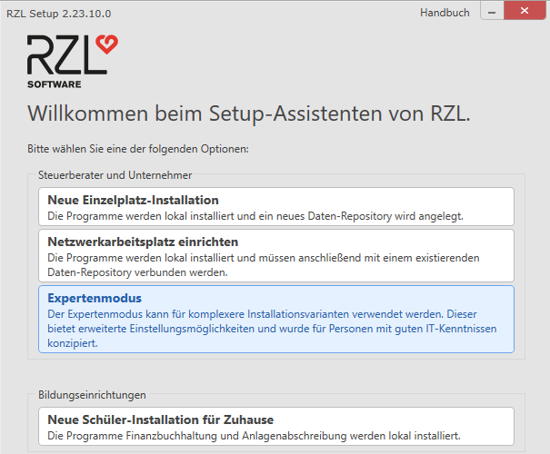

# Installation

## Wichtige allgemeine Informationen

Die RZL Programme sind nur für den Betrieb in typischen Microsoft
Windows Umgebungen ausgelegt.

Dieses Dokument beschreibt die Installation der RZL Programme in diesen
Umgebungen.

!!! warning "Hinweis"
    Bitte beachten Sie vor der Installation die Systemvoraussetzungen.
    Nähere Details finden Sie in den **RZL *Technischen Blättern***, online
    aufrufbar unter: [*https://rzlsoftware.at/Lizenzbestimmungen*](https://rzlsoftware.at/Lizenzbestimmungen)

Die RZL Programme werden immer Lokal auf den Arbeitsplätzen installiert.
Die Daten (RZL Daten-Repository und RZL-Datenbank) können ebenfalls
lokal eingerichtet werden (Einzelplatzinstallation), sind aber dann auch
nur für diesen Arbeitsplatz zugreifbar. Ist ein Zugriff durch mehrere
Arbeitsplätze gewünscht (Netzwerkinstallation), ist es notwendig die
Daten zentral auf einem Server einzurichten.

Das RZL *Daten-Repository* ist ein Verzeichnis welches von jedem
RZL-Programm benötigt wird und enthält unter anderem *Klienten Daten*,
*Einstellungen*, *Protokolle*, *Setup* etc.

Die RZL Datenbank ist ein Microsoft SQL-Server der nur von bestimmten
RZL-Programmen benötigt wird.

Technische Hilfestellungen finden Sie online auf der RZL Webseite, unter
[*rzlsoftware.at/kb*](https://rzlsoftware.at/kb).

Auf der RZL Webseite [*rzlsoftware.at*](https://rzlsoftware.at) finden
Sie im Bereich *Technik Knowledge Base/Downloads* gleichzeitig auch
immer die neuesten **Programmaktualisierungen (Updates)** zum Download.

Die jeweils aktuelle **Vollversion** der RZL Programme (für
Neu-Installationen, ...) kann im **Anwenderbereich** der RZL Webseite
(Registrierung und Login erforderlich) ebenfalls im Bereich *Technik
Knowledge Base/Downloads* *„RZL Komplettversion“* heruntergeladen
werden.

Die Zugangsdaten für den Anwenderbereich der RZL Webseite finden Sie im
Regelfall in den Ihnen im Zuge der Programmauslieferung übermittelten
Unterlagen. Falls Ihnen diese Zugangsdaten nicht mehr bekannt sind,
fordern Sie diese bitte – unter Angabe Ihrer RZL Anwender-Nummer – per
Mail unter *<software@rzl.at>* an.

## Neue Einzelplatz-Installation 

Bei einer *Neuen Einzelplatz-Installation* werden sämtliche Komponenten
lokal installiert und die Verwendung der RZL-Programme ist
ausschließlich auf dem aktuellen Gerät möglich. Ist es notwendig von
unterschiedlichen Geräten im Netzwerk auf den gleichen Datenbestand
zuzugreifen, wählen Sie bitte eine andere Installationsvariante ([siehe
Kapitel 1.4](#expertenmodus-z.b.-für-netzwerkinstallation))

1.  Zum Starten der Installation führen Sie die Datei *RZL Setup.exe* aus.

2.  Bestätigen Sie die Lizenzbestimmungen und klicken Sie auf Weiter.
    

3.  Klicken Sie auf Neue Einzelplatz-Installation.
    

4.  Wählen Sie Ihre lizenzierten RZL Programme und die gewünschten
    zusätzlichen Komponenten aus und bestätigen mit *Aktion durchführen* bzw. *Weiter*.
    

    Bei den Programmen Kanzlei-Informations-System, RZL Board und
    Firmen-Board mit Basis Modul ist der Einsatz einer Datenbank (Microsoft
    SQL-Server) erforderlich. Haben sie eines dieser Programme ausgewählt
    wird im Zuge einer Einzelplatzinstallation auch automatisch diese
    Datenbank installiert. Die für diese Installation notwendigen Eingaben
    müssen dann in der nachfolgenden zusätzlichen Einstellungsseite (4a)
    ergänzt werden. Bitte beachten sie hierzu Kapitel 12 und 13.
   
    1.  Geben Sie in der zusätzlichen Einstellungsseite Ihre Anwendernummer ein
        Soll der RZL Dienst ebenfalls lokal installiert werden, können Sie
        diesen hier anhaken (wird aktuell für die Module RZL HON Next, RZL
        FIBU Next, RZL KIS-Schnittstelle für Scanner-Anbindung, RZL
        Dokumentenverwaltung Plus und Digitaler Personalakt benötigt)
        
        
        Klicken Sie auf Aktionen durchführen
      
5.  Nach erfolgreicher Installation können Sie das Installationsfenster 
    mit *Fertigstellen* schließen

6.  Im Anschluss können Sie die RZL-Programme starten. Beim ersten Start
    werden Sie aufgefordert die Lizenzierung dieser Installation
    durchzuführen (siehe Kapitel 2)

## Netzwerkarbeitsplatz einrichten

!!! warning "Hinweis"
    Bei der Einrichtung der Netzwerkarbeitsplätze können Sie im
    Expertenmodus einzelne Programme abwählen die auf dem jeweiligen Gerät
    nicht benötigt werden.  

Ein Netzwerkarbeitsplatz kann nur eingerichtet werden, wenn im Netzwerk
bereits ein Datenrepository verfügbar ist. Ist dies noch nicht der Fall,
wechseln Sie bitte in den Expertenmodus und richten Sie initial ein
Datenrepository bzw. eine Serverinstallation ein ([siehe Kapitel
1.4](#expertenmodus-z.b.-für-netzwerkinstallation))

Zum Starten der Installation führen Sie die Datei *RZL Setup.exe* aus
dem Daten-Repository aus.

1.  Klicken Sie auf Netzwerkarbeitsplatz einrichten.
    

2.  Wählen Sie im nächsten Fenster ihr vorhandenes Daten-Repository aus
    

3.  Sobald Sie ein gültiges Daten-Repository ausgewählt haben, ändert
    sich der Status auf *Gültig* () und Sie können die
    Installation mit *Aktion durchführen* beginnen.

## Expertenmodus (z.B. für Netzwerkinstallation)

Der *Expertenmodus* kann für komplexere Installationsvarianten verwendet
werden. Dieser bietet erweiterte Einstellungsmöglichkeiten und wurde für
den Systembetreuer oder Personen mit guten IT-Kenntnissen konzipiert.

!!! warning "Hinweis"
    Im Expertenmodus kann auch der Pfad des lokalen Programmverzeichnisses
    und das Verzeichnis des Daten-Repository geändert werden.

Zum Starten des Expertenmodus führen Sie die Datei *RZL Setup.exe* aus
und wählen Sie die Option Expertenmodus.

1.  Im nächsten Fenster können Sie folgende Einstellungen anpassen.
    
        
    Unter *Lokales Programmverzeichnis* können Sie über das
    *Ordner-Symbol* ein Installationsverzeichnis auswählen in das die
    RZL-Programme installiert werden sollen. Verwenden Sie hier bitte
    immer ein lokales Laufwerk, da die Ausführung von Programmen über ein
    Netzwerk Probleme verursachen kann
    

2.  Unter Daten-Repository können Sie durch die Anwahl von „Auswählen“
    ein bereits bestehendes Datenrepository auswählen.

3.  Durch anschließendes klicken auf das *Ordner-Symbol* müssen Sie hier
    ein vorhandenes Daten-Repository auswählen. 
    

4.  Sobald sich der Status auf *Gültig* () ändert, können Sie mit
    *Weiter* die Installation fortsetzen.

5.  Unter Daten-Repository können Sie durch die Anwahl von „Neu anlegen“
    ein neues Datenrepository anlegen. Wählen Sie hier ein lokales
    Verzeichnis, wenn nur der aktuelle Arbeitsplatz auf das
    Datenrepository zugreift. Ist der Zugriff von mehreren
    Arbeitsplätzen gewünscht, wählen Sie eine Netzwerkfreigabe bzw.
    Netzlaufwerk aus.
    

    Durch die Auswahl von Kombi-Arbeitsplatz haben Sie die Möglichkeit ein
    lokales Offline-Datenrepository anzugeben. Diese Einstellung ist
    natürlich nur sinnvoll, wenn es sich beim regulären Datenrepository um
    ein Netzwerk-Verzeichnis handelt.

6.  

7.  Ein Kombi-Arbeitsplatz ermöglicht Ihnen bestimmte Daten in das
    Offline-Datenrepository zu verschieben. Der Zugriff auf diese Daten
    ist dann auch noch möglich, wenn das Gerät nicht mehr mit dem
    Netzwerk verbunden ist. Genaue Details zum Verschieben von
    Programmklienten entnehmen Sie bitte dem ZMV Handbuch.

8.  Mit einem Klick auf Weiter gelangen Sie zum nächsten Fenster mit Einstellungen

9.  Im nächsten Fenster können Sie auswählen welche Programme bzw. Komponenten im Detail installiert werden sollen

!!! warning "Hinweis"
    Die vorausgewählten RZL Programme werden vom vorhandenen
    Daten-Repository ausgelesen. Wenn vorausgewählte Programme auf dem
    jeweiligen Gerät nicht benötigt werden, oder zusätzliche Programme
    installiert werden sollen, entfernen oder setzen Sie das Häkchen beim
    jeweiligen RZL Programm.

    Bei den Programmen Kanzlei-Informations-System, RZL Board und
    Firmen-Board mit Basis Modul ist der Einsatz einer Datenbank (Microsoft
    SQL-Server) erforderlich. Haben Sie eines dieser Programme ausgewählt,
    gelangen Sie beim Klick auf Weiter zu einer zusätzlichen
    Einstellungsseite (1a), in der Sie Einstellungen zur Datenbank vornehmen
    können. Bitte beachten Sie hierzu Kapitel 12 und 13

Abhängig von den eingesetzten Programmfunktionen kann es erforderlich
sein, dass der RZL-Dienst installiert werden muss. Dieser kann im
Bereich „zusätzliche Komponenten“ ausgewählt werden. Bitte beachten Sie
hierzu das Kapitel 14

Klicken Sie auf *Weiter bzw. „Aktionen durchführen“* um mit dem
Installationsvorgang fortzufahren

1a Abhängig von den ausgewählten Programmen wird Ihnen ein zusätzliches
Einstellungsfenster für die Konfiguration der Datenbank angezeigt.

Geben Sie hier Ihre Anwendernummer und die zu verwendende
Datenbank-Instanz an

Wurde noch keine entsprechende Datenbank-Instanz eingerichtet, können
Sie durch einen Klick auf „Neue lokale SQL Server Instanz installieren“
unser SQL-Server Setup starten

Es handelt sich dabei um ein eigenständiges Setup, welches automatisch
eine für RZL passende neue Microsoft SQL-Server Express Instanz auf dem
aktuellen Gerät einrichtet.

Die Installation eines Microsoft SQL-Server auf dem aktuellen Gerät
empfiehlt sich aber in der Regel nur wenn es sich um eine
Einzelplatzinstallation handelt. Muss die Datenbank-Instanz auch von
anderen Geräten erreicht werden können, sollte die Datenbank auf einem
entsprechenden Server installiert werden. Verwenden Sie hierzu unser
SQL-Server Setup direkt ohne dem RZL Programm Setup.

Wir empfehlen, die RZL Instanz auch dann zu installieren, wenn in Ihrer
Kanzlei bereits ein Microsoft SQL-Server Express existiert.

Entweder Sie starten das SQL-Server Setup direkt über das RZL Programm
Setup (z.B. im Zuge einer Einzelplatzinstallation) oder Sie laden von
der RZL Webseite ([*rzlsoftware.at*](https://rzlsoftware.at/) im
*Anwenderbereich*) unter *Technik Knowledge Base/Downloads* unter *RZL
SQL Server Setup* das aktuelle Setup (*RZL SQL Server Setup.exe*)
herunter. Bitte beachten Sie: Zum Einstieg in den Anwenderbereich der
RZL Webseite müssen Sie sich mit Ihren Zugangsdaten (Benutzername und
Kennwort für Anwenderbereich) anmelden. Beachten Sie dazu das Ihnen von
RZL übermittelte Schreiben mit Ihren Erst-Benutzer-Zugangsdaten.

Führen Sie die Datei *RZL SQL Server Setup.exe* am Datenbankserver aus.

!!! warning "Hinweis"
    Unter Umständen kann ein Neustart des Systems nötig sein, um den SQL
    Server zu installieren.

Zum Starten der Installation Klicken Sie bitte auf *Installieren*.

Nach erfolgreicher Installation können Sie das Installationsfenster
schließen.

## Neue Schüler-Installation für Zuhause

Der Installationsmodus *Neue Schüler-Installation für Zuhause*
installiert die RZL Programme *Finanzbuchhaltung* und
*Anlagenabschreibung* lokal auf dem Arbeitsplatz.

Zum Starten der Installation für Sie die *RZL Setup.exe* aus.

1.  Klicken Sie bitte auf Neue Schüler-Installation für Zuhause.
    

2.  Anschließend wird die Installation der RZL Programme
    Finanzbuchhaltung und Anlagenabschreibung durchgeführt.
    

Nach Abschluss der Installation beenden Sie die Installation mit
*Fertigstellen*.