# Programmaktualisierung

Die regelmäßige Aktualisierung der RZL Programme ist für den
ordnungsgemäßen Betrieb zwingend notwendig und vom Lizenznehmer
verpflichtend durchzuführen.

## Voraussetzungen

Um eine Programmaktualisierung durchführen zu können, müssen folgende
Voraussetzungen erfüllt sein:

- Eine Internetverbindung muss vorhanden sein.

- Falls der *RZL Update-Service* nicht installiert ist, sind *lokale
  Administratorrechte* notwendig (der RZL Update-Service wird
  standardmäßig automatisch installiert).

- Falls *Kanzlei-Informations-System / Board* oder *Firmen-Board mit
  Basis Modul Belege* installiert ist, sind erweiterte Benutzerrechte
  auf die SQL-Datenbank notwendig ([siehe Kapitel
  12.8](#zusätzliche-konfigurationen-optional).).

- Wird der RZL-Dienst eingesetzt, kann nicht mehr auf jedem beliebigen
  Arbeitsplatz eine Aktualisierung gestartet werden, sondern nur noch
  auf dem Gerät auf dem der RZL-Dienst installiert ist ([siehe Kapitel
  14](#rzl-dienst-installieren))

## Aktualisierung starten

Zum Starten einer Programmaktualisierung stehen Ihnen drei Möglichkeiten
zur Verfügung.

### 1. Aktualisierungshinweis

Wenn Sie ein RZL Programm starten und es ist eine Aktualisierung für Sie
verfügbar, werden Sie über eine gelbe Leiste darauf hingewiesen.

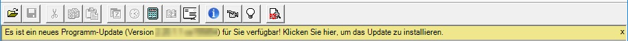

Maustaste auf die gelbe Leiste.

Falls Sie die Aktualisierung später durchführen möchten, können Sie die
gelbe Leiste auch mit dem *x* auf der rechten Seite schließen und sich
an einem späteren Zeitpunkt erinnern lassen.

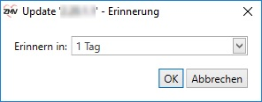

### 2. Manuell nach einer Aktualisierung suchen

Klicken Sie dazu im RZL Programm in der Menüleiste auf *Hilfsmittel* auf
*Programmaktualisierung…*

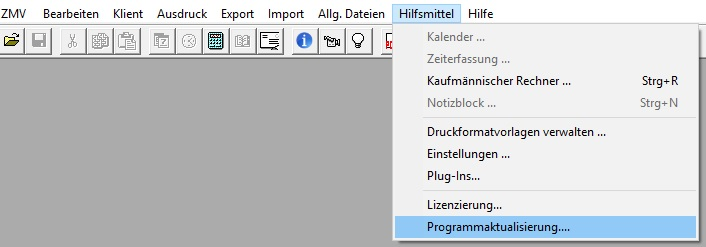

### 3. RZL-Admin

Im RZL-Admin unter *Informationen zur Installation und Update der
Programme* unter *Update der Programme* auf *Update durchführen* klicken

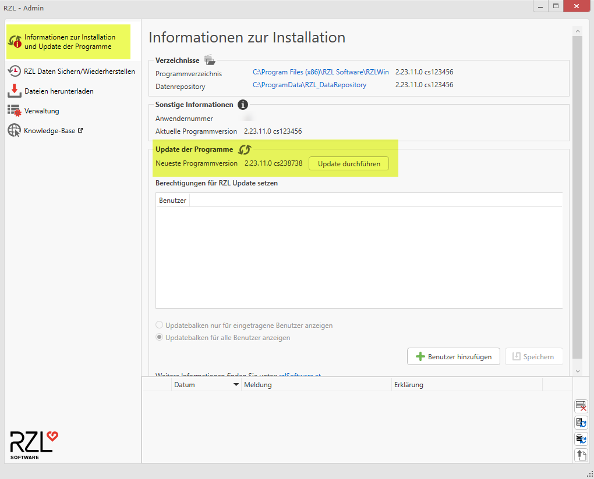

## Aktualisierung durchführen

Wenn Sie die Aktualisierung gestartet haben, wird diese automatisch
heruntergeladen. Es erscheint ein neues Fenster, welches über den
Download-Fortschritt informiert.

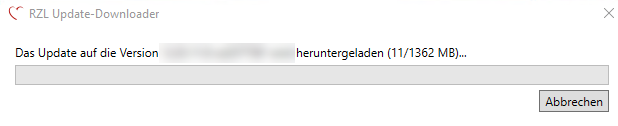

Sobald der Download abgeschlossen ist, wird das RZL Setup in der neuen
Version zum Durchführen der Aktualisierung geöffnet. **Schließen Sie
jetzt bitte sämtliche Programme** (nicht nur die RZL Programme), damit
der Aktualisierungsvorgang problemlos durchgeführt werden kann.

Bestätigen Sie die Lizenzbestimmungen und klicken Sie auf *Weiter*.

Klicken Sie hier auf *Aktualisieren* um die Aktualisierung zu starten.

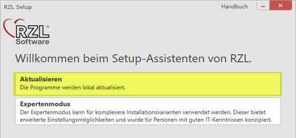

Sie können das RZL Setup mit einem Klick auf *Fertigstellen* beenden.
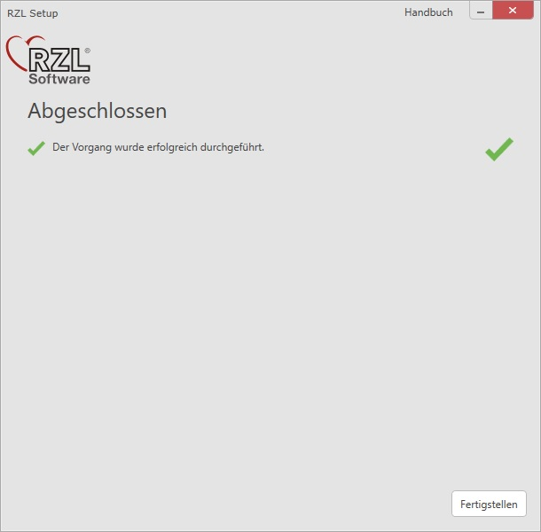

**Aktualisierung der weiteren Arbeitsplätze (bei Netzwerkinstallation)**

Bei einer Netzwerk-Installation müssen alle Arbeitsplätze die gleiche
RZL Programmversion aufweisen. Die RZL-Programme der noch nicht
aktualisierten Arbeitsplätze stellen selbständig beim nächsten Start
fest, dass sie veraltet sind und führen automatisch über den RZL Update
Dienst eine Aktualisierung durch. Ist der Update Dienst nicht
installiert muss die Aktualisierung als lokaler Administrator manuell
durchgeführt werden.

## Bestimmte Benutzer für das RZL Update berechtigen

Im Standardfall sind alle Benutzer berechtigt ein Update durchzuführen.
**Achtung:** Bei Einsatz von KIS/Board bzw. Firmen-Board sind zusätzlich
auch spezielle Reche auf der Datenbank notwendig.

Um nun nur bestimmte Benutzer für das Update zu berechtigen gehen Sie
wie folgt vor:

1.  Starten Sie über das Windows-Startmenü den *RZL Admin*.
    
    

2.  Klicken Sie in der Navigationsleiste auf die Schaltfläche *Informationen zur Installation und Update der Programme*.
    
    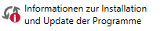

3.  Scrollen Sie nun in der Ansicht bis zur Überschrift *Update der Programme*.
    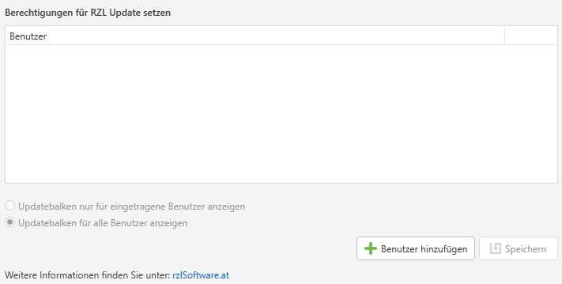

4.  Über die Schaltfläche *Benutzer hinzufügen* können Sie nun für einen
    bestimmten Benutzer die Updateberechtigung setzen.

5.  Nach dem Klicken der Schaltfläche *Benutzer hinzufügen*.
    
    

    öffnet sich folgendes Fenster:
    
    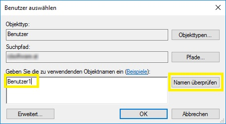

    Geben Sie nun den Benutzernamen ein und Klicken Sie auf die Schaltfläche
    *Namen überprüfen*, falls der Name erfolgreich überprüft wurde können
    Sie über die Schaltfläche *OK* den Benutzer hinzufügen.

    Um weitere Benutzer für das Update zu berechtigen wiederholen Sie
    Schritt 5.

6.  Um die Änderungen zu speichern und somit die hinzugefügten Benutzer
    für das Update zu berechtigen, klicken Sie auf die Schaltfläche
    *Speichern*.

## Updatebalken für nicht update-berechtigte Benutzer ausblenden

Um den Updatebalken für nicht update-berechtigte Benutzer

auszublenden müssen folgende Schritte durchgeführt werden:

1.  Starten Sie über das Windows-Startmenü den *RZL Admin*

    

2.  Klicken Sie in der Navigationsleiste auf die Schaltfläche
    *Informationen zur Installation und Update der Programme*

    

3.  Scrollen Sie nun in der Ansicht bis zur Überschrift *Update der Programme.*
    Hier finden Sie nun 2 Optionen:

    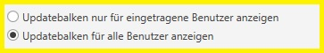

    1.  Option Updatebalken nur für eingetragene Benutzer anzeigen
   
        Mit dieser Option wird der Updatebalken nur mehr den Benutzer angezeigt,
        welche in der Liste für die updateberechtigten Benutzer eingetragen
        sind.

    2.  Option Updatebalken für alle Benutzer anzeigen
    
        Mit dieser Option wird der Updatebalken wieder für alle Benutzer
        angezeigt. Gleiches gilt hier auch, falls kein Benutzer explizit für das
        Update berechtigt wurde und somit im Standardfall alle berechtigt sind.

    Erst nach dem Speichern wird die jeweilige Option aktiv.