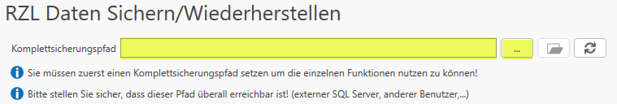
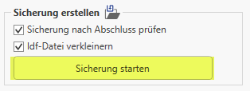
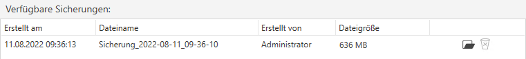
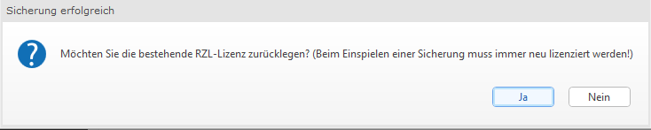
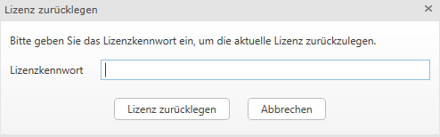

# RZL Daten sichern

Bevor die Sicherung gestartet werden kann, müssen alle Programme beendet
werden. Der RZL Service (wenn im Einsatz) wird vom RZL–Admin in einen
Diagnosemodus versetzt. Bei der Komplettsicherung wird auch die
Datenbank mitgesichert.

Während der Sicherung können keine anderen RZL Programme gestartet
werden.

Für eine Komplettsicherung führen Sie folgende Schritte durch:

1.  Öffnen Sie über das Windows Startmenü das Programm *RZL Admin*.

    

2.  Klicken Sie auf den Menüpunkt *RZL Daten Sichern/Wiederherstellen*.
    

3.  Wählen Sie den Pfad für die Komplettsicherung
    

    Stellen Sie sicher, dass dieser Pfad überall erreichbar ist.

4.  Klicken Sie auf Sicherung starten

    

Sobald die Sicherung erstellt wurde scheint diese unter *Verfügbare Sicherungen* auf

Nach Abschluss der Sicherung werden Sie aufgefordert die Lizenz
zurückzulegen. Bestätigen Sie dies mit Ja.

Sie können die Dateien (.rzlbak und .rzlbak_hash) in Ihrem
Komplettsicherungspfad nun abspeichern um Sie auf dem neuen
Rechner/Server wiederherzustellen.

**Mitgesichert werden:**

Standard:

- DataRepository
- DB Sicherung (falls Datenbank Installation)

Sonderfälle:

- Abweichende Datenverzeichnisse aller PCs (sofern diese auf einem
  Netzwerkpfad liegen und erreichbar sind)
- Abweichende RZL Dokumente Ordner
- Aus dem DokV+ gelöschte Dokumente

Danach wird es gezippt (Netzwerk kann unter Umständen sehr lange dauern)
Hash Wert der Datei wird berechnet.

!!! warning "Hinweis"
    Bitte achten Sie darauf, dass Lokale Datenordner die abweichend sind
    **nicht** mitgesichert werden. Im Grunde werden fast alle Dateien aus
    dem Data-Repository kopiert und gezippt. Falls es sich um eine
    Installation mit einer Datenbank handelt, werden die
    letzten/aktuellsten **DREI** **Datenbank-Backups** in die Sicherung
    übernommen.

!!! warning "Hinweis"
    Wenn kein Zugriff mehr auf die RZL Programme besteht finden Sie die
    Standardpfade einer Einzelplatz Installation unter: 
    RZL Setup (alt): C:\ProgramData\RZLWIN 
    RZL Setup: C:\ProgramData\RZL_DataRepository

!!! warning "Hinweis"
    Sollen nur bestimmte Datendateien (Wirtschaftsjahre eines Klienten)
    verschoben werden, verwenden Sie zwingend die entsprechenden Menüpunkte
    in den RZL Programmen. 
    Da die ZMV zusätzlich zu den Klientenstammdaten die RZL Datendateien
    verwaltet, würde eine Aktion mit dem Explorer an der ZMV vorbei gehen
    und so zu inkonsistenten Zuständen innerhalb der RZL Programme führen.