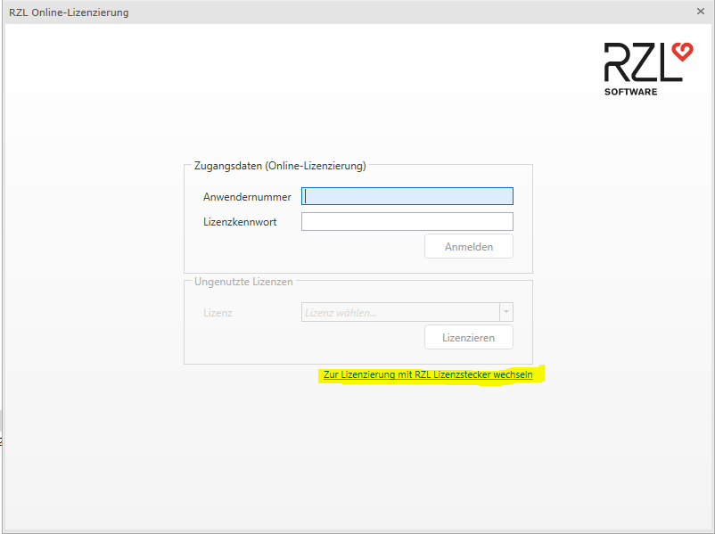

# RZL Lizenzierung

Beim ersten Start eines beliebigen RZL-Programms werden Sie aufgefordert
die Installation zu lizenzieren. Geben Sie hierzu in der folgenden
Eingabemaske Ihre Anwendernummer und Ihr Lizenzkennwort ein.

[*Kurzanleitung Online Lizenzierung*](https://rzlsoftware.at/fileadmin/user_upload/rzl/Kurzanleitungen/TECHNIK/TECH_Online-Lizenzierung.pdf)

!!! warning "Hinweis"
    Sollte Ihnen aus speziellen Gründen von uns noch ein Lizenz-Stecker
    (USB-Gerät) zur Verfügung gestellt worden sein, installieren Sie bitte
    unter zu Hilfenahme unserer Installationsanleitung
    (*[Anleitung Lizenzstecker](https://rzlsoftware.at/fileadmin/user_upload/rzl/Kurzanleitungen/TECHNIK/TECHNIK_RZL_Lizenzstecker.pdf)*)
    den entsprechenden Treiber und wechseln dann bitte in den
    Lizenzierungsmodus für den RZL-Lizenzstecker

