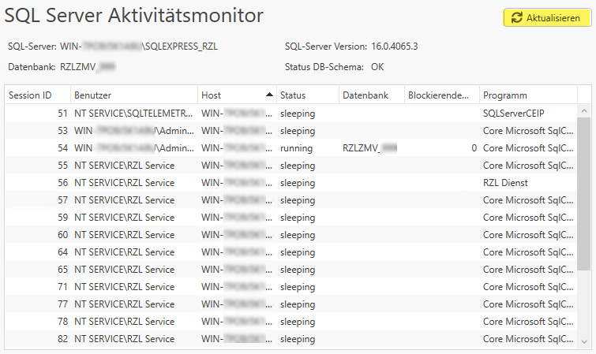
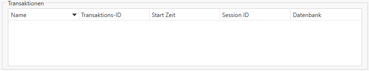

# Aktivitätsmonitor

Im "SQL Server Aktivitätsmonitor" erhalten Sie einen Überblick über alle Prozesse, die mit den RZL-Programmen und zugehörigen SQL-Server in Verbindung stehen.

**Aktualisieren:**  
Mit "Aktualisieren" wird die Liste der Prozesse neu aufgebaut. 

**SQL-Server:**  
Unter "SQL-Server:" wird der Server oder Rechner ausgegeben, auf dem SQL-Server installiert ist.  
Zudem wird die Bezeichnung der SQL-Datenbank angezeigt. 

**Datenbank:**  
Unter "Datenbank" wird die von RZL verwendete SQL-Datenbank ausgegeben.  

**SQL-Server Version:**  
Unter "SQL-Server Version" wird die für RZL verwendete und installierte Version ausgegeben.  
Mehr zu den RZL-Versionen finden Sie hier:  

[Neueste Updates und Versionsverlauf für SQL-Server](https://learn.microsoft.com/de-de/troubleshoot/sql/releases/download-and-install-latest-updates)

**Status DB-Schema:**  
Unter "Status DB-Schema" können Sie ablesen, ob die Datenbank der neuesten Programmversion entspricht.
Status "OK" bedeutet, dass Programmversion und Datenbank übereinstimmen.
!!!warning "Achtung"
    Ein rotes X bedeutet, dass die Programmversion und die Datenbank nicht übereinstimmen. Kontakieren Sie Ihren RZL-Support.

**SessionID:** "SessionID" zeigt die von der RZL SQL-Datenbank ausgegebene Nummerierung der verwendeten Prozesse.  
**Benutzer:** Der "Benutzer" zeigt das für diesen Prozess verwendete Benutzerprofil.  
**Host:** "Host" gibt an auf welchem Server bzw. Client der Prozess läuft.  
**Status:** Der "Status" eines Prozess wird als "sleeping" (Prozess ist im Ruhezustand) oder "running" (Prozess ist aktiv) ausgegeben.  
**Datenbank:** "Datenbank" gibt die Zugehörigkeit eines Prozess an.  

!!!warning "Achtung"  
    Sprechen Sie im Vorfeld mit einem RZL-Mitarbeiter, bevor Sie einen blockierenden Prozess wie im folgenden Punkt beschrieben beenden.
    
**Blockierende Session ID:**
Unter diesem Reiter können offene Transaktionen und aktive nicht abgeschlossene SQL-Skripte angezeigt werden. Bei lang anhaltenden Prozessen kann ein Eingriff notwendig sein.   

**Programm:** "Programm" zeigt an unter welcher Software ein Prozess ausgeführt wird.  

Im Bereich **Transaktionen** kann ein Prozess in seinen Bestandteilen dargestellt werden. Sie erhalten in Echtzeit Einblick in die "Transaktionen", die von Ihrer Datenbank verarbeitet werden. 

