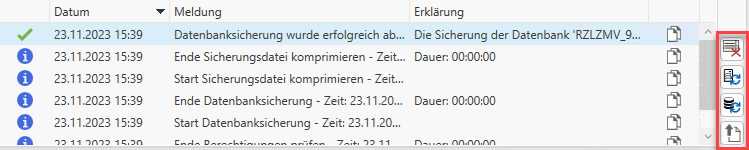

# Allgemein

Der RZL Admin wurde zur Verwaltung von Informationen und Prozessen der
RZL-Programme entwickelt. In den folgenden Kapiteln werden die einzelnen
Menüpunkte und Funktionen näher erläutert.

Im unteren Bereich des RZL Admin befindet sich die Ereignisanzeige, in
der temporär Fehlermeldungen und Systeminformationen dargestellt werden.

Auf der rechten Seite stehen Ihnen folgende Funktionen zur Verfügung:

- Löschen der Logeinträge
- Erneutes Herstellen der Verbindung zum Datenbankserver
- Erneutes Herstellen der Verbindung zur Datenbankinstanz
- Hochladen des Protokolls an den RZL-Webservice