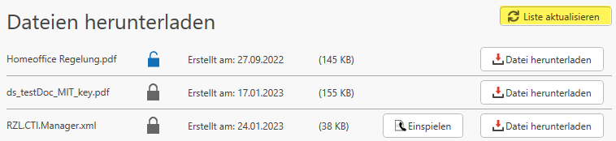

# Dateien herunterladen

Unter der Rubrik *Dateien herunterladen* können diverse Dateien, Hotfixes und maßgeschneiderte Skripte zur Verfügung gestellt werden.

!!!warning "Warnung"
    Bitte agieren Sie nur auf Anweisung des RZL Support in dieser Rubrik. Das Ausführen von Skripten kann zu einem unerwünschtem Verhalten der RZL-Programme führen.

  **Liste aktualisieren:**  
  Mit "Liste aktualisieren" können noch nicht sichtbare, aber für Sie freigegebene Skripts abgerufen werden.

  **Datei herunterladen:**  
  Über "Datei herunterladen" werden die Dateien für z.B. Skripte von den Servern von RZL heruntergeladen und auf Ihrer Hardware zur Verfügung gestellt.  
  Jedoch werden hier noch keine Änderungen im Programm vorgenommen.

!!! warning "**Einspielen**" 
    Das "Einspielen" von Dateien, Skripts oder Hotfixes ermöglicht es, gezielte Änderungen an einem Programm vorzunehmen. Dabei können nicht nur die Programmfunktionen angepasst, sondern auch Ordner, Dateien und Registry-Einträge erstellt oder verändert werden. Diese Änderungen können weitreichende Konsequenzen haben. Neue Funktionen und Hotfixes verbessern die Software, doch unvorhergesehene Probleme mit Dateiänderungen können die Systemstabilität gefährden, Abstürze verursachen oder Inkompatibilitäten hervorrufen.

    Ebenso besteht das Risiko, dass bestehende Daten überschrieben werden oder Konflikte durch geänderte Dateien und Registry-Einträge entstehen. Besonders kritisch sind Sicherheitsrisiken, da unsichere oder nicht vertrauenswürdige Skripte Schadcode enthalten könnten.

    Um diese Risiken zu minimieren, sollten Sie vorsichtig vorgehen. Vor dem Einspielen empfiehlt sich ein vollständiges Backup des Betriebsystems und der Registry, um im Notfall eine Wiederherstellung durchführen zu können. Skripte und Hotfixes sollten ausschließlich von vertrauenswürdigen Quellen bezogen werden. Idealerweise werden Änderungen zunächst in einer Testumgebung geprüft, um unerwünschte Effekte auszuschließen. Eine sorgfältige Durchsicht der Dokumentation und Changelogs hilft die Auswirkungen der Änderungen zu verstehen. Da das Einspielen oft administrative Rechte erfordert, die weitreichende Systemänderungen ermöglichen, ist besondere Sorgfalt geboten
    
  Mit diesen Vorsichtsmaßnahmen können Sie die Risiken des Einspielens deutlich reduzieren und die Vorteile sicher nutzen.