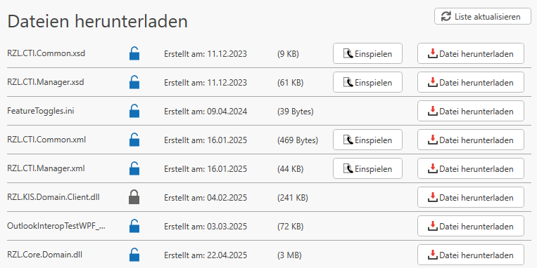

# Dateien herunterladen

Unter der Rubrik *Dateien herunterladen* können diverse Dateien, Hotfixes und maßgeschneiderte Skripte zur Verfügung gestellt werden.

!!!warning 
    Bitte agieren Sie nur auf Anweisung des RZL Support in dieser Rubrik. Das Ausführen von Skripen kann zu einem unerwünschtem Verhalten der RZL-Programme führen.

- **Liste aktualisieren:**  
  Mit "Liste aktualisieren" können noch nicht sichtbare, aber für Sie freigegebene Skripte abgerufen werden.

- **Datei herunterladen:**  
  Über "Datei herunterladen" werden die Dateien für z.B. Skripte von den Servern von RZL heruntergeladen und auf Ihrer Hardware zur Verfügung gestellt.  
  Jedoch werden hier noch keine Änderungen im Programm vorgenommen.

- **Einspielen:**  
  Über "Einspielen" kann ein Skript bzw. Hotfix ausgeführt werden. Es werden Änderungen im Programm vorgenommen.