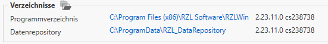
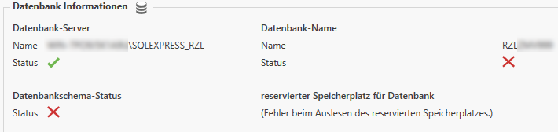
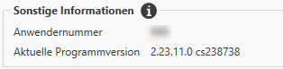
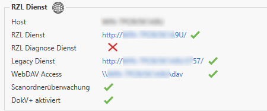
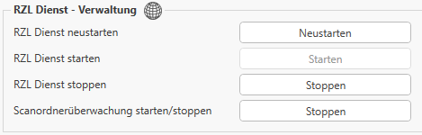
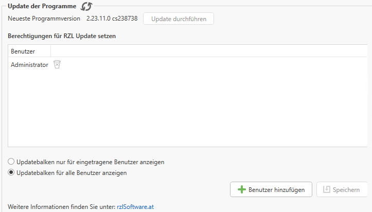
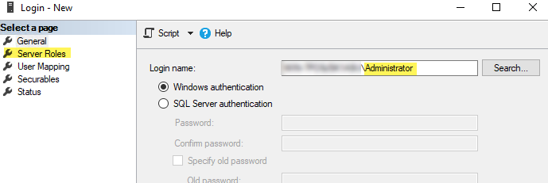
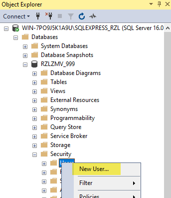
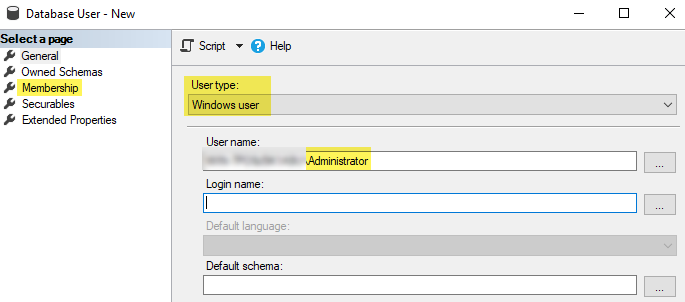
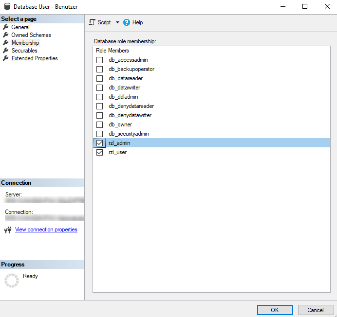

# Informationen zur Installation und dem Update der Programme

In diesem Bereich finden Sie die wichtigsten Informationen zu den RZL-Programmen
und den dazugehörigen Verbindungen.

## Verzeichnisse

Hier sehen Sie die aktuell hinterlegten Verzeichnisse: das Programmverzeichnis
und das Datenrepository. Das Programmverzeichnis enthält die für den Betrieb
der Programme erforderlichen Dateien und Ressourcen. Das Datenrepository dient als
zentraler Speicherort zur Organisation, Speicherung und Verwaltung von Daten.

## Datenbankinformationen

Unter *Datenbankinformationen* finden Sie den Namen des Datenbankservers und
der zugehörigen Instanz. Ein **grüner Haken** signalisiert eine erfolgreiche
Verbindung, während ein **rotes Kreuz** auf eine Verbindungsstörung hinweist.

## Sonstige Informationen

Im Bereich *Sonstige Informationen* finden Sie Ihre **Anwendernummer**
sowie die aktuell verwendete **Programmversion**.

## RZL Dienst

Im Bereich *RZL-Dienst* werden alle mit den RZL-Programmen verbundenen Dienste
angezeigt. Jedem Dienst ist ein aufrufbarer Link zugeordnet. Zusätzlich werden
auch die **Scanordnerüberwachung** sowie **DokV+** (Dokumentenverwaltung)
dargestellt. Ein **grüner Haken** zeigt an, dass der Dienst verfügbar ist.
Bei Problemen wird ein **rotes Kreuz** angezeigt.

## RZL Dienst - Verwaltung

Die Verwaltung des RZL-Dienstes bietet Ihnen folgende Funktionen:

## Update der Programme

Im Bereich *Update der Programme* wird die aktuelle Programmversion angezeigt.
Rechts davon befindet sich der Button zum Ausführen eines Updates. Bevor ein
Update durchgeführt wird, müssen alle Benutzer im Netzwerk die RZL-Programme
schließen.

Über die Schaltfläche *+ Benutzer hinzufügen* können Sie gezielt festlegen,
welche Benutzer Updates durchführen dürfen. Ist kein Benutzer hinterlegt, kann
jeder Benutzer im Netzwerk das Update starten.

Außerdem kann der gelbe Update-Balken wahlweise nur bei berechtigten Benutzern
eingeblendet werden.

### Zusätzliche Konfigurationen (SQL-Datenbank)

Dieser Abschnitt richtet sich an den EDV-Verantwortlichen oder Netzwerktechniker
Ihrer Kanzlei bzw. Ihres Unternehmens und erfordert entsprechende Fachkenntnisse.
Die nachfolgenden Schritte betreffen nur Umgebungen, in denen eine SQL-Datenbank
in Verbindung mit RZL-Programmen verwendet wird.

Für das erfolgreiche Durchführen eines Updates muss der definierte Benutzer
über **erweiterte Rechte** auf der SQL-Datenbank verfügen.

1.  Starten Sie das SQL-Server Management Studio auf dem Datenbankserver
    und verbinden Sie sich mit der SQLEXPRESS_RZL Instanz.

2.  Navigieren Sie nun zum Ordner
    Sicherheit -\> Anmeldungen (Security -\> Logins)
    und legen sie eine neue Anmeldung für den betroffenen
    Windows-Benutzer bzw. die betroffene Benutzergruppe an.

    

3.  Wechseln Sie auf die Seite Serverrollen (Server Roles) und
    selektieren Sie das Kästchen bei den Serverrollen `public` und
    `rzl_server_admin`.

4.  Schließen Sie den Dialog mit der Schaltfläche *OK*.

5.  Anschließend selektieren Sie die Datenbank
    RZLZMV\_\[Anwendernummer\] und navigieren zum Ordner
    Sicherheit \> Benutzer (Security -\> Users). Dort wählen Sie aus
    dem Kontextmenü die Option Neuer Benutzer... (New User...) aus.

    

6.  Wählen Sie unter Benutzertyp Windows-Benutzer, vergeben Sie einen
    Benutzernamen und tragen Sie den zuvor angelegten Anmeldenamen ein.

    

7.  Unter dem Punkt Mitgliedschaft (Membership) wählen Sie `rzl_admin`
    aus und bestätigen mit *OK*.

    