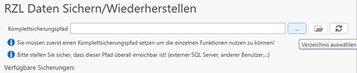
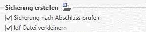
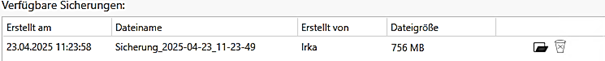
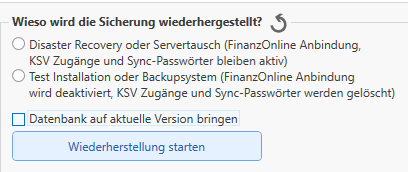

# RZL Daten Sichern/Wiederherstellen

Unter diesem Menüpunkt kann eine Komplettsicherung durchgeführt werden.
Dabei wird eine Sicherungsdatei erstellt, die bei einem Server /- Rechnertausch in
der neuen Systemumgebung wieder eingespielt werden kann. (Migration des Datenstandes)
Dabei werden sämtliche Klienten - Daten aus den Programmen und bei (optionaler) Installation
mit einer SQL-Datenbank, die letzten drei Datenbank - Backups in die Sicherung aufgenommen.

Zur Erstellung einer routinemäßigen Sicherung der Daten kann über die Komplettsicherung
jederzeit eine Sicherung erstellt und wieder hergestellt werden.

!!! warning "**Achtung**:"
    
    Während der Erstellung der Sicherung können die RZL Programme nicht verwendet werden.
    Bei einer Einspielung einer älteren Sicherungsdatei gehen die aktuellen Datenstände die 
    bis zum Zeitpunkt der Erstellung der Sicherungsdatei getätigt wurden,
    verloren – diese werden dann mit dem Einspielen der Sicherungsdatei „überschrieben“.

**Vorgang:**
Zunächst wird der Pfad angegeben an dem die Sicherungsdatei abgespeichert werden soll:
 (Dieser Pfad sollte auch vom neuen Benutzer / Gerät aus erreichbar sein und vorzugsweise auf dem Pfad C: \...liegen)

**Optional** kann ausgewählt werden ob die Sicherung nach Abschluss nochmals eines Prüflaufes unterzogen wird und ob die Transaktionslog Datei (Idf-Datei) verkleinert werden soll.
(Betrifft nur die RZL Installationen mit SQL - Instanz)

Abschließend klicken Sie zum Erstellen der Sicherungsdatei auf den Button ***Sicherung starten***:

**Zur Wiederherstellung** der Sicherungsdatei in der neuen Umgebung werden die bestehenden Sicherungen unter verfügbare Sicherungen angezeigt.

Mit dem Ordnersymbol kann die Sicherungsdatei im Explorer direkt geöffnet werden. Mit dem Papierkorb Symbol kann die Sicherungsdatei gelöscht werden.

Bei der Wiederherstellung können zusätzlich Optionen ausgewählt werden:

Die Option "Datenbank auf aktuelle Version bringen" ist nur sinnvoll zum Auswählen, wenn es bei der RZL INstallatin sich um eine mit einer SQL - Instanz handelt. In den meisten Fällen reicht die Auswahl der obersten Option (Disaster Revovery - Rechnertausch / Servertausch).

Abschließend klicken Sie auf den Button ***Wiederherstellung starten***.

