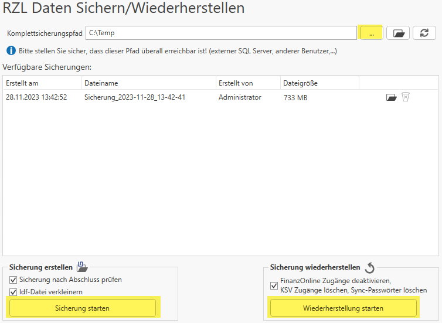

# RZL Daten Sichern/Wiederherstellen

Hier kann eine RZL-Komplettsicherung durchgeführt werden. Bevor eine
Komplettsicherung gestartet werden kann, müssen alle Programme beendet werden.
Während der Sicherung können keine anderen Programme gestartet werden. Handelt
es sich um eine RZL-Installation mit einer SQL-Datenbank, werden auch die
letzten drei Datenbank-Backups in die Sicherung übernommen.

Als Komplettsicherungspfad legen Sie fest, wo die Sicherung abgelegt wird.
Starten können Sie die Sicherung mit der Funktion *Sicherung starten*.
Alle Sicherungen unter dem angegebenen Pfad werden dann unter
*Verfügbare Sicherungen* angezeigt. Wählen Sie eine gespeicherte Sicherung
aus, haben Sie die Möglichkeit, eine Wiederherstellung zu starten.

