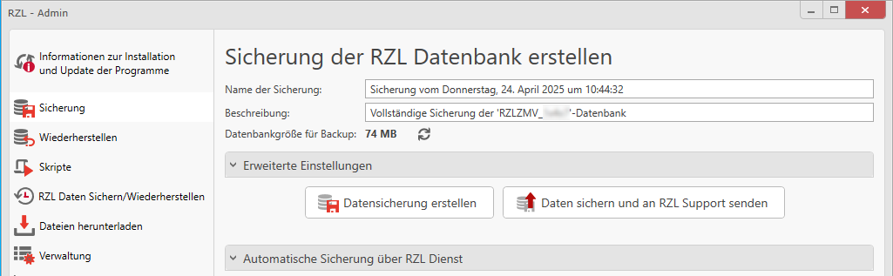
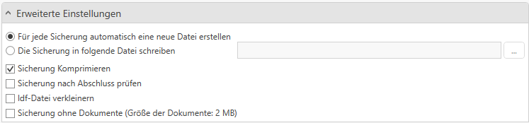

# Sicherung

## Manuelle Sicherung der RZL-Datenbank
In dieser Rubrik können Sie eine RZL-Datenbanksicherung erstellen und bei
Bedarf direkt an den RZL-Support senden.

Sie haben die Möglichkeit, den Namen und die Beschreibung der Sicherung individuell anzupassen.

 Darunter wird Ihnen außerdem angezeigt, wie groß das Backup **voraussichtlich** sein wird.

Mit einem Klick auf den Button **Datensicherung erstellen** wird automatisch eine Sicherung erstellt und im definierten Sicherungsordner abgelegt.  
*(Standardmäßig ist dies der Ordner `SQL_Backup` im Datenrepository.)*

Unter dem Punkt **Erweiterte Einstellungen** können Sie zudem folgende Optionen festlegen:

  * **Für jede Sicherung automatisch eine neue Datei erstellen**  
 Erstellt für jede Sicherung eine separate Datei, anstatt bestehende Backups zu überschreiben.
  * **Die Sicherung in folgende Datei schreiben**  
 Ermöglicht das manuelle Festlegen eines spezifischen Dateipfads und -namens für die Sicherung.
 * **Sicherung komprimieren**  
 Reduziert die Dateigröße des Backups durch Komprimierung.
 * **Sicherung nach Abschluss prüfen**  
  Führt eine automatische Überprüfung der Sicherung durch, um die Integrität der Daten sicherzustellen. 
 * **LDF-Datei verkleinern**  
 Verkleinert die Protokolldatei (LDF) einer Microsoft SQL Server-Datenbank, um Speicherplatz zu sparen. 
 * **Sicherung ohne Dokumente**  
 Eine Sicherung der Datenbank ohne Dokumente ist grundsätzlich möglich, wird aber nicht empfohlen. Wenn eine Sicherung an den RZL-Support gesendet werden soll, kann durch das Aktiveren der Option „Sicherung ohne Dokumente“ die Backupgröße minimiert werden.

## Automatische Sicherung der RZL-Datenbank über RZL-Dienst
Unter dem Punkt **Automatische Sicherung über RZL Dienst** können Sicherungen automatisiert erstellt werden.

Bitte beachten Sie, dass eine automatische Sicherung nur dann genutzt werden kann, wenn der RZL-Dienst installiert ist.

Der RZL-Dienst sollte ausschließlich für die im Setup-Handbuch in der RZL Online Hilfe [RZL Dienst installieren](https://hilfe.rzlsoftware.at/setup/dienst-installieren/) genannten Module eingerichtet werden.

In diesem Bereich stehen Ihnen folgende Optionen zur Verfügung:

  * **Sicherung komprimieren**  
 Reduziert die Dateigröße des Backups durch Komprimierung.
  * **Sicherung nach Abschluss prüfen**  
 Führt eine automatische Überprüfung der Sicherung durch, um die Integrität der Daten sicherzustellen.
  * **LDF-Datei verkleinern**  
 Verkleinert die Protokolldatei (LDF) einer Microsoft SQL Server-Datenbank, um Speicherplatz zu sparen.
  * **Sicherung ohne Dokumente**  
 Eine Sicherung der Datenbank ohne Dokumente ist grundsätzlich möglich, wird aber nicht empfohlen.Wenn eine Sicherung an den RZL-Support gesendet werden soll, kann durch das Aktiveren der Option „Sicherung ohne Dokumente“ die Backupgröße minimiert werden.

Zusätzlich können Sie:

  * **Einen Zeitplan für die automatische Sicherung festlegen**  
 Bestimmen Sie Wochentag und Uhrzeit, an denen die Sicherung automatisch durchgeführt werden soll.
  * **Die Behaltedauer der Sicherungen konfigurieren**  
 Legen Sie fest, wie lange alte Sicherungen aufbewahrt werden sollen.
* **Eine Mail-Benachrichtigung bei fehlgeschlagener Sicherung aktivieren**  
  Tragen Sie hierzu die gewünschten Empfängeradressen ein.
  Mit einem Klick auf das Zahnrad-Symbol können Sie Ihre SMTP-Einstellungen für den Mailversand konfigurieren.

    

Vergessen Sie nicht, die Einstellungen mit **Speichern** zu sichern und das automatische Backup mit dem Schieber neben **Automatisches Backup aktiviert** zu aktivieren.
