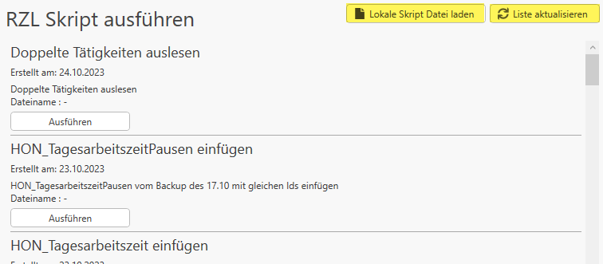

# Skripte

Im Bereich *Skripte* können Sie ein von RZL bereitgestelltes Skript
ausführen. Ebenso besteht die Möglichkeit, mit den Schaltflächen oben
rechts die Liste zu aktualisieren oder eine lokale Skript-Datei zu laden.

