# Verwaltung

**In diesem Bereich finden Sie die RZL Online-Lizenzierung und Möglichkeiten zur Grundeinstellung,
Upload - Möglichkeiten von Daten, Prüfungsmöglichkeiten und Optionen zur Konfiguration der 
verschiedenen Anwendungen und Installationen.**

Der Verwaltungsbereich ist in 10 weitere Einzel-Bereiche untergliedert die im Folgenden 
erläutert werden:
## Wartung
Unter *Wartung* können Sie die Fernwartung (via Teamviewer) für den RZL Kundensupport
freigeben. Weitere Schaltflächen bieten Ihnen die Möglichkeit, Protokolle
und Log-Dateien für die genaue Fehleruntersuchung hochzuladen.
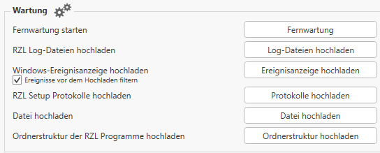

- **Fernwartung starten** 
  
  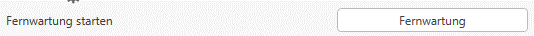

  Hier kann in 3 Schritten für Supportzwecke die Fernwartung über den Teamviewer gestartet werden.
  *(Die Fernwartung kann ebenfalls direkt in den RZL Programmen unter dem Reiter Hilfe aufgerufen 
  werden*)

I)*Benutzerkontensteuerung zulassen (JA / NEIN)*

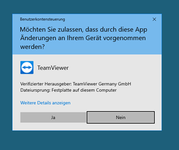

II) *Teamviewer Lizenzabkommen und Bedingungen akzeptieren und bestätigen*
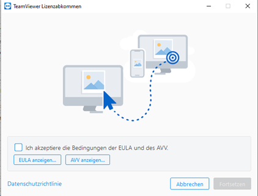

III)*Teamviewer ID und Passwort angeben 
    (wird vom Support Mitarbeiter abgefragt um eine Verbindung zum PC herstellen zu können)*

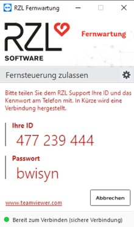 

- **RZL Log-Dateien hochladen**
  
  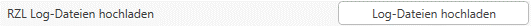

  Hier können ihre Log-Dateien an RZL übermittelt werden, im Anschluss bekommen Sie eine Erfolgsmeldung.

  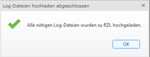

- **Windows-Ereignisanzeige hochladen**
  
  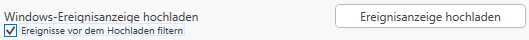

  Hier kann die Ereignisanzeige direkt an RZL hochgeladen werden. Optional kann ausgewählt werden ob die Ereignisse gefiltert oder ungefiltert versendet werden sollen. 
      
- **RZL Setup Protokolle hochladen**
  
  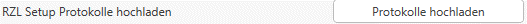

  Mit Hilfe dieses Werkzeugs können die Protokolle die bei der Durchführung des Updates geschrieben werden, für Supportzwecke, an den Server von RZL, hochgeladen werden.
  
- **Datei hochladen**
  
    

  Über das Verzeichnis können hier selbst ausgewählte Dateien an RZL übermittelt werden. (Sicherungsdateien, Dump Dateien, etc.)

- **Ordnerstruktur der RZL Programme hochladen**
  
  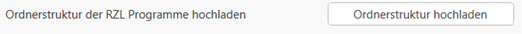

  Dieser Button lädt direkt die gesamte Ordnerstruktur des Programmverzeichnisses der RZL Programme hoch. 

## Lizenzierung
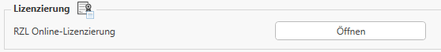

**Beim Öffnen des Lizenzmanagers kann die Lizenzierung mittels Anwendernummer und Lizenzpassworts durchgeführt werden.**

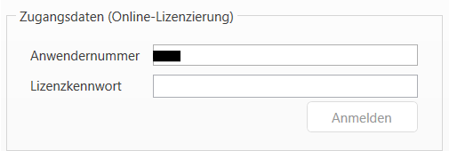

**Des Weiteren kann hier die Lizenz, im Falle eines Rechner – oder Servertauschs, zurückgelegt werden.**

**Man erhält Informationen über den Lizenztyp die Anwendernummer und die Anzahl der benutzen Lizenzen in der jeweiligen Organisation.**

## Allgemeine Datenbank-Einstellungen und Funktionen

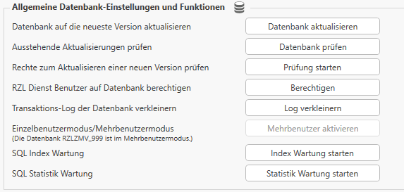

Dieser Punkt bietet Ihnen verschiedene Einstellungs- und Prüfungsmöglichkeiten für die Datenbank (optional). 
!!! warning "Hinweis"  
    Einige Optionen sollten nur nach direkter Anweisung durch Support Mitarbeiter von RZL ausgeführt werden.

- **Datenbank auf die neueste Version aktualisieren**

Beim Ausführen dieses Befehls erhält man folgende Hinweismeldung:

Nach erfolgreicher Aktualisierung erhält man folgende Meldung:

- **Ausstehende Aktualisierungen prüfen**

Dieser Befehl sollte nur in Ausnahmefällen nach Aufforderung des Supports ausgeführt werden.
(Wenn im Falle eines Setups die Programme zwar aktualsiert wurden aber die SQL-Instanz nicht)

- **Rechte zum Aktualisieren einer neuen Version prüfen**
  

Hier kann überprüft werden ob von einem Arbeitsplatz aus mittels vorhandener Berechtigungen ein Update eingespielt 
werden darf.

- **RZL Dienst Benutzer auf Datenbank berechtigen**
  
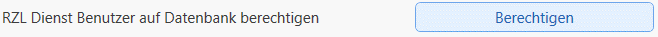

Über diesem Button kann der RZL Dienst (optional) auf der Datenbank berechtigt werden.
Die Einstellungen können auch manuell über das SQL Management Studio gesetzt werden (siehe dazu auch *Berechtigungskonzept*)

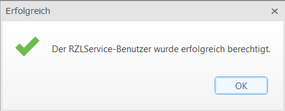

- **Transaktions-Log der Datenbank verkleinern**
  

  Dieser Befehl kann ausgeführt werden, wenn die Daten der Datenbank aus verschiedenen Gründen zunehmen, meist wenn Konfigurationen der Datenbank selbst nicht sauber gesetzt worden sind.

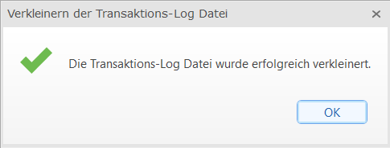

- **Einzelbenutzermodus/Mehrbenutzermodus**
  
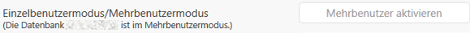

  Dieser Modus regelt, ob mehrere Benutzer oder nur ein Benutzer schreiben und/-oder lesend auf einen Klienten zugreifen können.Für den mehrfachen Lesezugriff auf eine Klientendatei zur Bearbeitung ist einezusätzliche Lizenz erforderlich.

  - *Einzelbenutzermodus*: Der Klient kann nur von einer Person in den klassischen RZL Programmen bearbeitet werden. Beim Öffnen eines Klienten, ist dieser für die Bearbeitung durch andere Benutzer gesperrt.
  - *Mehrbenutzermodus*: Mit einer Zusatzlizenz (optional) kann ein Klient von einem Benutzer bearbeitet werden und gleichzeitig von weiteren Benutzern angesehen werden  (Lesemodus).
  
  

- **SQL Index Wartung**

Generell bezeichnet die SQL Index Wartung die Pflege und Optimierung der Indizes in einer SQL-Datenbank. Indizes beschleunigen Datenbankabfragen, können aber mit der Zeit fragmentieren oder an Performance verlieren. Durch die Wartung werden sie neu organisiert oder aufgebaut, um die Datenbankgeschwindigkeit und Stabilität zu erhalten.

!!! warning "Hinweis"  
    Diese Optionen sollten nur nach direkter Anweisung durch Support Mitarbeiter von RZL ausgeführt werden.

- **SQL Statistik Wartung**
  

Zur Aktualisieren der Statistiken in der SQL-Datenbank, der SQL-Engine, um optimale Zugriffswege für Abfragen zu erhalten. 

!!! warning "Hinweis"  
    Diese Optionen sollten nur nach direkter Anweisung durch Support Mitarbeiter von RZL ausgeführt werden.

## RZL Kanzlei-Informations-System

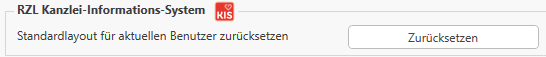

Hier können Sie für das Programm *KIS* das Standardlayout des aktuellen
Benutzers zurücksetzen. Das bedeutet, dass alle individuellen Anpassungen der Ansicht (wie verschobene oder ausgeblendete Spalten/Fenster) wieder auf die Standarddarstellung zurückgesetzt werden. So wird die Oberfläche auf das ursprüngliche Layout zurückgesetzt, das von RZL vorgegeben ist.

## RZL Board Einstellungen

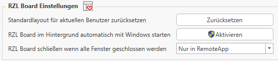

Für das Programm *Board* können hier zusätzliche Einstellungen gesetzt werden.

 

- *Standardlayout für aktuellen Benutzer zurücksetzen*:   Die Oberfläche wird auf das ursprüngliche Layout zurückgesetzt, individuelle Einstellungen können erneut im RZL Board vorgenommen werden.
  

- *RZL Board im Hintergrund automatisch mit Windows starten*:   Damit wird das RZL Board beim Starten von Windows automatisch im Hintergrund gestartet und ist sofort einsatzbereit, ohne dass Sie es manuell öffnen müssen.

- *RZL Board schließen wenn alle Fenster geschlossen werden*:  Diese Einstellung finden Sie auch im RZL Board im Bereich „Einstellungen“. Damit können Sie steuern, wie sich das Programm beim Schließen der Fenster verhält, je nach Ihren Arbeitsgewohnheiten oder der Umgebung (lokal oder remote).
  

    •	**Immer**: Das RZL Board wird immer geschlossen, wenn alle Fenster geschlossen wurden.

    •	**Nur Remote**: Das RZL Board wird nur dann geschlossen, wenn alle Fenster geschlossen wurden und Sie sich auf einem Remote-Desktop (z.B. über eine Terminalserver-Sitzung) befinden.
    
    • **Nie**: Das RZL Board bleibt immer geöffnet, auch wenn alle Fenster geschlossen wurden.

## Anwender-Protokolle

.png)

Dieses Protokoll dokumentiert alle relevanten Aktivitäten im Zusammenhang mit der Datenschutz-Grundverordnung (DSGVO), wie z. B. Datenzugriffe, Änderungen oder Löschungen, und dient der Nachvollziehbarkeit und rechtlichen Absicherung gemäß DSGVO-Anforderungen.

_2.png)

Nach Eingabe des Zeitraums und des Lizenzpasswortes können die Daten abgerufen und auch als CSV - Datei exportiert werden.

## Anonymisierung

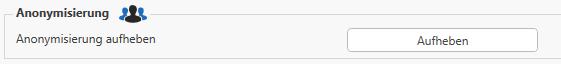

Die Funktion "Anonymisierung" im RZL Admin sorgt dafür, dass Benutzerdaten (Namen), die als Teil eines Fehlerberichts an RZL übermittelt werden, anonymisiert sind. Das dient dem Datenschutz und stellt sicher, dass personenbezogene Daten nicht ohne Weiteres weitergegeben werden.
Die Anonymisierung schützt die Identität der Mitarbeiter bei Fehlerberichten, kann aber im Bedarfsfall zur Fehleranalyse aufgehoben werden.

## RZL PDF-Drucker / Manager-Druckertreiber

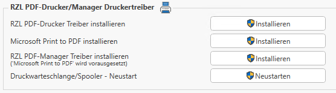

In dieser Rubrik können bestimmte Druckertreiber installiert werden. Wenn der
Treiber bereits vorhanden ist, wird dieser durch das Ausführen der Installation
automatisch entfernt und erneut installiert. Diese Optionen dienen dazu, Probleme mit dem PDF-Druck oder der Druckerinstallation direkt aus dem RZL Admin heraus zu beheben oder die Funktionalität des RZL PDF-Druckers sicherzustellen.

Für jede der folgenden Funktionen werden Administratorrechte benötigt.

- **RZL PDF-Drucker Treiber installieren**
  
  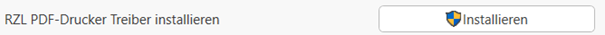

  Diese Funktion ist hilfreich, wenn es Probleme mit dem PDF-Drucker gibt oder eine Neuinstallation erforderlich ist, um die Funktionalität wiederherzustellen.

- **Microsoft Print to PDF installieren**
  
  

  Für den vollen Funktionsumfang des RZL PDF-Managers muss auf Ihrem Rechner der Standard-Windows-Druckertreiber „Microsoft Print to PDF“ installiert sein. Er wird für bestimmte Funktionen im Zusammenspiel mit dem RZL PDF-Manager benötigt (wenn Sie PDF-Ausdrucke aus externen Programmen (wie Word, Excel, etc.) in den RZL PDF-Manager übernehmen möchten).
  Falls „Microsoft Print to PDF“ nicht installiert ist, kann dieser auch über die Windows-Systemsteuerung nachinstalliert werden.

- **RZL PDF-Manager Treiber installieren**

  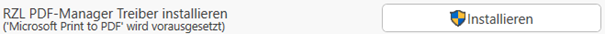

Der RZL PDF-Manager-Treiber ermöglicht es, PDF-Ausdrucke aus beliebigen externen Programmen (z. B. Word, Excel, Outlook, usw.) direkt an den RZL PDF-Manager zu übergeben. Zusätzlich muss auf dem System der Windows-Standarddruckertreiber „Microsoft Print to PDF“ installiert sein, damit alle Funktionen des RZL PDF-Managers genutzt werden können.

- **Druckerwarteschlange/Spooler - Neustart**

Hiermit kann man den Dienst für die Druckwarteschlange (auch „Spooler“ genannt) neu starten. Diese Funktion ist besonders nützlich, wenn Probleme mit Druckaufträgen oder dem PDF-Druck auftreten. Durch einen Neustart des Spooler-Dienstes können oft Druckprobleme behoben werden, ohne dass der gesamte Rechner neu gestartet werden muss.

## E-Mail

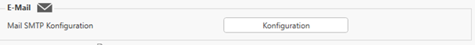

Die Konfiguration für den SMTP-Server (Mail an SMTP) wird in den RZL-Programmen nicht direkt im RZL Admin vorgenommen. Die relevanten Einstellungen, wie Absenderadresse, Absendername und Antwortadresse, werden im Bereich Stammdatenverwaltung des Kanzlei-Informations-Systems (KIS) oder im Klientenportal hinterlegt.

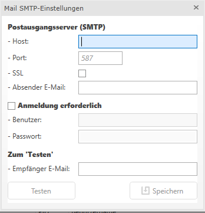

## Abbilddatei hochladen

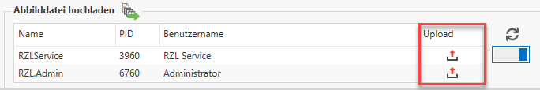

Hier werden alle offenen RZL Programme in einer Tabelle angezeigt.
Sie können eine Abbilddatei (Snapshot) dieser Programme erstellen und mittels der Funktion (rot markiert) direkt an RZL senden.
Mit dem blau markierten Schieberegler können Sie einstellen, ob nur die Prozesse des angemeldeten Benutzers oder alle auf dem Rechner laufenden Prozesse (z. B. auch den RZL Diagnose Dienst) angezeigt werden.

Diese Funktion dient dazu, bei Supportfällen gezielte Diagnosedaten an RZL zu übermitteln, was die Fehlersuche und Analyse durch den technischen Support erleichtert.Für das Hochladen und die Nutzung dieser Funktionen werden Administratorrechte benötigt.