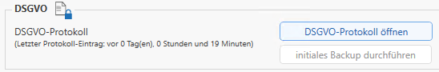

# Verwaltung

In der Verwaltung können die RZL Programme mittels der Online-Lizenzierung
freigeschaltet werden. Es können jedoch auch einige Einstellungen, Prüfungen
und Installationen durchgeführt werden.

## Wartung

Im Bereich *Wartung* können Sie die Fernwartung für den RZL Kundensupport
freigeben. Wenn Sie die Schaltfläche *Fernwartung* betätigen, öffnet sich der
TeamViewer. Weitere Schaltflächen bieten Ihnen die Möglichkeit, Protokolle
und Log-Dateien für die genaue Fehleruntersuchung hochzuladen.

## Lizenzierung

Durch Anklicken der Funktion *Öffnen* können Sie im darauffolgenden Fenster
eine Online-Lizenzierung durchführen. Dabei benötigen Sie Ihre Anwendernummer
und das Lizenzkennwort.

## Allgemeine Datenbank-Einstellungen und Funktionen

Dieser Punkt bietet Ihnen verschiedene Einstellungs- und Prüfungsmöglichkeiten
für die Datenbank. Außerdem können Sie mittels *Datenbank aktualisieren* die
Datenbank automatisch auf die neueste Version aktualisieren lassen.

## RZL Kanzlei-Informations-System

Hier können Sie für das Programm *KIS* das Standardlayout des aktuellen
Benutzers zurücksetzen.

## RZL Board Einstellungen

Für das Programm *Board* können Sie im RZL Admin folgende Einstellungen setzen:

## DSGVO

Das DSGVO-Protokoll kann hier geöffnet und exportiert werden.

## Anonymisierung

Mitarbeiternamen, die an RZL als Teil eines Fehlerberichts übermittelt werden,
sind anonymisiert. Mit dieser Funktion kann man den tatsächlichen Mitarbeiter
bestimmen, falls das bei der Fehlersuche hilft.

## RZL PDF-Drucker / Manager-Druckertreiber

In dieser Rubrik können bestimmte Druckertreiber installiert werden. Wenn der
Treiber bereits vorhanden ist, wird dieser durch das Ausführen der Installation
automatisch entfernt und erneut installiert. Es besteht ebenfalls die
Möglichkeit, den Dienst für die Druckwarteschlange neu zu starten.

Für jede der folgenden Funktionen werden Administratorrechte benötigt.

## Abbilddatei hochladen

Hier in der Tabelle werden alle offenen RZL Programme angezeigt. Eine Abbilddatei
dieser Programme kann mittels der Funktion (rot markiert) an RZL gesendet werden.

Durch den blau markierten Schalter werden nur Prozesse des angemeldeten Benutzers
angezeigt. Sollte man diesen Schalter betätigen, werden alle auf dem Rechner
laufenden Prozesse (z. B. RZL Diagnose Dienst) angezeigt.