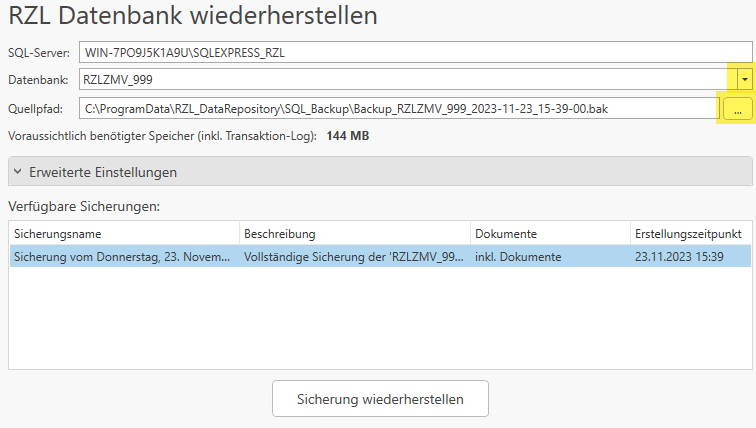

# Wiederherstellen

In diesen Bereich haben Sie die Möglichkeit, eine zuvor erstellte Sicherung
wiederherzustellen.

Angezeigt werden der SQL-Server, die Datenbank sowie der voreingestellte
Standard-Quellpfad. Alle diese Angaben können bearbeitet und überschrieben
werden. Die Datenbank lässt sich über das Drop-Down-Menü auf der rechten
Seite auswählen (siehe Screenshot). Den Quellpfad können Sie entweder
manuell eingeben oder über die Schaltfläche rechts die gewünschte
Sicherungsdatei auswählen.

Sobald ein gültiger Pfad angegeben wurde, erscheint in der Liste
*Verfügbare Sicherungen* Ihre ausgewählte Datei. Die Wiederherstellung
erfolgt durch einen Klick auf den Button *Sicherung wiederherstellen*.

Unter dem Punkt *Erweiterte Einstellungen* stehen Ihnen zusätzliche
Optionen zur Verfügung:

